One defines a natural map

$$\Omega_{\mathbf{Y}/\mathbf{k}}^{\mathbf{n-p}} \longrightarrow \omega_{\mathbf{Y}}$$
 ,

which, together with  $\eta$  and the construction of [8, 84], gives the cohomology class  $P_X(Y)$ . One proves the fundamental theorem that formation of the cohomology class associated to a cycle takes an intersection of cycles into the cup-product of their cohomology classes.

- 2. The theory of Poincaré duality and the Gysin homomorphism can be developed as in [8, \$7].
- 3. A Lefschetz-Verdier fixed point formula for coherent sheaves on a scheme proper over a field, to generalize [21, Thm. 2]. In particular, the determination of the local contribution at a non-simple fixed point presents an interesting topic for future investigation.
- 4. The still lacking theory of duality for complexes with differential operators as boundary operator, its ties with ordinary singular <a href="https://doi.org/10.1001/journal.com/">homology</a> theory and with vector bundles with integrable connections, as suggested in [22].

A remark on references: Theorem 5.1 of Chapter III is referred to as "Theorem 5.1" in Chapter III, and as [III 5.1] elsewhere. References to the bibliography at the end are given by square brackets with an arabic numeral or some capital letters e.g., [14,(31.1)] or [EGA III 2.1.12].

#### CHAPTER I. THE DERIVED CATEGORY

### \$0. Introduction.

Let A and B be abelian categories, and let  $F: A \longrightarrow B$  be a functor. Our purpose is to define, functorially for each  $X \in ObA$ , a complex  $\mathbb{R}^F(X)$ , whose cohomology groups are the right derived functors of F acting on X,  $R^iF(X)$ . In general, we will define  $\mathbb{R}^F(X')$  for any complex X' of objects of A.

More precisely, RF will be a functor from the derived category D(A) of A, to the derived category D(B) of B. The derived category D(A) is obtained as follows: one first considers the category K(A), whose objects are complexes of elements of A, and whose morphisms are homotopy equivalence classes of morphisms of complexes. The category D(A) is obtained by "localizing" K(A), so that every morphism in K(A) which induces an isomorphism on cohomology, becomes an isomorphism in D(A). This process of localization will be explained in general below.

Although A and B above are assumed to be abelian categories, the categories K(A), D(A)... are in general not abelian. However, they can be given a structure which carries enough information for our purposes, namely a structure of triangulated category. Thus we will be led to study triangulated categories.

### \$1. Triangulated Categories.

<u>Definition</u>. A <u>triangulated category</u> is an additive category C, together with

- a) an automorphism  $T: C \longrightarrow C$  of the category called the translation functor, and
- b) a collection of sextuples (X,Y,Z,u,v,w), called the triangles of C, where in each sextuple, X,Y,Z are objects of C, and u,v,w are morphisms as follows:  $u\colon X\longrightarrow Y,\ v\colon Y\longrightarrow Z,$   $w\colon Z\longrightarrow T(X)$ . A triangle is usually written

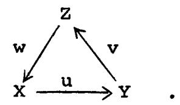

A morphism of triangles  $(X,Y,Z,u,v,w) \longrightarrow (X',Y',Z',u',v',w')$  is a commutative diagram

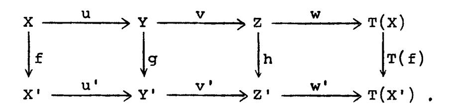

This data is subject to the following axioms:

- (TR1) Every sextuple (X,Y,Z,u,v,w) as above, isomorphic to a triangle, is a triangle. Every morphism  $u\colon X\longrightarrow Y$  can be imbedded in a triangle (X,Y,Z,u,v,w). The sextuple  $(X,X,0,id_X,0,0)$  is a triangle.
- (TR2) (X,Y,Z,u,v,w) is a triangle if and only if (Y,Z,T(X),v,w,-T(u)) is.
- (TR3) Given two triangles (X,Y,Z,u,v,w) and (X',Y',Z',u',v',w'), and morphisms  $f\colon X\longrightarrow X'$ ,  $g\colon Y\longrightarrow Y'$  commuting with u,u', there exists a morphism  $h\colon Z\longrightarrow Z'$  (not necessarily unique!) so that (f,g,h) is a morphism of the first triangle into the second.

(TR4) (The octohedral axiom).

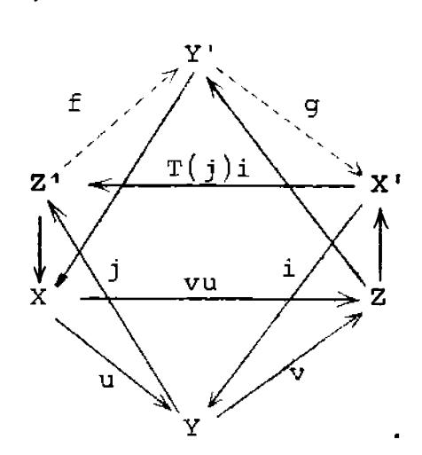

Suppose given triangles

$$(X, Z, Y', vu, ...)$$
.

Then there exist morphisms  $f: Z' \longrightarrow Y'$  and  $g: Y' \longrightarrow X'$ , such that

$$(Z', Y', \hat{X}', f, g, T(j)i)$$

is a triangle, and the two other faces of the octohedron with f.g as edges, are commutative diagrams.

Definition. An additive functor  $F: C \to C'$  from one triangulated category to another is called a (covariant)  $\partial$ -functor if it commutes with the translation functor and takes triangles into triangles. A contravariant  $\partial$ -functor takes triangles into triangles with the arrows reversed, and sends the translation functor into its inverse.

Definition. An additive functor H: C A from a triangulated category to an abelian category is called a covariant cohomological functor, if whenever (X,Y,Z,u,v,w) is a triangle, the long sequence

$$\dots \longrightarrow H(T^{i}X) \longrightarrow H(T^{i}Y) \longrightarrow H(T^{i}Z) \longrightarrow H(T^{i+1}X) \longrightarrow \dots$$

is exact (the morphisms being  $H(T^iu)$  etc.). If H is a cohomological functor, we often write  $H^i(X)$  for  $H(T^iX)$ ,  $i \in \mathbb{Z}$ . One defines a contravariant cohomological functor by reversing the arrows.

Proposition 1.1. a) The composition of any two consecutive morphisms in a triangle is zero.

- b) If C is a triangulated category, and M an object of C, then  $\operatorname{Hom}_{\mathbb{C}}(M,\cdot)$  and  $\operatorname{Hom}_{\mathbb{C}}(\cdot,M)$  are cohomological functors on C.
- c) If in the situation of (TR3) f and g are isomorphisms, then h is also an isomorphism.

<u>Proof.</u> a) Let (X,Y,Z,u,v,w) be a triangle. By (TR2) it is sufficient to show that vu = 0. Also by (TR2), (Y,Z,T(X),v,w,-T(u)) is a triangle. By (TR1),  $(Z,Z,0,id_Z,0,0)$  is a triangle. We apply (TR3) to the maps  $v: Y \longrightarrow Z$  and  $id_Z: Z \longrightarrow Z$ , and conclude that there is a map  $h: T(X) \longrightarrow 0$  giving a morphism of triangles. It follows that T(v)(-T(u)) = 0, or, since T is an automorphism, vu = 0.

b) Let  $M \in Ob \, C$ , and let (X,Y,Z,u,v,w) be a triangle. To show  $Hom_{C}(M,\cdot)$  is a cohomological functor, it will be sufficient by (TR2) to show the sequence

$$\operatorname{Hom}_{\mathbb{C}}(M,X) \longrightarrow \operatorname{Hom}_{\mathbb{C}}(M,Y) \longrightarrow \operatorname{Hom}_{\mathbb{C}}(M,Z)$$

is exact. By a) we know the composition is zero. So suppose given  $g \in \operatorname{Hom}_{\mathbb{C}}(M,Y)$  such that  $vg \in \operatorname{Hom}_{\mathbb{C}}(M,Z)$  is zero. We apply (TR3) to the triangles  $(M,M,0,\operatorname{id}_M,0,0)$  and (X,Y,Z,u,v,w) and the map  $g\colon M \longrightarrow Y$  and  $0\colon 0 \longrightarrow Z$  and conclude that there exists an  $f\colon M \longrightarrow X$  such that uf = g.

A similar proof shows that  $\operatorname{Hom}_{\mathbb{C}}(\,\cdot\,,M)$  is a (contravariant) cohomological functor.

c) In the situation of (TR3) suppose that f and g are isomorphisms. We apply the cohomological functor  $\operatorname{Hom}_{\mathbb{C}}(\mathbf{Z}', \cdot)$  to the whole situation, and obtain an exact commutative diagram

$$\operatorname{Hom}(Z',X) \longrightarrow \operatorname{Hom}(Z',Y) \longrightarrow \operatorname{Hom}(Z',Z) \longrightarrow \operatorname{Hom}(Z',T(X)) \longrightarrow \operatorname{Hom}(Z',T(Y))$$

$$\downarrow f_{*} \qquad \qquad \downarrow f_{*} \qquad \qquad \downarrow T(f)_{*} \qquad \qquad \downarrow T(g)_{*}$$

$$\operatorname{Hom}(Z',X') \longrightarrow \operatorname{Hom}(Z',Y') \longrightarrow \operatorname{Hom}(Z',Z') \longrightarrow \operatorname{Hom}(Z',T(X')) \longrightarrow \operatorname{Hom}(Z',T(Y'))$$

where  $f_* = \operatorname{Hom}(Z',f)$  etc. Now since f and g are isomorphisms in C, it follows that  $f_*,g_*,T(f)_*$ , and  $T(g)_*$  are isomorphisms of abelian groups. Hence by the five-lemma,  $h_*$  is an isomorphism. We conclude that there exists a  $\varphi \in \operatorname{Hom}_C(Z',Z)$  such that  $h_*(\varphi) = h\varphi$  is  $\operatorname{id}_{Z'} \in \operatorname{Hom}(Z',Z')$ .

Similarly using the cohomological functor  $\operatorname{Hom}_{\mathbb{C}}(\cdot,Z)$  we find there is a  $\psi \in \operatorname{Hom}(Z^{\bullet},Z)$  such that  $\psi h = \operatorname{id}_{Z^{\bullet}}$ . It follows that  $\varphi = \psi$  and h is an isomorphism.

## \$2. K(A) is triangulated.

Let A be an abelian category. A <u>complex</u> of objects of A is a collection  $X' = (X^n)_{n \in \mathbb{Z}}$  of objects of A, together with maps  $d^n \colon X^n \longrightarrow X^{n+1}$  such that  $d^{n+1}d^n = 0$  for all  $n \in \mathbb{Z}$ . A <u>morphism</u> f of complexes X' to Y' is a collection of maps  $f^n \colon X^n \longrightarrow Y^n$  which commute with the maps of complexes:

$$f^{n+1}d_X^n = d_Y^n f^n$$

for all n. Two maps f,g:  $X' \to Y'$  are said to be <u>homotopic</u> if there is a collection of maps  $k = (k^n)$ ,  $k^n \colon X^n \to Y^{n-1}$  (which do not necessarily commute with d) such that

$$f^{n} - g^{n} = d_{Y}^{n-1}k^{n} + k^{n+1}d_{X}^{n}$$

for all n. Homotopy is an equivalence relation, and the compositions of homotopic maps are homotopic.

We define K(A) to be the category whose objects are complexes of objects of A, and whose morphisms are homotopy equivalence classes of morphisms of complexes. A complex X' is said to be bounded below if  $X^{n} = 0$  for n << 0. We denote by  $K^{+}(A)$  the full subcategory of K(A) consisting of the complexes bounded below. Similarly we define  $K^{-}(A)$  and  $K^{b}(A)$  by taking complexes bounded above, or bounded on both sides, respectively.

Now let us define the structure of triangulated category on K(A) (resp.  $K^+(A)$ , etc.). T will be the operation of shifting one place to the left, and changing the sign of the differential, i.e.,  $T(X^*)^p = X^{p+1}$ , and  $d_{T(X)} = -d_{X^*}$ . We will often write  $X^*[1]$  instead of  $T(X^*)$ , and  $X^*[n]$  instead of  $T^n(X^*)$ . If  $u\colon X^* \to Y^*$  is any morphism, consider the <u>mapping cone</u>  $Z^*$  of u. Recall that the mapping cone is defined to be the complex  $T(X^*) \oplus Y^*$ , where the differential operator is given by the matrix

$$\left(\begin{array}{ccc} \mathbf{T}(\mathbf{d_X}) & \mathbf{T}(\mathbf{u}) \\ \mathbf{0} & \mathbf{d_Y} \end{array}\right)$$

There are natural morphisms  $v: Y' \longrightarrow Z'$  and  $w: Z' \longrightarrow T(X')$ .

We define a triangle in K(A) to be any sextuple isomorphic to a sextuple from a morphism  $u: X' \longrightarrow Y'$  by the construction above.

All of the axioms (TR1)-(TR4) are easy to verify, once one has made the observation that the mapping cone of the identity map  $id_X \colon X' \longrightarrow X'$  is homotopic to 0. Indeed, the mapping cone is  $T(X') \oplus X'$  as described above. The matrix

$$k = \begin{pmatrix} 0 & 0 \\ id_{X} & 0 \end{pmatrix}$$

is a homotopy operator.

<u>Definition</u>. We define H to be the functor from K(A) to A which takes a complex X' into its 0th cohomology group, namely  $\ker d^{O}/\operatorname{im} d^{-1}$ . (This is indeed a functor, because homotopic maps of complexes induce the same map on cohomology.) We write  $H^{i}$  for  $H \cdot T^{i}$ , for any  $i \in \mathbf{Z}$ .

Observe that H is a cohomological functor from K(A) to A. Indeed, it is sufficient to check the long exact sequence for triangles constructed with the mapping cylinder of a morphism  $u\colon X^\bullet \longrightarrow Y^\bullet$  of complexes, and there one can check directly that the sequence is exact.

### §3. Localization of Categories.

<u>Definition</u>. Let C be a category. A collection S of arrows of C is called a <u>multiplicative system</u> if it satisfies the following axioms (FR1)-(FR3):

(FR1) If  $f,g \in S$ , and fg exists, then  $fg \in S$ . For any  $X \in ObC$ ,  $id_X \in S$ .

### (FR2) Any diagram

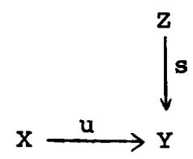

with  $s \in S$  can be completed to a commutative diagram

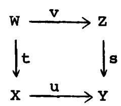

with  $t \in S$ . Ditto for the opposed statement (i.e., with all arrows reversed).

- (FR3) If f,g:  $X \longrightarrow Y$  are morphisms in C, the following conditions are equivalent:
  - (i) There exists an s:  $Y \rightarrow Y'$  in S such that sf = sg.
  - (ii) There exists a  $t: X' \longrightarrow X$  in S such that ft = gt.

<u>Definition</u>. If C is a category, and S a collection of morphisms of C, then the <u>localization of C with respect to S</u> is a category  $C_S$ , together with a functor  $Q: C \longrightarrow C_S$  such that

- a) Q(s) is an isomorphism for every  $s \in S$ , and
- b) Any functor  $F: C \longrightarrow D$  such that F(s) is an isomorphism for all  $s \in S$  factors uniquely through Q.

Remark. One can show that such a localization exists without hypotheses on S, but we will not need this result.

Proposition 3.1. Let C be a category, and S a multiplicative system in C. Then we can obtain the localization  $C_S$  as follows:

Ob  $C_S$  = Ob C, and for any X,Y  $\in$  Ob C,

$$\operatorname{Hom}_{\mathbb{C}_{S}}(X,Y) = \underset{\mathbb{I}_{X}}{\underbrace{\operatorname{lim}}} \operatorname{Hom}_{\mathbb{C}}(X',Y)$$

where  $I_X$  is the category whose objects are morphisms s: X'  $\longrightarrow$  X in S, and whose morphisms are commutative diagrams

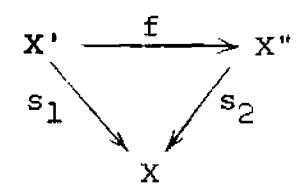

Furthermore, if C is an additive category, so is  $C_{c}$ .

<u>Proof.</u> First observe, using (FR1), (FR2), and (FR3) that the category  $I_X$  satisfies the axioms Ll, L2, L3 of [GT, Ch. I, \$1], and hence behaves as well as an inductive system for taking limits. Thus a morphism of X to Y in  $C_S$  is represented by a diagram

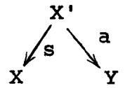

with  $s \in S$ . This diagram defines the same morphism as another one with  $t \in S$ 

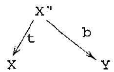

if and only if there is a morphism  $u: X''' \longrightarrow X$  in S and morphisms  $f: X''' \longrightarrow X'$  and  $g: X''' \longrightarrow X''$  such that sf = u = tg and af = bg.

To compose morphisms

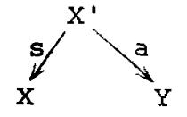

and

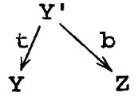

we use (FR2) to find a commutative diagram

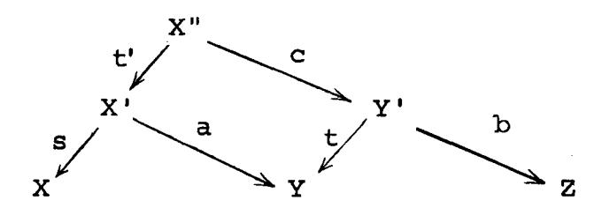

with t'  $\in$  S, and then take X", st', bc to be the composition. One verifies easily that the resulting morphism of X to Z is independent of the representatives of the morphisms of X to Y and Y to Z chosen, and is also independent of the commutative diagram chosen.

One can also verify easily that the functor  $Q: C \longrightarrow C_S$  has the properties required and that  $C_S$  is additive if C is (again using L1, L2, L3 to show that the <u>lim</u> is a group).

Definition. Let C be a triangulated category and S a multiplicative system of morphisms. S is said to be compatible with the triangulation if the following two axioms are satisfied:

(FR4)  $s \in S \iff T(s) \in S$ , where T is the translation functor.

(FR5) The same as (TR3), but where we assume that  $f,g \in S$ , and require that  $h \in S$ .

Proposition 3.2. If C is a triangulated category and S is a multiplicative system compatible with the triangulation, then  $C_S$  has a unique structure of triangulated category such that Q is a  $\partial$ -functor, and Q has the universal property b) above for  $\partial$ -functors into triangulated categories.

<u>Proof.</u> Left to the reader. It helps to observe that one can also calculate  $\operatorname{Hom}_{\mathsf{C}}(\mathsf{X},\mathsf{Y})$  as

$$\xrightarrow{\text{lim}} \text{Hom}_{C}(X,Y')$$

where  $J_Y$  is the category whose objects are morphisms s:  $Y \longrightarrow Y'$  in S, and whose maps are commutative diagrams

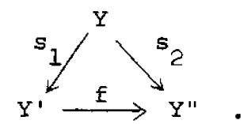

Proposition 3.3. Let C be a category, and let S be a multiplicative system in C. Let D be a full subcategory of C (i.e., X,Y  $\in$  Ob D  $\Longrightarrow$   $\operatorname{Hom}_{\mathbb{D}}(X,Y) = \operatorname{Hom}_{\mathbb{C}}(X,Y)$ ) and assume that S  $\cap$  D is a multiplicative system in D. Assume furthermore that one of the following two conditions holds:

- (i) Whenever s:  $X' \longrightarrow X$  is a morphism in S, with  $X \in Ob D$ , then there is a morphism  $f: X'' \longrightarrow X'$  such that  $X'' \in Ob D$  and  $sf \in S$ .
  - (ii) Ditto with the arrows reversed.

Then the natural functor  $D_{S \cap D} \longrightarrow C_S$  is fully faithful, i.e.,  $D_{S \cap D}$  can be identified with a full subcategory of  $C_S$ .

Proof. Straightforward.

<u>Proposition 3.4.</u> Let C be a category, S a multiplicative system in C, and Q:  $C \longrightarrow C_S$  the localization functor. Let D be another category, and let F,G:  $C_S \longrightarrow D$  be two functors. Then the natural map

$$\alpha: \text{Hom}(F,G) \longrightarrow \text{Hom}(FQ,GQ)$$

of morphisms of functors is bijective.

<u>Proof.</u> To give a morphism of functors  $F \longrightarrow G$  means to give, for each  $X \in Ob C_S$ , a morphism  $F(X) \longrightarrow G(X)$ , such that if  $X \longrightarrow Y$  is a morphism, then

$$\begin{array}{ccc}
F(X) & \longrightarrow & F(Y) \\
\downarrow & & \downarrow \\
G(X) & \longrightarrow & G(Y)
\end{array}$$

is a commutative diagram. Thus, since Ob C = Ob  $C_S$ , the map  $\alpha$  is injective. To show  $\alpha$  surjective, suppose given a morphism  $FQ \longrightarrow GQ$ . Then we have a morphism  $F(X) \longrightarrow G(X)$  for each  $X \in Ob C = Ob C_S$ , and commutative diagrams for morphisms  $X \longrightarrow Y$  in C. A morphism in  $C_S$  is represented by a diagram

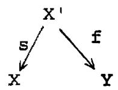

of morphisms in C, with  $s \in S$ . But for  $s \in S$ , F(s) and G(s) are isomorphisms, so we get the required commutative diagram.

### §4. Qis and the Derived Category.

Let A be an abelian category, and let K(A) be the triangulated category described in §2. We define a quasi-isomorphism to be a morphism  $f: X' \longrightarrow Y'$  in K(A) which induces an isomorphism on cohomology. Let Q is be the collection of all quasi-isomorphisms.

Proposition 4.1. Qis is a multiplicative system in K(A).

Proof. This is a consequence of the following more general proposition.

Proposition 4.2. Let C be a triangulated category, let A be an abelian category, and let H be a cohomological functor from C to A. Let S be the set of morphisms s in C such that  $H(T^{i}(s))$  is an isomorphism for all  $i \in \mathbb{Z}$ . Then S is a multiplicative system in C, compatible with the triangulation.

Proof. We must verify the axioms (FR1)-(FR5). (FR1) and (FR4) are trivial. (FR5) follows from the long exact sequence of a cohomological functor and the five-lemma.

To prove (FR2), let a diagram

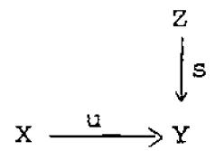

be given, with  $s \in S$ . Complete s to a triangle (Z,Y,N,s,f,g). Complete fu to a triangle (W,X,N,t,fu,h). Then  $(u,id_N)$  is a map of two sides of the second triangle into the first, so there is a map  $v\colon W\longrightarrow Z$  giving a morphism of triangles.

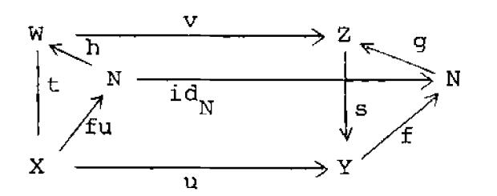

Now sv = ut, so it remains to prove t  $\in$  S. Indeed, since  $s \in S$ , we have  $H(T^i(N)) = 0$  for all  $i \in \mathbb{Z}$  by the long exact sequence of the first triangle. Applying this to the long exact sequence of the second triangle, we find  $H(T^i(t))$  is an isomorphism for all  $i \in \mathbb{Z}$ .

The opposed statement of (FR2) is proved similarly.

To prove (FR3), we consider the morphism f-g, and reduce to showing the following two properties equivalent (where  $f: X \longrightarrow Y$  is a morphism):

- (i) There exists an  $s: Y \longrightarrow Y' \in S$  such that sf = 0
- (ii) There exists a t: X'  $\longrightarrow$  X  $\in$  S such that ft = 0 . Suppose (i) holds.

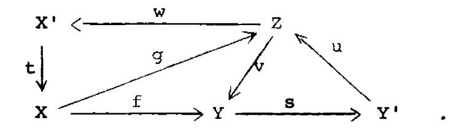

By (TR1) and (TR2) we can find a triangle (Z,Y,Y',v,s,u) for suitable Z. Now sf = 0, so by Proposition 1.1 b), there is a map  $g\colon X\longrightarrow Z$  such that f=vg. Again by (TR1) and (TR2) we can find a triangle (X',X,Z,t,g,w) for suitable X'. By the same Proposition applied to this second triangle, the existence of v implies that ft=0. We need only show that  $t\in S$ . Since  $s\in S$ ,  $H(T^{\dot{1}}(Z))=0$  for all  $i\in Z$ , by the long exact sequence of cohomology. In turn, this implies that  $t\in S$ .

The implication  $(ii) \Longrightarrow (i)$  is analogous.

Definition. The <u>derived category</u> of A, D(A), is defined to be K (A)Qis. Similarly we define  $D^+(A) = K^+(A)_{Qis}$ ,  $D^-(A)$ , and  $D^b(A)$ . One checks easily using Proposition 3.3 that they are full subcategories of D(A), and that  $D^+(A) \cap D^-(A) = D^b(A)$ .

Definition. Let A be an abelian category, and let A' be a thick abelian subcategory of A (i.e., any extension in A of two objects of A' is in A'). We define  $K_{A'}(A)$  to be the full subcategory of K(A) consisting of those complexes X' whose cohomology objects  $H^{1}(X^{\bullet})$  are all in A'. (Note that since A' is a thick subcategory of A,  $K_{A'}(A)$  is a triangulated subcategory of K(A), i.e., if two sides of a triangle are in it, so is the third.) We define  $D_{A'}(A)$  to be  $K_{A'}(A)_{Qis}$ . Note by Proposition 3.3 that  $D_{A'}(A)$  is the full subcategory of D(A) consisting of those X' with all  $H^{1}(X^{\bullet}) \in A'$ . We define similarly  $K_{A'}^{+}(A)$ ,  $D_{A'}^{+}(A)$  by taking complexes bounded below, with cohomology in A', etc.

Remark. There is a natural functor  $D(A') \longrightarrow D_{A'}(A)$  which in general is neither injective nor surjective. (See however Proposition 4.8.)

Example. To help understand the category D(A), let us ask the question, when does a morphism of complexes  $f: X \longrightarrow Y$  give the zero map in D(A)? The condition is the following:

(\*) There exists an s:  $Y \longrightarrow Y'$  in Qis such that sf is homotopic to zero (or, equivalently, there exists a t:  $X' \longrightarrow X$  in Qis such that ft is homotopic to zero).

1. Of course, if  $f \sim 0$  (f homotopic to zero), then f satisfies (\*). The converse is false. For example, take X to be the complex

$$\circ \longrightarrow \mathbb{Z} \xrightarrow{2} \mathbb{Z} \longrightarrow \mathbb{Z}_{2} \longrightarrow \circ ,$$

and f to be the identity

$$id_{x}: X \longrightarrow X$$
.

Let  $g: X \longrightarrow 0$  be the zero map. Then  $g \in Qis$ , and gf = 0, but f is not homotopic to zero, as one sees easily.

2. If f satisfies (\*), then f induces the zero map on cohomology, but the converse is false. For example take
f: X —> Y as follows:

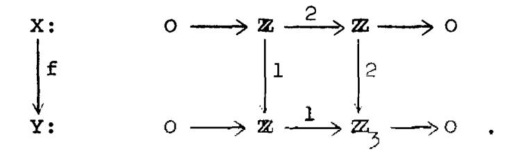

Now f induces the zero-map on cohomology, but there does not exist t:  $X' \longrightarrow X$  in Qis, such that ft  $\sim 0$ . (The reader can supply this proof as follows: take a cycle  $x \in X'$  such that t(x) generates the single cohomology group  $Z_2$  of X. If k is a homotopy operator for ft, show that 2k(x) = 1, which is impossible.)

So for two maps  $f,g: X \longrightarrow Y$  of complexes, we see that the following implications are all strict:

 $f = g \implies f$  homotopic to g

 $\rightarrow$  f and g give the same morphism in D(A)

f and g give the same map on cohomology.

<u>Proposition 4.3</u>. The functor  $A \longrightarrow D(A)$ , which sends each object X of A into the complex consisting of X in degree 0, and O elsewhere, gives an equivalence of the category A with the full subcategory of D(A) consisting of those complexes X' such that  $H^{i}(X^{\bullet}) = 0$  for  $i \neq 0$ .

Proof. Left to reader.

We will now give three lemmae, and another description of the derived category  $\operatorname{D}^+(A)$  when A has enough injectives.

Lemma 4.4. Let A be an abelian category, and let  $f: Z^{\bullet} \to I^{\bullet}$  be a morphism of complexes of objects of A. Assume

- 1) Z. is acyclic
- 2) Each Ip is injective
- 3) I' is bounded below.

Then f is homotopic to zero.

Proof. Well known (and easy).

Lemma 4.5. Let A be an abelian category and let  $s: I' \longrightarrow Y'$  be a morphism of complexes of objects of A. Assume

- 1) s induces an isomorphism on cohomology
- 2) each Ip is injective
- 3) Ip is bounded below.

Then s has a homotopy inverse.

<u>Proof.</u> Suppose given s:  $I' \longrightarrow Y'$  as above. Let  $Z' = T(I') \oplus Y'$  be the mapping cone of s. Then Z' is acyclic, and so the triangular morphism  $v: Z' \longrightarrow T(I')$  satisfies the conditions of Lemma 4.4, and so is homotopic to zero. Let us call the homotopy operator

$$(k,t): T(I^*) \oplus Y^* \longrightarrow I^*$$
.

Then we have the equation

$$v = (id_{T}, 0) = (k,t) d_{Z} + d_{T} (k,t)$$
.

Separating the components, we find

$$id_{\tau} = dk + kd + ts$$

and

$$dt - td = 0$$
.

Thus t:  $Y^* \longrightarrow I^*$  is a morphism of complexes, and  $id_I$  is homotopic to ts, so t is a homotopy inverse of s.

Lemma 4.6. Let A be an abelian category.

- 1). Let P be a subset of Ob A and assume
- (i) Every object of A admits an injection into an element of P.

Then every  $X^{\bullet} \in K^{+}(A)$  admits a quasi-isomorphism into a bounded below complex  $I^{\bullet}$  of objects of P.

- 2). Assume furthermore that P satisfies
- (ii) If  $0 \longrightarrow X \longrightarrow Y \longrightarrow Z \longrightarrow 0$  is a short exact sequence, with  $X \in P$ , then  $Y \in P \Longleftrightarrow Z \in P$ .

(iii) There exists a positive integer n, such that if

$$x^0 \longrightarrow x^1 \longrightarrow \cdots \longrightarrow x^{n-1} \longrightarrow x^n \longrightarrow 0$$

is an exact sequence, and  $x^0, \dots, x^{n-1} \in P$ , then  $x^n \in P$ .

Then every  $X^* \in K(A)$  admits a quasi-isomorphism into a complex  $I^*$  of objects of P.

3). Let A' be a thick subcategory of A, and assume that A' has enough A-injectives. Then every  $X^* \in K_{A^*}^+(A)$  admits a quasi-isomorphism into a bounded below complex I' of A-injective objects of A'.

<u>Proofs.</u> 1). We may assume  $X^p = 0$  for p < 0. Embed  $X^0 \longrightarrow I^0$  with  $I^0$  in P. Having defined  $I^0, I^1, \dots, I^p$ , choose  $I^{p+1}$  to be an element of P containing

$$I^p/im I^{p-1} \oplus_{X^p} X^{p+1}$$
,

and define the maps  $I^p \longrightarrow I^{p+1}$  and  $X^{p+1} \longrightarrow I^{p+1}$  in the obvious way. One checks easily that  $X^* \longrightarrow I^*$  is a quasi-isomorphism. Note that in this construction all the maps  $X^p \longrightarrow I^p$  are injective.

2). We proceed in several steps. Let X' be a complex, and let i be an integer. Then by 1) we can find a quasi-isomorphism of the truncated complex

$$0 \longrightarrow 0 \longrightarrow X^{i_0} \longrightarrow X^{i_0+1} \longrightarrow \cdots$$

into a complex I' of elements of P, with each  $X^{i} \longrightarrow I^{i}$  injective. Define  $X_{o}^{*}$  to be the complex

$$\cdots \longrightarrow x^{i_0-2} \longrightarrow x^{i_0-1} \longrightarrow x^{i_0} \longrightarrow x^{i_0+1} \longrightarrow \cdots$$

Then we have a quasi-isomorphism  $X^* \longrightarrow X_O^*$  such that  $X_O^i \in P$  for  $i \ge i_O$ , and each  $X^i \longrightarrow X_O^i$  is injective.

Suppose given a complex  $X_1^i$  with  $X_1^i \in P$  for  $i \ge i_1$ , and let  $i_2 < i_1$ . Then we will construct a quasi-isomorphism  $X_1^i \longrightarrow X_2^i$  such that  $X_2^i \in P$  for  $i \ge i_2$ , and  $X_1^i = X_2^i$  for

 $i \geq i_1+n$ . (Here n is the integer of condition (iii) above.) Indeed, by the first step above, we can find a quasi-isomorphism  $X_1^{\bullet} \longrightarrow X'^{\bullet}$  such that  $X^{\bullet}^{i} \in P$  for  $i \geq i_2$ , and each  $X_1^{i} \longrightarrow X'^{i}$  is injective. Let  $Y^{i} = \operatorname{coker}(X_1^{i} \longrightarrow X'^{i})$ . Then  $Y^{\bullet}$  is an acyclic complex, and  $Y^{i} \in P$  for  $i \geq i_1$ , by condition (ii) above. Hence  $B^{i}(Y^{\bullet}) \in P$  for  $i \geq i_1+n$ , by condition (iii). Now define  $X_2^{\bullet}$  by

$$x_{2}^{i} = \begin{cases} x^{i}^{i} & \text{for } i < i_{1}+n \\ B^{i}(x^{i}) \oplus_{x_{1}^{i-1}} x_{1}^{i} & \text{for } i = i_{1}+n \\ x_{1}^{i} & \text{for } i > i_{1}+n \end{cases}$$

One sees easily that  $X_1^{\bullet} \longrightarrow X_2^{\bullet}$  is a quasi-isomorphism. It follows from (ii) and the exact sequence

$$0 \longrightarrow X_1^i \longrightarrow B^i(X'') \oplus_{X_1^{i-1}} X_1^i \longrightarrow B^i(Y') \longrightarrow 0$$

that the middle term is in P, for  $i \ge i_1+n$ , so  $X_2^{\bullet}$  is as required.

Now, given a complex  $X^* \in K(A)$ , choose a sequence of integers  $i_0 > i_1 > \dots$  tending to  $-\infty$ . Choose  $X_0^*$  for  $i_0$  as in the first step, and choose  $X_1^*, X_2^*, \dots$  for  $i_1, i_2, \dots$  successively as in the second step. Then we have quasi-isomorphisms

 $X^{\bullet} \longrightarrow X_{0}^{\bullet} \longrightarrow X_{1}^{\bullet} \longrightarrow \dots$  and for each i, the sequence  $X^{i} \longrightarrow X_{0}^{i} \longrightarrow X_{1}^{i} \longrightarrow \dots$  is eventually constant, and eventually in P. Hence  $I^{\bullet} = \varinjlim X_{r}^{\bullet}$  is the required complex of objects of P.

3). We may assume  $X^{i} = 0$  for i < 0. Embed  $H^{O}(X^{*})$  in  $I^{O}$ , an A-injective of A', which is possible since  $H^{O}(X^{*}) \in Ob A'$ . Extend this to a map  $f^{O} \colon X^{O} \longrightarrow I^{O}$ , which is possible since  $I^{O}$  is A-injective. Having define  $I^{O}, I^{1}, \dots, I^{p}$ , and  $f^{i} \colon X^{i} \longrightarrow I^{i}$  for  $i = 0, \dots, p$ , choose  $I^{p+1}$  to be an A-injective of A' containing

(\*) 
$$I^{p}/im I^{p-1} \oplus_{\mathbf{x}^{p}} Z^{p+1}(X^{\bullet}) .$$

We must check that this latter is in A'. Indeed, A' is a thick subcategory, so it is sufficient to note that  $I^p/im\ I^{p-1}\in A'$  (one shows by induction that  $B^i(I^*)$  and  $Z^i(I^*)$  are in A' for all i), and that the quotient of (\*) by  $I^p/im\ I^{p-1}$  is  $H^{p+1}(X^*)$ , which is in A' by hypothesis. Extend the natural map  $Z^{p+1}(X^*) \longrightarrow I^{p+1}$  to a map  $f^{p+1}\colon X^{p+1} \longrightarrow I^{p+1}$ . One checks easily that the resulting map  $f\colon X^* \longrightarrow I^*$  is a quasiisomorphism, as required.

Proposition 4.7. Let A be an abelian category, and let I be the (additive) subcategory of injective objects of A. Then the natural functor

$$\alpha: K^{+}(I) \longrightarrow D^{+}(A)$$

is fully faithful. (Note that the results of section 3 carry over to additive subcategories of abelian categories.) Furthermore, if A has enough injectives (i.e., if every object of A admits an injection into an injective object) then  $\alpha$  is an equivalence of categories.

<u>Proof.</u> We note that  $K^+(I) \cap Q$  is a multiplicative system in  $K^+(I)$ , by Proposition 4.2, and we observe by Lemma 4.5 that condition (ii) of Proposition 3.3 is satisfied for  $K^+(I) \subseteq K^+(A)$  and Qis. Hence the natural functor

$$D^+(I) \longrightarrow D^+(A)$$

is fully faithful. But on the other hand, Lemma 4.5 shows also that every quasi-isomorphism in  $K^+(I)$  is an isomorphism, hence  $K^+(I) = D^+(I)$ .

Now if A has enough injectives, applying Lemma 4.6 in the case A = B and P = the injective objects, we see that every object of  $D^+(A)$  is isomorphic to an object in  $K^+(I)$ , so  $\alpha$  is an equivalence of categories.

Proposition 4.8. Let A be an abelian category, and let A' be a thick abelian subcategory. Assume that A' has enough A-injectives, i.e., every object of A' can be injected into an A-injective object of A'. Then the natural functor

$$D^{+}(A') \longrightarrow D^{+}_{A'}(A)$$

is an equivalence of categories.

<u>Proof.</u> We apply Proposition 3.3 to the inclusion  $K^+(A^+) \to K^+(A)$ . Clearly Qis is a multiplicative system in each. If  $X^* \to Y^*$  is a quasi-isomorphism with  $X^* \in K^+(A^+)$ , then  $Y^*$  has cohomology in  $A^+$ , and so by Lemma 4.6 admits a quasi-isomorphism  $Y^* \to I^*$  with  $I^* \in K^+(A^+)$ , each  $I^p$  injective in A. Hence condition (ii) is satisfied, and so the functor

$$D^+(A') \longrightarrow D^+(A)$$

is fully faithful. The same Lemma 4.6 also shows that the image is  $D_{A}^{+}$ , (A).

Exercise. We leave to the reader the analogous statements of the last five results in the case of projective objects of A and  $D^-(A)$ .

### \$5. Derived Functors.

We will treat only the question of right derived covariant functors, leaving the reader to make the obvious modifications for left derived covariant functors, and right and left derived contravariant functors.

Let A,B be abelian categories, and let  $F: K(A) \longrightarrow K(B)$  be a  $\partial$ -functor (see §1). Such is the case, for example, if we are given an additive functor  $F: A \longrightarrow B$ . It extends to K(A).

In general, F will not take quasi-isomorphisms into quasi-isomorphisms—to say that it does is to say that it localizes and gives rise to a functor from D(A) to D(B). That will be the case, for example, if F is an exact functor.

Thus we are led to ask if there is a functor from D(A) to D(B) which is at least close to F, and this gives rise to the notion of derived functor below. Before giving the definition we generalize slightly.

<u>Definition</u>. Let A be an abelian category, and let  $K^*(A)$  be a triangulated subcategory of K(A). Note by Proposition 4.2 that  $K^*(A) \cap Q$  is a multiplicative system in  $K^*(A)$ . We say that  $K^*(A)$  is a <u>localizing subcategory</u> of K(A) if the natural functor

$$K*(A)_{K*(A)\cap Qis} \longrightarrow K(A)_{Qis} = D(A)$$

is fully faithful, and in that case we write  $D^*(A)$  for the first of these categories.

Examples. 1. Any intersection of localizing subcategories is localizing.

- 2.  $K^+(A)$ ,  $K^-(A)$ , and  $K^b(A)$  are localizing subcategories of K(A) (see section 4).
- 3. If A' is a thick subcategory of A, then  $K_{A}^{+}(A)$ ,  $K_{A}^{+}(A)$ ,  $K_{A}^{-}(A)$  and  $K_{A}^{b}(A)$  are localizing subcategories of K(A) (see section 4).
- \*4. The complexes of finite injective dimension form a localizing subcategory  $K^+(A)_{fid}$  of K(A) (see Corollary 7.7).\*

Definition. Let A and B be abelian categories, let  $K^*(A)$  be a localizing subcategory of K(A), and let

$$F: K^*(A) \longrightarrow K(B)$$

be a  $\partial$ -functor. Let Q denote the localization functor from  $K^*(A)$  to  $D^*(A)$  resp. K(B) to D(B). The right derived functor of F is a  $\partial$ -functor

$$\underline{R}^*F: D^*(A) \longrightarrow D(B)$$

together with a morphism of functors

$$\xi: Q \cdot F \longrightarrow \underline{R}^* F \cdot Q$$

from  $K^*(A)$  to D(B), with the following universal property: If

G: 
$$D^*(A) \longrightarrow D(B)$$

is any  $\partial$ -functor, and if

$$\zeta: Q \cdot F \longrightarrow G \cdot Q$$

is a morphism of functors, then there exists a unique morphism

$$\eta: \underline{R}^*F \longrightarrow G$$

such that

$$\zeta = (\eta \cdot Q) \cdot \xi$$
.

Remarks. 1. If  $\mathbb{R}^*F$  exists, it is unique up to unique isomorphism of functors.

2. If  $K^*(A)$  is  $K^+(A)$ ,  $K^-(A)$ ,  $K_{A^-}(A)$ , etc., we will write  $\underline{R}^+F$ ,  $\underline{R}^-F$ ,  $\underline{R}_{A^-}F$  etc. for  $\underline{R}^*F$ , and when no confusion can result, we will write simply  $\underline{R}F$  for all of these.

- 3. We will write  $R^{i}F$  for  $H^{i}(R^{i}F)$ , and it will follow from the results below that if F comes from a left-exact functor  $F: A \longrightarrow B$ , and if A has enough injectives, then these are the usual derived functors of F.
- 4. If  $\phi\colon F \longrightarrow G$  is a morphism of functors from  $K^*(A)$  to K(B), and if  $\begin{tabular}{l} RF \end{tabular}$  and  $\begin{tabular}{l} RG \end{tabular}$  both exist, then there is a unique morphism of functors

$$\underline{R}\varphi: \underline{R}F \longrightarrow \underline{R}G$$

compatible with the  $\xi$ 's. This follows immediately from the definition.

5. If  $K^{**}(A) \subseteq K^{*}(A)$  are two localizing subcategories of K(A), and if

$$F: K^*(A) \longrightarrow K(B)$$

is a  $\partial$ -functor, and if both  $\underline{R}^*F$  and  $\underline{R}^{**}(F|K^{**}(A))$  exist, then there is a natural morphism of functors

$$\underline{\underline{R}}^{**}(F|K^{**}(\underline{A})) \longrightarrow \underline{\underline{R}}^{*}F|D^{**}(\underline{A})$$
.

We do not know if it is an isomorphism in general, but it will be in all the applications we have in mind (see e.g. Corollary 5.3 below).

Theorem 5.1. (Existence of derived functors). Let A, B,  $K^*(A)$ , and F be as in the definition above. Suppose there is a triangulated subcategory  $L \subseteq K^*(A)$  such that

- 1) Every object of  $K^*(A)$  admits a quasi-isomorphism into an object of L, and
- 2) If  $I' \in Ob L$  is <u>acyclic</u> (i.e.,  $H^{i}(I') = O$  for all i), Then F(I') is also acyclic.

Then F has a right derived functor  $(\underline{\underline{R}}^*F,\xi)$ . Furthermore, for any I'  $\in$  Ob L , the map

$$\xi(I^*): Q \cdot F(I^*) \longrightarrow R^*F \cdot Q(I^*)$$

is an isomorphism in D(B).

<u>Proof.</u> First observe that the restriction of F to L takes quasi-isomorphisms into quasi-isomorphisms. Indeed, if  $s: I \xrightarrow{\cdot} I \xrightarrow{\cdot} i$  is a quasi-isomorphism of objects of L, let  $J \xrightarrow{\cdot}$  be the third side of a triangle built on s. Then  $J \xrightarrow{\cdot} i$  is acyclic, so  $F(J \xrightarrow{\cdot})$  is also, so F(s) is a quasi-isomorphism. Hence F passes to the quotient to give a functor

$$\overline{F}: L_{Ois} \longrightarrow D(B)$$

with the property  $\overline{F} \cdot Q = Q \cdot F$  on L. (We denote as usual by Q the morphism from a category to its localization.)

Second note that the hypotheses of Proposition 3.3, (ii) are satisfied for L,  $K^*(A)$ , and Qis, and so the natural functor

T: 
$$L_{\text{Ois}} \longrightarrow D^*(A)$$

is an equivalence of categories, using 1) above. Let U be a quasi-inverse of T, i.e., a functor

$$U: D^*(A) \longrightarrow L_{Ois}$$

together with functorial isomorphisms

$$\alpha: \quad \mathbf{1}_{\mathbf{Qis}} \xrightarrow{} \mathbf{U} \cdot \mathbf{T}$$

and

$$\beta: \quad \mathbf{1}_{D^*(A)} \longrightarrow T \cdot U.$$

Then define

$$R^*F = \overline{F} \cdot U$$
.

We define a morphism of functors

$$\xi: Q \cdot F \longrightarrow \underline{R}^* F \cdot Q = \overline{F} \cdot U \cdot Q$$

as follows. Let  $X^* \in Ob \ K^*(A)$ , and let  $I^* \in Ob \ L$  be such that  $Q(I^*) = U \cdot Q(X^*)$ . We have an isomorphism in  $D^*(A)$ ,

$$\beta(Q(X^*)): Q(X^*) \xrightarrow{\sim} T \cdot U(Q(X^*)) = T(QI^*).$$

This isomorphism can be represented by a diagram of morphisms

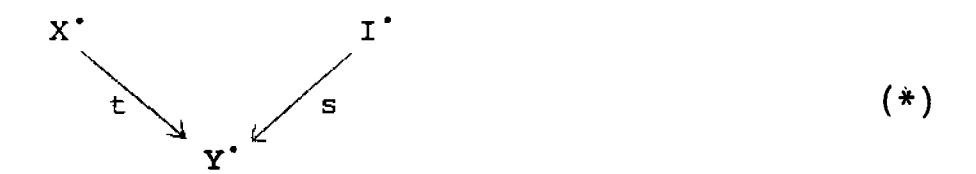

in  $K^*(A)$ , with  $Y' \in Ob \ K^*(A)$  and  $s,t \in Qis$ . Furthermore, by hypothesis 1 above, we may assume  $Y' \in Ob \ L$ . Now applying the functor F, we get a diagram in K(B)

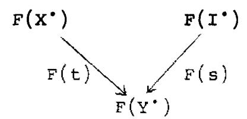

where F(s) is also a quasi-isomorphism, as we remarked above. This in turn gives a morphism in D(B),

$$\xi(X'): Q \cdot F(X') \longrightarrow Q \cdot F(I') = \overline{F} \cdot Q(I') = \overline{F} \cdot U \cdot Q(X') = \underline{R}^* F \cdot Q(X').$$

One can now check without difficulty that  $\xi(X^*)$  does not depend on the choice of the diagram (\*) above, that  $\xi$  gives a morphism of functors from  $Q \cdot F$  to  $\underline{R}^* F \cdot Q$ , and that the pair  $(\underline{R}^* F, \xi)$  is a derived functor of F.

Now if  $X' \in Ob L$ , then F(t) in the construction above is also a quasi-isomorphism, and so  $\xi(X')$  is an isomorphism in D(B), as required.

Proposition 5.2. Let A, B, K\*(A), and F be as above, and let K\*\*(A)  $\subseteq$  K\*(A) be another localizing subcategory of K(A). Suppose there is a triangulated subcategory L of K\*(A) satisfying hypotheses 1 and 2 of the theorem, and suppose, furthermore, that L  $\cap$  K\*\*(A) satisfies 1 for K\*\*(A). Then  $\mathbb{R}^*F$  and  $\mathbb{R}^*(F|K^{**}(A))$  both exist, and the natural map  $\mathbb{R}^{**}(F|K^{**}(A)) \longrightarrow \mathbb{R}^*F|D^{**}(A)$ 

is an isomorphism.

<u>Proof.</u> The existence of the two derived functors follows from the theorem. To prove the isomorphism, since every  $X^* \in \mathsf{Ob}\ \mathsf{D}^{**}(A)$  is isomorphic to one coming from an object of L, we may assume that  $X^* = \mathsf{Q}(I^*)$  with  $I^* \in \mathsf{Ob}(L \cap K^{**}(A))$ . Then the statement follows from the last part of the theorem.

Corollary 5.3.  $\alpha$ . Let A,B be abelian categories, let  $F: K^+(A) \longrightarrow K(B)$  be a  $\partial$ -functor (defined for example by an additive functor  $F_o: A \longrightarrow B$ ), and assume that A has enough injectives. Then  $R^+F$  exists.

- $\beta$ . Let A,B be abelian categories, let F: A  $\longrightarrow$  B be an additive functor, and assume that there exists a subset P of Ob A having the properties (i) and (ii) of Lemma 4.6, and also
- (iv) F carries short exact sequences of objects of P\ninto short exact sequences.

Then  $\underline{R}^+F$  exists. (We denote also by F the extension of F to a  $\partial$ -functor  $K^+(A) \longrightarrow K^+(B)$ .)

- $\gamma$ . Let A,B be abelian categories, let F: A  $\longrightarrow$  B be an additive functor, and assume that
  - a) The hypotheses of  $\beta$  above are satisfied, and
- b) F has finite cohomological dimension on A, i.e., there is a positive integer n such that  $R^iF(Y)=0$  for all  $Y\in Ob$  A and all i>n. (Note that  $R^iF$  exists by  $\beta$ , so this makes sense.) Then  $R^iF$  exists, and the restriction of  $R^iF$  to  $D^i(A)$  is equal to  $R^iF$ .

Remark.  $\alpha$  is a special case of  $\beta$ , since if A has enough injectives, then the set P of injectives of A has properties (i),(ii), and (iv) for any additive functor F.

<u>Proof.</u>  $\alpha$ . Let  $L \subseteq K^+(A)$  be the triangulated subcategory of complexes of injective objects of A. Then by Lemma 4.6, 1), every  $X^* \in Ob \ K^+(A)$  admits a quasi-isomorphism into an object of L. Furthermore, by Lemma 4.5, every quasi-isomorphism in L is an isomorphism. Hence condition 2) of the theorem is satisfied for any  $\partial$ -functor F, and we deduce that  $R^+$ F exists.

 $\beta$ . In this case we take  $L \subseteq K^+(A)$  to be the triangulated subcategory of complexes of objects of P. (Note L is a triangulated subcategory because P is stable under direct sums by (ii).) Condition 1) of the theorem is satisfied as above. For condition 2), let  $Z^*$  be acyclic. We use condition (ii) above repeatedly, and the fact that  $Z^* \in K^+(A)$ , to show that  $\ker d_Z^p \in P$  for every p. Then by condition (iv) of P, it follows that  $F(Z^*)$  is acyclic.

 $\gamma$ . We take P' to be the collection of <u>F-acyclic</u> objects of A, i.e., those X  $\in$  Ob A such that  $R^{i}F(X)=0$  for all i>0. Then P' has properties (i),(ii) and (iii) of Lemma 4.6. We take  $L\subseteq K(A)$  to be the complexes of objects of P'. Then using Lemma 4.6 and an argument similar to the one in  $\beta$  above, one sees that the hypotheses of the theorem are satisfied, so RF exists.

One sees by Proposition 5.2 that the restriction of RF to  $D^+(A)$  is  $R^+F$ .

<u>Proposition 5.4.</u> Let A,B,C be abelian categories, let  $K^*(A) \subseteq K(A)$  and  $K^{\dagger}(B) \subseteq K(B)$  be localizing subcategories, and let

$$F: K^*(A) \longrightarrow K(B)$$

G: 
$$K^{\uparrow}(B) \longrightarrow K(C)$$

be 0-functors.

a). Assume that  $F(K^*(A)) \subseteq K^{\dagger}(B)$ , assume that  $\underline{R}^*F$ ,  $\underline{R}^{\dagger}G$ , and  $\underline{R}^*(G \cdot F)$  exist, and assume that  $\underline{R}^*F(D^*(A)) \subseteq D^{\dagger}(B)$ . Then there is a unique morphism of functors

$$\zeta: \underline{\underline{R}}^*(G \cdot F) \longrightarrow \underline{\underline{R}}^{\dagger} G \cdot \underline{\underline{R}}^* F$$

such that the diagram

$$\begin{array}{ccc}
Q \cdot G \cdot F & \xrightarrow{\xi_G} & \xrightarrow{\mathbb{R}^{\uparrow}} G \cdot Q \cdot F \\
\downarrow^{\xi_G \cdot F} & \downarrow^{\xi_F} \\
\underline{\mathbb{R}^{*}} (G \cdot F) \cdot Q & \xrightarrow{\zeta \cdot Q} & \underline{\mathbb{R}^{\uparrow}} G \cdot \underline{\mathbb{R}^{*F}} \cdot Q
\end{array}$$

is commutative.

b). Assume that  $F(K^*(A)) \subseteq K^{\uparrow}(B)$ , assume that there are triangulated subcategories  $L \subseteq K^*(A)$  and  $M \subseteq K^{\uparrow}(B)$  satisfying the hypotheses of Theorem 5.1 for F and G, respectively, and assume that  $F(L) \subseteq M$ . Then the hypotheses of A above are satisfied, and the morphism C which therefore exists, is an isomorphism.

Proof. Straightforward.

Remarks. 1. If F,G,H are three consecutive functors, then there is a commutative diagram of  $\zeta$ 's (provided they all exist):

$$\underline{\underline{R}(H \cdot G \cdot F)} \xrightarrow{\xi_{G \cdot F, H}} \underline{\underline{R}H \cdot \underline{\underline{R}}(G \cdot F)}$$

$$\downarrow^{\zeta_{F, H \cdot G}} \qquad \qquad \downarrow^{\zeta_{F, G}}$$

$$\underline{\underline{R}(H \cdot G) \cdot \underline{R}F} \xrightarrow{RH \cdot \underline{R}G \cdot \underline{R}F}.$$

2. This proposition shows the convenience of derived functors in the context of derived categories. What used to be a spectral sequence becomes now simply a composition of functors. (And of course one can recover the old spectral sequence from this proposition by taking cohomology and using the spectral sequence of a double complex.)

Corollary 5.5. Left to the reader: Illustrate the Proposition in the style of Corollary 5.3.

<u>Proposition 5.6.</u> Let A be an abelian category, let A' be a thick abelian subcategory, let B be another abelian category, and let  $F: K^+(A) \longrightarrow K^+(B)$  be a  $\partial$ -functor. Suppose that  $\underline{R}^+F$  and  $\underline{R}^+(F|_{A^+})$  both exist. Then there is a natural morphism

$$\zeta: \ \underline{\underline{R}}^+(F|_{\underline{A}},) \longrightarrow \phi \cdot \underline{\underline{R}}^+F$$

of functors from D+(A') to D(B), where

$$\varphi \colon D^{+}(A') \longrightarrow D^{+}(A)$$

is the natural functor. If furthermore A' has enough A-injectives, and A has enough injectives, then  $\zeta$  is an isomorphism.

<u>Proof.</u> The existence of  $\zeta$  follows from the definition of the derived functor. If A' has enough A-injectives, and A has enough injectives, then we can use A-injectives to calculate both functors above, by Corollary  $5.3\alpha$ , and so  $\zeta$  is an isomorphism. (Recall by Proposition 4.8 that  $\varphi$  is an equivalence of categories in that case.)

§6. Examples. Ext and R Hom.

<u>Definition</u>. Let A be an abelian category, and let  $X^{\bullet},Y^{\bullet}$  be objects of D(A). We define the <u>i</u>th hyperext of  $X^{\bullet},Y^{\bullet}$  to be

Exti (X',Y') = 
$$\text{Hom}_{D(A)}(X', T^{i}(Y')).$$

Remarks. 1. If  $X^*,Y^* \in D^+(A)$ , then we get the same Ext by taking Hom in  $D^+(A)$ , for  $D^+(A)$  is a full subcategory of D(A).

2. This definition gives us in particular a definition of  $\operatorname{Ext}^{\mathbf{i}}(X,Y)$  for any  $X,Y\in A$ . We will see below that if A has enough injectives (so that the usual Ext is defined) then this definition agrees with the usual definition of Ext.

### Proposition 6.1. Let

$$0 \longrightarrow X' \longrightarrow Y' \longrightarrow Z' \longrightarrow 0$$

be a short exact sequence of complexes of objects of A, and let V' be another complex of objects of A. Then there are long exact sequences

Proof. Let W' be the third side of a triangle on  $X' \rightarrow Y'$ .

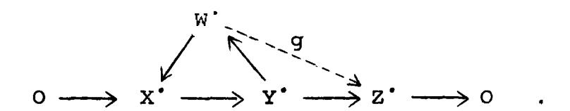

Then by Proposition 1.1b, there is a morphism of complexes  $g\colon W'\longrightarrow Z'$ . Using the long exact sequence of cohomology of the short exact sequence, and of the triangle, and using the five-lemma, we see that g is a quasi-isomorphism, i.e., an isomorphism in D(A). Hence we may replace Z' by W' in the conclusion, which then follows from the same proposition.

Remark. It follows from the proof that whenever

$$0 \longrightarrow X' \longrightarrow Y' \longrightarrow Z' \longrightarrow 0$$

is a short exact sequence of complexes of objects of A, then there is a morphism  $Z^* \longrightarrow T(X^*)$  in D(A) making  $X^*,Y^*,Z^*$  into a triangle.

Now we will define a functor whose cohomology gives the Ext groups.

Definition. If  $X^*$  and  $Y^*$  are complexes of objects of A, we define a complex  $Hom^*(X^*,Y^*)$  by

$$\operatorname{Hom}^{n}(x^{\bullet}, y^{\bullet}) = \prod_{p \in \mathbb{Z}} \operatorname{Hom}_{A}(x^{p}, y^{p+n})$$

and

$$d^{n} = \prod (d_{X}^{p-1} + (-1)^{n+1} d_{Y}^{p+n})$$
.

Notice under this definition that the n-cycles of the complex  $\operatorname{Hom}^{\cdot}(X^{\cdot},Y^{\cdot})$  are in one-to-one correspondence with morphisms of complexes of  $X^{\cdot}$  to  $\operatorname{T}^{n}(Y^{\cdot})$ , and the n-boundaries correspond to those morphisms which are homotopic to zero. In other words,

$$H^{n}(Hom^{\bullet}(x^{\bullet}, Y^{\bullet})) \cong Hom_{K(A)}(x^{\bullet}(x^{\bullet}))$$
.

Now Hom' is clearly a bi-0-functor

Hom: 
$$K(A)^{\circ} \times K(A) \longrightarrow K(Ab)$$
.

If A has enough injectives, we can calculate its derived functors.

Lemma 6.2. Let  $X' \in Ob \ K(A)$  be a complex, and let  $Y' \in Ob \ K^+(A)$  be a complex of injective objects. Assume either a) Y' is acyclic, or b) X' is acyclic. Then  $Hom^*(X',Y')$  is acyclic.

<u>Proof.</u> By the remark above, one has only to check that any morphism of  $X^*$  to  $T^n(Y^*)$  is homotopic to zero, or, since  $T^n(Y^*)$  also satisfies the hypotheses of the lemma, it is enough to show that any morphism of  $X^*$  to  $Y^*$  is homotopic to zero. In case a,  $Y^*$  is split exact, and it is easy to construct the homotopy (left to reader). In case a the result is Lemma 4.4.

Now suppose A has enough injectives, and let  $L \subseteq K^+(A)$  be the triangulated subcategory of complexes of injective objects. Then using the lemma, part a), we see that for each  $X^* \in Ob K(A)$ , L satisfies the hypotheses of Theorem 5.1 for the functor

$$\text{Hom}^{\bullet}(X^{\bullet}, \cdot): K^{+}(A) \longrightarrow K(Ab).$$

Hence this functor has a right derived functor. It is easily seen to be functorial in  $X^*$ , and so we have a bi- $\partial$ -functor

$$R_{\text{TT}}$$
Hom':  $K(A)^{\circ} \times D^{+}(A) \longrightarrow D(Ab)$ .

Now using the lemma, part b), we see that this functor is "exact" in the first variable, i.e., takes acyclic complexes into acyclic complexes, and hence passes to the quotient, giving a trivial right derived functor

$$R_{T} = T + T + T + T + T + T + T + T + T + T$$

(We will denote this functor by R Hom when no confusion can result.)

Suppose on the other hand that A has enough projectives. Then by the usual process of "reversing the arrows" we see that there is also a functor

$$R_{\Pi} = R_{\Pi} + \text{Hom}^*: D^{-}(A)^{\circ} \times D(A) \longrightarrow D(A)$$
.

Now if A has enough injectives and enough projectives, then both functors  $R_{II} = Hom$  and  $R_{II} = Hom$  are defined on  $D^{-}(A)^{O} \times D^{+}(A)$ ,

and are canonically isomorphic, as we see by the lemma below. Thus we are justified in using the ambiguous notation R Hom.

Lemma 6.3. Let A, B, and C be abelian categories, and let

T: 
$$K^*(A) \times K^{\uparrow}(B) \longrightarrow K(C)$$

be a bi-d-functor. Suppose that  $\mathbb{R}_{\mathbf{I}=\mathbf{\Pi}}^{\mathbf{R}}\mathbf{T}$  and  $\mathbb{R}_{\mathbf{I}=\mathbf{\Pi}}^{\mathbf{R}}\mathbf{T}$  both exist (where the subscripts I,II denote the derived functor in the first or second variable, respectively). Then there is a unique isomorphism between them compatible with the morphisms  $\xi_1\colon \mathbf{T} \longrightarrow \mathbb{R}_{\mathbf{I}=\mathbf{\Pi}}^{\mathbf{R}}\mathbf{T}$  and  $\xi_2\colon \mathbf{T} \longrightarrow \mathbb{R}_{\mathbf{I}=\mathbf{\Pi}}^{\mathbf{R}}\mathbf{T}$ .

<u>Proof.</u> Follows directly from the definition of derived functors.

Theorem 6.4. (Yoneda) Let A be an abelian category having enough injectives. Then for any  $X^* \in D(A)$ ,  $Y^* \in D^+(A)$ ,

$$H^{i}(\underline{\underline{R}}^{+}Hom^{\cdot}(X^{\cdot},Y^{\cdot})) = Ext^{i}(X^{\cdot},Y^{\cdot}).$$

Corollary 6.5. If A has enough injectives, then for any  $X,Y \in A$ , the  $Ext^{i}(X,Y)$  defined above in the usual Ext.

Proof. Let I' be an injective resolution of Y. Then using the above theorem, and Theorem 5.1, we have

$$\operatorname{Ext}^{\mathbf{i}}(X,Y) = \operatorname{H}^{\mathbf{i}}(\operatorname{Hom}^{\cdot}(X,I^{\cdot}))$$
,

which is the usual definition.

Proof of Theorem 6.4. Let s: Y'  $\rightarrow$  I' be a quasi-isomorphism of Y' into a complex of injectives I'. Then

$$\operatorname{Ext}^{\mathbf{i}}(X^{\bullet},Y^{\bullet}) = \operatorname{Ext}^{\mathbf{i}}(X^{\bullet},I^{\bullet}) = \operatorname{Hom}_{D(A)}(X^{\bullet},T^{\mathbf{i}}(I^{\bullet})).$$

But by using Lemma 4.5, one sees that every morphism in D(A) of a complex  $X^{\bullet}$  to a complex of injectives bounded below, say  $T^{i}(I^{\bullet})$ , is represented by an actual morphism of complexes. Hence the above is equal to

$$Hom_{K(A)}(X^{\bullet}, T^{i}(I^{\bullet})) = H^{i}(Hom^{\bullet}(X^{\bullet}, I^{\bullet}))$$

$$= H^{i}(\underline{\underline{R}} Hom^{\bullet}(X^{\bullet}, Y^{\bullet})).$$

# §7. Way-out functors and isomorphisms.

<u>Definition</u>. Let A and B be abelian categories, and let F:  $D(A) \longrightarrow D(B)$  be a (covariant)  $\partial$ -functor. We say that F is way-out (right) if given  $n_1 \in \mathbb{Z}$ , there exists  $n_2 \in \mathbb{Z}$  such that whenever  $X^* \in Ob\ D(A)$  is a complex with  $H^i(X^*) = O$  for all  $i < n_2$ , then  $H^i(F(X^*)) = O$  for all  $i < n_3$ .

One defines similarly way-out left, way out in both directions. If  $F: D(A) \longrightarrow D(B)$  is a contravariant  $\partial$ -functor, the definition of way-out right is the same, except that we reverse the inequality  $i < n_2$  to be  $i > n_2$ .

Examples. 1. If  $F_o: A \longrightarrow B$  is an additive functor satisfying the hypotheses of Corollary 5.3,  $\alpha$  or  $\beta$ , then  $\underline{R}^+F$  is a way-out right functor. If F satisfies the hypotheses of  $\gamma$ , then  $\underline{R}^F$  is way-out in both directions:

2. If  $X' \in D(A)$  is an unbounded complex, then  $R \to D(X', Y')$ , for  $Y' \in D^+(A)$ , is in general not a way-out functor in Y'.

Proposition 7.1. (Lemma on Way-out Functors) Let A and B be abelian categories, let A' be a thick subcategory of A, let F and G be  $\partial$ -functors from  $D_{A}^+(A)$  (or  $D_{A}^-(A)$ ) to D(B), and let  $\eta\colon F\to G$  be a morphism of functors.

- (i) Assume that  $\eta(X)$  is an isomorphism for all  $X \in Ob A'$ . Then  $\eta(X')$  is an isomorphism for all  $X' \in Ob D_{A'}^b(A)$ .
- (ii) Assume that  $\eta(X)$  is an isomorphism for all  $X \in Ob\ A'$ , and that F and G are both way-out right functors. Then  $\eta(X^*)$  is an isomorphism for all  $X^* \in D_A^+$ , (A).
- (iii) Assume that  $\eta(X)$  is an isomorphism for all  $X \in Ob\ A'$ , and that F and G are way-out in both directions. Then  $\eta(X^*)$  is an isomorphism for all  $X' \in D_A$ , A.
- (iv) Let P be a subset of Ob A' such that every object of A' admits an injection into an object of P. Assume  $\Pi(X)$  is an isomorphism for every  $X \in P$ , and that F and G are way-out right functors. Then  $\Pi(X)$  is an isomorphism for every  $X \in Ob A'$ .

Definition. Let X' be a complex of objects of A. For an integer  $n \in \mathbb{Z}$ , we define the following truncations:

$$\tau_{>n}(x^{*}): \qquad \cdots \longrightarrow 0 \longrightarrow x^{n+1} \longrightarrow x^{n+2} \longrightarrow \cdots$$

$$\tau_{\leq n}(x^{*}): \qquad \cdots \longrightarrow x^{n-1} \longrightarrow x^{n} \longrightarrow 0 \longrightarrow \cdots$$

$$\sigma_{>n}(x^{*}): \qquad \cdots \longrightarrow 0 \longrightarrow \text{ im } d^{n} \longrightarrow x^{n+1} \longrightarrow x^{n+2} \longrightarrow \cdots$$

$$\sigma_{< n}(x^{*}): \qquad \cdots \longrightarrow x^{n-1} \longrightarrow \text{ker } d^{n} \longrightarrow 0 \longrightarrow \cdots$$

There are natural morphisms of complexes giving rise to the following exact sequences:

$$(1) \qquad 0 \longrightarrow \tau^{>n}(x_*) \longrightarrow x_* \longrightarrow \tau^{$$

$$(2) \qquad \circ \longrightarrow \sigma_{\langle \mathbf{n}}(\mathbf{x}^*) \longrightarrow \mathbf{x}^* \longrightarrow \sigma_{\rangle \mathbf{n}}(\mathbf{x}^*) \longrightarrow 0 .$$

The truncation functor  $\sigma$  has the property

$$H^{i}(\sigma_{>n}(X^{\bullet})) = \begin{cases} H^{i}(X^{\bullet}) & \text{for } i > n \\ 0 & \text{for } i \leq n \end{cases}$$

$$H^{i}(\sigma_{\leq n}(X^{*})) = \begin{cases} H^{i}(X^{*}) & \text{for } i \leq n \\ 0 & \text{for } i > n \end{cases}$$

Lemma 7.2. Let  $X^*$  be a complex of objects of A. Then there are triangles in D(A)

(3) 
$$\tau_{\geq n}(\mathbf{x}^*) \xrightarrow{} \mathbf{x}^n$$

(4) 
$$H_{\mathbf{u}}(\mathbf{x},) \xrightarrow{\mathbb{Q}^{>\mathbf{u}}(\mathbf{x},)} \mathbf{u}^{>\mathbf{u}}(\mathbf{x},) \qquad .$$

<u>Proof.</u> The triangle (3) is deduced from an exact sequence of complexes

$$0 \longrightarrow \tau_{>n}(X^{\bullet}) \longrightarrow \tau_{>n}(X^{\bullet}) \longrightarrow X^{n} \longrightarrow 0$$

(see Remark following proof of Proposition 6.1). For the second, let  $\sigma'(x^*)$  be the complex

$$\cdots \longrightarrow 0 \longrightarrow X^{n}/im \ d^{n-1} \longrightarrow X^{n+1} \longrightarrow \cdots$$

Then there is a natural map  $\sigma_{\geq n}(x^*) \longrightarrow \sigma_{\geq n}(x^*)$  which is a quasi-isomorphism, and there is an exact sequence of complexes

$$0 \longrightarrow \operatorname{H}^{n}(X^{\scriptscriptstyle{\bullet}}) \longrightarrow \sigma_{\geq n}^{\scriptscriptstyle{\bullet}}(X^{\scriptscriptstyle{\bullet}}) \longrightarrow \sigma_{> n}(X^{\scriptscriptstyle{\bullet}}) \longrightarrow 0 .$$

Thus by the same remark we get a triangle in D(A).

Proof of Proposition. (i) Let  $X^* \in Ob \ D_A^b$ , (A). We prove, by descending induction on n, that

$$\eta(\sigma_{>n}(X^*)): F(\sigma_{>n}(X^*)) \longrightarrow G(\sigma_{>n}(X^*))$$

is an isomorphism for all n. If n is large enough, then  $\sigma_{>n}(X^*)$  has zero cohomology, since  $X^*$  has bounded cohomology. Hence it is the zero object of D(A), and  $\eta$  of it is an isomorphism. The induction step follows from the hypotheses and Proposition 1.1c, applied to the triangle (4) above.

Now for n small enough, the natural map  $X' \to \sigma_{>n}(X')$  is a quasi-isomorphism, hence an isomorphism in D(A), and we are done.

(ii) Let  $X^* \in Ob\ D_{A}^+$  (A). To show  $\eta(X^*)$  is an isomorphism, it is sufficient to show that

$$H^{j}(\eta(x^{*})): H^{j}(F(x^{*})) \longrightarrow H^{j}(G(x^{*}))$$

is an isomorphism for all  $j \in \mathbb{Z}$ . Given j, let  $n_1 \ge j+2$ , and choose  $n_2$  as in the definition of way-out functors, to work for F and G both. From the exact sequence (2) above, we have a triangle in D(A)

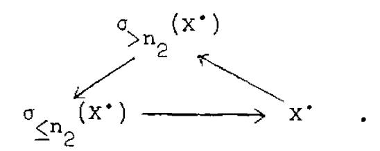

Since  $H^{i}(\sigma_{>n_{2}}(X^{\circ})) = 0$  for  $i \leq n_{2}$ , we have

$$H^{i}(F(\sigma_{>n_{2}}(X^{\bullet}))) = O = H^{i}(G(\sigma_{>n_{2}}(X^{\bullet})))$$

for  $i < n_1$ , in particular for i = j, j+1. Therefore from the long exact sequence of cohomology we get isomorphisms

$$H^{j}(F(\sigma_{\leq n_{2}}(X^{\bullet}))) \xrightarrow{\sim} H^{j}(F(X^{\bullet}))$$

$$\text{H}^{j}\big(\text{G}(\sigma_{\leq n_{2}}(\textbf{X}^{\bullet}))\big) \xrightarrow{\sim} \text{H}^{j}(\text{G}(\textbf{X}^{\bullet})) \ .$$

- But  $\sigma_{\leq n_2}(x^*) \in D_A^b(A)$ , so  $\eta$  is an isomorphism on it by what we have just proved. Hence  $H^j(\eta(x^*))$  is an isomorphism, as required.
- (iii) Given  $X^* \in D_{A^*}(A)$ , we treat first  $\sigma_{\leq O}(X^*)$  and  $\sigma_{>O}(X^*)$  by case (ii), then glue the results by a triangle deduced from the exact sequence (2).
- (iv) Given  $X \in Ob A'$ , we can find by Lemma 4.6 a resolution  $I' \in D_{A'}^+(A)$  of X, with each  $I^P \in P$ . Thus it is sufficient to show that  $\eta(I')$  is an isomorphism. This follows by applying the technique of (i) and (ii), but using the functors  $\tau$  instead of  $\sigma$ .

  q.e.d.

Proposition 7.3. Let A and B be abelian categories, and let  $A' \subseteq A$  and  $B' \subseteq B$  be thick abelian subcategories. Let F be a  $\partial$ -functor from  $D_{A'}^+(A)$  (or  $D_{A'}(A)$ ) to D(B)).

- (i) Assume that  $F(X) \in D_B$ , (B) for all  $X \in Ob A$ . Then  $F(X^*) \in D_B$ , (B) for all  $X^* \in D_A^b$ , (A).
- (ii) Assume that  $F(X) \in D_B^-(B)$  for all  $X \in Ob\ A'$ , and that F is a way-out right functor. Then  $F(X^*) \in D_B^-(B)$  for all  $X^* \in D_A^+(A)$ .

(iii) As in (ii) but where we assume that F is way-out in both directions, and conclude that  $F(X^*) \in D_B^-(B)$  for all  $X^* \in D_A^-(A)$ .

(iv) Let P be a subset of Ob A' such that every object of A' admits an injection into an object of P. Assume  $F(X) \in D_{B^*}(B) \text{ for every } X \in P, \text{ and that } F \text{ is a way-out right functor. Then } F(X) \in D_{B^*}(B) \text{ for every } X \in Ob A'.$ 

<u>Proof.</u> The proof is analogous to that of the previous proposition, and will be left to the reader.

Proposition 7.4. Let A and B be abelian categories, where A has enough injectives, and let  $F: A \longrightarrow B$  be an additive functor which has cohomological dimension  $\leq n$  on A. Let  $P \subseteq Ob \ A$  be the set of objects  $X \in Ob \ A$  such that  $R^{1}F(X) = 0$  for all  $i \neq n$ , and assume that every object of A is a quotient of an element of P. Let  $G = R^{n}F$ . Then RF and RF exist, and there is a functorial isomorphism

$$\psi: \underline{R}F \xrightarrow{\sim} \underline{L}G[-n]$$
,

where "[-n]" means "shift n places to the right".

<u>Proof.</u> We know already from Corollary 5.3 that RF exists. To see that the left derived functor LG exists, we apply Theorem 5.1 with the arrows reversed. By hypothesis P satisfies condition (i)\* of Lemma 4.6 (where \* denotes reversal of arrows) and one sees easily from the definition of P that it satisfies also (ii)\*, (iii)\*, and (iv)\* of Corollary 5.3. Therefore, if we let  $L \subseteq K(A)$  be the triangulated subcategory consisting of complexes of elements of P, we see as in the proof of Corollary 5.3,  $\gamma$ , that the hypotheses 1)\* and 2)\* = 2) of the theorem are satisfied, and so LG exists.

To define the morphism  $\psi$ , we observe, as in the proof of Theorem 5.1, that T:  $L_{Qis} \longrightarrow D(A)$  is an equivalence of categories, so it will be sufficient to define  $\psi$  on  $L_{Qis}$ . Or, using Proposition 3.4, it will be sufficient to define  $\psi$  on L itself. In other words, for every complex X' of objects of P we must give a morphism in D(B),

$$\psi(X^*): \underline{R}F(X^*) \longrightarrow \underline{L}G(X^*)[-n]$$
,

such that whenever f: X'  $\longrightarrow$  Y' is a morphism of such complexes, there is the usual commutative diagram:  $LG(f) \cdot \psi(X') = \psi(Y') \cdot RF(f)$ .

Definition. Let A be an abelian category, and X' a complex of objects of A. We refer to [M, Ch. IV, §4] for the definition of double complexes, maps of double complexes, and homotopies of maps of double complexes. A (right) Cartan-Eilenberg resolution of X' is a double complex C' of injective objects of A, where  $C^{p,q} = 0$  if p < 0, and an augmentation  $\epsilon \colon X' \longrightarrow C'^{0}$ , such that for every  $p \in \mathbb{Z}$ , the maps

$$B^{p}(\epsilon): B^{p}(X^{\bullet}) \longrightarrow B^{T}_{p^{\bullet}}(C^{\bullet})$$

$$H_b(\varepsilon): H_b(x_*) \longrightarrow H_b^L(c_*)$$

are injective resolutions in the ordinary sense (cf. [M, Ch. XVII, §1] where this is called an injective resolution of X').

We recall for convenience some properties of double complexes and Cartan-Eilenberg resolutions.

Lemma 7.5. a) If A has enough injectives, then every complex X of objects of A has a Cartan-Eilenberg resolution.

- b) If  $f: X' \longrightarrow Y'$  is a map of complexes, and if C'', D'' are Cartan-Eilenberg resolutions of X' and Y', respectively, then there is a map  $F: C'' \longrightarrow D''$  of double complexes lying over f.
- c) If f,g:  $X' \longrightarrow Y'$  are homotopic maps, and F,G:  $C'' \longrightarrow D''$  are maps of Cartan-Eilenberg resolutions lying over f and g, respectively, then F is homotopic to G.

- d) If F,G:  $C'' \longrightarrow D''$  are homotopic maps of double complexes, then  $s(F), s(G): s(C'') \longrightarrow s(D'')$  are homotopic maps of the associated simple complexes.
- e) If F,G:  $C"\longrightarrow D"$  are homotopic maps of double complexes, and if we define truncation  $\sigma^{\mathrm{II}}_{\leq n}$  as above, with respect to  $\mathrm{d}_2$ , then the restrictions of F and G to be maps  $\sigma^{\mathrm{II}}_{\leq n}(C")\longrightarrow \sigma^{\mathrm{II}}_{\leq n}(D")$  are homotopic.
- f) If  $\epsilon\colon X^*\longrightarrow C^*$  is an augmentation of  $X^*$  into a double complex  $C^*$  with  $C^{pq}=0$  for q<0 and  $q>n_0$  for suitable  $n_0$ , and such that for each  $p, X^p\longrightarrow C^p$  is a resolution, then the natural map  $X^*\longrightarrow s(C^{**})$  into the associated simple complex is a quasi-isomorphism.

Proofs. a), b), and c) are in [M, Ch. XVII, Prop. 1.2]. d) is in [M, Ch. IV, 84]. e) is easy, and f) follows either from the spectral sequence of a double complex [EGA OIII 11.3.3 (ii)] or by an easy direct calculation.

Proof of Proposition, continued. Given  $X' \in ObL$ , let C'' be a Cartan-Eilenberg resolution of X', which exists since A has enough injectives. Let C''' be the truncated complex  $\sigma_{\leq n}^{II}(C'')$ , i.e.,

$$C^{pq} = \begin{cases} c^{pq} & \text{for } q < n \\ \text{ker } d_2^{pn} & \text{for } q = n \end{cases}$$

$$0 & \text{for } q > n .$$

Then for each  $p \in \mathbf{Z}$  we have an exact sequence

$$0 \rightarrow x^p \rightarrow c^{p0} \rightarrow c^{p1} \rightarrow \cdots \rightarrow c^{p,n-1} \rightarrow c^{pn} \rightarrow 0$$

Now  $C^{p0},...,C^{p,n-1}$  are all injective, and  $X^p \in P$ , so  $C^{pn}$  is F-acyclic. Hence this resolution may be used to calculate  $\underline{\mathbb{R}}^p(X^p)$  (see end of Theorem 5.1) and we have an isomorphism

$$\varphi(t^p): G(X^p) = R^n F(X^p) \xrightarrow{\sim} F(C^{pn}) / Im F(C^{p,n-1})$$
,

where  $t^p$  is the quasi-isomorphism  $x^p \longrightarrow C^{p}$ . This can be used to construct a map

$$\alpha^p : F(c^p) \longrightarrow G(x^p)$$

whence a map

$$\alpha: F(C''') \longrightarrow G(X')$$

of double complexes, where the second is concentrated in the nth row. Taking associated simple complexes we have

$$s(\alpha): F(sC'') \longrightarrow G(X')[-n].$$

But now u:  $X^* \longrightarrow sC'^*$  is a quasi-isomorphism into a complex of F-acyclic objects, by the lemma, part f), and so there is an isomorphism

$$\phi(u): \quad \ \ \underline{R}F(X^{\, \cdot}) \longrightarrow F(sC^{\, \cdot\, \cdot\, \cdot}) \ .$$

But also X° is made of G-acyclic objects, so there is an isomorphism

$$\phi(id_{X}.): G(X^{*}) \longrightarrow \underline{L}G(X^{*})$$

and composing we can define a morphism

$$\psi(X^*): \qquad \underline{\underline{R}}F(X^*) \longrightarrow \quad \underline{\underline{L}}G(X^*) \ .$$

I do not care whether  $\psi(X^*)$  depends on the choice of the Cartan-Eilenberg resolution  $C^{**}$ . It will be sufficient to verify that whenever  $f\colon X^* \longrightarrow Y^*$  is a morphism of complexes in L, then  $\psi(X^*)$  and  $\psi(Y^*)$  defined as above, fit into a commutative diagram. This is not hard to show using the results of the lemma above, and can safely be left to the reader.

Thus we have a morphism of functors

$$\psi: \quad \underline{R}F \longrightarrow \underline{L}G[-n]$$
.

To show that  $\psi$  is an isomorphism, we note that  $\mathbb{R}F$  and  $\mathbb{R}G$  are way-out in both directions, and so, by the lemma on way-out functors, we reduce to showing  $\psi(X)$  is an isomorphism for any  $X \in P$ . But that is clear from the construction. q.e.d.

Proposition 7.6. Let A be an abelian category with enough injectives, and let  $X' \in Ob K^+(A)$ . Then the following conditions are equivalent:

- (i) X' admits a quasi-isomorphism  $X' \longrightarrow I'$  into a bounded complex of injective objects of A.
- (ii) The functor  $F = R + Mom'(\cdot, X')$  from  $D(A)^O$  to D(Ab) is way-out left (and hence way-out in both directions).
- (iii) There is an integer  $n_0$  such that  $\operatorname{Ext}^{\mathbf{i}}(Y,X^*)=0$  for all  $Y\in \operatorname{Ob} A$  and all  $i>n_0$ .
- Proof. (i)  $\Longrightarrow$  (ii) We may assume that X' is a bounded complex of injectives, and calculate F(Y') as Hom'(Y',X'). Then it is clear that F is way-out in both directions.
- (ii)  $\Longrightarrow$  (iii) Choose  $n_O$  such that whenever  $Y' \in D(A)$  and  $H^i(Y') = 0$  for  $i < n_O$ , then  $H^i(F(Y')) = 0$  for i > 0. (This is possible since F is way-out left.) Then this  $n_O$  will do. Indeed, let  $Y \in Ob\ A$ , and let Y'' be the complex  $T^{-n}O(Y)$ . Then  $H^i(Y'') = 0$  for  $i < n_O$ , so  $H^i(F(Y'')) = 0$  for i > 0. But  $H^i(F(Y'')) = H^i(T^{-n}O(Y)) = H^i(T^{-n}O(Y)) = H^i(T^{-n}O(Y))$ . This says  $Ext^j(Y,X') = 0$  for  $j > n_O$ , as required.
- (iii)  $\Rightarrow$  (i). Let X' satisfy condition (iii) for no. Since A has enough injectives, we can find an injective resolution of X'

(Lemma 4.6), i.e., a quasi-isomorphism s:  $X' \longrightarrow X''$  where X'' is a complex of injective objects of A. bounded below.

I claim that  $H^{i}(X') = 0$  for  $i > n_{o}$ . Suppose to the contrary that  $H^{m}(X') \neq 0$  for some  $m > n_{o}$ . Then from the exact sequence

$$o \longrightarrow B_{\mathfrak{m}}(X, \cdot) \longrightarrow S_{\mathfrak{m}}(X, \cdot) \longrightarrow H_{\mathfrak{m}}(X, \cdot) \longrightarrow o$$

we see that the first inclusion is strict. Hence there exists a  $Y \in Ob A$  (e.g.,  $Y = Z^m(X')$ ) such that the inclusion

$$\operatorname{Hom}(Y, B^{m}(X'')) \longrightarrow \operatorname{Hom}(Y, Z^{m}(X''))$$

is strict. However, there is a commutative diagram

$$Hom(X, B_m(X, ., .)) \longrightarrow T_m(Hom, (X, X, ., .))$$

$$\downarrow \qquad \qquad \qquad \downarrow \approx$$

$$B_m(Hom, (X, X, ., .)) \longrightarrow T_m(Hom, (X, X, ., .))$$

with an isomorphism on the right since Hom is left exact. But by hypothesis  $\operatorname{Ext}^m(Y,X^*)=\operatorname{H}^m(\operatorname{Hom}^*(Y,X^{**}))=0$ , so the arrow on top is an isomorphism, which gives a contradiction. Hence  $\operatorname{H}^i(X^{**})=0$  for i>n as claimed.

It follows that the map

$$i: \quad \sigma_{\leq n}(X'') \longrightarrow X''$$

is a quasi-isomorphism for any  $n \ge n_o$  (using the notation introduced earlier in this section). Now I claim that  $z^{n+1}(x'') = B^{n+1}(x'') \quad \text{is injective for any} \quad n \ge n_o. \quad \text{This will}$  show that  $\sigma_{< n+1}(x'')$  is a bounded complex of injectives.

Consider the exact sequence of complexes

$$0 \longrightarrow \sigma_{\leq n}(X'') \longrightarrow \tau_{\leq n}(X''') \longrightarrow B^{n+1}(X''[-n] \longrightarrow 0$$

for  $n \ge n_0$ . We will show that  $B^{n+1} = B^{n+1}(X^n)$  is injective by showing that  $\operatorname{Ext}^1(Y,B^{n+1}) = 0$  for all  $Y \in \operatorname{Ob} A$ . For any Y, we have

$$\operatorname{Ext}^{1}(Y,B^{n+1}) = \operatorname{Ext}^{n+1}(Y,B^{n+1}[-n])$$

and there is an exact sequence

$$\cdots \longrightarrow \operatorname{Ext}^{n+1}(Y, \tau_{\leq n}(X'')) \longrightarrow \operatorname{Ext}^{n+1}(Y, B^{n+1}[-n]) \longrightarrow \operatorname{Ext}^{n+2}(Y, \sigma_{\leq n}(X'')) \longrightarrow \cdots$$

The group on the left is zero since  $\tau_{\leq n}(X'')$  is an injective complex which stops in degree n. The group on the right is zero by our hypothesis and the fact that  $\sigma_{\leq n}(X'')$  is isomorphic to X'' in  $D^+(A)$ . Hence the middle group is zero.

Now for  $n \ge n + 1$  we have seen that  $\sigma_{\le n}(X^{**})$  is a bounded complex of injectives, and that the map

i: 
$$\sigma_{\leq n}(x'') \longrightarrow x''$$

is a quasi-isomorphism. By Lemma 4.5, i has a homotopy inverse, say f. Therefore the composition

$$fs: X' \longrightarrow \sigma_{n}(X'')$$

gives the required quasi-isomorphism of  $X^{\bullet}$  into a bounded complex of injectives.

Definition. If  $X^* \in Ob\ K^+(A)$  satisfies the equivalent conditions of the Proposition, we say that  $X^*$  has <u>finite injective</u> dimension.

Corollary 7.7. The complexes  $X^{\bullet} \in K^{+}(A)$  with finite injective dimension form a localizing (see §5) triangulated subcategory of K(A).

<u>Proof.</u> The fact that they form a triangulated subcategory follows e.g. from condition (iii) and the long exact sequence of Ext. We see that the subcategory is localizing by applying Proposition 3.3(i), since anything in  $K^+(A)$  quasi-isomorphic to an element of the subcategory is already in the subcategory, and  $K^+(A)$  is a localizing subcategory of K(A).

<u>Definition</u>. We denote the category of  $X^* \in K^+(A)$  with finite injective dimension by  $K^+(A)_{fid}$ . The corresponding subcategory of  $D^+(A)$  is denoted by  $D^+(A)_{fid}$ .

Remark. These subcategories are essentially different from the subcategories of the form  $K_{A}$ , (A) and  $D_{A}$ , (A) we have considered before, because they cannot be characterized by putting conditions on the cohomology objects  $H^{1}(X^{\bullet})$ .