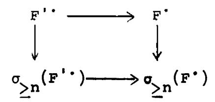

<u>Definition</u>. We denote the category of  $X^* \in K^+(A)$  with finite injective dimension by  $K^+(A)_{fid}$ . The corresponding subcategory of  $D^+(A)$  is denoted by  $D^+(A)_{fid}$ .

Remark. These subcategories are essentially different from the subcategories of the form  $K_{A}$ , (A) and  $D_{A}$ , (A) we have considered before, because they cannot be characterized by putting conditions on the cohomology objects  $H^{1}(X^{\bullet})$ .

#### CHAPTER II. APPLICATION TO PRESCHEMES

In this chapter we will discuss the various categories of sheaves we plan to use in the sequel, their derived categories, various functors between them, and relations among these functors. In §7 we give the structure of injective sheaves of  $\mathcal{O}_X$ -modules on a locally noetherian prescheme X.

### \$1. Categories of sheaves.

Let  $(X, \theta_X')$  be a prescheme. We will denote by Mod(X) the category of sheaves of  $\theta_X'$ -modules, and we will denote its derived category by D(X) = D(Mod(X)).

We will consider the thick subcategories of Mod(X) consisting of the quasi-coherent sheaves, denoted by Qco(X), and the coherent sheaves, denoted by Coh(X). (Cf. [EGA O, §5] for definitions and the fact that these are thick subcategories.) We will write  $D_{qc}(X)$  for  $D_{Qco}(X)^{(Mod(X))}$  and  $D_{c}(X)$  for  $D_{Coh}(X)^{(Mod(X))}$ , using the notation of [I.4]. Similarly  $D_{qc}^{+}(X)$  etc.

Proposition 1.1. There are enough injectives in the categories Mod(X) and Qco(X).

<u>Proof.</u> This is well known, e.g., [T, 1.10.1], or, for Mod(X), [G, II 7.1.1].

Proposition 1.2. Every sheaf of  $\mathcal{O}_X$ -modules is a quotient of a flat  $\mathcal{O}_X$ -module.

<u>Proof.</u> If U is an open subset of X, we denote by  $\mathcal{O}_{X,U}$  the sheaf which is  $\mathcal{O}_{X}$  on U and O outside [G, II Thm. 2.9.1]. Then  $\mathcal{O}_{X,U}$  is a flat  $\mathcal{O}_{X}$ -module, and any direct sum of these is also flat. If F is any sheaf of  $\mathcal{O}_{X}$ -modules, let  $s_i \in \Gamma(U_i,F)$  be a set of generators of F as an  $\mathcal{O}_{X}$ -module. Then F is a quotient of  $\Sigma \mathcal{O}_{X,U_i}$ , by sending  $1 \in \Gamma(U_i,\mathcal{O}_{X,U_i})$  to  $s_i$ .

## §2. The derived functors of $f_*$ and $\Gamma$ .

Let  $f: X \longrightarrow Y$  be a morphism of preschemes. Then the functor  $f_*$  sends Mod(X) to Med(Y). Since the first of these categories has enough injectives, we have a derived functor

$$\underline{R}^+f_*: D^+(X) \longrightarrow D^+(Y).$$

There are two cases in which we can define  $\mathbb{R}_{+}$  for unbounded complexes. If X is noetherian of finite Krull dimension n, then  $H^{i}(X,F)=0$  for i>n and every sheaf F of abelian groups on X [T 3.6.5]. Note that if F is an  $\mathcal{O}_{X}$ -module, then its cohomology as an  $\mathcal{O}_{X}$ -module is the same as its cohomology as an abelian sheaf [EGA  $O_{III}$ 12.1.1]. Therefore we have  $R^{i}f_{*}(F)=0$  for i>n, since this sheaf is the sheaf associated to the presheaf  $V\longrightarrow H^{i}(f^{-1}(V),F)$ . Thus  $f_{*}$  has finite cohomological dimension on Mod(X), and using [I 5.3 $\gamma$ ] we can define

$$\underline{R}f_*: D(X) \longrightarrow D(Y).$$

On the other hand, if  $f_*$  has finite cohomological dimension on Qco(X), we can define

 $\underline{R}f_*: D(Qco(X)) \longrightarrow D(Qco(Y))$ .

This will be the case if

- a) f is separated, quasi-compact, and Y is quasi-compact, by [EGA III 1.4.12], or
- b) if X,Y are locally noetherian, f is of finite type, and the fibres of f are of bounded dimension (use [EGA III 4.1.5] and [T.3.6.5]).

We will often make statements in only one of these two contexts, and will let the reader make the necessary modifications for the other. We will also write  $\mathbb{R}f_*$  instead of  $\mathbb{R}^+f_*$ , when no confusion can arise.

<u>Proposition 2.1.</u> If  $f: X \longrightarrow Y$  is separated and quasicompact, then  $Rf_*$  takes  $D_{qc}^+(X)$  into  $D_{qc}^+(Y)$ . If, furthermore, X is noetherian of finite Krull dimension,  $Rf_*$  takes  $D_{qc}^-(X)$ into  $D_{qc}^-(Y)$ .

<u>Proof.</u> By [EGA III 1.4.10], if F is quasi-coherent on X, then all the  $R^if_*(F)$  are quasi-coherent sheaves on Y. In other words,  $R^if_*(F) \in D^+_{qc}(Y)$ . But  $R^if_*$  is a way-out functor, so the result follows from [1.7.3].

<u>Proposition 2.2.</u> If  $f: X \longrightarrow Y$  is a proper morphism, and Y is locally noetherian, then  $\mathbb{R}f_*$  sends  $D_C^+(X)$  into  $D_C^+(Y)$ . If, furthermore, X is noetherian of finite Krull dimension,  $\mathbb{R}f_*$  takes  $D_C^-(X)$  into  $D_C^-(Y)$ .

Proof. Same as previous proposition, using [EGA III 3.2.1].

If X is a prescheme, the global section functor  $\Gamma$  has a right derived functor

$$\underline{R}^{+}\Gamma: D^{+}(X) \longrightarrow D(Ab)$$
.

As above, we can extend the domain of definition of  $\mathbb{R}\Gamma$  to  $\mathbb{D}(X)$  if X is noetherian of finite Krull dimension.

## §3. The derived functor of $\underline{\text{Hom}}^{\bullet}$ .

Let X be a prescheme, and let  $F^*,G^* \in K(Mod(X))$ . Then we define  $Hom^*(F^*,G^*) \in K(Mod(X))$  as in [I.6] by

$$\frac{\operatorname{Hom}^{n}(F^{\bullet},G^{\bullet})}{\operatorname{p}\in\mathbb{Z}} = \prod_{p\in\mathbb{Z}} \frac{\operatorname{Hom}(F^{p},G^{p+n})}{\operatorname{Hom}(F^{p},G^{p+n})}$$

and

$$d = d_F + (-1)^{n+1} d_G$$

Then Hom' is a bi-d-functor

Hom: 
$$K(Mod(X))^{\circ} \times K(Mod(X)) \longrightarrow K(Mod(X))$$
.

Lemma 3.1. Let  $F^*$  be a complex of  $\mathcal{O}_X$ -modules, and let  $G^*$  be a complex of injective  $\mathcal{O}_X$ -modules, bounded below. Assume that either  $F^*$  or  $G^*$  is acyclic. Then  $\operatorname{Hom}^*(F^*,G^*)$  is acyclic.

<u>Proof.</u> It is enough to show for each open subset U of X that  $\Gamma(U, \underline{\text{Hom}}^*(F^*,G^*)) = \underline{\text{Hom}}^*(F^*|U, G^*|U)$  is acyclic. But this follows from [I.6.2] applied to the abelian category of  $\mathcal{O}_U$ -modules, since if G is an injective  $\mathcal{O}_X$ -module, then G|U is an injective  $\mathcal{O}_{X}$ -module.

Using this Lemma, we can follow the method of [I.6] and obtain a derived functor

$$\underline{R} \xrightarrow{\text{Hom}^*} : D(X)^* \times D^+(X) \longrightarrow D(X)$$

(more precisely  $R_{I}R_{II} = \frac{Hom^{\circ}}{}$ ).

Exercise. Suppose that X is locally noetherian, and that every coherent  $\mathscr{O}_X$ -module is a quotient of a locally free  $\mathscr{O}_X$ -module of finite rank (e.g. X quasi-projective over a field). Show then that

$$\underset{=}{\mathbb{R}} \underset{=}{\mathbb{R}} \underset{=}{\mathbb{R}} \xrightarrow{\text{Hom}^{\bullet}} : \qquad \underset{=}{\mathbb{D}_{\mathbf{C}}} (X)^{\bullet} \times D(X) \longrightarrow D(X)$$

exists.

Problem. Without the hypotheses of the Exercise, study sheaves on X which are acyclic for Hom in the first variable. Find out whether there are enough of them, and hence whether R\_Hom' exists.

Definition. If  $F^* \in D(X)$  and  $G^* \in D^+(X)$ , we define the local hyperext

$$\underline{\text{Ext}}^{i}(F^{\bullet},G^{\bullet}) = H^{i}(\underline{\underline{R}} \underline{\text{Hom}}^{\bullet}(F^{\bullet},G^{\bullet}))$$
.

Let F be a coherent  $\mathcal{O}_{X}$ -module, and let G be a coherent

(resp. quasi-coherent)  $\mathcal{O}_X$ -module. Then for all  $i \geq 0$   $\underline{\operatorname{Ext}}^i(F,G)$  is coherent (resp. quasi-coherent).

Proof. The coherent case is [EGA OIII12.3.3], and the quasi-coherent case is proved similarly.

Proposition 3.3. Let X be a locally noetherian prescheme. Let  $F^* \in D_{\bf c}(X)$  and  $G^* \in D_{\bf c}^+(X)$  (resp.  $D_{\bf qc}^+(X)$ ). Assume either

- a)  $F^* \in D_{C}(X)$  or
- b)  $G^{\bullet} \in D_{c}^{+}(X)_{fid}$  (cf. [1.7]).

Then  $\underline{\underline{R}} \xrightarrow{\underline{\text{Hom}}^*} (F^*,G^*) \in D_{\underline{C}}(X)$  (resp.  $D_{\underline{qc}}(X)$ ).

<u>Proof.</u> This follows from the lemma and [I.7.3] applied twice. The details are left to the reader.

# 84. The derived functors of $\otimes$ and $f^*$ .

Let X be a prescheme, and let  $F',G' \in K(Mod(X))$ . Then we define the tensor product  $F' \otimes G'$  to be the simple complex associated to the double complex  $(F^p \otimes G^q)$ , i.e.,

$$(F^{\bullet}\otimes G^{\bullet})^n = \sum_{p+q=n} F^{p}\otimes G^{q}$$

and

$$d = d_F + (-1)^n d_G.$$

Homotopies carry over to the tensor product, so we have a functor

$$\&: K(Mod(X)) \times K(Mod(X)) \longrightarrow K(Mod(X)).$$

Lemma 4.1. Let  $F^*$  be a complex of  $\mathcal{O}_X$ -modules, and let  $G^*$  be a complex of flat  $\mathcal{O}_X$ -modules, bounded above. Assume that either

- a) G' is acyclic, or
- b) F' is acyclic,

and assume also that either

- 1) F' is bounded above, or
- 2) G' is bounded in both directions.

Then F'&G' is acyclic.

<u>Proof.</u> Let K. be the double complex  $K^{pq} = F^{p} \otimes G^{q}$ . Then there are spectral sequences [EGA OIII 11.3.2]

$$E_2^{pq} = H_I^p H_I^q (K^*) \Longrightarrow E^n = H^n(F^*\otimes G^*)$$

and 
$$"E_2^{pq} = H_T^p H_T^q (K^*) \Longrightarrow E^n = H^n(F^*\otimes G^*).$$

Our hypotheses 1) or 2) imply that these spectral sequences are biregular. In case a), one shows that  $B^q(G^*) = Z^q(G^*)$  is flat for each q, and so  $F^p \otimes G^*$  is acyclic for each p. This implies that  $E_2^{pq} = 0$  for all p,q, and hence  $E^n = 0$ , and  $F^* \otimes G^*$  is acyclic. In case b),  $F^* \otimes G^q$  is acyclic for each q, since  $G^q$  is flat, and so  $E_2^{pq} = 0$  for each p,q. Hence again  $E^n = 0$ , and  $F^* \otimes G^*$  is acyclic.

Now let  $F' \in K^-(Mod(X))$ , and let  $L \subseteq K^-(Mod(X))$  be the triangulated subcategory of complexes of flat  $\mathscr{O}_X^-$ -modules. Then by Proposition 1.2 and the lemma, part al, L satisfies the hypotheses of [I.5.1] for the functor

$$F^*\otimes^*: K^-(Mod(X)) \longrightarrow K(Mod(X)),$$

and hence

$$L_{\overline{X}} \otimes : K^{-}(Mod(X)) \times D^{-}(X) \longrightarrow D(X)$$

exists. (It is clearly functorial in F').

By the lemma, part bl, this functor is exact in the first variable, hence passes to the quotient to give

$$L_{II} = II \otimes : D(X) \times D(X) \longrightarrow D(X).$$

Of course we can derive  $\otimes$  in the first variable first, then in the second variable, and by [1.6.3] we get the same result. We will therefore use the ambiguous notation  $F' \otimes G'$  for  $\coprod_{T = \Pi} \otimes (F', G')$ .

<u>Definition</u>. If  $F^{\bullet},G^{\bullet} \in D^{-}(X)$ , we define the <u>local hyperTor</u>  $\underline{Tor}_{i}(F^{\bullet},G^{\bullet}) = H^{-i}(F^{\bullet} \otimes G^{\bullet}).$ 

Proposition 4.2. Let X be a prescheme, and let  $F' \in Ob\ K^b(Mod(X))$ . Then the following conditions are equivalent:

- (i) There is a quasi-isomorphism s:  $G' \longrightarrow F'$  where G' is a bounded complex of flat  $\mathscr{O}_{X}$ -modules.
- (ii) The functor  $F' \underset{=}{\otimes}$  from D'(X) to D'(X) is way-out right (and hence way-out in both directions).
- (iii) There is an  $n_0$  such that  $\underline{Tor}_i(F^*,G) = 0$  for all  $\theta'_X$ -modules G, and all  $i > n_0$ .

<u>Proof.</u> The proof is entirely analogous to the proof of [I.7.6] and will be left to the reader. Important points are 1) an  $\mathscr{O}_X$ -module F is flat if and only if  $\underline{\text{Tor}}_1(F,G) = 0$  for all  $\mathscr{O}_X$ -modules G, 2) if  $Z \to B \to 0$  is a surjection of  $\mathscr{O}_X$ -modules with  $Z \neq B$ , then there exists an  $\mathscr{O}_X$ -module G (for example  $G = \mathscr{O}_X$ ) such that  $Z \otimes G \neq B \otimes G$ , and 3) the analogue of [I.4.5] for flat modules fails. Instead, we use the commutative diagram

where F' is a (not necessarily bounded) flat resolution of F'. Since F' itself is a bounded complex, for n small enough,  $\sigma_{\geq n}(F') \text{ is equal to } F'\text{. Hence } \sigma_{\geq n}(F'') \longrightarrow F' \text{ is the required quasi-isomorphism.}$ 

Remark. We see from the proof that it is sufficient in (iii) to consider only quasi-coherent sheaves G. Indeed, it is sufficient to consider only the sheaves  $O_X$ , and k(x) for every point  $x \in X$ . Similarly, in (ii) it is sufficient to consider the restriction of the functor  $F^*\underline{\otimes}^*$  to  $D^-_{GC}(X)$ .

Definition and Corollary 4.3. If  $F^* \in Ob \ K^b(Mod(X))$  satisfies the equivalent conditions of the Proposition, we say that  $F^*$  has <u>finite Tor-dimension</u>. These complexes form a localizing subcategory of K(Mod(X)), which we denote by  $K^b(Mod(X))_{fTd}$ . The corresponding subcategory of D(X) is denoted by  $D^b(X)_{fTd}$ .

Proof. Cf. [I.7.7].

Now let  $F^* \in Ob K(Mod(X))$ , and consider the functor  $F^* \otimes \cdot : K^b(Mod(X))_{fTd} \longrightarrow K(Mod(X))$ .

Let  $L \subseteq K^b(Mod(X))_{fTd}$  be the subcategory of complexes of flat modules. Then by Proposition 4.2 and Lemma 4.1, part a2, L satisfies the hypotheses of [I.5.1] for this functor. Hence we can take the left derived functor in the second variable, and obtain

$$L_{\Pi} \otimes : K(Mod(X)) \times D^{b}(X) \xrightarrow{fTd} \longrightarrow D(X).$$

By Lemma 4.1, part b2, this gives rise to a functor

$$L_{I} = L_{I} \otimes : D(X) \times D^{b}(X) \xrightarrow{fTd} \longrightarrow D(X)$$

which we will also denote by  $\underline{\otimes}$ .

Problem. Does the functor

$$\otimes: K(Mod(X)) \times K^b(Mod(X))_{frd} \longrightarrow K(Mod(X))$$

admit a left derived functor in the first variable? Given  $G^{\bullet} \in \text{Ob } K^{b}(\text{Mod}(X))_{\text{fTd}}, \text{ does there exist a subcategory}$   $L \subseteq K(\text{Mod}(X)) \text{ satisfying the hypotheses of [I.5.1] for } \bullet \text{SG}^{\bullet}?$ 

Proposition 4.3. Let X be a prescheme (resp. a locally noetherian prescheme), and let  $F' \in D_{qc}(X)$  (resp.  $D_{c}(X)$ ) and let  $G' \in D_{qc}(X)$  (resp.  $D_{c}(X)$ ). Assume either

- a)  $F' \in D^{-}(X)$ , or
- b)  $G^{\bullet} \in D^{b}(X)_{end}$ .

Then  $F' \underset{=}{\otimes} G' \in D_{QC}(X)$  (resp.  $D_{C}(X)$ ).

<u>Proof.</u> Using [I.7.3] as before, it is enough to show that if F,G are quasi-coherent (resp. coherent)  $\mathcal{O}_X$ -modules, then  $\underline{\text{Tor}}_i(F,G)$  is quasi-coherent (resp. coherent) for all  $i \geq 0$ . The question is local on X, so we may assume X affine. Then F has a resolution by quasi-coherent (resp. coherent)  $\mathcal{O}_X$ -modules, namely direct sums (resp. finite direct sums) of copies of  $\mathcal{O}_X$ . We can use this resolution to calculate the  $\underline{\text{Tor}}_i(F,G)$ .

Suppose now that  $f: X \longrightarrow Y$  is a morphism of preschemes. Then we have

$$f^*: Mod(Y) \longrightarrow Mod(X)$$

and we can take its left-derived functor

$$\underline{L}f^*: D^-(Y) \longrightarrow D^-(X)$$

since there are enough flat  $O_Y$ -modules, and they are  $f^*$ -acyclic. If  $f^*$  has finite cohomological dimension on Mod(Y), then we say f has finite Tor-dimension, and we can extend the domain of definition of  $Lf^*$  to

$$\underline{L}f^*: D(Y) \longrightarrow D(X)$$
.

Proposition 4.4. Let  $f: X \longrightarrow Y$  be a morphism of preschemes (resp. locally noetherian preschemes). Then  $\underline{L}f^*$  takes  $D_{qc}^-(Y)$  (resp.  $D_{c}^-(Y)$ ) into  $D_{qc}^-(X)$  (resp.  $D_{c}^-(X)$ ). If f is of finite Tor-dimension, the same is true for unbounded complexes.

Proof. Left to reader.

### §5. Relations among the derived functors.

In this section we will make a list of various natural homomorphisms and isomorphisms among the derived functors discussed in the previous sections.

<u>Proposition 5.1.</u> Let  $f: X \longrightarrow Y$  and  $g: Y \longrightarrow Z$  be two morphisms of preschemes. Then there is a natural isomorphism

$$\zeta^+: \underline{R}^+(g_* \cdot f_*) \xrightarrow{\sim} \underline{R}^+g_* \cdot \underline{R}^+f_*$$

of functors from  $D^+(X)$  to  $D^+(Z)$ .

Suppose furthermore that X and Y are noetherian of finite Krull dimension. Then there is a natural isomorphism

$$\zeta: \mathbb{R}(g_* \cdot f_*) \xrightarrow{\sim} \mathbb{R}g_* \cdot \mathbb{R}f_*$$

of functors from D(X) to D(Z).

<u>Proof.</u> We use [I.5.4b]. For the first statement, let  $L \subseteq K^+(Mod(X))$  be the complexes of injective sheaves, and let  $M \subseteq K^+(Mod(Y))$  be the complexes of  $g_*$ -acyclic sheaves. Then  $f_*(L) \subseteq M$  (indeed,  $f_*$  of an injective sheaf is flasque [EGA  $O_{III}$ 12.2.4] and a flasque sheaf is  $g_*$ -acyclic [EGA  $O_{III}$ 12.2.1]). Then the hypotheses are satisfied, so we have  $\zeta^+$ .

For the second statement, let  $L \subseteq K(Mod(X))$  be the complexes of sheaves which are  $f_*$ -acyclic and  $g_*f_*$ -acyclic. Let  $M \subseteq K(Mod(Y))$  be the complexes of  $g_*$ -acyclic sheaves. Then by the first statement of the proposition we see that  $f_*(L) \subseteq M$ . Indeed, if F is both  $f_*$ -acyclic and  $g_*f_*$ -acyclic, then  $Rf_*(F) \cong f_*(F)$ , so for i > 0,  $R^ig_*(f_*F) \cong R^i(g_*f_*)(F) = 0$ , and  $f_*F$  is  $g_*$ -acyclic. On the other hand, one sees easily that the collection P of sheaves on X which are  $f_*$ -acyclic and  $g_*f_*$ -acyclic satisfies (i) and (ii) of [I.4.6], so L and M satisfy the hypotheses of [I.5.1], and we have the isomorphism  $g_*f_*$  by [I.5.4b].

Proposition 5.2. Let  $f: X \longrightarrow Y$  be a morphism of preschemes. Then there is a natural isomorphism

$$\zeta^+: \underline{R}^+\Gamma(X,\cdot) \xrightarrow{\sim} \underline{R}^+\Gamma(Y,\underline{R}f_*(\cdot))$$

of functors from  $D^+(X)$  to  $D^+(Ab)$ .

If furthermore X and Y are noetherian of finite Krull dimension, then there is a natural isomorphism

$$\zeta \colon \underline{R}\Gamma(X, \cdot) \xrightarrow{\sim} \underline{R}\Gamma(Y, \underline{R}f_*(\cdot))$$

of functors from D(X) to D(Ab).

Proof. Similar to proof of previous proposition.

<u>Proposition 5.3</u>. Let X be a prescheme. Then there is a natural isomorphism

$$\underline{R}$$
 Hom'(F',G')  $\xrightarrow{\sim}$   $\underline{R}\Gamma(X, \underline{R}$  Hom'(F',G'))

of bi-functors from  $D^-(X)^{\circ} \times D^+(X)$  to D(Ab).

<u>Proof.</u> Use [I.5.4]. Note that for any two sheaves F and G,  $Hom(F,G) = \Gamma(\underline{Hom}(F,G))$ . Also note that if G is injective, then Hom(F,G) is flasque [G, II 7.3.2], and hence  $\Gamma$ -acyclic.

Proposition 5.4. Let  $f: X \longrightarrow Y$  and  $g: Y \longrightarrow Z$  be morphisms of preschemes. Then there is a natural isomorphism

$$\zeta^-: \underline{L}^-(f^* \cdot g^*) \xrightarrow{\sim} \underline{L}^-f^* \cdot \underline{L}^-g^*$$

of functors from  $D^{-}(Z)$  to  $D^{-}(X)$ .

If furthermore f and g have finite Tor-dimension (see  $\S4$ ) then so does g.f, and there is a natural isomorphism

$$\zeta: \underline{L}(g \cdot f)^* \xrightarrow{\sim} \underline{L}f^* \cdot \underline{L}g^*$$

of functors from  $D^{-}(Z)$  to  $D^{-}(X)$ .

Proof. Left to reader. (Note that  $g^*$  takes flat  $O_Z^-$  modules into flat  $O_Y^-$  modules.)

Proposition 5.5. Let  $f: X \longrightarrow Y$  be a morphism of preschemes, with X noetherian of finite Krull dimension. Then there is a natural functorial homomorphism

$$\underline{R}f_* \underline{R} \underline{Hom}^*_{X}(F^*,G^*) \longrightarrow \underline{R} \underline{Hom}^*_{Y}(\underline{R}f_*F^*,\underline{R}f_*G^*)$$

for  $F' \in D^-(X)$  and  $G' \in D^+(X)$ .

<u>Proof.</u> Note first that our hypotheses on f,Y,F', and G' ensure that both objects above are defined (cf. §2 and §3 above). We wish to define a morphism between two functors from  $D^-(X)^\circ \times D^+(X)$  to D(Y). Let  $L \subseteq K^-(Mod(X))$  be the complexes of f\*-acyclic objects, and let  $M \subseteq K^+(Mod(X))$  be the complexes of injective objects. Then, as we have seen before ([I, §5] and §2 above) the natural functors

$$L_{qis} \longrightarrow D^{-}(X)$$

and 
$$M_{Qis} \longrightarrow D^{+}(X)$$

are equivalences of categories. Hence it will be sufficient to define a morphism between the extensions of our functors to functors from  $L_{Qis}^{\quad e} \times M_{Qis}^{\quad e}$  to D(Y). But now, using [I.3.4] applied to the triangulated categories L and M, we see that it is enough to define a morphism of functors

$$\underline{R}f_{*} \underline{R} \underline{Hom}_{X}(QF^{\bullet}, QG^{\bullet}) \longrightarrow \underline{R} \underline{Hom}_{Y}(\underline{R}f_{*}QF^{\bullet}, \underline{R}f_{*}QG^{\bullet})$$

(where Q denotes the localization functor from L to  $L_{Qis}$  or M to  $M_{Qis}$ ) for  $F^* \in L$  and  $G^* \in M$ .

We now make explicit the morphisms ξ between a functor and its derived functor (cf. definition of derived functor, [I.5]) and obtain the following diagram:

$$Qf_{*} \underbrace{Hom}^{\cdot}(F^{\cdot},G^{\cdot}) \qquad \underbrace{\xi_{f_{*}}}_{(1)} \rightarrow \underline{\mathbb{R}}f_{*} \ Q \ \underline{Hom}^{\cdot}(F^{\cdot},G^{\cdot})$$

$$Q \ \underline{Hom}^{\cdot}(f_{*}F^{\cdot},f_{*}G^{\cdot}) \qquad \underline{\mathbb{R}}f_{*} \ \underline{\mathbb{R}} \ \underline{Hom}^{\cdot}(QF^{\cdot},QG^{\cdot})$$

$$(3) \ |\xi_{\underline{Hom}^{\cdot}}|$$

$$\underline{\mathbb{R}} \ \underline{Hom}^{\cdot}(Qf_{*}F^{\cdot},Qf_{*}G^{\cdot}) \qquad \underline{\xi_{f_{*}}}_{(5)} \qquad \underline{\mathbb{R}} \ \underline{\underline{Hom}^{\cdot}(\underline{\mathbb{R}}f_{*}QF^{\cdot},\underline{\mathbb{R}}f_{*}QG^{\cdot})} \qquad \underline{\mathbb{R}} \ \underline{\underline{Hom}^{\cdot}(\underline{\mathbb{R}}f_{*}QF^{\cdot},\underline{\mathbb{R}}f_{*}QG^{\cdot})} \ .$$

Here φ is deduced from the well-known natural map

$$f_* \xrightarrow{Hom_X} (F,G) \longrightarrow \xrightarrow{Hom_Y} (f_*F,f_*G)$$

for any two sheaves of  $\mathcal{O}_X$ -modules F,G. Now we use the last statement of [I.5.1] to deduce that certain of the  $\xi$ 's are isomorphisms.

- (1) Since G' is made of injective sheaves,  $\underline{\operatorname{Hom}}^{\bullet}(F^{\bullet},G^{\bullet})$  is made of flasque sheaves [G, II.7.3.2] (note only finite products are involved since  $F^{\bullet} \in K^{-}$  and  $G^{\bullet} \in K^{+}$ ). But flasque sheaves are  $f_{*}$ -acyclic, so they can be used to calculate  $\underline{\operatorname{R}} f_{*}$ , and hence the map  $\xi_{f_{*}}$  denoted by (1) above is an isomorphism.
- (2) G° is injective (or more precisely "M satisfies the hypotheses of [I.5.1] for  $\underline{\text{Hom}}$  (F°, ·)") and so  $\underline{\xi}_{\underline{\text{Hom}}}$ . is an isomorphism.
  - (3) We can say nothing here.
  - (4)  $G^{\bullet}$  is injective, so  $\xi_{f_{\omega}}$  is an isomorphism.
- (5) F' is made of  $f_*$ -acyclic sheaves, so  $\xi_{f_*}$  here is an isomorphism.

Therefore, since (1), (2), (4), and (5) are isomorphisms, there is a unique

$$\psi: \mathbb{R}f_* \mathbb{R} \xrightarrow{\text{Hom}^*} (QF^*,QG^*) \longrightarrow \mathbb{R} \xrightarrow{\text{Hom}^*} (\mathbb{R}f_*QF^*, \mathbb{R}f_*QG^*)$$

making the diagram commutative. This is the desired morphism of functors.

Remark. We have given the above proof in some detail to show the method. Faced with a similar situation in the sequel, we will say simply "we may assume F is made of  $f_*$ -acyclic objects, and

G° on injective objects", and then we will drop all Q's, and write "=" for any  $\xi$  which is an isomorphism. In other words, we use the convention that we may erase the  $\underline{R}$  before a functor applied to an argument for which  $\xi$  is an isomorphism. So if F° is a complex of  $f_*$ -acyclic objects, we will write  $\underline{R}f_*(F^*) = f_*F^*$ .

Proposition 5.6 (Projection formula). Let  $f: X \longrightarrow Y$  be a quasi-compact morphism of noetherian preschemes, of finite Krull dimension. Then there is a natural functorial isomorphism

$$\underline{R}f_{*}(F^{\bullet}) \underset{\underline{w}}{\underline{\otimes}} G^{\bullet} \xrightarrow{\sim} \underline{R}f_{*}(F^{\bullet} \underset{\underline{w}}{\underline{\otimes}} \underline{L}f^{*}G^{\bullet})$$

for  $F^* \in D^-(X)$  and  $G^* \in D^-_{qc}(Y)$ .

<u>Proof.</u> Note first that both sides are defined. To define the morphism, we may assume that  $F^*$  is a complex of  $f_*$ -acyclic sheaves, and that  $G^*$  is a complex of  $f_Y$ -flat sheaves. Then we get the morphism by composing the usual projection formula for sheaves with a suitable  $\xi$ :

$$f_*(F^*) \otimes_V G^* \xrightarrow{\xi} f_*(F^*\otimes_X f^*G^*) \xrightarrow{\xi} g_*(F^*\otimes_X f^*G^*)$$

using the conventions of the remark above.

To show it is an isomorphism, we must show for each i that the map of sheaves

$$H^{i}(\underline{R}f_{*}(F^{\bullet})\underline{\otimes}_{Y}G^{\bullet}) \longrightarrow H^{i}(\underline{R}f_{*}(F^{\bullet}\underline{\otimes}_{X}\underline{L}f^{*}G^{\bullet}))$$

is an isomorphism. But this question is local on Y. Furthermore, the functors involved are all compatible with localization on Y, so we may assume Y affine. Now, going back to the original morphism, note that both sides are way-out left functors in  $G^*$ . Note also that every quasi-coherent  $\mathcal{O}_Y$ -module is a quotient of a free  $\mathcal{O}_Y$ -module, since Y is affine. Hence, using the Lemma on Way-Out Functors [I.7.1 (ii) and (iv), dual statement], we reduce to the case where  $G^*$  is reduced to a single sheaf G, which is a free  $\mathcal{O}_Y$ -module. But now X, Y, and f are quasi-compact, so everything commutes with infinite direct sums, and we reduce to the case  $G = \mathcal{O}_Y^*$ . (The noetherian hypothesis ensures that  $R^if_*$  commutes with direct sums, cf. [T.3.6.2] and [G,II §4.12]). Then we have  $Rf_*(F^*)$  on each side and we are done.

Remark. Again we have given a proof in some detail to show the method. In the sequel, we may leave many of these details to the reader.

Corollary 5.7. Let f,X,Y be as in the Proposition, and assume that f has finite Tor-dimension. Let  $F^* \in D^b(X)$  have finite Tor-dimension (see Definition 4.3 above). Then  $\mathbb{R}f_*F^* \in D^b(Y)$  also has finite Tor-dimension.

<u>Proof.</u> We use condition (ii) of Proposition 4.2. Since f has finite Tor-dimension, the functor on  $D_{qq}^{-}(Y)$ 

$$G^{\bullet} \longrightarrow \underline{L}f^{*}G^{\bullet}$$

is way-out right. Since F' also has finite Tor-dimension,

$$G^{\bullet} \xrightarrow{\mathsf{F}^{\bullet}} F^{\bullet} \overset{\boxtimes}{\cong}_{\mathsf{X}} \overset{\mathtt{L}}{=} f^{\bullet} G^{\bullet}$$

is way-out right, and so

$$G^{\bullet} \xrightarrow{} \underline{R}f_{*}(F^{\bullet} \underline{\otimes}_{X} \underline{L}f^{*}G^{\bullet})$$

is way-out right. By the Proposition, this implies that the functor

$$G' \longmapsto \underline{R}f_*(F') \otimes G'$$

is way-out right (for  $G^{\bullet} \in D_{qc}^{-}(Y)$ ). But this implies that  $Rf_{*}(F^{\bullet})$  has finite Tor-dimension (using the Remark following Proposition 4.2).

<u>Problem.</u> Let f,X,Y be as in the Proposition, and assume that f has finite Tor-dimension. Then the functors  $\operatorname{Rf}_*(F^*) \underset{=Y}{\otimes} G^*$  and  $\operatorname{Rf}_*(F^* \underset{=}{\otimes} \operatorname{Lf}^* G^*)$  are both defined for  $F^* \in \operatorname{D}^b(X)_{fTd}$ , and  $G^* \in \operatorname{D}_{qc}(Y)$ , using the result of the Corollary. Are they isomorphic? The problem is to define a morphism between them, since once we have a morphism, it is easy to prove that it is an isomorphism, using the lemma on way-out functors.

Proposition 5.8. Let  $f: X \longrightarrow Y$  be a flat morphism of preschemes. Then there is a natural functorial homomorphism

$$f^* \xrightarrow{R} \xrightarrow{Hom^*_{Y}} (F^*,G^*) \longrightarrow \xrightarrow{R} \xrightarrow{Hom^*_{X}} (f^*F^*,f^*G^*)$$

for  $F^* \in D(Y)$  and  $G^* \in D^+(Y)$ . If furthermore Y is locally noetherian, and  $F^* \in D^-_C(Y)$ , it is an isomorphism. (We write  $f^*$  instead of  $\underline{L}f^*$  since it is an exact functor.)

Proof. To define the map, we may assume G' is a complex of injective sheaves, and then use the natural map of sheaves

$$f^*\underline{Hom}_Y(F,G) \longrightarrow \underline{Hom}_X(f^*F,f^*G).$$

To show the isomorphism, we may assume that Y is affine, and then we reduce to the case  $F = \mathcal{O}_Y'$  by the lemma on way-out functors.

<u>Proposition 5.9.</u> Let  $f: X \longrightarrow Y$  be a morphism of preschemes. Then there is a natural functorial isomorphism

$$\underline{\underline{\underline{r}}}_{f^*(F^*)} \underline{\otimes}_{\underline{\underline{X}}} \underline{\underline{\underline{r}}}_{f^*(G^*)} \xrightarrow{\sim} \underline{\underline{\underline{r}}}_{f^*(F^*\underline{\otimes}_{\underline{\underline{Y}}}G^*)}$$

for  $F',G' \in D'(Y)$ .

Proof. Left to reader.

<u>Proposition 5.10.</u> Let f: X —— Y be a morphism of noetherian preschemes of finite Krull dimension. Then there is a natural functorial homomorphism

$$\rho\colon F^* \xrightarrow{} \underline{R}f_* \underline{L}f^*F^*$$

for  $F^* \in D^-(Y)$ , which gives rise by Proposition 5.5 to a natural functorial homomorphism

$$\tau \colon \underset{=}{\mathbb{R}} f_* \underset{=}{\mathbb{R}} \xrightarrow{\operatorname{Hom}_X^*} (\underset{=}{\mathbb{L}} f^* F^*, G^*) \xrightarrow{} \underset{=}{\mathbb{R}} \xrightarrow{\operatorname{Hom}_Y^*} (F^*, \underset{=}{\mathbb{R}} f_* G^*)$$

for  $F' \in D'(Y)$  and  $G' \in D^+(X)$ .

If furthermore  $F^* \in D^-_{\mathbf{c}}(Y)$ , then  $\tau$  is an isomorphism.

<u>Proof.</u> To define  $\rho$ , we may assume  $F^*$  is a complex of flat  $\theta_Y^*$ -modules, compose the natural map  $F^* \to f_*f^*F^*$  with  $\xi_{f_*}^*$ . To check that  $\tau$  is an isomorphism, we may assume Y affine, and then reduce to the case  $F^* = \theta_Y^*$ . Then  $\underline{L}f^*F^* = \theta_X^*$ , and we have simply  $\underline{R}f_*G^*$  on each side.

Corollary 5.11. Under the hypotheses of the Proposition, we have

$$\text{Hom}_{D(X)}(\underline{\underline{\underline{f}}}^*\underline{F}^*,\underline{G}^*) \xrightarrow{\sim} \text{Hom}_{D(Y)}(\underline{F}^*,\underline{\underline{\underline{g}}}_{*}\underline{G}^*)$$

in other words,  $\underline{L}f^*$  and  $\underline{R}f_*$  are adjoint functors from  $D_{\mathbf{C}}^-(Y)$  to  $D_{\mathbf{C}}^-(X)$  and  $D^+(X)$  to  $D^+(Y)$ , respectively.

<u>Proof.</u> Apply  $H^{O}_{\underline{R}\Gamma}$  to both sides of the isomorphism  $\tau$  of the Proposition, and use Propositions 5.2, 5.3, and [1.6.4].

Proposition 5.12. Let  $f: X \longrightarrow Y$  be a morphism of finite type of noetherian preschemes of finite Krull dimension. Let  $u: Y' \longrightarrow Y$  be a flat morphism, let  $X' = Xx_YY'$ , and let  $X' = Xx_YY'$ , and let  $X' = Xx_YY'$ . Then there is a natural functorial  $X' = Xx_YY'$ 

$$u^* \underline{R}f_*F^* \xrightarrow{\sim} \underline{R}g_*v^*F^*$$

for  $F' \in D_{QC}(X)$ .

isomorphism

<u>Proof.</u> To define the morphism, we may assume F' is a complex of  $f_*$ -acyclic sheaves, and use the natural map  $u^*f_*F' \longrightarrow g_*v^*F'$  followed by  $\xi_{g_*}$ . Both sides are way-out in both directions, so to prove the isomorphism we reduce by the lemma on way-out functors to the case of a single quasi-coherent sheaf F on Y. Then we must show that for each i,

$$H^{i}(u^{*}\underline{R}f_{*}F) \xrightarrow{\sim} H^{i}(\underline{R}g_{*}v^{*}F)$$
.

This is [EGA III 1.4.15]. (Recall that the proof uses Čech cohomology, hence the quasi-coherence hypothesis.)

<u>Proposition 5.13</u>: Let X be a prescheme. Then there are natural functorial isomorphisms

$$F' \overset{\otimes}{\otimes} G' \xrightarrow{\sim} G' \overset{\otimes}{\otimes} F'$$

and  $F^* \overset{\otimes}{\otimes} (G^* \overset{\otimes}{\otimes} H^*) \xrightarrow{\sim} (F^* \overset{\otimes}{\otimes} G^*) \overset{\otimes}{\otimes} H^*$ 

for all F',G', and  $H' \in D'(X)$ .

Proof. Left to reader.

Proposition 5.14. Let X be a prescheme. Then there is a natural functorial homomorphism

$$\underline{\underline{R}} \xrightarrow{\underline{Hom}} (F^{\bullet}, G^{\bullet}) \underline{\otimes} H^{\bullet} \xrightarrow{} \underline{\underline{R}} \xrightarrow{\underline{Hom}} (F^{\bullet}, G^{\bullet} \underline{\otimes} H^{\bullet})$$

for  $F^* \in D(X)$ ,  $G^* \in D^+(X)$ , and  $H^* \in D^b(X)_{fTd}$ . If furthermore X is locally noetherian, and  $F^* \in D^-_C(X)$ , then it is an isomorphism.

Proof. Left to reader.

Proposition 5.15. Let X be a locally noetherian prescheme, and assume that every coherent sheaf on X is a quotient of a locally free sheaf of finite rank (lffr). Then there is a natural functorial isomorphism

 $\frac{R}{Hom}(F', \underline{R} \underline{Hom}(G', H')) \xrightarrow{\sim} \underline{R} \underline{Hom}(F' \underline{\otimes} G', H')$ for F' and  $G' \in D^{-}_{G}(X)$ , and  $H' \in D^{+}(X)$ .

<u>Proof.</u> To define the morphism, we use the result of the exercise in §3 above. We take resolutions of F' and G' by lffr's, and use them to calculate  $\underline{R}$  <u>Hom'</u>. Note that any lffr is flat, and so if F',G' are complexes of lffr's, then  $F' \underline{\otimes} G' = F' \underline{\otimes} G'$ , which is also a complex of lffr's. For the isomorphism, we use the lemma on way-out functors and reduce to the case  $F' = O'_{X}$ .

Proposition 5.16. Let X be a prescheme, and let L' be a bounded complex of locally free sheaves of finite rank. Let  $L^{\bullet V} = \underline{\text{Hom}}^{\bullet}(L^{\bullet}, \theta_{X}^{\bullet}).$  Then there are natural functorial isomorphisms

$$\frac{\mathbb{R} \operatorname{Hom}^{\cdot}(F^{\cdot},G^{\cdot}) \otimes L^{\cdot} \xrightarrow{\sim} \underline{\mathbb{R}} \operatorname{Hom}^{\cdot}(F^{\cdot},G^{\cdot}\otimes L^{\cdot})}{\cong \operatorname{Hom}^{\cdot}(F^{\cdot}\otimes L^{\cdot\vee},G^{\cdot})}$$

for all  $F^* \in D^-(X)$  and  $G^* \in D^+(X)$ .

Proof. Easy once one notes that the corresponding formulae hold for sheaves, and if G is an injective sheaf, and L a lffr, then G&L is injective.

# §6. Compatibilities among the relations of §5.

In situations involving three or more derived functors, there may be different ways of composing the homomorphisms and isomorphisms of section 5 to obtain a homomorphism or isomorphism of functors. One would like to know that the result is independent of any choices. We give three examples.

1. Let  $f: X \longrightarrow Y$ ,  $g: Y \longrightarrow Z$ , and  $h: Z \longrightarrow W$  be three morphisms of preschemes. Then by Proposition 5.1 there are isomorphisms

$$\underline{\underline{R}}^{+}(h_{*}g_{*}f_{*}) \xrightarrow{\sim} \underline{\underline{R}}^{+}h_{*} \underline{\underline{R}}^{+}(g_{*}f_{*})$$

$$\downarrow \qquad \qquad \downarrow \qquad \qquad \downarrow \qquad \qquad \downarrow \qquad \qquad \downarrow \qquad \qquad \qquad \qquad \underline{\underline{R}}^{+}(h_{*}g_{*})\underline{\underline{R}}^{+}(f_{*}) \xrightarrow{\sim} \underline{\underline{R}}^{+}h_{*} \underline{\underline{R}}^{+}g_{*} \underline{\underline{R}}^{+}f_{*}$$

We would like to know that this diagram is commutative.

2. Let  $f: X \to Y$  and  $g: Y \to Z$  be morphisms of noetherian preschemes of finite Krull dimension. Then there are functorial homomorphisms

$$\frac{\mathbb{R}(g_{*}f_{*})\mathbb{R} \operatorname{Hom}_{X}^{\bullet}(F^{\bullet},G^{\bullet})}{\mathbb{R}g_{*}\mathbb{R}f_{*}\mathbb{R} \operatorname{Hom}_{X}^{\bullet}(F^{\bullet},G^{\bullet})} \xrightarrow{\mathbb{R}g_{*}\mathbb{R}} \frac{\mathbb{R} \operatorname{Hom}_{X}^{\bullet}(F^{\bullet},G^{\bullet})}{\mathbb{R}g_{*}\mathbb{R}f_{*}\mathbb{R}f_{*}} \xrightarrow{\mathbb{R}g_{*}\mathbb{R}f_{*}} \mathbb{R}f_{*}^{\bullet}G^{\bullet})$$

$$\mathbb{R} \operatorname{Hom}_{Z}^{\bullet}(\mathbb{R}(g_{*}f_{*})F^{\bullet},\mathbb{R}(g_{*}f_{*})G^{\bullet}) \xrightarrow{\sim} \mathbb{R} \operatorname{Hom}_{Z}^{\bullet}(\mathbb{R}g_{*}\mathbb{R}f_{*}F^{\bullet},\mathbb{R}g_{*}\mathbb{R}f_{*}G^{\bullet})$$

$$\mathbb{R} \operatorname{Hom}_{Z}^{\bullet}(\mathbb{R}(g_{*}f_{*})F^{\bullet},\mathbb{R}(g_{*}f_{*})G^{\bullet}) \xrightarrow{\sim} \mathbb{R} \operatorname{Hom}_{Z}^{\bullet}(\mathbb{R}g_{*}\mathbb{R}f_{*}F^{\bullet},\mathbb{R}g_{*}\mathbb{R}f_{*}G^{\bullet})$$

for  $f' \in D'(X)$  and  $G' \in D^+(X)$ . Here the horizontal arrows are deduced from Proposition 5.1, and the vertical arrows from Proposition 5.5, and we have tacitly included in the left-hand vertical arrow a double use of the natural isomorphism  $g_*f_* \cong (gf)_*$ . We would like to know that this diagram is commutative.

3. Let X be a prescheme. Then there are functorial isomorphisms

$$F. \overset{\otimes}{\otimes} (G.\overset{\otimes}{\otimes} (H.\overset{\otimes}{\otimes} I.)) \xrightarrow{\sim} ((E.\overset{\otimes}{\otimes} G.)\overset{\otimes}{\otimes} H.)\overset{\otimes}{\otimes} I.$$

$$(E.\overset{\otimes}{\otimes} (G.\overset{\otimes}{\otimes} H.))\overset{\otimes}{\otimes} I.$$

$$\downarrow (E.\overset{\otimes}{\otimes} (G.\overset{\otimes}{\otimes} H.))\overset{\otimes}{\otimes} I.$$

for  $F^{\bullet}, G^{\bullet}, H^{\bullet}$ , and  $I^{\bullet} \in D^{-}(X)$ , by Proposition 5.13. We would like to know that this diagram is commutative.

In the first example, the commutativity follows from the Remark after [1.5.4]. In the second and third examples, we note that the homomorphisms and isomorphisms referred to are uniquely determined by the corresponding natural maps for sheaves, and by the condition that they commute with the relevant morphisms  $\xi$  which occur in the definition of the derived functor. The required commutativities then follow from the analogous results for sheaves, which we may assume known.

Now these examples are only three of many more similar compatibilities which will come immediately to the reader's mind. I could make a big list, and in principle could prove each one on the list. However, I would be sure to need some more later, and already the list of ones I can think of off-hand is too cumbersome to write down. And since the chore of inventing these diagrams and checking their commutativity is almost mechanical, the reader would not want to read them, nor I write them. It would be comforting to know that such a list existed, or to have a meta-theorem saying that any such diagram one would dream up is commutative. However, both of these possibilities seem of an order of complexity too great to treat in these notes.

Unfortunately, I will have to use many of these compatibilities in an essential way in what is to follow. Perhaps for each theorem in the sequel one could make a list of exactly which compatibilities are needed, and verify them, but even that is too clumsy at this stage. So I must ask the reader's indulgence. I believe in the truth of the theorems stated, and I hope to convince him of their truth also. But I have not verified every commutative diagram which is necessary for a rigorous proof, and I do not suppose that any reader will have the patience to do so either.

In particular, I believe that all reasonable compatibilities one could imagine between the "natural" homomorphisms and isomorphisms of section 5 are true, and so in the sequel I will write simply "=" instead of naming the isomorphism (provided, of course, the relevant hypotheses are satisfied). However, in later chapters we will deal with more homomorphisms and isomorphisms, where the compatibilities one can imagine are not always obvious, and may even be false (e.g., where there is a question of sign). Hence I will name those isomorphisms and list (in principle) the compatibilities we will need, and keep track of them.

For a completely satisfactory treatment of this question of "natural" isomorphisms and their compatibilities, we must await

future developments. Mac Lane [12 pp. 14,15] refers to the problem in the context of the associativity of the tensor product, where he says that he does not know even a finite number of diagrams such as the one in example 3 above, which together imply that all such diagrams involving associativities are commutative. Perhaps the language of fibred categories [SGA 60-61, exposé VI] or the techniques of [Giraud, thesis] will supply what is needed.

### §7. Injective sheaves on a locally noetherian prescheme.

In this section we give the structure of the injective objects in the category  $\operatorname{Mod}(X)$  of all  $\mathscr{O}_X$ -modules on a locally noetherian prescheme X. We show in particular that every quasi-coherent  $\mathscr{O}_X$ -module can be embedded in a quasi-coherent injective  $\mathscr{O}_X$ -module, and hence that the natural functor

$$D^{+}(Qco(X)) \longrightarrow D^{+}_{qc}(X)$$

is an equivalence of categories.

We use results of Gabriel [5], which in turn were inspired from results of Matlis [13] in the case of noetherian rings.

Definition. Let A be an abelian category, and let M be an object of A. An injective hull of M is an injective object I of A, together with a monomorphism  $M \longrightarrow I$ , such that if N is a non-zero subobject of I, then  $M \cap N \neq 0$ .

Theorem 7.1 [5, Ch. II, Thm. 2]. If A is an abelian category with generators and exact direct limits, then every object has an injective hull.

Examples. The category of modules over a commutative ring has generators and exact direct limits, hence has injective hulls.

The category Mod(X) of  $\mathcal{O}_X$ -modules on an arbitrary prescheme X has generators and exact direct limits, hence has injective hulls.

Definition [5, Ch. II, §4]. An object of an abelian category A is noetherian if every ascending chain of subobjects is stationary. An abelian category A is locally noetherian if it has exact direct limits, and has a family of generators consisting of noetherian objects of A.

Examples. The category of modules over a noetherian ring is locally noetherian — the ring itself is a noetherian generator for the category.

The category Qco(X) of quasi-coherent sheaves on a noetherian prescheme X is locally noetherian, with the coherent sheaves forming a family of noetherian generators. This example was studied by Gabriel [5, Ch. VI].

Proposition 7.2 [5, Ch. IV, Prop. 6]. Any direct sum of injective objects in a locally noetherian category is injective.

Theorem 7.3 [5, Ch. IV, Thm. 2]. Let A be a locally noetherian category. Then every injective object I of A is isomorphic to a direct sum  $\bigoplus_{j \in J} I_j$  of indecomposable injectives

Ij. Furthermore, if  $\bigoplus_{k \in K} I_k$  is a second such decomposition, then there is a bijection h:  $J \longrightarrow K$  such that  $I_j \cong I_{h(j)}$  for each j.

Proposition 7.4 [13]. Let A be a noetherian ring. Then the indecomposable injective A-modules are precisely the injective hulls I(p) of k(p) over A, where p ranges over the prime ideals of A.

We also have information about the structure of one of these injective hulls [Matlis, ibid.]:

Proposition 7.5. Let A be a noetherian ring, let p be a prime ideal of A, and let I be an injective hull of the residue field k(p) of p. Then one can write I as a direct limit of the submodules

$$0 \subseteq E^1 \subseteq E^2 \subseteq \cdots$$

where  $E^{i} = \text{Hom}_{A}(A_{j}/p^{i}A_{j}, I)$  is an Artin module over the local ring  $A_{j}$ , and where, for each i,

$$\dim_{k(p)}(E^{i+1}/E^{i}) = \dim_{k(p)}((p^{i}/p^{i+1})\otimes_{A} k(p)).$$

Now we apply these results to locally noetherian preschemes, giving first a special case.

<u>Definition</u>. Let X be a prescheme, x a point of X, and M and  $\mathcal{O}_{X,X}$ -module. Then we define  $\underline{i_X}(M)$  to be the sheaf  $\underline{i_X}(\widetilde{M})$  on X, where i: Spec  $\mathcal{O}_{X,X} \longrightarrow X$  is the natural inclusion, and  $\widetilde{M}$  is the sheaf on Spec  $\mathcal{O}_{X,X}$  associated to M.

Remark. We will be particularly interested in the case where Supp M is just the closed point x of Spec  $\mathcal{O}_{x,X}$ . In that case  $\Gamma(U,i_{x}(M))=M$  if  $x\in U$ , and 0 otherwise, i.e., it is a simple sheaf on the closed subset  $\{x\}^{-}$  of X. Moreover, for any  $\mathcal{O}_{y}$ -module F, we have

$$\operatorname{Hom}_{X}(F, i_{x}(M)) = \operatorname{Hom}_{\operatorname{Spec} \mathscr{O}_{X,X}}(i^{*}(F), \widetilde{M}) = \operatorname{Hom} \mathscr{O}_{X,X}(F_{X}, M)$$

where  $F_x$  is the stalk of F at x.

Proposition 7.6. Let X be a locally noetherian prescheme, let x be a point of X, and let I be an injective hull of k(x) over the local ring  $\mathscr{O}_{x,X}$  of x. Then  $i_x(I)$  is a (quasi-coherent) injective  $\mathscr{O}_{x}$ -module.

Proof. By Proposition 7.5 above, I has support at the closed point of Spec  $\mathscr{O}_{X,X}$ . Therefore, if  $F\subseteq G$  are two  $\mathscr{O}_{X}$ -modules, and  $\phi\colon F\longrightarrow i_{X}(I)$  is a homomorphism of sheaves,  $\phi$  gives a map  $F_{X}\longrightarrow I$ , which extends to a map  $G_{X}\longrightarrow I$  since I is an injective  $\mathscr{O}_{X,X}$ -module. But by the Remark above, this gives a map of G to  $i_{X}(I)$  extending  $\phi$ , so  $i_{X}(I)$  is an injective  $\mathscr{O}_{X}$ -module.

Lemma 7.7. Let X be a noetherian prescheme, and let  $G \subseteq \mathcal{O}_X'$  be a sheaf of ideals (not necessarily quasi-coherent). Then there are a finite number of open subsets  $U_i \subseteq X$ , and a finite number of sections  $s_{ij} \in \Gamma(U_i,G)$  for each i, such that at each point  $x \in X$ , the sections  $s_{ij}$ , for those i such that  $x \in U_i$ , generate the stalk  $G_X$  as an  $\mathcal{O}_{X,X}$ -module.

Proof. Since X can be covered by a finite number of open affines, we may as well assume X is affine, equal to Spec A for a suitable noetherian ring A.

Let  $x \in X$ . For each open affine neighborhood U of x of the form  $X_f = \operatorname{Spec} A_f$  for  $f \in A$ , consider the ideal  $\alpha(U) = \rho^{-1}\Gamma(U,G)$  of A, where

$$\rho \colon A = \Gamma(X, \mathscr{O}_{X}) \longrightarrow \Gamma(U, \mathscr{O}_{X})$$

is the natural restriction. Clearly a smaller neighborhood gives a larger ideal. Hence by the a.c.c. in A, there is such a neighborhood U of x giving a maximal  $\alpha(U_X) = \alpha_X$ . Hence, since the rings  $\Gamma(U, \delta_X')$  are localizations of A, we have for every such open neighborhood  $U \subseteq U_X$  of x that

(1) 
$$\Gamma(U,G) = \sigma_X \otimes_A \Gamma(U,\sigma_X) = \Gamma(U_X,G) \otimes_{\Gamma(U_X,\sigma_X)} \Gamma(U,\sigma_X).$$

Now if x' is a specialization of x in  $U_X$ , i.e.,  $x' \in \{x\}^T \cap U_X$ , then every neighborhood of x' contains x. So by (1) we see that the stalk  $G_X$  can be generated by sections  $S_i \in \Gamma(U_X, G)$ , which, being an ideal in a noetherian ring, has a finite number of generators. (Recall that open sets of the form  $X_f$  form a base for the topology of X.) Thus we have established the following result:

(\*) For each point  $x \in X$ , one can find an open affine neighborhood  $U_x$  of x, and a finite number of sections  $s_i \in \Gamma(U_x, G)$ , such that for every  $x' \in \{x\}^T \cap U_x$ , the  $s_i$  generate the stalk  $G_x$ .

Now we prove the statement of the Lemma. By quasi-compacity, we can find an open subset U of X (possibly empty) which is maximal with the property that the lemma is true for  $G|_{II}$ . Suppose

that  $U \neq X$ . Let x be the generic point of an irreducible component of X-U, and choose a neighborhood  $U_X$  with the property (\*) above, and also so small that it does not meet any other irreducible component of X-U. Then every point of  $U \cup U_X$  lies either in U or in  $\{x\}^- \cap U_X$ , so that the lemma is also true for  $G|_{U \cup U_X}$ . We conclude that U = X, which proves the Lemma.

Theorem 7.8. Let X be a locally noetherian prescheme. Then the category Mod(X) of all  $\mathcal{O}_X$ -modules is a locally noetherian category.

Proof. Mod(X) clearly has exact direct limits. We must provide it with a family of noetherian generators. I claim the sheaves  $\mathscr{O}_U$ , where U is a noetherian open affine of X, and  $\mathscr{O}_U$  is the sheaf  $\mathscr{O}_X$  on U and zero outside, will do. They clearly form a family of generators. To see that  $\mathscr{O}_U$  is noetherian, let  $G_1\subseteq G_2\subseteq \cdots$  be an increasing sequence of subsheaves. We may assume X=U is noetherian. Let  $G=UG_k$ . Then by the Lemma, there are a finite number of open sets  $U_1$  and sections  $S_{ij}\in \Gamma(U_i,G)$  which generate the stalk of G at each point. For each  $S_{ij}$ , we can cover  $U_i$  with a finite number of open sets

Uijℓ such that each  $s_{ij}|_{U_{ijℓ}}$  comes from a section of a suitable  $G_{k(ijℓ)}$  over  $U_{ijℓ}$ . Doing this for all the  $s_{ij}$ , and taking  $k = \max(k(ijℓ))$ , we find that all the  $s_{ij}$  come from sections of  $G_k$ . Hence  $G_k = G$ , and so our sequence is stationary.

Corollary 7.9. Let X be a locally noetherian prescheme. Then any direct sum of injective  $\mathcal{O}_X$ -modules is injective.

Corollary 7.10. Let X be a locally noetherian prescheme. Then any injective  $\mathscr{O}_X$ -module can be written uniquely as a direct sum of indecomposable injective  $\mathscr{O}_Y$ -modules.

Definition. Let X be a locally noetherian prescheme, let  $x \in X$ , and let x' be a specialization of x, i.e.,  $x' \in \{x\}^-$ . Let I be an injective hull of k(x) over the local ring  $\mathcal{O}_{X,X}$ . We define  $\underline{J(x,x')}$  to be the restriction of the sheaf  $i_{X}(I)$  to the closed subset  $\{x'\}^-$  of  $\{x\}^-$ , as in [G, II.Thm. 2.9.1]. If x = x', we write simply J(x) for  $J(x,x) = i_{X}(I)$ . Note that J(x,x') is an indecomposable injective  $\mathcal{O}_{X}$ -module.

Theorem 7.11. Let X be a locally noetherian prescheme. Then the indecomposable injective  $\mathcal{O}_{X}$ -modules are precisely the sheaves J(x,x') defined above, for every pair of points x specializing to x' of X.

Lemma 7.12. Let X be a locally noetherian prescheme, and let I be an injective  $\mathscr{O}_X$ -module. Then the stalk I of I at each point  $x \in X$  is an injective module over the local ring  $\mathscr{O}_X$  of x.

Proof. Since  $O_X$  is a noetherian ring, it is sufficient to show that whenever  $M \subseteq N$  is an inclusion of  $O_X$ -modules of finite type, and  $\phi \colon M \longrightarrow I_X$  is a map, then  $\phi$  extends to N. We can find coherent sheaves  $\overline{M} \subseteq \overline{N}$  on X, with stalks M and N at x [EGA.I.9.4.8], and we can find a map of  $\overline{M}$  to  $\overline{I}$  in a suitable neighborhood  $\overline{U}$  of X, extending  $\phi$ , since  $\overline{M}$  is a sheaf of finite presentation [EGA 0.5.2.6]. This gives a map of  $\overline{M}_U$  to  $\overline{I}$ . Now since  $\overline{I}$  is injective, this extends to a map of  $\overline{N}_U$  to  $\overline{I}$ , whose stalk at X extends  $\phi$ .

Proof of theorem. Let I be an indecomposable injective  $\mathcal{O}_{X}$ -module. We define  $\underline{\operatorname{Supp}(I)}$  to be the set of points  $x \in X$  such that the stalk  $I_{X}$  is non-zero. Let  $x' \in \operatorname{Supp}(I)$  be a maximal point (i.e., one which is not a specialization of any other point in  $\operatorname{Supp}(I)$ .) Then by the lemma, the stalk  $I_{X}$ , is an injective  $\mathcal{O}_{X}$ ,-module. Let  $I_{O}$  be an indecomposable injective direct summand of  $I_{X}$ . Then by Proposition 7.4,  $I_{O}$  is of the form I(P) for some

prime ideal  $\gamma$  of  $\mathscr{C}_{x'}$ . Let  $\gamma$  correspond to the point  $x \in X$ . Then  $i_x(I(\gamma)) = J(x)$ , using the notation above. Furthermore, there is a natural inclusion of  $\mathscr{C}_{z}$  in J(x), where  $z = \{x\}^{-}$ . Since the stalk  $J(x)_{x'} = I_{o}$  is mapped into  $I_{x'}$ , we have a map  $\mathscr{C}_{z,x'} \longrightarrow I_{x'}$ , and hence can find a map  $\phi \colon \mathscr{C}_{z} \to I$  extending it in a suitable neighborhood U of x'. Let  $z' = \{x'\}^{-}$ . Then the image of  $\phi$  has support in z', since x' was chosen maximal in Supp(I), and by construction,  $\phi$  is injective at x'. Now applying Lemma 7.7 to the kernel of  $\phi$ , we see that  $\phi$  factors through  $\mathscr{C}_{z,z'}$ , the restriction of  $\mathscr{C}_{z}$  to the closed subset z', to give a map  $\psi \colon \mathscr{C}_{z,z'} \to I$  (defined on U), and that by shrinking U a bit, we may assume that  $\psi$  is injective on U. In other words, we have an injection of sheaves on X,

$$\psi_{\mathbf{U}}\colon \ \mathcal{O}_{\mathbf{Z},\mathbf{Z}',\mathbf{U}} \longrightarrow \mathbf{I}$$

where  $\mathcal{O}_{Z,Z',U}$  is the restriction of  $\mathcal{O}_{Z,Z'}$  to the open set U.

Now it is easily seen that J(x,x') is an injective hull of  $\mathcal{C}_{Z,Z',U}$ , so  $\psi_U$  extends to give a map  $J(x,x') \longrightarrow I$ , which is necessarily an inclusion since  $\psi_U$  is. Now J(x,x') being injective, is a direct summand, so must be equal to I since I was indecomposable.

q.e.d.

Corollary 7.13. Let X be a locally noetherian prescheme. Then every injective  $\mathscr{O}_X$ -module is uniquely a direct sum of injectives J(x,x') defined above.

Corollary 7.14. Let A be a noetherian ring, let I be an injective A-module, and let X = Spec A. Then  $\widetilde{\mathbf{I}}$  is an injective  $\mathcal{O}_{\mathbf{X}}$ -module.

<u>Proof.</u> Follows from Theorem 7.3, Propositions 7.4 and 7.6, and Corollary 7.9.

Corollary 7.15. Let A be a noetherian ring, let M be an A-module of finite type, and let N be any A-module. Then

$$\underline{\underline{Ext}}_{X}^{i}(\widetilde{M},\widetilde{N}) = \underline{Ext}_{A}^{i}(M,N)^{\sim}$$

for all i, where X = Spec A.

Proof. Since M is of finite type,

$$\underline{\text{Hom}} \ (\widetilde{M}, \widetilde{N}) = \text{Hom} \ (M, N)^{\sim}$$

for any N. Take an injective resolution I of N. Then  $\widetilde{I}$  is an injective resolution of  $\widetilde{N}$  by the previous Corollary. Since  $\widetilde{}$  is an exact functor, we have the result.

Lemma 7.16. Let X be a prescheme, and let F be an  $\mathcal{O}_X$ -module. Then F is injective in Mod(X) if and only if there is an open cover  $\{U_\alpha\}$  of X such that for each  $\alpha$ ,  $F|_{U_\alpha}$  is injective in the category Mod( $U_\alpha$ ).

<u>Proof.</u> If F is injective, then F restricted to any open set is injective. Indeed, given  $G' \subseteq G$  on U and a map  $G' \longrightarrow F|_U$ , we deduce a map  $G'^X \longrightarrow F$ , where  $G'^X$  is the sheaf G' extended by zero outside U. This extends to a map  $G^X \longrightarrow F$ , hence  $G \longrightarrow F|_U$ .

On the other hand, to test whether F is injective, it is enough, by Zorn's lemma, to show that for every sheaf G in a family of generators of the category, and for every map  $\phi\colon G'\longrightarrow F$  of a subsheaf G' of G to F,  $\phi$  extends to G. Since the sheaves  $\mathscr{O}_U$  (which is  $\mathscr{O}_X$  on U and O outside), for U arbitrarily small, form a family of generators of  $\operatorname{Mod}(X)$ , we see that the question of injectivity is local, as required.

Proposition 7.17. Let X be a locally noetherian prescheme, and let F be a quasi-coherent  $\mathcal{O}_X$ -module. Then the following conditions are equivalent:

- (i) F is an injective  $\mathscr{O}_{\mathbf{X}}$ -module.
- (ii) F is isomorphic to a direct sum of sheaves J(x) for various  $x \in X$ .
- (iii) For every  $x \in X$ , the stalk  $F_x$  of F at x is an injective  $\mathcal{O}_x$ -module.
  - (iv) For all coherent sheaves G on X,  $Ext^{1}(G,F) = 0$ .
- (v) There is an open cover  $\{U_{\alpha}\}$  of X such that  $F|_{U_{\alpha}}$  is an injective  $U_{\alpha}$ -module for all  $\alpha$ .

<u>Proof.</u> (i)  $\Longrightarrow$  (ii) We know by Corollary 7.13 that F is isomorphic to a direct sum of J(x,x'). Since F is quasi-coherent, each J(x,x') must be also. But J(x,x') is quasi-coherent if and only if x = x', i.e., J(x,x') = J(x).

(ii) ⇒ (iii) Clear.

(iii)  $\Longrightarrow$  (iv) Since G is coherent, Ext commutes with passage to stalks, and all the stalks are zero.

 $(iv) \Longrightarrow (v)$  On a noetherian affine  $U = \operatorname{Spec} A$  of X  $\operatorname{Ext}^1(G,F)|_U = \operatorname{Ext}^1_A(M,N)^{\sim}$  where  $G = \widetilde{M}$  and  $F = \widetilde{N}$ . The result then follows from [EGA I.9.4.8], Corollary 7.14, and the well-known fact that on a noetherian ring, N is injective if and only if  $\operatorname{Ext}^1_A(M,N) = 0$  for all A-modules M of finite type.

 $(v) \Longrightarrow (i)$  by the lemma.

Theorem 7.18. Let X be a locally noetherian prescheme. Then every quasi-coherent  $\mathcal{O}_X$ -module F can be embedded in a quasi-coherent, injective  $\mathcal{O}_X$ -module I.

Proof. Indeed, we will show that the injective hull I of a quasi-coherent sheaf F is quasi-coherent. Let I be written as a direct sum of sheaves J(x,x'), by Corollary 7.13. For each such J(x,x'), since I is an injective hull of F, there is a neighborhood U of x', and a section  $s \in J(x,x')(U)$  which is also a section of F(U). By shrinking U if necessary, we may assume that the support of s is just  $U \cap Z'$ , where  $Z' = \{x'\}^T$ . Since s is a section of a quasi-coherent sheaf F, it must be annihilated by some power of the ideal  $\mathcal{O}_{Z'}$  of Z'. This implies x = x', for if  $x \neq x'$ , no section of J(x,x') is annihilated by any power of  $\mathcal{O}_{Z'}$ . Thus J(x,x') = J(x) is quasi-coherent, and so I is quasi-coherent.

Corollary 7.19. Let X be a locally noetherian prescheme.

Then the natural functor

$$D^{+}(Qco(X)) \longrightarrow D^{+}_{qc}(X)$$

is an equivalence of categories.

Proof. (Cf. \$1 for notations). Follows from [I.4.8].

As an application, we give the following result on complexes of finite injective dimension.

Proposition 7.20. Let X be a locally noetherian prescheme, let A = Mod(X), and let  $F' \in Ob K_{qc}^+(A)$ . Then the equivalent conditions (i),(ii), and (iii) of [I.7.6] are also equivalent to the following:

- (i) \_qc F' admits a quasi-isomorphism F'  $\longrightarrow$  I' into a bounded complex of quasi-coherent injective \_X-modules.
- (<u>ii</u>) The functor  $\frac{R}{=} \frac{Hom}{\cdot} (\cdot, F^{\cdot})$  from  $D(A)^{\cdot}$  to D(A) is way-out left.
- (<u>iii</u>) There is an integer  $n_0$  such that  $\underline{Ext}^i(G,F^*)=0$  for all  $G\in Mod(X)$  and all  $i>n_0$ .
- $(\underline{iii})_{C}$  There is an integer  $n_{O}$  such that  $\underline{Ext}^{i}(G,F^{\bullet})=0$  for all  $G\in Coh(X)$  and all  $i>n_{O}$ .

Proof. (i)  $\rightarrow$  (i)  $\rightarrow$  (ii)  $\rightarrow$  (iii)  $\rightarrow$  (iii)  $\rightarrow$  (iii)  $\rightarrow$  are all easy as before. It remains only to prove (iii)  $\rightarrow$  (i)  $\rightarrow$  (i)  $\rightarrow$  This is similar to the proof of (iii)  $\rightarrow$  (i) in loc. cit. using Proposition 7.17(iv) and Theorem 7.18 above.

Example. If X is a locally noetherian prescheme, the category Qco(X) of quasi-coherent sheaves on X may not be locally noetherian. Thus we do not know the structure of injectives in that category, and we do not know whether every injective object of Qco(X) is injective in Mod(X).

Here is the example. Let  $X_1$  be the projective plane, let  $E_1$  be a line in  $X_1$ , and let  $x_1$  be a closed point of  $E_1$ . Having defined  $X_n, E_n, x_n$ , define  $X_{n+1}$  to be  $X_n$  blown up at the point  $x_n$ , let  $E_{n+1}$  be the exceptional curve, and let  $x_{n+1}$  be a closed point of  $E_{n+1}$ . Define

$$X = \bigcup_{n=1}^{\infty} (X_n - x_n) ,$$

where we glue  $X_n-x_n$  to the open subset  $X_{n+1}-E_{n+1}$  of  $X_{n+1}-x_{n+1}$ . Then X is an integral, locally noetherian scheme,

However,  $\operatorname{Qco}(X)$  is not a locally noetherian category. Indeed, let  $\mathfrak I$  be a non-zero sheaf of ideals of  $\mathscr O_X$ , and let F be a noetherian generator of the category which admits a map into  $\mathscr O_X$  not factoring through  $\mathfrak I$ . Then the image of F must be a noetherian non-zero ideal G of  $\mathscr O_X$ .

For each  $k = 1, 2, \dots$ , let  $Y_k$  be a closed subset of X,

$$Y_k = \bigcup_{n=k}^{\infty} (E_n - x_n)$$
.

Then  $Y_1 > Y_2 > \cdots$ . Let  $\mathcal{J}_k$  be the sheaf of ideals of  $Y_k$ . Then  $G\mathcal{J}_1 < G\mathcal{J}_2 < \cdots$  which is a contradiction to the statement G is noetherian.

We conclude that the category Qco(X) does not have a family of noetherian generators.

Remark. We do not know if the analogue of Corollary 7.19 is true for unbounded complexes, i.e., whether the natural functor

$$D(Qco(X)) \longrightarrow D_{qc}(X)$$

is an equivalence of categories. However, we conjecture it to be true when X is a <u>regular</u> noetherian scheme of finite Krull dimension, because in that case the category Mod(X) has finite injective dimension.

#### CHAPTER III. DUALITY FOR PROJECTIVE MORPHISMS

### \$1. Differentials.

In this section we recall some facts on relative differentials which we will need in the sequel. These results will surely be in [EGA] eventually, but for the moment the best reference seems to be [SGA 60-61, expose II].

Definition. If  $A \longrightarrow B$  is a morphism of rings, and M a B-module, we define  $\operatorname{Der}_A(B,M)$  to be the A-module of derivations of B into M over A. We define  $\Omega^1_{B/A}$ , the module of relative one-differentials of B over A, to be the B-module representing the functor

$$M \longrightarrow Der_A(B,M)$$
.

In other words, there is a derivation d: B  $\longrightarrow \Omega^1_{B/A}$  given, such that for any B-module M, the natural map

$$\operatorname{Hom}_{\operatorname{B}}(\Omega^{\mathbf{1}}_{\operatorname{B/A}}, \operatorname{M}) \longrightarrow \operatorname{Der}_{\operatorname{A}}(\operatorname{B}, \operatorname{M})$$

is an isomorphism.

If f: X  $\longrightarrow$  Y is a morphism of preschemes, we define  $\Omega^1_{X/Y}$ , the sheaf of relative one-differentials of X over Y, by considering open affines in X and Y, and glueing the corresponding modules  $\Omega^1_{B/A}$ .