#### CHAPTER III. DUALITY FOR PROJECTIVE MORPHISMS

### \$1. Differentials.

In this section we recall some facts on relative differentials which we will need in the sequel. These results will surely be in [EGA] eventually, but for the moment the best reference seems to be [SGA 60-61, expose II].

Definition. If  $A \longrightarrow B$  is a morphism of rings, and M a B-module, we define  $\operatorname{Der}_A(B,M)$  to be the A-module of derivations of B into M over A. We define  $\Omega^1_{B/A}$ , the module of relative one-differentials of B over A, to be the B-module representing the functor

$$M \longrightarrow Der_A(B,M)$$
.

In other words, there is a derivation d: B  $\longrightarrow \Omega^1_{B/A}$  given, such that for any B-module M, the natural map

$$\operatorname{Hom}_{\operatorname{B}}(\Omega^{\mathbf{1}}_{\operatorname{B/A}}, \operatorname{M}) \longrightarrow \operatorname{Der}_{\operatorname{A}}(\operatorname{B}, \operatorname{M})$$

is an isomorphism.

If f: X  $\longrightarrow$  Y is a morphism of preschemes, we define  $\Omega^1_{X/Y}$ , the sheaf of relative one-differentials of X over Y, by considering open affines in X and Y, and glueing the corresponding modules  $\Omega^1_{B/A}$ .

<u>Definition</u>. [EGA IV 6.8.1] A morphism  $f: X \longrightarrow Y$  of preschemes is <u>smooth</u> if it is flat, locally of finite presentation, and for every  $y \in Y$ , the fibre  $f^{-1}(y)$  is locally noetherian, and <u>geometrically regular</u> (i.e., "absolutely non-singular").

Examples. 1. An open immersion is smooth.

- 2. A composition of smooth morphisms is smooth.
- 3. Smooth morphisms are stable under base extensions.
- 4. A prescheme X over a field k is smooth  $\iff$  it is locally noetherian and geometrically regular.

<u>Proposition 1.1.</u> [SGA 60-61, II.4.3] Let  $f: X \longrightarrow Y$  be a smooth morphism of preschemes over another prescheme S. Then  $\Omega^1_{X/Y}$  is locally free (of rank n = relative dimension of X over Y), and there is an exact sequence

$$0 \longrightarrow f^*(\Omega^1_{Y/S}) \longrightarrow \Omega^1_{X/S} \longrightarrow \Omega^1_{X/Y} \longrightarrow 0.$$

Definition. A closed subscheme Y of a prescheme X is locally a complete intersection if every point  $y \in Y$  has a neighborhood U such that in U, the ideal  $J_Y$  of Y is generated by an  $\mathcal{O}_X$ -sequence, i.e., a collection of sections  $s_1, \ldots, s_r$  such that  $s_1$  is a non-zero divisor in  $\mathcal{O}_X$ , and for each

i = 2,...,r,  $s_i$  is a non-zero divisor in  $O_X'/(s_1,...,s_{i-1})$ .

Proposition 1.2. [SGA 60-61 II.4.10] Let X be a locally noetherian prescheme, smooth over a locally noetherian prescheme S, and let Y be a closed subprescheme of X. Then the following conditions are equivalent:

- (i) Y is smooth over S
- (ii)  $\Omega_{Y/S}^1$  is locally free, and the sequence

$$0 \longrightarrow J/J^2 \longrightarrow i^*\Omega^1_{X/S} \longrightarrow \Omega^1_{Y/S} \longrightarrow 0$$

is exact, where J is the sheaf of ideals of Y, and i:  $Y \longrightarrow X$  the immersion.

Furthermore, in that case Y is locally a complete inter-section in X.

Definition. Let X be a prescheme, and let

$$(*) \qquad 0 \longrightarrow E' \longrightarrow E \longrightarrow E'' \longrightarrow 0$$

be an exact sequence of locally free sheaves of ranks r, r+s, and s, respectively. Then we define an isomorphism

$$\varphi(*): \Lambda^{r+s}E \longrightarrow \Lambda^{r}E' \otimes \Lambda^{s}E''$$

as follows. Choose a basis  $e_1, \ldots, e_{r+s}$  of E locally such that  $e_1, \ldots, e_r$  form a basis of E', and the images  $e_j$  of  $e_{r+1}, \ldots, e_{r+s}$ 

form a basis of E". Then map

$$e_1 \wedge ... \wedge e_{r+s} \longrightarrow (e_1 \wedge ... \wedge e_r) \otimes (\overline{e}_{r+1} \wedge ... \wedge \overline{e}_{r+s}).$$

Remark. We have made a choice here, and it is emphatically not true that all imaginable compatibilities of these isomorphisms  $\phi(*)$  hold. For example, if  $(\overset{\checkmark}{*})$  is the dual exact sequence to (\*), then  $\phi(\overset{\checkmark}{*})$  and  $\phi(*)^{\checkmark}$  commute only to within a factor of  $(-1)^{rs}$ .

Lemma 1.3. Let  $0 \subseteq E_1 \subseteq E_2 \subseteq E$  be locally free sheaves on a prescheme X. Then the four exact sequences

$$\begin{array}{cccccccccccccccccccccccccccccccccccc$$

give rise to a commutative diagram of isomorphisms  $\phi$  among their highest exterior powers.

Proof. Left to reader.

Definition. a) Let  $f: X \longrightarrow Y$  be a smooth morphism of relative dimension n. Then we define  $w_{X/Y} = \Lambda^n \Omega^1_{X/Y}$ . Note by Proposition 1.1 that  $w_{X/Y}$  is a locally free sheaf of rank one.

b) Let  $f: X \longrightarrow Y$  be a closed immersion which is locally a complete intersection of codimension n (i.e., locally defined by n equations), and let J be the sheaf of ideals of X. Then we define  $w_{X/Y} = (\Lambda^n(J/J^2))^{\vee}$ , where  $\vee$  denotes dual. Note that  $J/J^2$  is locally free of rank n on X, so that  $w_{X/Y}$  is a locally free sheaf of rank one on Y.

Remarks. 1. Note if  $f: X \longrightarrow Y$  is smooth and a closed immersion, then it is locally an isomorphism, so the two definitions coincide.

2. If  $f: X \to Y$  is either smooth, or a locally complete intersection, and if  $Y' \to Y$  is a base change, and  $X' = X \times_Y Y'$ , then  $\operatorname{pr}_1^*(\omega_{X/Y}) = \omega_{X'/Y'}$ . This follows from the fact that differentials and ideals of subschemes are compatible with base extension.

Lemma 1.4. Let  $X \xrightarrow{f} Y \xrightarrow{g} Z$  be morphisms of preschemes, with g smooth. Let  $\Gamma: X \longrightarrow X \times_Z Y$  be the graph morphism. Then  $\Gamma$  is locally a complete intersection, and  $w_{X/X\times_Z Y} = f^*w_{Y/Z}$ .

<u>Proof.</u> We apply Proposition 1.2 to  $W = X \times_Z Y$ , X, and the section  $\Gamma$ . Note that  $p_1 \colon W \to X$  is smooth by base extension from g, hence  $\Gamma$  is a local complete intersection, and

 $J/J^2 \cong \Gamma^*\Omega^1_{W/X}$ . Therefore  $w_{X/W} = \Gamma^*w_{W/X}$ . But again by base extension,  $w_{W/X} = p_2^*w_{Y/Z}$ , and  $f = p_2\Gamma$ , so  $w_{X/W} = f^*w_{Y/Z}$  as required.

Definition 1.5. Let  $X \xrightarrow{f} Y \xrightarrow{g} Z$  be morphisms of locally noetherian preschemes, and suppose that f,g, and gf is each either smooth or a local complete intersection. Then we define an isomorphism

$$\zeta_{f,q} : \omega_{X/Z} \xrightarrow{\sim} f^* \omega_{Y/Z} \otimes \omega_{X/Y}$$

There are four cases to consider.

- a) f,g, and gf are all smooth. Then we take  $\zeta$  to be  $\phi$  of the exact sequence of Proposition 1.1.
- b) f,g, and gf are all local complete intersections. If
  J is the ideal of Y in Z, and K is the ideal of X in X,
  then we have an exact sequence on X.

$$0 \longrightarrow f^*(J/J^2) \longrightarrow K/K^2 \longrightarrow (K/J)/(K/J)^2 \longrightarrow 0.$$

We take  $\phi$  of this exact sequence, then dualize, and take the inverse isomorphism to be  $\zeta$ .

c) f is a local complete intersection, with g and gf smooth. We take  $\phi$  of the exact sequence of Proposition 1.2, tensor with  $\omega_{\rm X/v}$ , and take the inverse to get  $\zeta$ .

d) f and gf local complete intersections, and g smooth. Then by the lemma above,  $\Gamma$  is a local complete intersection, and we can use b) above applied to  $\Gamma$  and  $p_2$  to obtain

$$\zeta_{\Gamma,p_2}: \omega_{X/Y} \xrightarrow{\sim} \Gamma^* \omega_{X \times_Z Y/Y} \otimes \omega_{X/X \times_Z Y}.$$

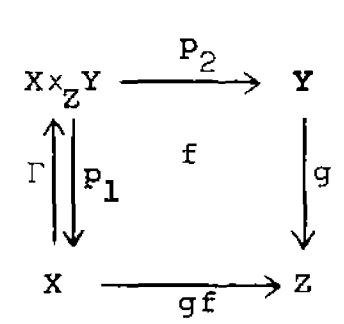

Now by base extension,  $w_{X_X,Y/Y} = p_1^*w_{X/Z}$ , and by the lemma,  $\omega_{X/X_{Z}Y} = f^*\omega_{Y/Z}^{v}$ . Transposing and taking the inverse, we obtain  $\zeta_{f,g} : \omega_{X/Z} \xrightarrow{\sim} f^*\omega_{Y/Z} \otimes \omega_{X/Y}$ 

Proposition 1.6. Let  $X \xrightarrow{f} Y \xrightarrow{g} Z \xrightarrow{h} W$  be three morphisms of locally noetherian preschemes, and suppose that each of the morphisms f,g,h,gf,hg,hgf is either smooth or a local complete intersection. Then the isomorphisms  $\zeta$  give a commutative diagram

$$\zeta_{h,g}\zeta_{f,hg} = \zeta_{f,g}\zeta_{gf,h}$$
.

Proof. Use Lemma 1.3.

\*Remark. The reader will realize later that the proper context for the notion of  $w_{X/Y}$  just studied is that of a Gorenstein morphism, and we will leave him to elaborate on the following indications. A morphism  $f\colon X\longrightarrow Y$  of locally noetherian preschemes is called <u>Gorenstein</u> if it is locally of finite type, has finite <u>Tor-dimension</u>, and if  $f^!(\mathscr{O}_Y')$  is isomorphic in  $D^+(X)$  to an invertible sheaf. Then we call that invertible sheaf  $\omega_{X/Y}$ , and prove that

$$f'(F') = \underline{L}f^*(F') \otimes \omega_{X/Y}$$

for all  $F' \in D_{qc}^+(Y)$ .

Smooth morphisms, and locally complete intersection morphisms are Gorenstein, and in those two cases the sheaf  $\omega_{X/Y}$  is the one we have already defined. Furthermore, if  $f\colon X\longrightarrow Y$  and  $g\colon Y\longrightarrow Z$  are Gorenstein, so is gf, and there is an isomorphism

$$\zeta_{f,g} : \omega_{X/Z} \xrightarrow{\sim} f^*\omega_{Y/Z} \otimes \omega_{X/Z}.$$

For a composition of three Gorenstein morphisms, there is a commutative diagram as in the Proposition.

# §2. f for a smooth morphism f.

Definition. Let  $f: X \longrightarrow Y$  be a smooth morphism of preschemes. Then we define a functor

$$f^{\sharp}: D(Y) \longrightarrow D(X)$$

by 
$$f^{\sharp}(G^{\bullet}) = f^{*}(G^{\bullet}) \otimes \omega_{X/Y}[n],$$

where [n] means "shift n places to the left". Observe that f is flat, so  $f^* = Lf^*$  is defined on all of D(Y), and  $w_{X/Y}$  is an invertible sheaf on X, hence is an element of  $D(X)_{fTd}$ , so that the tensor product is defined [II §4].

Proposition 2.1. Let  $f: X \longrightarrow Y$  be a smooth morphism, let  $u: Y' \longrightarrow Y$  be a morphism of finite Tor-dimension, and let  $X' = X \times_{Y} Y'$ . Then there is a

$$(\underline{L}v^*)f^{\sharp} = g^{\sharp}\underline{L}u^*$$

natural isomorphism

of functors from D(Y) to D(X').

<u>Proof.</u> This follows from [II 5.4] and [II 5.9] modified to include the case of finite Tor-dimension, and the compatibility of  $\omega_{X/Y}$  with base extension [\$1 above].

Remark. Following the conventions of [II §6], we write
"=" instead of naming the isomorphism and keeping track of it.
However, in the following Proposition we do not write "=",
because the isomorphism depends on a choice of sign made in
\$1 above. In general, we will write "=" below when there can
be no doubt about the isomorphism being compatible with all
previous ones, and we will name those isomorphisms where there
may be a question of sign, or of choice of coordinates, etc.

<u>Proposition 2.2.</u> Let  $f: X \longrightarrow Y$  and  $g: Y \longrightarrow Z$  be two smooth morphisms. Then there is an isomorphism

$$\zeta_{f,g}: (gf)^{\dagger} \xrightarrow{\sim} f^{\dagger}g^{\dagger}$$

of functors from D(Z) to D(X). Furthermore, for a composition of three smooth morphisms the isomorphisms  $\zeta$  give a commutative diagram.

<u>Proof.</u> We define  $\zeta_{f,g}$  using the  $\zeta$  of Definition 1.5 above, and the isomorphisms [II 5.4] and [II 5.9]. The compatibility then follows from Proposition 1.6.

Proposition 2.3. Let  $f: X \longrightarrow Y$  be a smooth morphism. Then  $f^{\sharp}$  takes  $D_{qc}(Y)$  to  $D_{qc}(X)$ , and, if X and Y are locally noetherian, it takes  $D_{c}(Y)$  to  $D_{c}(X)$ .

Proof. Obvious.

Proposition 2.4. Let  $f: X \longrightarrow Y$  be a smooth morphism.

a) There is a functorial isomorphism

$$f^{\sharp}(F^{\bullet}\otimes G^{\bullet}) \xrightarrow{\sim} f^{\sharp}(F^{\bullet}) \otimes f^{\ast}(G^{\bullet})$$

provided either  $F^*,G^*\in D^*(Y)$ , or one of  $F^*,G^*$  is in  $D^b(Y)_{fTd}$ , and the other is in D(Y).

b) There is a functorial homomorphism

$$f^{\sharp}(\underline{R} \xrightarrow{Hom} (F',G')) \longrightarrow \underline{R} \xrightarrow{Hom} (f^{\sharp}F', f^{\sharp}G')$$

for  $F' \in D(Y)$  and  $G' \in D^+(Y)$ . It is an isomorphism if Y is locally noetherian, and  $F' \in D^-_C(Y)$ .

Proof. Left to reader. (Use [II 5.8],[II 5.9],[II 5.13],
and [II 5.16].)

### §3. Recall of the Explicit Calculations.

In this section we recall the calculations of the cohomology of projective space, as done in [EGA III \$1]. First we must define the Cech resolution of a sheaf, and we follow [G, II \$5].

Let X be a prescheme, let  $\mathcal{U} = (U_i)$  be a family of open sets of X, and let F be an  $\mathcal{O}_X$ -module. Then we define the Cech complex of F,  $C^*(\mathcal{U},F)$ , as follows.

For each  $p \ge 0$ , and for each (p+1)-tuple of indices  $i_0 < \cdots < i_p$  let  $U_{i_0}, \cdots, i_p = U_{i_0} \cap \cdots \cap U_{i_p}$ . Define the sheaf  $C^p(U,F)$  by giving its sections on an open set V as follows:

$$c^{p}(u,F)(v) = i_{o}(\prod_{i_{o}} F(v \cap u_{i_{o}}, \dots, i_{p}).$$

One checks easily that this is a sheaf. In fact, it is the product, over all  $i_0 < \cdots < i_p$ , of the sheaves  $i_*(F|_{U_{i_0}, \cdots, i_p})$ ,

where i:  $U_{i_0, \dots, i_p} \rightarrow X$  is the inclusion. If

$$\alpha \in C^{\mathbf{p}}(\mathbf{u}, \mathbf{F})(\mathbf{v})$$

is a section, we represent it by its components,

$$\alpha = \prod_{i_0, \dots, i_p} \alpha_{i_0, \dots, i_p}$$

$$\alpha_{i_0, \dots, i_p} \in F(V \cap U_{i_0, \dots, i_p}).$$

with

We define the boundary map

d: 
$$c^{p}(u,F) \longrightarrow c^{p+1}(u,F)$$

as follows. If  $\alpha \in C^p(\mathfrak{U},F)(V)$  is a section, as above, then the components of  $d\alpha$  are given by

$$(d\alpha)_{i_0,\dots,i_{p+1}} = \sum_{j=1}^{n} (-1)^{j} \rho_j \alpha_{i_0,\dots,i_j,\dots,i_{p+1}}$$

where  $\rho_i$  is the appropriate restriction map on sections of F.

Finally, we define an augmentation

$$\epsilon \colon F \longrightarrow C^{O}(\mathfrak{U},F)$$

by sending a section  $\alpha \in E(V)$  to the product of its restrictions  $\alpha_i \in F(V \cap U_i)$ .

Proposition 3.1. [G, II.5.2.1] Suppose that  $\mathcal U$  is a covering of X. Then the augmentation  $\epsilon$  gives a quasi-isomorphism of F to the Cech complex  $C^*(\mathcal U,F)$  of F (i.e., it is a "resolution" of F, in the old language).

<u>Proposition 3.2.</u> Let  $f: X \longrightarrow Y$  be a separated morphism of preschemes, let  $\mathcal{U} = (\mathcal{U}_i)$  be a family of open subsets of X such that  $f|_{\mathcal{U}_i}$  is an affine morphism for each i, and let F be a quasi-coherent  $\mathcal{O}_X$ -module. Then the sheaves  $C^p(\mathcal{U},F)$  are  $f_*$ -acyclic.

<u>Proof.</u> Since a product of  $f_*$ -acyclic sheaves is  $f_*$ -acyclic, we need only show that if U is an open subset of X such that  $f|_U$  is an affine morphism, and if i: U  $\longrightarrow$  X is the inclusion, then  $i_*(F)$  is  $f_*$ -acyclic. Now since f is separated, and  $f|_U$  is affine, it follows that i is an affine morphism. On the other hand, since F is quasi-coherent,  $F|_U$  is acyclic for the affine morphisms i and fi, by [EGA III 1.3.2]. Hence by the spectral sequence of derived functors [II.5.1],  $i_*(F|_U)$  is  $f_*$ -acyclic.

Corollary 3.3. Let  $f: X \longrightarrow Y$  be a separated morphism of preschemes, let  $\mathcal{U} = (U_i)$  be an open cover of X such that  $f|_{U_i}$  is an affine morphism for each i, and let F be a quasicoherent sheaf on X. Then the natural maps

$$f_*(C^*(u,F)) \xrightarrow{\xi} Rf_*(C^*(u,F)) \xleftarrow{Rf_*(\epsilon)} Rf_*(F)$$

are isomorphisms in D(Y). (Here  $\xi$  is the canonical map in the definition of the derived functor, cf. [I.5].)

Proof. Follows from the two previous results and from [I.5.1] and [I.5.3 $\beta$ ].

Now we will apply these results to projective space. Let Y be a prescheme, and let  $X = \mathbb{P}^n_Y$  be the n-dimensional projective space over Y, i.e.,  $X = \underline{\operatorname{Proj}} \ \mathscr{O}_Y[T_0, \cdots, T_n]$  where the  $T_i$  are indeterminates. For each i, let  $U_i = X_{T_i}$ , the place where  $T_i \neq 0$ . Then  $\mathscr{U} = (U_i)$  is a finite open cover of X, and  $f|_{U_i}$  is an affine morphism for each i, where  $f\colon X \longrightarrow Y$  is the projection. Indeed,  $U_i \cong \mathbb{A}^n_Y$ , affine n-space.

On  $U_{O}$  we fix a set of inhomogeneous coordinates  $t_{i} = T_{i}/T_{O}, \qquad i = 1, \dots, n.$ 

Let  $w=w_{X/Y}$  be the relative n-differential forms on X over Y. (It is well known that one can find an isomorphism  $w\cong \mathscr{O}_X(-n-1)$ , but we will not use this isomorphism, because of its non-intrinsic nature.) Then

$$\tau = dt_1 \wedge \cdots \wedge dt_n$$

is a generating section of  $w|_{U_O}$ , since  $\Omega_{U_O/Y}^1$  is free of rank n, and generated by  $\mathrm{dt}_1,\cdots,\mathrm{dt}_n$ . Since  $w(n+1)\cong \mathcal{O}_X$ ,  $\tau$  extends to a global section

$$\tau \in \Gamma(X, \omega(n+1))$$

which we will also call T.

Multiplication by  $T_0\cdots T_n$  gives a map from  $\omega$  to  $\omega(n+1)$ , which is an isomorphism on  $U_0,\dots,n$ , so we can consider the section

$$\tau/T_{\circ}\cdots T_{n} \in \omega(U_{\circ,\cdots,n})$$
.

This section is an n-cocycle in the complex  $f_*(C^*(\mathfrak{U},\omega))$ , and so using Corollary 3.3 above, defines an element

$$\overline{\tau} \in \Gamma(Y,R^n f_*(\omega)).$$

Theorem 3.4. [EGA III 2.1.12] Let Y be a prescheme, let  $X = \mathbf{F}_Y^n$ , let f be the projection, and let  $w = w_{X/Y}$  be the relative n-differentials. Then  $R^n f_*(w)$  is an invertible sheaf on Y, and  $\overline{\tau}$  is a generating section, hence it defines an isomorphism

$$\gamma \colon R^n f_*(\omega) \xrightarrow{\sim} O_v$$

by sending  $\bar{\tau}$  to 1. Furthermore,

$$R^{i}f_{*}(O_{X}(m)) = O = R^{n-i}f_{*}(\omega(-m))$$

for 0 < i < n,  $m \in \mathbb{Z}$ , and for i = 0, m < 0, and the cup-product

$$f_*(\mathcal{O}_X(m)) \times R^n f_*(\omega(-m)) \longrightarrow R^n f_*(\omega)$$

is a perfect pairing of locally free sheaves for all m  $\geq$  0.

- Remarks. 1. Note that the isomorphism  $\gamma$  we have constructed above is compatible with arbitrary base extension, since everything in the construction is flat over Y.
- 2. It is natural to ask whether the isomorphism  $\gamma$  is stable under automorphisms of the projective space, and we will see later (Corollary 10.2) that indeed it is.

## \$4. The trace map for projective space.

In this section we define the trace isomorphism

$$Trp_{f}: \quad \mathbb{R}f_{*}f^{\sharp}(G^{\bullet}) \xrightarrow{\sim} G^{\bullet}$$

for  $G \in D_{qc}^+(Y)$ , where Y is a locally noetherian prescheme, and  $f \colon \mathbb{F}_Y^n \longrightarrow Y$  is the projection. The definition uses the results of [II.7] on locally noetherian preschemes. Without using these results, we can define the trace map only for  $G \in D_{qc}^b(Y)$ .

Lemma 4.1. Let Y be a locally noetherian prescheme, let  $X = \mathbb{P}_Y^n$ , and let  $f \colon X \longrightarrow Y$  be the projection. Then every quasi-coherent sheaf F on X is a quotient of a sheaf of the form

$$L = \oplus f^*(G_i)(-m_i)$$

where the  $G_{i}$  are quasi-coherent sheaves on Y, and the  $m_{i}>0$  are integers.

Proof. Since F is the direct limit of its coherent subsheaves, we may assume that F itself is coherent. For each m > 0 we have a natural map

$$f^*f_*(F(m)) \longrightarrow F(m),$$

and we know from Serre's theorem [EGA III 2.2.1] that for each noetherian open subset  $V \subseteq Y$ , the restriction of this map to

 $f^{-1}(V)$  is surjective for large enough m. Hence the map

$$\bigoplus_{m>0} f^*f_*(F(m))(-m) \longrightarrow F$$

is surjective on all of X, so we are done.

Lemma 4.2. For any sheaf L on X of the form of the previous lemma,  $R^{i}f_{*}(L) = 0$  for  $i \neq n$ .

<u>Proof.</u> It is sufficient to show that for G quasi-coherent on Y, and m > 0,  $R^if_*(f^*(G)(-m)) = 0$  for  $i \neq n$ . The question is local on Y, so we may assume Y quasi-compact, and use the projection formula [II.5.6] (note  $f^*(G)(-m) = f^*(G) \otimes f_X(-m)$ ):

$$\mathbb{R}f_{*}(f^{*}(G)(-m)) \xrightarrow{\sim} \mathbb{R}f_{*}(\mathcal{O}_{X}(-m)) \otimes G.$$

But  $R^i f_*(\mathcal{O}_X(-m)) = 0$  for  $i \neq n$  by the explicit calculations (Theorem 3.4), and  $R^n f_*(\mathcal{O}_X(-m))$  is locally free on Y, so there is only one non-zero sheaf on the right, and we are done.

Proposition 4.3. Let Y be a locally noetherian prescheme, let  $X = \mathbb{P}^n_Y$ , and let  $f \colon X \longrightarrow Y$  be the projection. Then there is a functorial isomorphism

$$\operatorname{Trp}_{\mathbf{f}} \colon \ \underline{\mathbf{R}} f_{*} f^{*}(G^{\bullet}) \xrightarrow{\sim} G^{\bullet}$$

for  $G^* \in D^+_{qc}(Y)$ .

<u>Proof.</u> Since X and Y are locally noetherian, we reduce to constructing a similar isomorphism for  $G' \in D^+(Qco(Y))$ , where

$$\underline{R}f_*: D(Qco(X)) \longrightarrow D(Qco(Y))$$

and  $f^{\sharp}: D(Qco(Y)) \longrightarrow D(Qco(X)).$ 

(We use here [II.7.19] which says that  $D^+(Qco(Y)) \longrightarrow D^+_{qc}(Y)$  is an equivalence of categories, and [I.5.6] which says that taking derived functors is compatible with this isomorphism. Note that  $\mathbb{R}f_*$  is defined on all of D(Qco(X)) since  $f_*$  is of finite cohomological dimension on Qco(X).)

In fact, we will construct an isomorphism

$$Trp_{f}: \underline{R}f_{*}f^{*}(G^{\bullet}) \xrightarrow{\sim} G^{\bullet}$$

for all  $G' \in D(Qco(Y))$ .

We apply [I.7.4] to the categories A = Qco(X) and B = Qco(Y), and to the functor  $F = f_*$ . Now  $f_*$  has cohomological dimension n on Qco(X). Let  $P \subseteq Ob\ Qco(X)$  be the collection of sheaves of the form L of Lemma 4.1. Then by the two lemmae, P satisfies the hypotheses of loc. cit. and we conclude that  $\underline{L}(R^nf_*)$  exists, and there is an isomorphism

$$\psi: \underline{R}f_* \xrightarrow{\sim} \underline{L}(R^n f_*)[-n]$$

of functors from D(Qco(X)) to D(Qco(Y)).

We apply  $\psi$  to  $f^{\sharp F}G^{\bullet}$  for  $G^{\bullet} \in K(Qco(Y))$ , which gives an isomorphism

$$\underset{=}{\mathbb{R}} f_* f^*(G^*) = \underset{=}{\mathbb{R}} f_* (f^*(G^*) \otimes \omega[n])$$

$$\xrightarrow{\sim} L(R^n f_*) (f^*(G^*) \otimes \omega) .$$

Now each sheaf  $f^*(G^p)\otimes \omega$  is in P (since  $\omega\cong \mathscr{O}_X(-n-1)$ ), hence is  $R^nf_*$ -acyclic, so the expression on the right is just

$$R^n f_*(f^*(G^*) \otimes \omega).$$

But for each p, the projection formula gives us an isomorphism

$$R^{n}f_{*}(f^{*}(G^{p})\otimes w) \xrightarrow{\sim} R^{n}f_{*}(w) \otimes G^{p}$$
,

and composing with the isomorphism  $\gamma$  of Theorem 3.4, this becomes  $G^p$ . Composing all these isomorphisms we have the required isomorphism

$$\operatorname{Trp}_{\mathbf{f}} \colon \ \underline{\mathbf{R}} \mathbf{f}_{\mathbf{f}} \mathbf{f}^{\mathbf{f}} \mathbf{G}^{\bullet} \longrightarrow \mathbf{G}^{\bullet} \ .$$

Remarks. 1. Remember that the isomorphism  $\operatorname{Trp}_f$  we have just defined depends on the isomorphism  $\gamma$  of Theorem 3.4, and so depends apparently on the projective coordinates.

2. If one does not wish to use [II.7.19] and [I.7.4], one can define  $\operatorname{Trp}_f$  for  $G' \in \operatorname{D}_{\operatorname{qc}}^b(Y)$  simply by using the projection formula [II.5.6]. The following proposition shows that the two methods of constructing the trace map agree when both are defined.

<u>Proposition 4.4.</u> Let f,X,Y be as in the previous proposition, let  $F^{\bullet},G^{\bullet}\in D^b_{qc}(Y)$ , and assume that one of  $F^{\bullet},G^{\bullet}$  has finite Tor-dimension. Then the following diagram is commutative:

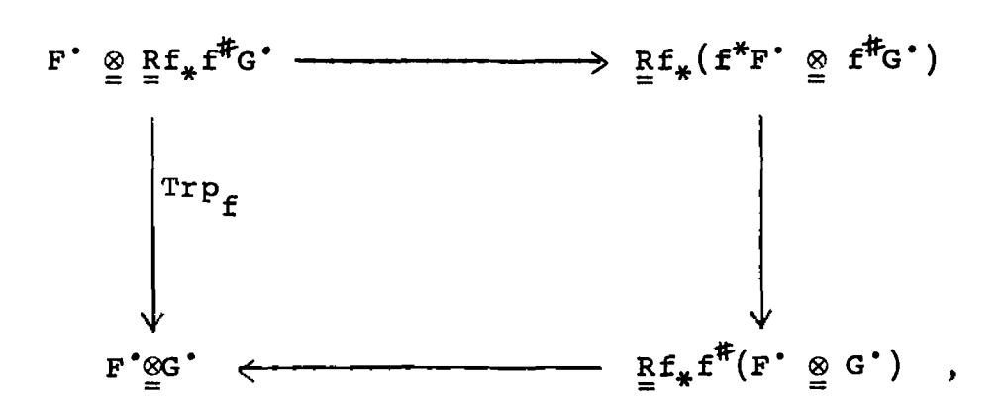

where the upper horizontal arrow is the projection formula [II 5.6] and the right-hand vertical arrow is the isomorphism of Proposition 2.4a.

<u>Proof.</u> The question is local on Y, so we may assume Y affine. Then we can take a resolution of  $F^*$  by direct sums of copies of  $\mathcal{O}_Y$ . Thus we may work entirely with quasi-coherent sheaves, and will prove the statement for  $F^*,G^*\in D^-(Qco(Y))$ . Then the result follows easily from the definition of the morphisms involved, since if  $C^*$  is a Cartan-Eilenberg resolution of  $f^*G^*$ , then  $f^*F^*\otimes C^*$  is a Cartan-Eilenberg resolution of  $f^*F^*\otimes f^*G^*$ .

# §5. The duality theorem for projective space.

The duality theorem for projective space now follows easily from what has gone before. At the same time it is a model of how the duality is defined in terms of the functor  $f^*$  and the isomorphism  $\operatorname{Tr}_f$ . When we have a satisfactory functorial theory of  $f^*$  (which is  $f^*$  in the smooth case) and  $\operatorname{Tr}_f$ , we will prove the most general duality theorem by reducing to this case (Chapter VII).

Let Y be a noetherian prescheme of finite Krull dimension, let  $X = \mathbb{P}^n_Y$ , and let  $f \colon X \longrightarrow Y$  be the projection. We define the <u>duality morphism</u>

$$\frac{\Theta}{-f}: \quad \mathbb{R}f_{*} \quad \mathbb{R} \xrightarrow{Hom_{X}^{\bullet}} (F^{\bullet}, f^{\sharp}G^{\bullet}) \longrightarrow \mathbb{R} \xrightarrow{Hom_{Y}^{\bullet}} (\mathbb{R}f_{*}F^{\bullet}, G^{\bullet})$$

for  $F \in D^-(X)$  and  $G \in D^+_{qc}(Y)$  by composing the morphism of [II.5.5] with the trace morphism in the second variable (Proposition 4.3).

Applying the functor  $\mathbb{R}\Gamma(Y, \cdot)$  to both sides, and using [II.5.2] and [II.5.3] we obtain a global duality morphism

$$\Theta_{\mathbf{f}} : \underline{\underline{R}} \operatorname{Hom}_{X}^{\bullet}(F^{\bullet}, f^{\sharp}G^{\bullet}) \longrightarrow \underline{\underline{R}} \operatorname{Hom}_{Y}^{\bullet}(\underline{\underline{R}}f_{*}F^{\bullet}, G^{\bullet})$$

and taking the cohomology of this, we get morphisms

$$e_f^i$$
:  $\operatorname{Ext}_X^i(F^{\,\bullet},f^{\sharp}G^{\,\bullet}) \longrightarrow \operatorname{Ext}_Y^i(\operatorname{\underline{R}f}_*F^{\,\bullet},G^{\,\bullet})$ .

Theorem 5.1. Let Y be a noetherian prescheme of finite Krull dimension, and let  $X = \mathbb{P}^n_Y$ . Then the duality morphisms  $\underline{\Theta}_f, \underline{\Theta}_f$ , and  $\underline{\Theta}^i_f$  are isomorphisms for all  $F^* \in D^-_{qc}(X)$  and  $G^* \in D^+_{qc}(Y)$ .

<u>Proof.</u> Clearly it is sufficient to show that  $\underline{\theta}_f$  is an isomorphism. The question is local on Y, so we may assume that Y is affine. Then every quasi-coherent sheaf on Y is a quotient of a direct sum of copies of  $\theta_Y$ , hence, as in Lemma 4.1, every quasi-coherent  $\theta_X$ -module is a quotient of a direct sum of copies of  $\theta_X$ (-m) for various m. We can take m large, and using any isomorphism  $\psi \cong \theta_X$ (-n-1) we see that any quasi-coherent sheaf F on X is a quotient of a sheaf of the form

$$L = \oplus \omega(-m_i)$$

for certain integers  $m_i > 0$ .

The functors in question are way-out right in both variables, so by the Lemma on Way-out Functors [I.7.1], we reduce to the case F' = L of the form above, and G' = G, a single injective

quasi-coherent sheaf. Furthermore,  $\frac{R}{L}$  Hom' transforms direct sums in the first variable to direct products, so we reduce to the case  $F' = \omega(-m)$  for m > 0. Thus we have to prove that the map

$$\underline{\Theta}_{f} : \underline{\mathbb{R}} f_{*} \underline{\mathbb{R}} \underline{\operatorname{Hom}}_{X}^{\bullet}(\omega(-m), f^{*}(G) \otimes \omega[n]) \\
\longrightarrow \underline{\mathbb{R}} \underline{\operatorname{Hom}}_{Y}^{\bullet}(\underline{\mathbb{R}} f_{*}(\omega(-m)), G)$$

is an isomorphism. By [II.5.16] and the projection formula, the complex on the left becomes

$$\underset{=}{\mathbb{R}} \mathbf{f}_{*}(\mathcal{O}_{\mathbf{X}}(\mathbf{m})) \otimes \mathbf{G}[\mathbf{n}] = \mathbf{f}_{*}(\mathcal{O}_{\mathbf{X}}(\mathbf{m})) \otimes \mathbf{G}[\mathbf{n}]$$

since m > 0 and  $R^{i}f_{*}(O'_{X}(m)) = 0$  for i > 0 (Theorem 3.4). On the other hand,  $R^{i}f_{*}(w(-m)) = 0$  for  $i \neq n$ , so the complex on the right becomes

$$\underline{\text{Hom}}_{\mathbf{v}}(\mathbf{R}^{\mathbf{n}}\mathbf{f}_{*}(\omega(-\mathbf{m})), \mathcal{O}_{\mathbf{v}}) \otimes \mathbf{G}[\mathbf{n}],$$

using again [II.5.16] and the fact that  $R^n f_*(\omega(-m))$  is a locally free sheaf of finite rank on Y.

Now  $\Theta_{\mathbf{f}}$  is the map deduced from the cup-product

$$f_*(O_X(m)) \times R^n f_*(w(-m)) \longrightarrow R^n f_*(w)$$
,

and so it is an isomorphism by Theorem 3.4. q.e.d.

Corollary 5.2. Let A be a noetherian ring, let  $X = \mathbb{P}_A^n$ , let I be an A-module, and let  $F^* \in D^-_{qc}(X)$ . Assume either that I is injective, or that  $H^1(X,F^*)$  is projective for all i. Then there is a canonical isomorphism

$$\operatorname{Hom}_{A}(\operatorname{H}^{i}(X, F^{\cdot}), I) \cong \operatorname{Ext}_{\mathcal{O}_{X}}^{n-i}(F^{\cdot}, \omega \otimes_{A} I).$$

Remark. When A is a field, I = A, and F' is a complex consisting of a single sheaf, one recovers the duality theorem of Serre for projective space over a field.

## §6. Duality for a finite morphism.

Throughout this section we will let  $f\colon X\longrightarrow Y$  be a finite morphism of locally noetherian preschemes. We will define a functor  $f^{\flat}$  and a morphism of functors  $\mathrm{Trf}_f\colon \ ^{\mathrm{gf}}_{\star}f^{\flat}\longrightarrow 1$ , with the same formal properties as the  $f^{\sharp}$  and  $\mathrm{Trp}_f$  of §2,4 above. Then we prove a duality theorem similar to the one of §5. This duality theorem is much more elementary than the preceding one, but it is important to set it in the right functorial context.

The reader will notice that the locally noetherian hypothesis is not needed for the definition of fb, but it is needed for the functorial properties, and the trace map. This suggests that our definition is not the "right" one in the non-noetherian case. On the other hand, we show by an example that the quasi-coherent hypotheses on the sheaves are indeed necessary for a duality theorem.

Let  $f: X \longrightarrow Y$  be a finite morphism of locally noetherian preschemes. Let  $\overline{f}$  be the morphism of ringed spaces  $(X, \mathscr{O}_X) \longrightarrow (Y, f_*\mathscr{O}_X)$ , and let  $\operatorname{Mod}(f_*\mathscr{O}_X)$  be the category of sheaves of  $f_*\mathscr{O}_X$ -modules on Y. Then  $\overline{f}$  is a flat morphism, and we will consider the functors

$$\overline{f}_*: Mod(X) \longrightarrow Mod(f_* \mathcal{O}_X)$$

$$\overline{f}^*: \operatorname{Mod}(f_* \mathcal{O}_X) \longrightarrow \operatorname{Mod}(X).$$

Then  $\overline{f}^*$  is exact, since  $\overline{f}$  is flat, and the two functors are adjoint [EGA 0, 4.4], i.e., there is a natural map

$$\tau\colon \ 1 \longrightarrow \overline{f}_* \overline{f}^*$$

of functors from  $\operatorname{Mod}(\operatorname{f}_{\mathbf{x}} \mathscr{O}_{\operatorname{X}})$  into itself, such that the resulting map

$$\text{Hom}_{\mathcal{O}_{\mathbf{X}}^{\prime}}(\overline{\mathbf{f}}^{*}\mathbf{G}, \mathbf{F}) \longrightarrow \text{Hom}_{\mathbf{f}_{\mathbf{X}}}(\mathbf{G}, \overline{\mathbf{f}}_{\mathbf{X}}\mathbf{F})$$

is an isomorphism for  $F \in Mod(X)$  and  $G \in Mod(f_* O_X)$ .

Definition. Let  $f: X \longrightarrow Y$  be a finite morphism of locally noetherian preschemes. Then we define

$$f^{\flat}: D^{+}(Y) \longrightarrow D^{+}(X)$$

by

$$f^{\flat} = \overline{f}^* = \underline{Hom}_{\mathcal{O}_{\mathbf{v}}}(f_*\mathcal{O}_{\mathbf{x}}, \cdot)$$
.

(Note that  $\underset{=}{\mathbb{R}} \xrightarrow{\operatorname{Hom}} \mathscr{O}_{\mathbf{Y}}^{(f_*\mathscr{O}_{\mathbf{X}}, \cdot)}$  is considered as a functor from  $D^+(\mathbf{Y})$  to  $D^+(\operatorname{Mod}(f_*\mathscr{O}_{\mathbf{X}}))$ , and that  $\overline{f}^*$  is exact.)

If f has finite Tor-dimension [II §4], then  $f_*\mathscr{O}_X$  has finite Tor-dimension in the category Mod(Y), since  $f^* = \overline{f}^* \cdot (\mathfrak{D}_{\mathbf{X}})$ . On the other hand,  $f_*\mathscr{O}_X$  is coherent, so locally it has a finite resolution by locally free sheaves of finite rank. We conclude that the functor  $\underline{\mathrm{Hom}}_{Y}(f_*\mathscr{O}_X, \cdot)$  has finite cohomological dimension, and so in that case we can define

$$f^{\flat}: D(Y) \longrightarrow D(X)$$

by the same formula as above.

<u>Proposition 6.1.</u> Let  $f: X \longrightarrow Y$  be a finite morphism of locally noetherian preschemes (resp. with finite Tor-dimension). Then f takes  $D_{qc}^+(Y) \longrightarrow D_{qc}^+(X)$  and  $D_c^+(Y) \longrightarrow D_c^+(X)$  (resp.  $D_{qc}^-(Y) \longrightarrow D_{qc}^-(X)$  and  $D_c^-(Y) \longrightarrow D_c^-(X)$ ).

<u>Proof.</u> Follows from [I.7.3], [II.3.2], and the fact that  $\overline{f}^*$  takes quasi-coherent sheaves to quasi-coherent sheaves, and coherent sheaves to coherent sheaves.

Proposition 6.2. Let  $X \xrightarrow{f} Y \xrightarrow{g} Z$  be two finite morphisms of locally noetherian preschemes (resp. with finite Tor-dimension). Then there is a natural morphism

$$(gf)^{\flat} \longrightarrow f^{\flat}q^{\flat}$$

of functors from  $D^+(Z)$  to  $D^+(X)$  (resp. D(Z) to D(X)). Furthermore, this map is an isomorphism for all  $G^* \in D^+_{qc}(Z)$  (resp.  $D_{qc}(Z)$ ).

whence by [I.5.4] the morphism of functors

$$(gf)^{\flat} \longrightarrow f^{\flat}g^{\flat}$$
.

To show it is an isomorphism for  $G' \in D^+_{qc}(Z)$  (resp.  $D^-_{qc}(Z)$ ) we use [I.7.1] and [II.7.18] to reduce to the case where G' is a single quasi-coherent injective  $\mathscr{O}_Z$ -module. Then  $\overline{g}^*\underline{\operatorname{Hom}}_{\mathscr{O}_Z}(g_*\mathscr{O}_Y,G)$  is a quasi-coherent injective  $\mathscr{O}_Y$ -module (since for a morphism of rings  $A \longrightarrow B$ , if I is an injective A-module, then  $\operatorname{Hom}_A(B,I)$  is an injective B-module), so we reduce to the isomorphism of sheaves mentioned above, by [II.7.14] and [II.7.16].

Proposition 6.3. Let  $f: X \longrightarrow Y$  be a finite morphism of locally noetherian preschemes (resp. with  $X' \xrightarrow{V} X$  finite Tor-dimension), and let  $u: Y' \longrightarrow Y$  be a flat morphism with Y' locally noetherian.  $Y' \xrightarrow{u} Y$  Let  $X' = X \times_{Y} Y'$ , and let v,g be the projections. Then there is a natural functorial isomorphism

$$v^*f^{\flat}$$
 (G°)  $\xrightarrow{\sim}$   $g^{\flat}u^*(G^{\bullet})$ 

for  $G^{\bullet} \in D^{+}(Y)$  (resp.  $G^{\bullet} \in D(Y)$ ).

Proof. Use [II.5.8]. Details left to reader.

Corollary 6.4. With the hypotheses of the Proposition, assume furthermore that u (and hence also v) is a smooth morphism. Then there is a natural functorial isomorphism

$$v^{\sharp}f^{\flat}(G^{\bullet}) \xrightarrow{\sim} g^{\flat}u^{\sharp}(G^{\bullet})$$

for  $G' \in D^+(Y)$  (resp.  $G' \in D(Y)$ ). Moreover, under composition of two such Cartesian diagrams, this isomorphism is compatible with the isomorphisms of Propositions 2.2 and 6.2.

<u>Proof.</u> Follows immediately from the Proposition and the fact that  $\omega_{Y'/Y}$  is compatible with arbitrary base extension.

<u>Proposition 6.5.</u> Let  $f: X \longrightarrow Y$  be a finite morphism of locally noetherian preschemes (resp. with finite Tor-dimension). Then there is a functorial morphism

$$\operatorname{Trf}_{f} : \underline{R}f_{*}f^{\flat}(G^{\bullet}) \longrightarrow G^{\bullet}$$

for  $G' \in D_{qc}^+(Y)$  (resp.  $G' \in D_{qc}(Y)$ ).

Proof. Consider the natural map, for G ∈ Mod(Y)

$$\tau \colon \ \underline{\text{Hom}}_{\mathscr{O}_{\mathbf{V}}}(f_{*}\mathscr{O}_{X},G) \longrightarrow \overline{f}_{*}\overline{f}^{*} \ \underline{\text{Hom}}_{\mathscr{O}_{\mathbf{V}}}(f_{*}\mathscr{O}_{X},G).$$

This gives rise to a functorial morphism [I.5.4]

$$\underline{\underline{\mathbf{P}}}_{\mathsf{T}} : \underline{\underline{\mathbf{P}}} \xrightarrow{\underline{\mathbf{Hom}}} \theta_{\mathsf{Y}}' (f_{\mathsf{X}} \theta_{\mathsf{X}}, G^{\bullet}) \longrightarrow \underline{\underline{\mathbf{P}}} f_{\mathsf{Y}} f^{\flat} (G^{\bullet})$$

for  $G^{\bullet} \in D^{+}(Y)$  (resp. D(Y)). I claim  $\mathbb{R}^{\intercal}$  is an isomorphism for  $G^{\bullet} \in D^{+}_{qc}(Y)$  (resp.  $D_{qc}(Y)$ ). Indeed, using [I.7.3] we reduce to the case where  $G^{\bullet} = G$  is a single quasi-coherent injective  $\theta_{X}^{\bullet}$ -module. In that case  $\tau$  is an isomorphism [EGA II.1.4.3] since f is an affine morphism, and  $f^{\flat}(G)$  is injective (as we saw above) so we are done.

Now composing  $(\underline{R}\tau)^{-1}$  with the natural map

$$\stackrel{\mathbb{R}}{=} \underline{\operatorname{Hom}}_{\mathscr{O}_{\mathbf{v}}}(f_{*}\mathscr{O}_{X},G^{\bullet}) \longrightarrow G^{\bullet}$$

derived from the map

$$\underline{\operatorname{Hom}}_{\mathcal{O}_{\mathbf{V}}}(f_{*}\mathcal{O}_{\mathbf{X}}',G) \longrightarrow G,$$

"evaluation at one", gives Trf,.

<u>Proposition 6.6.</u> 1) Let  $X \xrightarrow{f} Y \xrightarrow{g} Z$  be a composition of two finite morphisms as in 6.2 above. Then there is a commutative diagram

$$\begin{array}{cccc}
& & & & & & & & & \\
& & & & & & & & \\
& & & &$$

of functors on  $D_{qc}^+(Z)$  (resp.  $D_{qc}(Z)$ ).

2) Let u: Y' -> Y be a flat base extension, as in 6.3 above. Then there is a commutative diagram

$$\begin{array}{cccccccccccccccccccccccccccccccccccc$$

of functors on  $D_{qc}^+(Y)$  (resp.  $D_{qc}(Y)$ ). (The left vertical arrow is [II.5.12].)

Proof. Left to reader.

Theorem 6.7 (Duality). Let  $f: X \longrightarrow Y$  be a finite morphism of noetherian preschemes of finite Krull dimension. Then the duality morphism  $\theta_f: \mathbb{R}f_* \mathbb{R} \xrightarrow{Hom_X^*} (F^*, f^{\dagger}G^*) \longrightarrow \mathbb{R} \xrightarrow{Hom_X^*} (\mathbb{R}f_*F^*, G^*)$ 

defined by composing [II.5.5] with Trff, is an isomorphism for  $F^* \in D^-_{qc}(X) \text{ and } G^* \in D^+_{qc}(Y).$ 

<u>Proof.</u> Making the usual reductions, we arrive at the following well-known statement: let  $A \longrightarrow B$  be a homomorphism of rings, let M be a B-module and let N be an A-module. Then the natural map

$$\operatorname{Hom}_{B}(M, \operatorname{Hom}_{A}(B,N)) \longrightarrow \operatorname{Hom}_{A}(M,N)$$

is an isomorphism.

Example. One cannot expect a duality theorem for non-quasi-coherent sheaves, even for a finite étale morphism of integral noetherian schemes. Let Y be a non-singular curve over a field k, algebraically closed, and let X be a double covering of Y.

Let  $y \in Y$  be a closed point, and let  $x_1, x_2$  be the two points lying over y. Let K(X) and K(Y) be the function fields of X and Y, respectively. Let G be the sheaf K(Y), concentrated at the point y. Then G is a (non-quasi-coherent) indecomposable injective  $\theta_Y$ -module [II.7.11]. One sees easily that  $f^{\flat}(G)$  is the sheaf on X consisting of two copies of K(X), one concentrated at  $x_1$ , and one concentrated at  $x_2$ . It is the direct sum of two indecomposable injective  $\theta_X$ -modules.

Now let  $F = \sigma_x$ . Then we have

$$f_* = \frac{\text{Hom}}{\ell_X} (F, f^{\flat}G) = 2K(X)$$
 concentrated at y

$$\frac{\text{Hom}}{\theta_{\mathbf{v}}}(f_{\mathbf{x}}F,G) = K(X)$$
 concentrated at y.

Thus the duality morphism  $\underline{\Theta}_f$  cannot be an isomorphism.

Remark 6.8. Let  $f: X \longrightarrow Y$  be a closed immersion of preschemes (not necessarily locally noetherian) (resp. with X a locally complete intersection in Y [\$1]). Then we can improve on the results of this section as follows.

We can define

$$f^{\flat} : D^{+}(Y) \longrightarrow D^{+}(X)$$
(resp. 
$$f^{\flat} : D(Y) \longrightarrow D(X)$$
)

by the same formula as above, noting that if X is a local complete intersection, then the functor  $\frac{\operatorname{Hom}}{\mathbb{C}_Y}(f_*\mathcal{C}_X, \cdot)$  has finite cohomological dimension.

As in Proposition 6.2, there is a natural map

$$(gf)^{\flat} \longrightarrow f^{\flat}g^{\flat}$$

which is defined and is an isomorphism on  $D^+(Z)$  (resp. D(Z)). One need only note that  $\overline{f}^*$  and  $\overline{g}^*$  are the identity maps, so the reduction to the quasi-coherent case is unnecessary.

The trace map of Proposition 6.4,

$$\operatorname{Trf}_{\mathbf{f}}: \quad \operatorname{\mathbf{R}f}_{\mathbf{f}} f^{\flat}(G^{\bullet}) \longrightarrow G^{\bullet},$$

is defined for  $G^* \in D^+(Y)$  (resp. D(Y)) since the morphism  $\tau$  of the proof is the identity.

The compatibilities of Proposition 6.6 carry over to this more general case. (Here one needs to note that the quasi-coherence assumption in [II.5.12] is unnecessary if f is a closed immersion, because then  $f_*$  is an exact functor on Mod(X).)

Finally, the duality of Theorem 6.6 is valid for  $F' \in D(X)$  and  $G' \in D^+(Y)$ . Indeed, we may assume that G' is a complex of injective  $\mathscr{O}_Y$ -modules. Then  $f^{\dagger}G'$  is also a complex of injectives;  $f_*$  is exact, so we have to show that

$$f_* \xrightarrow{Hom_X^{\bullet}} (F^{\bullet}, f^{\flat}G^{\bullet}) \xrightarrow{Hom_Y^{\bullet}} (f_*F^{\bullet}, G^{\bullet})$$

is an isomorphism. It is true for each  $F^p$ ,  $G^q$  separately, and hence is true for the complexes. (Note we do not use the Lemma on Way-out Functors this time.)

Proposition 6.9. Let  $f: X \longrightarrow Y$  be a finite morphism of locally noetherian preschemes. Then

a) There is a functorial isomorphism

$$f^{\flat}(F^{\bullet}) \otimes \underline{L}f^{*}(G^{\bullet}) \xrightarrow{\sim} f^{\flat}(F^{\bullet}\otimes G^{\bullet})$$

for  $F' \in D^+(Y)$ ,  $G' \in D^b(Y)$ fTd.

b) There is a functorial isomorphism

$$\underline{\underline{R}} \ \underline{\underline{Hom}}^{\bullet}(\underline{\underline{L}}\underline{f}^{*}F^{\bullet}, \ \underline{f}^{\flat}G^{\bullet}) \xrightarrow{\sim} \underline{f}^{\flat}(\underline{\underline{R}} \ \underline{\underline{Hom}}^{\bullet}(F^{\bullet}, G^{\bullet}))$$

for  $F^* \in D_{C}^{-}(Y)$  and  $G^* \in D_{C}^{+}(Y)$ .

c) There is a commutative diagram (for  $F^* \in D^{b}_{qc}(Y)$  and  $G^* \in D^{b}_{qc}(Y)_{\mbox{fTd}})$ 

$$F^{\bullet} \underset{\mathbb{R}^{f}_{*}}{\mathbb{R}^{f}_{*}} G^{\bullet} \xrightarrow{[II \ 5.6]} \underset{\mathbb{R}^{f}_{*}}{\mathbb{R}^{f}_{*}} (\underline{L}f^{*}F^{\bullet} \underset{\mathbb{R}^{f}_{*}}{\mathbb{R}^{f}_{*}} G^{\bullet})$$

$$F^{\bullet} \underset{\mathbb{R}^{f}_{*}}{\mathbb{R}^{f}_{*}} f^{\flat} (F^{\bullet} \underset{\mathbb{R}^{G}_{*}}{\mathbb{R}^{f}_{*}} f^{\flat} (F^{\bullet} \underset{\mathbb{R}^{G}_{*}}{\mathbb{R}^{f}_{*}} f^{\flat})$$

d) There is a commutative diagram (for  $F^*\in D^-_{\bf C}(Y)$  and  $G^*\in D^+_{\bf qc}(Y))\colon$ 

$$\begin{array}{c}
 & \text{b}) \\
 & \text{Rf}_{*}(\underline{R} \ \underline{\text{Hom}}_{X}^{\bullet}(\underline{L}f^{*}F^{\bullet},f^{\dagger}G^{\bullet})) \xrightarrow{} \underline{R}f_{*}f^{\dagger}\underline{R} \ \underline{\text{Hom}}_{Y}^{\bullet}(F^{\bullet},G^{\bullet}) \\
 & & \text{Trf}_{f} \\
 & \underline{R} \ \underline{\text{Hom}}_{Y}^{\bullet}(F^{\bullet},\underline{R}f_{*}f^{\dagger}G^{\bullet}) \xrightarrow{} \underline{R} \ \underline{\text{Hom}}_{Y}^{\bullet}(F^{\bullet},G^{\bullet}) \\
 & & \underline{R} \ \underline{\text{Hom}}_{Y}^{\bullet}(F^{\bullet},\underline{R}f_{*}f^{\dagger}G^{\bullet}) \xrightarrow{} \underline{R} \ \underline{\text{Hom}}_{Y}^{\bullet}(F^{\bullet},G^{\bullet}) \\
 & & \underline{R} \ \underline{\text{Hom}}_{Y}^{\bullet}(F^{\bullet},\underline{R}f_{*}f^{\dagger}G^{\bullet}) \xrightarrow{} \underline{R} \ \underline{\text{Hom}}_{Y}^{\bullet}(F^{\bullet},G^{\bullet}) \\
 & & \underline{R} \ \underline{\text{Hom}}_{Y}^{\bullet}(F^{\bullet},\underline{R}f_{*}f^{\dagger}G^{\bullet}) \xrightarrow{} \underline{R} \ \underline{\text{Hom}}_{Y}^{\bullet}(F^{\bullet},G^{\bullet}) \\
 & & \underline{R} \ \underline{\text{Hom}}_{Y}^{\bullet}(F^{\bullet},\underline{R}f_{*}f^{\dagger}G^{\bullet}) \xrightarrow{} \underline{R} \ \underline{\text{Hom}}_{Y}^{\bullet}(F^{\bullet},G^{\bullet}) \\
 & & \underline{R} \ \underline{\text{Hom}}_{Y}^{\bullet}(F^{\bullet},\underline{R}f_{*}f^{\dagger}G^{\bullet}) \xrightarrow{} \underline{R} \ \underline{\text{Hom}}_{Y}^{\bullet}(F^{\bullet},\underline{R}f_{*}G^{\bullet}) \\
 & & \underline{R} \ \underline{\text{Hom}}_{Y}^{\bullet}(F^{\bullet},\underline{R}f_{*}G^{\bullet}) \xrightarrow{} \underline{R} \ \underline{\text{Hom}}_{Y}^{\bullet}(F^{\bullet},\underline{R}f_{*}G^{\bullet}) \\
 & & \underline{R} \ \underline{\text{Hom}}_{Y}^{\bullet}(F^{\bullet},\underline{R}f_{*}G^{\bullet}) \xrightarrow{} \underline{R} \ \underline{R} \ \underline{\text{Hom}}_{Y}^{\bullet}(F^{\bullet},\underline{R}f_{*}G^{\bullet}) \\
 & & \underline{R} \ \underline{\text{Hom}}_{Y}^{\bullet}(F^{\bullet},\underline{R}f_{*}G^{\bullet}) \xrightarrow{} \underline{R} \ \underline{R} \ \underline{\text{Hom}}_{Y}^{\bullet}(F^{\bullet},\underline{R}f_{*}G^{\bullet}) \\
 & & \underline{R} \ \underline{\text{Hom}}_{Y}^{\bullet}(F^{\bullet},\underline{R}f_{*}G^{\bullet}) \xrightarrow{} \underline{R} \ \underline{\text{Hom}}_{Y}^{\bullet}(F^{\bullet},\underline{R}f_{*}G^{\bullet}) \\
 & & \underline{R} \ \underline{\text{Hom}}_{Y}^{\bullet}(F^{\bullet},\underline{R}f_{*}G^{\bullet}) \xrightarrow{} \underline{R} \ \underline{R} \ \underline{\text{Hom}}_{Y}^{\bullet}(F^{\bullet},\underline{R}f_{*}G^{\bullet}) \\
 & & \underline{R} \ \underline{\text{Hom}}_{Y}^{\bullet}(F^{\bullet},\underline{R}f_{*}G^{\bullet}) \xrightarrow{} \underline{R} \ \underline{\text{Hom}}_{Y}^{\bullet}(F^{\bullet},\underline{R}f_{*}G^{\bullet}) \\
 & & \underline{R} \ \underline{\text{Hom}}_{Y}^{\bullet}(F^{\bullet},\underline{R}f_{*}G^{\bullet}) \xrightarrow{} \underline{R} \ \underline{\text{Hom}}_{Y}^{\bullet}(F^{\bullet},\underline{R}f_{*}G^{\bullet}) \\
 & \underline{R} \ \underline{\text{Hom}}_{Y}^{\bullet}(F^{\bullet},\underline{R}f_{*}G^{\bullet},\underline{R}f_{*}G^{\bullet}) \xrightarrow{} \underline{\text{Hom}}_{Y}^{\bullet}(F^{\bullet},\underline{R}f_{*}G^{\bullet}) \\
 & \underline{R} \ \underline{\text{Hom}}_{Y}^{\bullet}(F^{\bullet},\underline{R}f_{*}G^{\bullet},\underline{R}f_{*}G^{\bullet}) \xrightarrow{} \underline{\text{Hom}}_{Y}^{\bullet}(F^{\bullet},\underline{R}f_{*}G^{\bullet}) \\
 & \underline{R} \ \underline{\text{Hom}}_{Y}^{\bullet}(F^{\bullet},\underline{R}f_{*}G^{\bullet},\underline{R}f_{*}G^{\bullet}) \xrightarrow{} \underline{\text{Hom}}_{Y}^{\bullet}(F^{\bullet},\underline{R}f_{*}G^{\bullet}) \\
 & \underline{R} \ \underline{\text{Hom}}_{Y}^{\bullet}(F^{\bullet},\underline{R}f_{*}G^{\bullet},\underline{R}f_{*}G^{\bullet}) \xrightarrow{} \underline{\text{Hom}}_{Y}^{\bullet}(F^{\bullet},\underline{R}f_{*}G^{\bullet}) \\
 & \underline{R} \ \underline{\text{Hom}}_{Y}^{\bullet}(F^{\bullet},\underline{R}f_{*}G^{\bullet},\underline{R}f_{*}G^{\bullet}) \xrightarrow{} \underline{\text$$

Proof. Left to reader.

### §7. The fundamental local isomorphism.

We have seen two different contexts in which we could define a functor f' giving rise to a duality theorem: the case of a finite morphism and the case of a projective space morphism. (We called them f' and f', respectively, to avoid confusion.) In this section we give a local isomorphism which will be the key link relating these two different procedures in the definition of the functor f' for a general morphism of preschemes.

Let  $X = \operatorname{Spec} A$  be an affine scheme, and let  $\underline{f} = (f_1, \dots, f_n)$  be an A-sequence, that is,  $f_1, \dots, f_n$  are elements of A;  $f_1$  is a non-zero divisor in A, and for each  $i = 2, \dots, n$ ,  $f_i$  is a non-zero divisor in the quotient ring  $A/(f_1, \dots, f_{i-1})$ . Let J be the sheaf of ideals on X generated by  $f_1, \dots, f_n$ , and let F be any sheaf of  $\mathcal{O}_X$ -modules.

We define the Koszul complex  $K.(\underline{f})$  as follows (cf. [EGA III 1.1] where the sign convention is different):

$$K_{p}(\underline{f}) = \bigwedge^{p} (\mathfrak{f}_{x}^{n})$$
  $p = 0, \dots, n$ .

If  $e_1, \dots, e_n$  is the usual basis of  $\theta_X^n$ , then

$$d_p: K_p(\underline{f}) \longrightarrow K_{p-1}(\underline{f})$$

is defined by

$$d_{p}(e_{i_{1}} \wedge ... \wedge e_{i_{p}}) = \sum (-1)^{j} f_{j} e_{i_{1}} \wedge ... \wedge e_{i_{j}} \wedge ... \wedge e_{i_{p}}$$

For any sheaf  $F \in Mod(X)$  we define

$$K^{\bullet}(\underline{f};F) = \underline{\text{Hom}}_{\mathcal{O}_{X}}(K_{\bullet}(\underline{f}),F)$$
.

Then a section

$$\alpha \in \Gamma(\kappa^p(\underline{f};F))$$

is determined by giving its values

$$\alpha_{i_1,...,i_p} = \alpha(e_{i_1} \wedge ... \wedge e_{i_p}) \in \Gamma(X,F)$$
,

and the boundary operator is given by

$$(d\alpha)_{i_1,...,i_{p+1}} = \sum_{j=1}^{n} (-1)^{j} f_{j} \alpha_{i_1},...,i_{j},...,i_{p+1}$$

We denote the cohomology of  $K^{\bullet}(\underline{f};F)$  by  $H^{i}(\underline{f};F)$ .

Recall [EGA III.1.1] that for  $(f_1,\cdots,f_n)$  an A-sequence,  $K.(\underline{f})$  is a resolution of  $\mathscr{O}_X/J$  by locally free  $\mathscr{O}_X$ -modules by means of the augmentation  $\epsilon\colon K_O(\underline{f})=\mathscr{O}_X\longrightarrow \mathscr{O}_X/J$ . Hence the maps

$$\frac{\mathsf{K}^{\bullet}(\underline{\mathbf{f}};\mathsf{F})}{|\xi}$$

$$\frac{\mathsf{R}}{\underline{\mathsf{Hom}}} \underbrace{\mathsf{Hom}}_{\mathsf{X}}^{\bullet}(\mathscr{O}_{\mathsf{X}}/\mathtt{J},\mathsf{F}) \xrightarrow{\varepsilon} \underline{\mathsf{R}} \underbrace{\mathsf{Hom}}_{\mathscr{O}_{\mathsf{X}}}^{\bullet}(\mathsf{K}_{\bullet}(\underline{\mathbf{f}}),\mathsf{F})$$

are isomorphisms, and we deduce isomorphisms

$$\psi^{i}: \underline{\operatorname{Ext}}_{X}^{i}(\mathscr{O}_{X}/\mathtt{J},F) \xrightarrow{\sim} H^{i}(\underline{f};F)$$

for  $i = 0, \dots, n$ . We define now a map

$$\phi_{f} \colon \xrightarrow{\operatorname{Ext}^{n}} (\sigma_{X}^{/J,F}) \longrightarrow F/JF$$

by composing  $*^n$  with the map of  $H^n(\underline{f};F) \longrightarrow F/JF$  defined by sending  $\alpha \in K^n(\underline{f};F)$  to  $\alpha_1, \dots, n \in \Gamma(X,F)$ . Then  $\phi_{\underline{f}}$  is an isomorphism. More generally, one shows using the Koszul complex [EGA III 1.1] that there are isomorphisms

(1) 
$$\underline{\operatorname{Ext}}^{\mathbf{i}}(\mathscr{O}_{\mathbf{X}}/\mathtt{J},\mathtt{F}) \cong \underline{\operatorname{Tor}}_{\mathtt{n-i}}(\mathscr{O}_{\mathbf{X}}/\mathtt{J},\mathtt{F})$$

for all  $i = 0, \dots, n$ . We have made explicit the case i = n, noting that  $\underline{\text{Tor}}_{X}(\theta_{X}^{\prime}/J,F) = F \otimes \theta_{X}^{\prime}/J = F/JF$ .

Lemma 7.1. Let  $X = \operatorname{Spec} A$  be an affine scheme; let  $\underline{f} = (f_1, \dots, f_n)$  and  $\underline{g} = (g_1, \dots, g_n)$  be two A-sequences generating the same ideal J, and let  $g_i = \sum c_{ij} f_j$  with  $c_{ij} \in A$ . Let F be a sheaf of  $\mathcal{O}_X$ -modules. Then there is a commutative

diagram

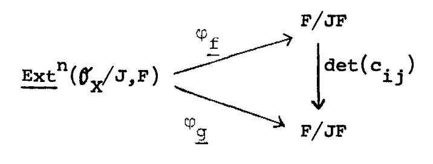

<u>Proof.</u> One has only to note that there is an isomorphism  $\bigwedge \underline{c}$  of  $K.(\underline{g})$  into  $K.(\underline{f})$  which is given in the  $p^{th}$  degree by  $\bigwedge^p (c_{ij})$ . In particular its action on the  $n^{th}$  degree is  $\det(c_{ij})$ . The result follows immediately.

Proposition 7.2. (Fundamental Local Isomorphism). Let\ni: Y -> X be a closed immersion of preschemes, where Y is
locally a complete intersection in X of codimension n, and let
F be a sheaf on X. Then there is a natural functorial isomorphism

$$\varphi \colon \xrightarrow{\operatorname{Ext}^{\mathbf{n}}} (\mathscr{O}_{\mathbf{Y}}, F) \xrightarrow{\sim} F \otimes_{\mathscr{O}_{\mathbf{X}}} {}^{\omega}_{\mathbf{Y}/\mathbf{X}}$$

(cf. §1 for definition of  $w_{Y/X}$ ). Furthermore, if F is i\*-acyclic, then

$$\underline{\mathrm{Ext}}_{\mathcal{O}_{X}}^{j}(\mathcal{O}_{Y}, F) = 0 \qquad \text{for } j \neq n.$$

Proof. Let J be the ideal of Y in X. Since  $\int_{-\infty}^{\infty} J/J^2$  is locally free of rank one on Y, we have

$$F \otimes_{\mathcal{O}_{\mathbf{X}}} \omega_{\mathbf{Y}/\mathbf{X}} = \underline{\operatorname{Hom}}_{\mathcal{O}_{\mathbf{Y}}} (\bigwedge^{n} J/J^{2}, F/JF)$$
,

and this latter is locally isomorphic to F/JF (non-canonically). Thus we can define an isomorphism  $\varphi$  locally by the condition that  $\varphi$  followed by evaluation at  $f_1 \wedge \cdots \wedge f_n$  (where  $\underline{f} = (f_1, \cdots, f_n)$  is an  $\mathcal{O}_X$ -sequence generating J locally) be  $\varphi_{\underline{f}}$ . When one changes basis of J,  $\bigwedge^n J/J^2$  changes according to the determinant of the transformation. Therefore by the Lemma we see that the definition of  $\varphi$  is independent of the basis chosen, and hence the local definitions glue together to give a global  $\varphi$ .

To say F is i\*-acyclic is to say that

$$\frac{\mathcal{O}_{X}}{\text{Tor } j}(\mathcal{O}_{Y},F) = 0 \qquad \text{for } j \neq 0.$$

By the isomorphisms (1) above we see that this is equivalent to the condition on the  $\underline{\text{Ext}}$ 's of the Proposition.

Corollary 7.3. Let i:  $Y \longrightarrow X$  and  $w_{Y/X}$  be as in the proposition. Then there is a natural functorial isomorphism, for all  $F' \in D(X)$ ,

$$\eta_{\mathbf{i}} : \mathbf{i}^{\flat}(\mathbf{F}^{\bullet}) \longrightarrow \underline{\mathbf{L}}\mathbf{i}^{*}(\mathbf{F}^{\bullet}) \otimes \omega_{\mathbf{Y}/\mathbf{X}}[-n]$$
.

<u>Proof.</u> (Note that we write  $\otimes$  on the right, not  $\underline{\otimes}$ , because  $w_{Y/X}$  is locally free on Y and so tensoring by it is an exact functor.) In the first place, if F' is reduced to a single sheaf F, which is i\*-acyclic, then on the left we have the single sheaf  $\underline{\operatorname{Ext}}_X^n(\mathscr{O}_Y, F)$  in degree n, by the Proposition, and on the right we have  $F \otimes_{\mathscr{O}_X} \mathscr{O}_Y \otimes_Y w_{X/Y}[-n]$  which is isomorphic to it by the isomorphism  $\varphi$  of the Proposition.

In the second place, i\* is a functor of finite cohomological  $\mathcal{O}_X$  dimension, because its derived functors are the  $\underline{\text{Tor}}_{j}^{\mathsf{T}}(\mathcal{O}_{Y}, \cdot)$ , and  $\mathcal{O}_{Y}$  locally has a flat resolution of length n, namely the Koszul complex mentioned above. Therefore every  $F^* \in D(X)$  admits a (left)-resolution by i\*-acyclic  $\mathcal{O}_{X}$ -modules.

We are thus in a position to apply [I.7.4]. Let A = Mod(X), B = Mod(Y), let F be the functor  $i^* \underline{Hom}_{X}(i_* \mathcal{O}_{Y}, \cdot)$ , and let P be the  $i^*$ -acyclic  $\mathcal{O}_{X}$ -modules. Then  $G = R^nF$  is isomorphic to  $i^*(\cdot) \otimes_{Y} \omega_{Y/X}$  by the Proposition, and every element of P is G-acyclic also by the Proposition. Hence there is a functorial isomorphism

$$\underline{R}F \xrightarrow{\sim} \underline{L}G[-n]$$

which is just what we want.

Proposition 7.4. a) If  $Z \xrightarrow{j} Y \xrightarrow{i} X$  are two closed immersions which are locally complete intersections of codimensions m,n respectively, and if  $F' \in D(X)$ , then there is a commutative diagram

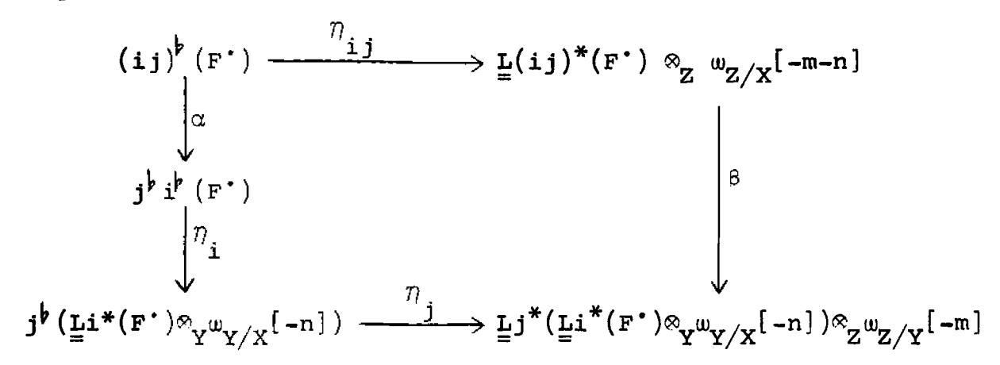

where  $\alpha$  is the isomorphism of Proposition 6.2, and  $\beta$  is obtained by composing the isomorphism  $\zeta_{i,j}$  of Definition 1.5 with the isomorphisms of [II 5.4], [II 5.9], and [II 5.13].

b) If i:  $Y \longrightarrow X$  is a locally complete intersection of codimension n, and if  $f: X' \longrightarrow X$  is a flat morphism, then letting Y' be the fibred product, we have a commutative diagram for  $F' \in D(X)$ 

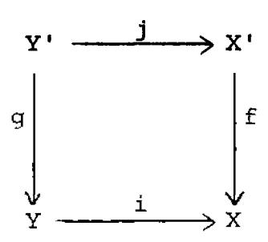

$$g^{*i^{\flat}}(F^{*}) \xrightarrow{\eta_{\underline{i}}} g^{*}[\underline{L}i^{*}(F^{*}) \otimes_{\underline{Y}} \omega_{\underline{Y}/X}[-n]]$$

$$\downarrow^{\alpha} \qquad \qquad \downarrow^{\beta}$$

$$f^{*}(F^{*}) \xrightarrow{\eta_{\underline{i}}} g^{*}[\underline{L}i^{*}(F^{*})) \otimes_{\underline{Y}} \omega_{\underline{Y}'/X}[-n]$$

where again  $\alpha$  and  $\beta$  are composed of the usual identifications.

# 88. The functor f for embeddable morphisms.

In this section we use the fundamental local isomorphism to relate the functors  $f^{\dagger}$  and  $f^{\dagger}$  defined above, and to define a functor  $f^{\dagger}$  for morphisms which can be factored into a finite morphism followed by a smooth morphism. The main result of this section is only provisional, but it is a model for the stronger results we will obtain in Chapter VII after developing the local techniques.

Lemma 8.1. Let  $f: X \to Y$  be a smooth morphism of locally noetherian preschemes, and let  $i: Y \to X$  be a section of f. Then there is a functorial isomorphism

$$\psi_{i,f}: G' \xrightarrow{\sim} i^{\dagger} f^{*}G'$$

for all  $G' \in D(Y)$ .

<u>Proof.</u> We first note by Proposition 1.2 that i is a local complete intersection morphism. Hence for any  $G^* \in D(Y)$  we have

$$i^{\flat} f^{\sharp}G^{\bullet} = i^{\flat} (f^{*}G^{\bullet} \otimes \omega_{X/Y}[n])$$

by definition of f , which is isomorphic by the fundamental local isomorphism  $\boldsymbol{\eta}_{\mathbf{i}}$  of Corollary 7.3 to

$$\underline{\underline{\underline{L}}}$$
i\*(f\*G'  $\otimes \omega_{X/Y}[n]$ )  $\otimes \omega_{Y/X}[-n]$ .

Using [II.5.9] and [II.5.4] this becomes

$$G' \otimes i^* \omega_{X/Y} \otimes \omega_{Y/X}$$
,

which finally by the isomorphism  $\zeta_{i,f}$  of Definition 1.5 is isomorphic to G°. We compose all these isomorphisms to obtain  $\psi_{i,f}$ .

Proposition 8.2. (Residue Isomorphism) Let  $f: X \to Y$  and  $g: Y \to Z$  be two morphisms of locally noetherian preschemes, with f finite, g smooth, and gf finite. Then there is a functorial isomorphism

$$\psi_{f,g}: (gf)^{\flat} \xrightarrow{\sim} f^{\flat}g^{\sharp}$$

defined on  $D_{qc}^+(Z)$ .

Proof. We consider the fibred product  $X \times_Z Y$ , with projections  $p_1$  and  $p_2$ , and let i be the graph morphism of f. Then  $p_1$  is smooth by base extension from g, so i and  $p_1$  satisfy the hypotheses of the Lemma. Thus

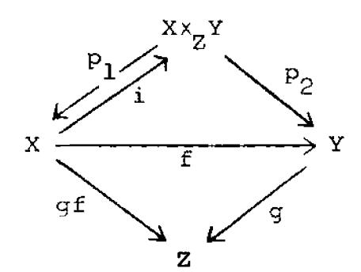

$$(gf)^{\flat} \xrightarrow{\sim} i^{\flat} p_1^{*} (gf)^{\flat}$$

by  $\psi_{i,p_1}$  of the lemma. This in turn is isomorphic to

by Corollary 6.4, which is isomorphic finally to

by Proposition 6.2.

Remarks. This isomorphism, in the case where f is a closed immersion, was first discovered by Grothendieck using a much more complicated procedure. The present proof is due to Cartier, as interpreted by Mumford. This isomorphism will be used in defining the trace map for residual complexes in Chapter VI, an important preliminary to the residue theorem.

Corollary 8.3. Let  $f: X \longrightarrow Y$  be a morphism of locally noetherian preschemes which is both finite and smooth. Then there is an isomorphism

$$\psi_{\mathbf{f}} \colon \mathbf{f}^{\flat} \xrightarrow{\sim} \mathbf{f}^{*}$$

defined on  $D_{qq}^+(Y)$ .

<u>Proof</u>. Let f be the identity in the proposition.

Remark. We will leave to the reader the verification that this map is the same as the one deduced from the classical trace map  $f_* \xrightarrow{\sigma_X} \xrightarrow{\sigma_Y} \xrightarrow{\sigma_Y}$ .

Proposition 8.4. Let  $f: X \to Y$  and  $g: Y \to Z$  be two morphisms of locally noetherian preschemes, with f finite, g smooth, and gf smooth. Then there is a functorial isomorphism

$$\psi_{f,g}: (gf)^{\sharp} \xrightarrow{\sim} f^{\flat}g^{\sharp}$$

defined on  $D_{qc}^+(Z)$ .

 $\underline{\text{Proof.}}$  Considering  $X \times_Z Y$  and using the notation of the proof of Proposition 8.2, we have

$$(gf)^{\sharp} \xrightarrow{\sim} i^{\flat} p_{1}^{\sharp} (gf)^{\sharp} \xrightarrow{\sim} i^{\flat} p_{2}^{\sharp} g^{\sharp} \xrightarrow{\sim} f^{\flat} g^{\sharp}$$
,

where the isomorphisms are those of Lemma 8.1, Proposition 2.2 (twice), and Proposition 8.2, respectively.

Corollary 8.5. With the same hypotheses as the Proposition, there is a natural map

$$\operatorname{Tr}_{\mathbf{f}}\colon \ \mathbf{f}_* \ \mathbf{w}_{\mathbf{X}/\mathbf{Z}} \longrightarrow \mathbf{w}_{\mathbf{Y}/\mathbf{Z}}.$$

<u>Proof.</u> Apply the isomorphism of the Proposition to  $\mathcal{O}_Z$ , and use the trace map of Proposition 6.5.

Remark. In case Z is the spectrum of a field, X,Y irreducible, and K(X)/K(Y) a separable extension, this trace map coincides with the classical one [3, Ch. VI §2]. It has the obvious functorial properties: compatibility with composition and flat base extension. It is a non-trivial map, and deserves to be studied more closely.

Proposition 8.6. a) The isomorphisms  $\psi_{f,g}$  of Propositions 8.2 and 8.4 are compatible with the isomorphisms of Propositions 2.1 and 6.3 under a flat base extension.

b) If  $X \xrightarrow{f} Y \xrightarrow{g} Z \xrightarrow{h} W$  are three morphisms, and if each pair (f,g), (f,hg), (gf,h), (g,h) satisfies the hypotheses of one of Propositions 2.2, 6.2, 8.2, or 8.4, then there is a commutative diagram of the corresponding isomorphisms.

#### c) If

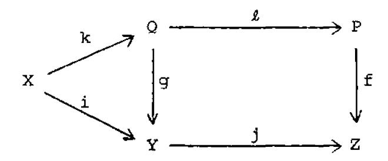

are morphisms with  $Q = Px_ZY$ , f smooth, j,k, and i finite, then there is a commutative diagram

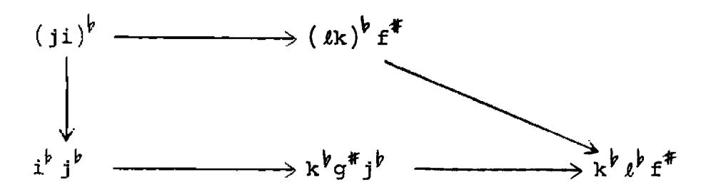

using the isomorphisms of Propositions 6.2, 6.4, and 8.2.

Proof. Left to the patient reader.

<u>Definition</u>. Let S be a fixed prescheme. We say a morphism  $f: X \longrightarrow Y$  in the category of preschemes over S is <u>embeddable</u> (or S-embeddable), if there exists a smooth prescheme P over S and a finite morphism  $i: X \longrightarrow P_Y = Px_SY$  such that  $f = p_2i$ . Unless otherwise specified, embeddable will usually mean over Spec Z.

Examples. A projective morphism  $f: X \to Y$  where Y is quasicompact and admits an ample sheaf is embeddable (for any S). Indeed, f can be factored through some  $\mathbb{P}_Y^N$  [EGA II 5.5.4 (ii)]. Any finite morphism is embeddable, by taking P = S. Any morphism of finite type of affine schemes is embeddable in some affine space. Note that any composition of embeddable morphisms is embeddable (!) and that embeddable morphisms are stable under base extension.

Theorem 8.7 (f' for embeddable morphisms). We fix a base prescheme S, and consider the category Lno(S) of locally noetherian preschemes over S. Then there exists a theory of f' for embeddable morphisms in Lno(S) consisting of the data 1) to 5) below, subject to the conditions VAR 1 - VAR 6. Furthermore this theory is unique in the sense that if 1')-5') is another set of such data satisfying VAR 1 - VAR 6, then there is an isomorphism of the functors 1) and 1') compatible with the isomorphisms 2)-5) and 2')-5').

1) For every embeddable morphism  $f: X \longrightarrow Y$  in Lno(S), a functor

$$f: D_{qc}^+(Y) \longrightarrow D_{qc}^+(X)$$
.

2) For every composition  $X \xrightarrow{f} Y \xrightarrow{g} Z$  of embeddable morphisms, an isomorphism of functors

$$c_{f,g}: (gf)^! \longrightarrow f^!g^!$$
.

- 3) For every finite morphism f, an isomorphism  $d_{f} \colon f \xrightarrow{i} \longrightarrow f^{\flat} .$
- 4) For every smooth embeddable morphism f, an isomorphism  $e_f\colon f^{!} \xrightarrow{} f^{\#} .$

5) For every embeddable morphism  $f: X \longrightarrow Y$ , and for every flat base extension  $u: Y' \longrightarrow Y$ , an isomorphism

$$b_{u,f}: v^*f^! \longrightarrow g^!u^*$$

(where v and g are the two projections of  $X' = XX_{V}Y'$ ).

- VAR 1).  $c_{f,id} = c_{id,f} = 1$ , and there is a commutative diagram of four c's for a composition of three embeddable morphisms.
- VAR 2). For a composition of two finite morphisms f,g, compatibility of  $c_{f,g}$  with the isomorphism of Proposition 6.2 via  $d_f$  and  $d_g$ .
- VAR 3). Ditto for a composition of smooth morphisms, using Proposition 2.2,  $e_f$  and  $e_g$ .
- VAR 4). For a Cartesian square of embeddable morphisms as in Corollary 6.4, compatibility of that isomorphism with  $c_{v,f}$  and  $c_{q,u}$  via  $d_f$ ,  $d_q$ ,  $e_u$  and  $e_v$ .
- VAR 5). For a composition of two embeddable morphisms f,g satisfying the hypotheses of Proposition 8.2 or 8.4, compatibility of  $c_{f,g}$  with  $\psi_{f,g}$  via the appropriate d's and e's.
- VAR 6). For a flat base extension of a finite or smooth embeddable morphism, compatibility of  $b_{u,f}$  with the isomorphism of Proposition 2.1 or 6.3.

<u>Proof.</u> We will give only a sketch, since a similar but more difficult theorem is proved in some detail in Chapter VI.

To define f' one chooses an f embedding  $i: X \longrightarrow P_Y$ , and defines  $f' = i^{\dagger} p_2^{\sharp}$ . The product of two embeddings is again one, so one shows that f' is independent of the embedding chosen by using Propositions 8.2 and 8.6b. To define  $c_{f,g}$  for a composition, one notes that given embeddings of f and g, say  $i: X \longrightarrow P_Y$  and  $j: Y \longrightarrow Q_Z$ , then

$$(j \times_S P)i: \times \longrightarrow (P \times_S Q)_Z$$

is an embedding of gf, and one can define  $c_{f,g}$  using the isomorphisms of Corollary 6.4. Of course  $c_{f,g}$  is independent of the embeddings chosen ... One defines  $d_f$  and  $e_f$  using Propositions 8.2 and 8.4, and  $b_{u,f}$  using Proposition 8.6a.

Checking the properties VAR 1 - VAR 6 requires many commutative diagrams, but no imagination. The uniqueness is tedious but straightforward. By the way, the reader will note that 5) and VAR 6 are not needed for the uniqueness statement.

Remarks. One of the main goals of these notes is to obtain a theory of f, such as the one given in this theorem, for arbitrary morphisms of finite type of locally noetherian preschemes.

The obvious difficulty is that the derived category is not a local object. That is to say, if X is a prescheme, then the presheaf  $U \longrightarrow D_{qc}^+(U)$  is not a sheaf of categories on X. One can give a cover of X by open subsets  $U_i$ , and complexes  $F_i^* \in D_{qc}^+(U_i)$  and isomorphisms  $\phi_{ij} \colon F_i^*|_{U_{ij}} \longrightarrow F_j^*|_{U_{ij}}$  in  $D_{qc}^+(U_{ij})$  which are compatible in  $D_{qc}^+(U_{ijk})$ , but where there does not exist a complex  $F^* \in D_{qc}^+(X)$  whose restriction to  $U_i$  is  $F_i^*$ . Even worse, given two complexes  $F^*, G^* \in D_{qc}^+(X)$ , and isomorphisms  $\phi_i \colon F^*|_{U_i} \longrightarrow G^*|_{U_i}$  such that  $\phi_i|_{U_{ij}} = \phi_j|_{U_{ij}}$  in  $D_{qc}^+(U_{ij})$ , the  $\phi_i$  may not glue into a global isomorphism  $\phi_i \colon F^* \longrightarrow G^*$ .

Thus although every morphism of finite type is <u>locally</u> embeddable, we cannot glue the local functors f' into a global one.

To overcome this difficulty, we study in Chapter VI the notion of residual complex. These are actual complexes, and hence can be glued. We develop a formalism of f' for residual complexes similar to the one given here, expanding from the two easy cases of finite and smooth morphisms. Then after proving the duality theorem we can recover a theory of f' for arbitrary

complexes, but only under the additional hypotheses that our schemes be noetherian of finite Krull dimension, and admit a residual complex (e.g., anything of finite type over a regular scheme of finite Krull dimension), and that our complexes have coherent cohomology.

<u>Proposition 8.8.</u> Let  $f: X \longrightarrow Y$  be an embeddable morphism of locally noetherian preschemes. Then

6) There is a functorial isomorphism

for 
$$F^* \in D_{qc}^+(Y)$$
 and  $G^* \in D_{qc}^b(Y)_{fTd}$ .

7) There is a functorial isomorphism

$$\underline{\underline{R}} \xrightarrow{\underline{Hom}} (\underline{\underline{L}} f^*(F^*), f^!(G^*)) \xrightarrow{\sim} f^!(\underline{\underline{R}} \xrightarrow{\underline{Hom}} (F^*,G^*))$$

for 
$$F^* \in D_{C}^{-}(Y)$$
 and  $G^* \in D_{C}^{+}(Y)$ .

Proof. Left to reader. (Factor f into a finite morphism followed by a smooth morphism, and use Propositions 2.4 and 6.9.)

Remark. We would like to have an isomorphism such as 6) above when f is flat,  $F' \in D^b_{qc}(Y)_{fTd}$ , and  $G' \in D^+_{qc}(Y)$ . Both sides make sense in that case, but we do not know how to define a map between them, and hence cannot construct the isomorphism. However, if Y admits a dualizing complex, we can get a result of this kind for complexes with coherent cohomology [V 8.6].\*

## \$9. The residue symbol.

This section will not be used in the sequel, and so may be omitted at a first reading. In it we define the residue symbol  $\operatorname{Res}[t_1, \cdots, t_n]$  which is a generalization of the classical notion of residue. For X a non-singular curve over a field k,  $\omega$  a regular differential form on X, and t a function with an isolated zero at a point P,  $\operatorname{Res}[t]$  is just the ordinary residue, at P, of the differential form  $\omega/t$ . Since we will not use these results later, we leave their proofs to the reader.

Let  $f\colon X\longrightarrow Y$  be a smooth morphism of relative dimension n. Let  $t_1,\cdots,t_n\in \Gamma(X,\mathscr{O}_X)$  be functions such that the closed subscheme Z of X defined by the ideal  $I=(t_1,\cdots,t_n)$  is finite and hence flat [EGA IV §11] over Y. Let  $w\in \Gamma(X,w_{X/Y})$  be a global n-differential form on X relative to Y. Under these conditions the residue symbol

$$\operatorname{Res}_{X/Y}[t_1, \dots, t_n] \in \Gamma(Y, \theta_Y')$$

can be defined as follows. Let i:  $Z \longrightarrow X$  be the inclusion of Z in X, and let g = fi. Then by the residue isomorphism  $\psi_{i,f}$  of Proposition 8.2 we have an isomorphism

$$g^{\dagger}(\mathscr{O}_{Y}) \xrightarrow{\sim} i^{\dagger} f^{\sharp}(\mathscr{O}_{Y}) = i^{\dagger}(\omega_{X/Y}[n])$$

$$\xrightarrow{\sim} i^{\ast}(\omega_{X/Y}) \otimes \omega_{Z/X}$$

$$= \underline{\text{Hom}}_{\mathscr{O}_{Z}}(\Lambda^{n}I/I^{2}, i^{\ast}\omega_{X/Y}),$$

where the second arrow is given by the fundamental local isomorphism  $\eta_i$  of Corollary 7.3. (Note that our hypotheses imply that Z is locally a complete intersection in X. Indeed, Z is a local complete intersection in Z  $x_y$  X, by Proposition 1.2, and is defined by  $p_2^*(t_1, \dots, t_n)$ , hence this is an  $\theta_{Zx_yX}$ -sequence [ZS, vol. II, App. 6, Thm. 2]. But now by faithfully flat descent,  $t_1, \dots, t_n$  is an  $\theta_X$ -sequence.) Now  $\Lambda^n I/I^2$  is locally free of rank 1 on Z, so  $\overline{t_1} \wedge \dots \wedge \overline{t_n}$  is a basis for it. By sending this element into the global section  $\overline{w}$  of  $i^*w_{X/Y}$  obtained from w, we obtain via the isomorphisms above, a global section of  $g^{\flat}(\theta_Y)$ . Applying  $g_X$  we get a global section of

$$g_*g^{\flat}(\mathscr{O}_{Y}) = \mathbb{R} \xrightarrow{\text{Hom}} \mathscr{O}_{Y} (g_*\mathscr{O}_{Z}, \mathscr{O}_{Y})$$
.

But since Z is flat over Y,  $g_* \theta_Z'$  is locally free, and so we can erase the  $\underline{\mathbb{R}}$ . Applying our global section to the unit section of  $g_* \theta_Z'$ , we obtain a global section of  $\theta_Y'$ , which is by definition

$$\text{Res}_{X/Y}[t_1, \dots, t_n]$$
.

The residue symbol has the following properties (we assume every time we write a residue symbol that the conditions for its existence are satisfied):

- (RO). It is  $\mathscr{O}_{\mathbf{Y}}$ -linear in  $\omega$ .
- (R1). Let  $s_i = \sum_{i,j} c_{i,j} t_j$ . Then

$$Res[t_1, \dots, t_n] = Res[t_1, \dots, t_n].$$

In particular, the symbol is alternating in  $t_1, \dots, t_n$ .

- (R2). Localization. It is stable under étale localization on Y.
- (R3). Restriction. Let X' be a complete intersection in X, also smooth over Y, defined by functions  $s_1, \dots, s_p$  in  $\Gamma(X, \mathcal{O}_X)$ . Let  $t_1, \dots, t_n$  be in  $\Gamma(X, \mathcal{O}_X)$ , where X is of relative dimens

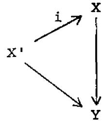

 $\Gamma(X, 0_X')$ , where X is of relative dimension n+p, and let  $t_1', \cdots, t_n'$  be their restrictions to X'. Let  $w \in \Gamma(X, \Omega_{X/Y}^n)$ . Then

$$\operatorname{Res}_{X'/Y}\left[\begin{smallmatrix}i*_{w}\\t_{1}^{\prime},\dots,t_{n}^{\prime}\end{smallmatrix}\right] = \operatorname{Res}_{X/Y}\left[\begin{smallmatrix}w \wedge ds_{1} \wedge \dots \wedge ds_{p}\\t_{1}^{\prime},\dots,t_{n}^{\prime},s_{1}^{\prime},\dots,s_{p}^{\prime}\end{smallmatrix}\right].$$

(R4). Transitivity. Let  $X \xrightarrow{f} Y \xrightarrow{g} Z$  be two smooth morphisms, of relative dimensions n,p respectively. Let  $t_1', \cdots, t_n' \in \Gamma(X, \emptyset_X), \quad \omega' \in \Gamma(X, \omega_{X/Y}); \quad s_1, \cdots, s_p \in \Gamma(Y, \emptyset_Y),$   $\omega \in \Gamma(Y, \omega_{Y/Z}), \text{ and let } s_1', \cdots, s_p' \text{ be the compositions of } s_i$  with f. Then

$$\operatorname{Res}_{X/Z}\left[\begin{smallmatrix} w \\ t_1', \cdots, t_n', s_1', \cdots, s_p' \end{smallmatrix}\right] = \operatorname{Res}_{Y/Z}\left[\begin{smallmatrix} w \cdot \operatorname{Res}_{X/Y}\left[\begin{smallmatrix} t_1', \cdots, t_n' \\ s_1, \cdots, s_p \end{smallmatrix}\right]\right].$$

- (R5). <u>Base change</u>. Formation of the residue symbol commutes with base change.
- (R6). Trace formula (Normalization). Let  $t_1, \dots, t_n$  and  $\varphi$  be in  $\Gamma(X, \theta_X)$ . Then

$$Res\begin{bmatrix} \varphi dt_1^{\wedge}...^{\wedge}dt_n \\ t_1,...,t_n \end{bmatrix} = Tr_{Z/Y}(\varphi|_{Z}).$$

In particular, for  $\varphi = 1$ , one has

$$\operatorname{Res}\begin{bmatrix} dt_1^{\wedge \dots \wedge dt_n} \\ t_1, \dots, t_n \end{bmatrix} = \operatorname{rank} (Z/Y) \cdot 1_Y.$$

(R7). Intersection formula. For any collection of integers  $k_1, \dots, k_n > 0$ , not all equal to one,

$$Res\begin{bmatrix} dt_1 & \cdots & dt_n \\ t_1 & \cdots & t_n \end{bmatrix} = 0.$$

(R8). Duality. If  $w \in \Gamma(\sum_i w_{X/Y})$ , then

$$Res[t_1, \dots, t_n] = 0$$

and conversely if  $\operatorname{Res}[t_1, \dots, t_n] = 0$  for all  $f \in \Gamma(X, \emptyset_X)$ , then  $\omega \in \Gamma(\sum t_i \omega_{X/Y})$ .

(R9). Exterior differentiation. For  $t_1, \dots, t_n \in \Gamma(X, 0_X)$ , and  $w \in \Gamma(X, \Omega_{X/Y}^{n-1})$  and for  $k_1, \dots, k_n > 0$  we have

$$\operatorname{Res}\begin{bmatrix} \mathbf{k}_{1}, \dots, \mathbf{k}_{n} \end{bmatrix} = \sum_{i} k_{i} \operatorname{Res}\begin{bmatrix} \mathbf{k}_{1}, \dots, \mathbf{k}_{i} + 1, \dots, \mathbf{k}_{n} \end{bmatrix}.$$

(R10). Residue Formula. Let  $g: X' \longrightarrow X$  be a finite morphism where X', X are both smooth over Y. Let  $w' \in \Gamma(X', w_{X'/Y})$  and let  $t_1, \cdots, t_n \in \Gamma(X, 0)$ . Let  $t_1', \cdots, t_n'$  be their compositions with g. Then

$$Res_{X'/Y}[t_1, \dots, t_n] = Res_{X/Y}[t_1, \dots, t_n],$$

where  $Tr_g$  is the map of Corollary 8.5.

### \$10. Trace for projective morphisms.

In this section we show that in the situation of the Residue isomorphism (Proposition 8.2) if g is a projective space morphism, then our trace morphisms Trf for finite morphisms and Trp for projective space morphisms are compatible. This allows us to expand from these two cases to arrive at a theory of the trace map for any projectively embeddable morphism. This result, like the one of \$8, is only provisional, because we want eventually a theory of trace for an arbitrary proper morphism. This will come in Chapter VII.

Proposition 10.1. Let Y be a locally noetherian prescheme, let  $X = \mathbb{P}^n_Y$ , let f be the projection, and let s: Y  $\longrightarrow$  X be a section of f. Then for every  $G^* \in D^+_{qc}(Y)$ , the composition of maps

$$G^{\bullet} \xrightarrow{\psi_{S,f}} \underbrace{Rf_{*}}_{Rf_{*}} \underbrace{Rs_{*}}_{f} s^{\dagger} f^{*} G^{\bullet} \xrightarrow{Trf_{S}} \underbrace{Rf_{*}}_{f} f^{\dagger} G^{\bullet} \xrightarrow{Trp_{f}} G^{\bullet}$$

is the identity. (The maps are those of Lemma 8.1, Proposition 6.5, and Proposition 4.3, respectively.)

<u>Proof.</u> 1) We note that both  $\psi_{s,f}$  and  $\operatorname{Trp}_f$  are calculated by using a Cartan-Eilenberg resolution of  $f^{\sharp}(G^{\bullet}) = f^{*}(G^{\bullet}) \otimes \omega_{X/Y}[n]$ . We can use the same resolution for

each, and thus reduce to the case where G is a single quasi-coherent sheaf on Y. Then  $f^*(G) \otimes \omega_{X/Y}$  is  $\operatorname{Ext}^n(s_*\mathscr{O}_Y, \cdot)$ -acyclic, and  $R^nf_*$ -acyclic, so we have to show that the composition

$$G \longrightarrow f_* \xrightarrow{\operatorname{Ext}^n} (s_* 0_Y, f^* G \otimes w_{X/Y}) \longrightarrow R^n f_* (f^* G \otimes w_{X/Y}) \longrightarrow G$$

is the identity.

2) Noting that the functors above are all right exact in G, and commute with direct sums, and noting that the question is local on Y, we may assume that Y is affine, and thus reduce to the case  $G = \mathcal{O}_{Y}$ . Thus we must show that the composition

$$\mathcal{O}_{\mathbf{Y}} \xrightarrow{\alpha} f_{\mathbf{x}} \xrightarrow{\operatorname{Ext}^{n}_{\mathbf{X}}} (s_{\mathbf{x}} \mathcal{O}_{\mathbf{Y}}, \omega_{\mathbf{X}/\mathbf{Y}}) \xrightarrow{\beta} R^{n} f_{\mathbf{x}}(\omega_{\mathbf{X}/\mathbf{Y}}) \xrightarrow{\gamma} \mathcal{O}_{\mathbf{Y}}$$

is the identity.

3) In other words, from the section s of  $\mathbb{P}^n_Y$ , we have obtained a map of  $\mathcal{O}_Y$  into itself, i.e., a section  $\delta(s) \in \Gamma(Y,\mathcal{O}_Y)$ , and our problem is to show  $\delta(s) = 1$ . Since everything in the composition of morphisms in 2) above is flat over Y, this construction is stable under arbitrary base change.

Now our given section s can be obtained from the diagonal section  $\Delta\colon \operatorname{\mathbb{P}}^n \longrightarrow \operatorname{\mathbb{P}}^n \times \operatorname{\mathbb{P}}^n$  of projective space over Spec Z into its product with itself by the base extension  $\operatorname{p}_{\mathfrak{I}} s \colon Y \longrightarrow \operatorname{\mathbb{P}}^n$ .

Thus  $\delta(s) = (p_2 s)^* \delta(\Delta)$  and we reduce to showing that  $\delta(\Delta) = 1$ . Now  $\delta(\Delta)$  is an integer, since  $\Gamma(\mathfrak{g}'_{\mathbb{P}^n}) = \mathbb{Z}$ . To find out what integer, it is sufficient to make the base extension at some closed point, say  $T_1 = \cdots = T_n = 0$  of  $\mathbb{P}^n$ , consider  $Y = \operatorname{Spec} \mathbb{Z}$ ,  $s = \operatorname{the} \operatorname{section} \operatorname{of} \mathbb{P}^n_Y$  given by  $T_1 = \cdots = T_n = 0$ , and show that  $\delta(s) = 1$  in that case.

4) We show more generally that for any prescheme Y, if s is the section  $T_1 = \cdots = T_n = 0$  of  $\mathbb{F}_Y^n$ , then  $\delta(s) = 1$ . This is a formidable exercise in explicit calculations, of which we will give a mere outline.

Recalling the notation of §3, we calculate  $\gamma$  (which is the  $\gamma$  of Theorem 3.4) by means of the cover  $\mathcal{U} = (U_1)$  of X, the section  $\tau = \text{dt}_1 \land \dots \land \text{dt}_n$  of  $w_{X/Y}|_{U_0}$ , and the n-cocycle  $\tau/T_0 \cdots T_n$  of the Cech complex  $f_*(C^*(\mathcal{U}; w_{X/Y}))$ .

To calculate  $\alpha$ , we use the notation of §7, and the Koszul complex  $K^{\bullet}(\underline{t};\omega_{X/Y})$  where  $t_1,\cdots,t_n$  are the local coordinates  $T_1/T_0,\cdots,T_n/T_0$  on  $U_0$ . The map  $\alpha$  is obtained by composing the fundamental local isomorphism  $\eta_i$  of Proposition 7.2 with the isomorphism  $\zeta_{s,f}$  of Definition 1.5. Recalling that the map  $J/J^2 \longrightarrow i^*\Omega^1_{X/S}$  of Proposition 1.2 is defined by sending

 $t \in J$  to dt, we see that a(1) is the cocycle

$$\alpha(1) \in K^{\bullet}(\underline{t}; \omega_{X/Y})$$

given by

$$e_1 \wedge \ldots \wedge e_n \longrightarrow \tau$$
.

Finally, we calculate  $\beta$  by means of the morphism of complexes

$$K^{\bullet}(t_1,\dots,t_n;\omega) \longrightarrow C^{\bullet}(\mathcal{U},\omega)$$

defined by sending a p-cochain

$$\{e_{i_1}^{\wedge \dots \wedge e_{i_p}} \xrightarrow{f_{i_1}, \dots, i_p} dt_1^{\wedge \dots \wedge dt_n}\}$$

(where  $f_{i_1,\dots,i_p} \in \Gamma(U_o,\theta_X)$ ) to the p-cochain

$$\left\{\begin{array}{cc} \frac{\mathbf{T_{o}^{p-n-1}f_{i_{1},\cdots,i_{p}}}}{\mathbf{T_{i_{1},\cdots,i_{p}}}} \in \Gamma(\mathbf{U_{o,i_{1},\cdots,i_{p},\omega}}), \end{array}\right.$$

and  $0 \in \Gamma(U_{j_0,j_1,\dots,j_p},\omega)$  when all  $j_i \neq 0$ .

Then \$\beta\$ applied to the cocycle

$$e_1 \wedge \cdots \wedge e_n \longrightarrow dt_1 \wedge \cdots \wedge dt_n$$

gives

$$\tau/T_0 \cdots T_n \in \Gamma(U_0, \dots, n, w)$$

as required.

Corollary 10.2. The isomorphism  $\gamma$  of Theorem 3.4 is compatible with an automorphism of the projective space, i.e., it is "independent of the choice of homogeneous coordinates".

Proof. Indeed,  $\psi_{s,f}$  and  $\operatorname{Trf}_{s}$  do not depend on a choice of coordinates, hence  $\operatorname{Trp}_{f}$  does not either.

Remark. This shows that for any locally free sheaf E of rank n+l on a prescheme Y, we can define an isomorphism

$$\gamma: \mathbb{R}^n f_*(\omega) \xrightarrow{\sim} \mathscr{O}_{\mathbf{v}}$$

where  $X = \mathbb{P}(E)$ , and  $w = w_{X/Y}$ . We can define  $\operatorname{Trp}_f$  for the projection  $f \colon X \longrightarrow Y$  as in §4, and get a duality theorem as in §5 for this morphism.

Proposition 10.3. Let u:  $X \longrightarrow Y$  be a finite morphism of locally noetherian preschemes, let

f be the projection of projective n-space over Y, and fill in a Cartesian diagram as shown. Then there is a

$$\mathbb{P}_{X}^{n} \xrightarrow{v} \mathbb{P}_{Y}^{n}$$

$$\downarrow^{g} \qquad \qquad \downarrow^{f}$$

$$X \xrightarrow{u} Y$$

commutative diagram of morphisms of functors on  $D_{qc}^{+}(Y)$ ,

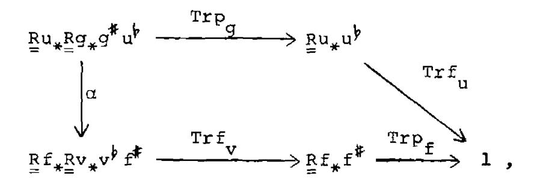

where  $\alpha$  is composed of [II.5.1] and Corollary 6.4.

<u>Proof.</u> Left to reader. One follows through the definitions of the maps concerned. The only tricky point is to note that if  $C^*$  is a Cartan-Eilenberg resolution of  $f^{\sharp}(G^*)$ , where  $G^*$  is a complex of quasi-coherent sheaves on Y, then  $v^{\flat}(C^*)$  is not necessarily a Cartan-Eilenberg resolution of  $v^{\flat}f^{\sharp}(G^*)$ . However, one can find a Cartan-Eilenberg resolution  $D^*$  of this latter which dominates it (i.e., there is a map of double complexes  $D^* \longrightarrow v^{\flat}(C^*)$ ), which is good enough for the proof.

Proposition 10.4. Let X and Y be locally noetherian preschemes, and let f be a finite morphism of X into  $\mathbb{P}^n_Y$ . Let g:  $\mathbb{P}^n_Y \longrightarrow Y$  be the projection, and assume that gf is finite. Then there is a commutative diagram of morphisms of functors on  $\mathbb{D}^+_{GC}(Y)$ ,

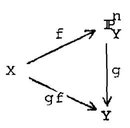

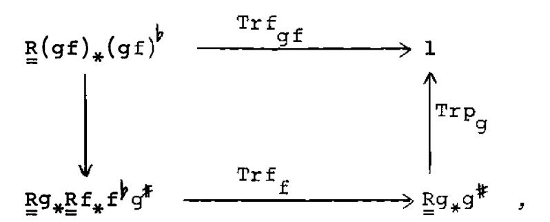

where the vertical arrow on the left is [II.5.1] composed with the residue isomorphism  $\psi_{f,q}$  of Proposition 8.2.

<u>Proof.</u> Considering  $\mathbb{P}_{X}^{n} = X \times_{Y} \mathbb{P}_{Y}^{n}$  as in the proof of Proposition 8.2, the result follows from Propositions 6.6, 10.1, and 10.3.

<u>Definition</u>. A morphism  $f: X \longrightarrow Y$  of preschemes is projectively embeddable if f can be factored f = pg where  $p: \mathbb{P}^n_Y \longrightarrow Y$  is the projection of a suitable projective space over Y, and  $g: X \longrightarrow \mathbb{P}^n_Y$  is a finite morphism.

Example. If  $f: X \longrightarrow Y$  is a projective morphism, where Y is quasi-compact and has an ample sheaf, then f is projectively embeddable [EGA II.5.5.4 (ii)].

Theorem 10.5 (Trace for projectively embeddable morphisms). We consider the category (Lno) of locally noetherian preschemes. There is a unique theory of trace for projectively embeddable morphisms  $f: X \longrightarrow Y$  in (Lno), consisting of a morphism of

functors  $\operatorname{Tr}_{f} \colon \operatorname{Rf}_{*}f \xrightarrow{!} \longrightarrow 1$  on  $\operatorname{D}_{\operatorname{qc}}^{+}(Y)$  for each such morphism f, subject to the conditions TRA 1 - TRA 4 below.

TRA 1). For a composition  $X \xrightarrow{f} Y \xrightarrow{g} Z$  of projectively embeddable morphisms, there is a commutative diagram

$$\frac{\mathbb{R}(gf)_{*}(gf)^{!}}{\mathbb{C}_{f,g}} \xrightarrow{\operatorname{Tr}_{g}} 1$$

$$\mathbb{R}_{g_{*}\mathbb{R}f_{*}f^{!}g^{!}} \xrightarrow{\operatorname{Tr}_{f}} \mathbb{R}_{g_{*}g}^{\mathbb{R}g_{*}g^{!}}$$

TRA 2). For a finite morphism  $f: X \longrightarrow Y$ ,  $Tr_f$  is compatible via  $d_f$  with  $Trf_f$ .

TRA 3). For the projection  $f: \mathbb{P}^n_Y \longrightarrow Y$  of projective space,  $\text{Tr}_f$  is compatible, via  $e_f$ , with  $\text{Trp}_f$ .

TRA 4). For a projectively embeddable morphism  $f: X \longrightarrow Y$  and a flat base extension  $u: Y' \longrightarrow Y$ , there is a commutative diagram

$$\begin{array}{cccccccccccccccccccccccccccccccccccc$$

where v and g are the two projections of  $X' = X \times_{Y} Y'$ .

Proof. Of course the notations f', cf,g, df, ef, and bu.f refer back to Theorem 8.7.

To construct  $\mathrm{Tr}_{\mathrm{f}}$ , one chooses a factorization  $\mathrm{f}=\mathrm{pg}$  as in the definition of projectively embeddable morphism above, and defines  $\mathrm{Tr}_{\mathrm{f}}$  to be the composition of  $\mathrm{c}_{\mathrm{g,p}}$ ,  $\mathrm{d}_{\mathrm{g}}$ ,  $\mathrm{e}_{\mathrm{p}}$ ,  $\mathrm{Trf}_{\mathrm{g}}$ , and  $\mathrm{Trp}_{\mathrm{p}}$ . To show that it is independent of the factorization, one observes that any two factorizations can be dominated by a third, and thus reduces to Proposition 10.4. The properties TRA 1 - TRA 4 are all straightforward, but tedious.

Remarks. The second main object of these notes is to obtain a theory of Tr similar to the above one for all proper morphisms f. It is not simply a question of localization, as for the theory of f, because a proper morphism is not locally projective.

Therefore we resort to an entirely different technique for the construction of the general trace map. We forget entirely the projective case, and work purely from the trace of a finite morphism to define a trace map (which is a map of graded sheaves!) of residual complexes relative to a morphism of finite type. Then we will prove the residue theorem which says that for a proper morphism, the trace map is a morphism of complexes. Finally, after proving the duality theorem, we lift ourselves by our bootstraps, and obtain the general trace map (but under the restrictive hypotheses that our schemes be noetherian of finite Krull dimension admitting a dualizing complex, and that our complexes have coherent cohomology).

## \$11. Duality for projective morphisms.

Combining the results of \$58 and 10 we have a notion of fand Tr for projectively embeddable morphisms, and we are in a position to prove the following duality theorem.

Theorem 11.1 (Duality for projectively embeddable morphisms). Let  $f: X \longrightarrow Y$  be a projectively embeddable morphism of noetherian preschemes of finite Krull dimension. Then the duality morphism

$$\underline{\Theta}_{f} \colon \underline{\mathbb{R}} f_{*}\underline{\mathbb{R}} \xrightarrow{\text{Hom}_{X}^{\bullet}} (F^{\bullet}, f^{\bullet}G^{\bullet}) \xrightarrow{} \underline{\mathbb{R}} \xrightarrow{\text{Hom}_{Y}^{\bullet}} (\underline{\mathbb{R}} f_{*}F^{\bullet}, G^{\bullet}) ,$$

defined by composing [II.5.5] with  $Tr_f$  in the second place, is an isomorphism for all  $F^* \in D^-_{qc}(X)$  and  $G^* \in D^+_{qc}(Y)$ .

<u>Proof.</u> We factor f into pg with g finite and p:  $\mathbb{P}_{Y}^{n} \longrightarrow Y$  the projection of a suitable projective space. Then using TRA 1 of Theorem 10.5, and [II \$6, ex. 2] we see that  $\theta_{f} = \theta_{g} \theta_{g}$ , Thus it is sufficient to show that  $\theta_{g}$  and  $\theta_{g}$  are isomorphisms. This follows from Theorems 5.1 and 6.7, using the compatibilities of Theorems 8.7 and 10.5.

Remarks. 1. As in §5, the variants  $\theta_f$  and  $\theta_f^i$  are also isomorphisms.

- 2. This result, like the ones of \$88 and 10, is provisional. We will prove a more general duality theorem for proper morphisms in Chapter VII.
- 3. Taking global sections, and  $H^{O}$  on each side, we have (using [1.6.4])

$$\text{Hom}_{D(X)}(F^{\bullet},f^{!}G^{\bullet}) \xrightarrow{\sim} \text{Hom}_{D(Y)}(\underline{R}f_{*}F^{\bullet},G^{\bullet})$$
.

For  $F \in D_{qc}^b(X)$  and  $G \in D_{qc}^b(Y)$  this says that  $f : (and the map Tr_f : Ref_*f : \longrightarrow 1)$  is a right adjoint of the functor  $Ref_*$ . Therefore the pair  $(f : Tr_f)$  is uniquely determined on  $D_{qc}^b(Y)$ . It is conceivable, however, that there are non-isomorphic functors  $f : O D_{qc}^+(Y)$  each of which gives a duality theorem.

Corollary 11.2. We consider smooth, projectively embeddable morphisms  $f: X \longrightarrow Y$  of locally noetherian preschemes. Then

a) For each such morphism f of relative dimension n, there is a map

$$\gamma_{f} \colon \mathbb{R}^{n} f_{*}(\omega_{X/Y}) \longrightarrow \mathscr{O}_{Y}.$$

b) For each pair  $f: X \longrightarrow Y$  and  $g: Y \longrightarrow Z$  of such morphisms, of relative dimensions n and m, respectively, there is a commutative diagram

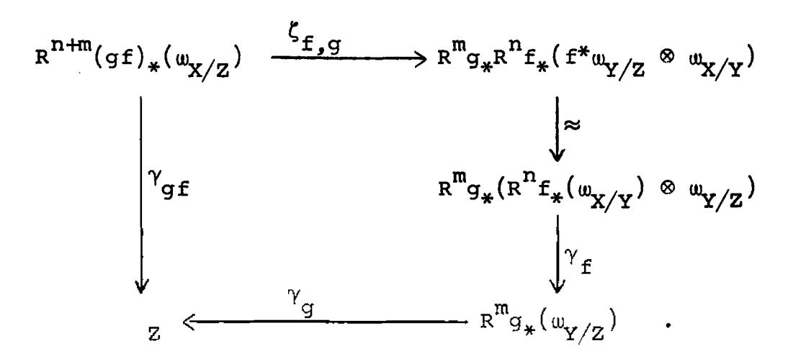

(Note that Rnf\* is right exact on quasi-coherent sheaves, so the projection formula gives an isomorphism on the sheaf level.)

- c)  $\gamma_{\rm f}$  commutes with arbitrary base extension. (Note that  ${\rm R}^{\rm n} f_{\star}$  being right exact, commutes with arbitrary base extension.)
  - d) For f:  $\mathbb{P}^n_{Y} \longrightarrow Y$ ,  $\gamma_f$  is the map  $\gamma$  of Theorem 3.4.
  - e) For f:  $X \longrightarrow Y$  a finite smooth morphism,

$$\gamma_f : f_* f_X \longrightarrow f_Y$$

is the ordinary classical trace map.

f) For F quasi-coherent on X and G an injective quasi-coherent on Y, the duality map

$$\Theta_{f}^{i}$$
:  $\operatorname{Ext}_{X}^{i}(F, f^{*G} \otimes \omega_{X/Y}) \longrightarrow \operatorname{Hom}_{O_{Y}}(R^{n-i}f_{*}(F), G)$ 

defined via  $\gamma_{\mathfrak{f}}$ , is an isomorphism.

g) The map  $\gamma_f$  is an isomorphism if and only if f is surjective and has geometrically connected fibres.

Proof. We obtain the map  $\gamma_f$  by applying  $\mathrm{Tr}_f$  to  $\mathrm{G}=0_Y'$ . Property b) follows immediately from TRA 1.

To prove c), the question is local on Y, so we may assume Y is affine. Then f can be factored f = pi, where i is a closed immersion, and p:  $\mathbf{P}_{\mathbf{Y}}^{\mathbf{N}} \longrightarrow \mathbf{Y}$  is a projective space morphism. [EGA II 5.5.4]. We can calculate  $\gamma_{\mathbf{f}}$  by considering the fundamental local isomorphism (Proposition 7.2) which gives

$$\omega_{X/Y} \cong i^* \underline{\text{Ext}}_{0p}^{N-n}(i_* 0_X, \omega_{p/Y})$$
.

Then there is a natural map

$$R^n f_*(\omega_{X/Y}) \longrightarrow R^N p_*(\omega_{P/Y})$$
,

which followed by  $\gamma_p$  gives  $\gamma_f$  . Everything in sight is flat over Y, and hence commutes with arbitrary base extension.

- d) follows from TRA 3.
- e) we will leave to the reader as an exercise.
- f) is a special case of the Theorem, and
- g) follows from [EGA III 4.3.1], using f).

Remarks. 1. Later we will prove this theorem for an arbitrary smooth proper morphism of locally noetherian preschemes.

2. In case Y = Spec k with k a field, G = k, X is a smooth projective scheme /k (i.e., "absolutely non-singular projective variety"), and F a coherent sheaf on X, the duality formula f) above reads

$$\operatorname{Ext}_{X}^{i}(F, \omega_{X/Y}) \xrightarrow{\sim} \operatorname{H}^{n-i}(X;F)^{\sim}$$

where where means the dual k-vector space.

#### CHAPTER IV.\_ LOCAL COHOMOLOGY.

This chapter consists for a great part in definitions, which generalize those of the Local Cohomology lecture notes [LC]. Notable new material is the spectral sequence of a filtered topological space, and the Cousin complex of a sheaf.

## \$1. Local cohomology groups, sheaves, and complexes.

Throughout this section, X will be an arbitrary topological space, and F a sheaf of abelian groups on X. There are three ways in which one can vary the basic definition of the cohomology of F with supports in a closed subset Z of X: one can replace Z by a family of supports; one can define a relative local cohomology if  $Z' \subseteq Z$  are two closed subsets; and one can make everything local by sheafifying. Therefore we will present the definitions in the form of a theme and variations, to allow for all possible combinations of the generalizations suggested above.

We state our results mostly in terms of the cohomology groups, and leave to the reader the appropriate statements in terms of the derived category. When X is an arbitrary