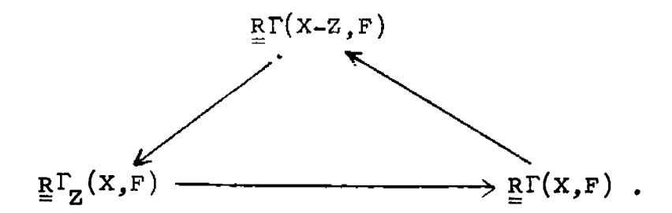
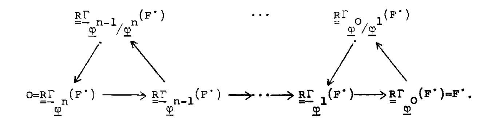
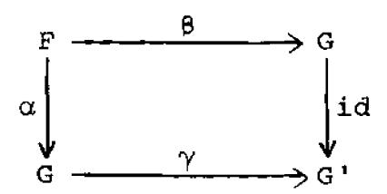
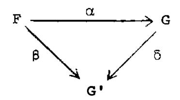
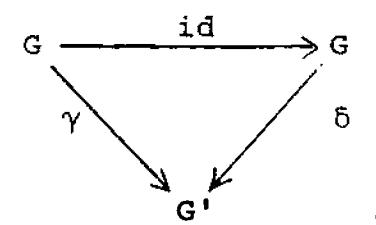
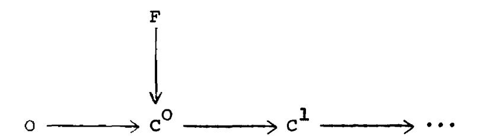
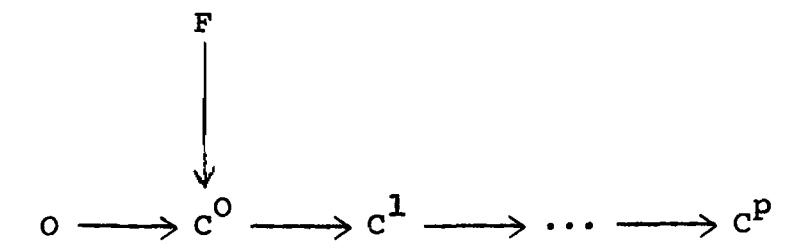
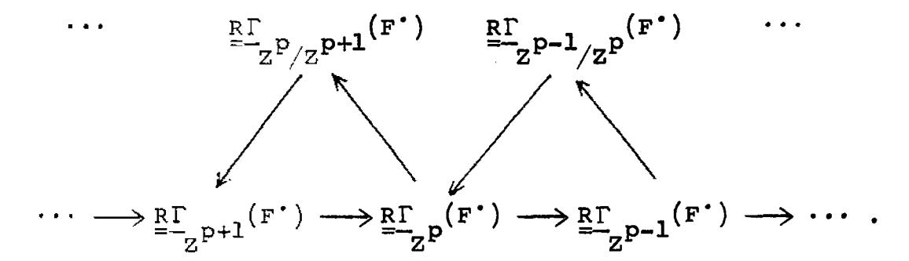
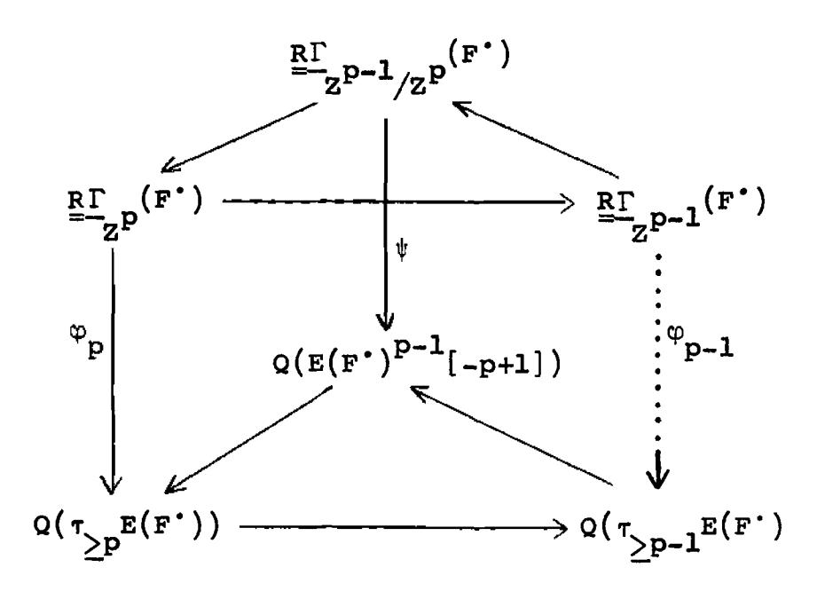
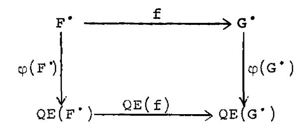

#### CHAPTER IV.\_ LOCAL COHOMOLOGY.

This chapter consists for a great part in definitions, which generalize those of the Local Cohomology lecture notes [LC]. Notable new material is the spectral sequence of a filtered topological space, and the Cousin complex of a sheaf.

# \$1. Local cohomology groups, sheaves, and complexes.

Throughout this section, X will be an arbitrary topological space, and F a sheaf of abelian groups on X. There are three ways in which one can vary the basic definition of the cohomology of F with supports in a closed subset Z of X: one can replace Z by a family of supports; one can define a relative local cohomology if  $Z' \subseteq Z$  are two closed subsets; and one can make everything local by sheafifying. Therefore we will present the definitions in the form of a theme and variations, to allow for all possible combinations of the generalizations suggested above.

We state our results mostly in terms of the cohomology groups, and leave to the reader the appropriate statements in terms of the derived category. When X is an arbitrary

topological space, we work in the derived category D(Ab(X)) of the category of abelian sheaves on X. If X is a prescheme, we work in the derived category D(X) = D(Mod(X)) of the category of  $\mathscr{O}_X$ -modules. All the derived functors considered in this chapter are compatible in the two cases with the natural functor

$$D^+(X) \longrightarrow D^+(Ab(X))$$
,

since any injective  $\mathcal{C}_{X}$ -module is flasque, and flasque sheaves are acyclic for the functors considered (Motif C below).

#### Theme.

Let Z be a closed subset of X. Define  $\Gamma_Z(X,F)$  to be the group consisting of those global sections of F whose support lies in Z. Define  $H_Z^i(X,F)$  to be the ith right derived functor of  $\Gamma_Z$  (which is a left-exact functor), and define  $\Gamma_Z^i$  to be the right derived functor on the derived category  $\Gamma_Z^i$  (Ab(X)). These are called the local cohomology groups of F with supports in Z. They have the following properties:

## Motif A. If

$$0 \longrightarrow F' \longrightarrow F \longrightarrow F'' \longrightarrow 0$$

is a short exact sequence of abelian sheaves on X, then there

is a long exact sequence of groups

$$0 \longrightarrow \Gamma_{\mathbf{Z}}(\mathbf{X},\mathbf{F}') \longrightarrow \Gamma_{\mathbf{Z}}(\mathbf{X},\mathbf{F}) \longrightarrow \Gamma_{\mathbf{Z}}(\mathbf{X},\mathbf{F}'') \longrightarrow$$

$$H^{1}_{\mathbf{Z}}(\mathbf{X},\mathbf{F}') \longrightarrow H^{1}_{\mathbf{Z}}(\mathbf{X},\mathbf{F}) \longrightarrow H^{1}_{\mathbf{Z}}(\mathbf{X},\mathbf{F}'') \longrightarrow \cdots.$$

<u>Proof.</u> This is the same as to say that  $\Gamma_Z$  is left exact, and so is equal to  $\operatorname{H}^{O}(\operatorname{R}\Gamma_Z)$ , which it is.

Motif B. There is a long exact sequence

$$0 \longrightarrow \Gamma_{\mathbf{Z}}(\mathbf{X},\mathbf{F}) \longrightarrow \Gamma(\mathbf{X},\mathbf{F}) \longrightarrow \Gamma(\mathbf{X}-\mathbf{Z},\mathbf{F}) \longrightarrow$$

$$H^{1}_{\mathbf{Z}}(\mathbf{X},\mathbf{F}) \longrightarrow H^{1}(\mathbf{X},\mathbf{F}) \longrightarrow H^{1}(\mathbf{X}-\mathbf{Z},\mathbf{F}) \longrightarrow H^{2}_{\mathbf{Z}}(\mathbf{X},\mathbf{F}) \longrightarrow \cdots.$$

Proof. For any sheaf F one has an exact sequence

$$0 \longrightarrow \Gamma_{Z}(X,F) \longrightarrow \Gamma(X,F) \longrightarrow \Gamma(X-Z,F) ,$$

and if F is flasque (in particular if F is injective) one can write a zero on the right. Thus if I is an injective resolution of F, we have an exact sequence of complexes

$$0 \longrightarrow \Gamma_{\mathbf{Z}}(\mathbf{X},\mathbf{I}^{\bullet}) \longrightarrow \Gamma(\mathbf{X},\mathbf{I}^{\bullet}) \longrightarrow \Gamma(\mathbf{X}-\mathbf{Z},\mathbf{I}^{\bullet}) \longrightarrow 0$$

which gives rise to a triangle in D+(Ab),

Taking cohomology gives the result.

Motif C. For F flasque, and i > 0,  $H_Z^i(X,F) = 0$ .

<u>Proof.</u> This follows from Motif B, and the fact that  $H^{i}(X,F) = H^{i}(X-Z,F) = 0$  for i > 0, and  $\Gamma(X,F) \longrightarrow \Gamma(X-Z,F)$  is surjective for F flasque.

Remark. In fact, F is flasque  $\iff$  for every closed subspace Z of X,  $H_Z^1(X,F) = 0$  [LC, 1.10].

# Variation 1.

Definition. A family of supports on a topological space X is a set  $\phi$  of closed subsets of X such that

- (a) if Z  $\in \phi$ , and Z' is a closed subset of Z, then Z'  $\in \phi$ , and
  - (b) if  $z_1, z_2 \in \varphi$ , then  $z_1 \cup z_2 \in \varphi$ .

Now let  $\phi$  be a family of supports, and define  $\Gamma_{\phi}(X,F)$  to be the group of global sections of F whose support is in  $\phi$ . Define  $\underline{\underline{R}}\Gamma_{\phi}(X,F) \text{ and } H^{\mathbf{i}}_{\phi}(X,F) \text{ to be the right derived functors.}$ 

Motif A. Repeat as above, with  $\, Z \,$  replaced by  $\, \phi \,$ .

Motif D. 
$$H_{\varphi}^{i}(X,F) = \lim_{Z \in \Theta} H_{Z}^{i}(X,F)$$
.

<u>Proof.</u> It is true for i = 0, and direct limits commute with cohomology of complexes.

Motif C. For F flasque, and i > 0,  $H_{\phi}^{i}(X,F) = 0$ . Proof. Follows from Motif D, and Motif C above.

### Variation 2.

Let Z'  $\subseteq$  Z be closed subsets of X. Define  $\Gamma_{Z/Z}$ , (X,F) to be  $\Gamma_{Z}(X,F)/\Gamma_{Z}$ , (X,F). Define  $\mathbb{R}^{\Gamma}_{Z/Z}$ , and  $\mathbb{H}^{\mathbf{i}}_{Z/Z}$ , to be the right derived functors. Note that in general  $\Gamma_{Z/Z}$ , is not left exact, so that  $\Gamma_{Z/Z}$ ,  $\frac{1}{7}$   $\mathbb{H}^{\mathcal{O}}_{Z/Z}$ .

Motif A. Repeat with  $H^O$  in place of  $\Gamma$ , and Z/Z' in place of Z.

Motif B. There is a long exact sequence

$$0 \longrightarrow \Gamma_{Z}(X,F) \longrightarrow \Gamma_{Z}(X,F) \longrightarrow H_{Z/Z}^{0}(X,F) \longrightarrow$$

$$H_{Z}^{1}(X,F) \longrightarrow H_{Z}^{1}(X,F) \longrightarrow H_{Z/Z}^{1}(X,F) \longrightarrow$$

$$H_{Z}^{2}(X,F) \longrightarrow \cdots$$

Motif C. Repeat.

## Variation 3.

Let Z be a closed subset of X. Define  $\underline{\Gamma}_Z(F)$  to be the sheaf whose sections over an open set U are the elements of  $\Gamma_{Z\cap U}(U,F|_U)$ . Define  $\underline{R}\underline{\Gamma}_Z(F)$  and  $\underline{H}_Z^i(F)$  to be the right derived functors, which are now complexes of sheaves, resp. sheaves on X.

Motif A. Repeat with underlines.

Motif B. There is a four-term exact sequence

$$\circ \longrightarrow \underline{\Gamma}_{\!\!\!Z}(F) \longrightarrow F \longrightarrow j_*(F\big|_{X-Z}) \longrightarrow \underline{H}^1_{\!\!\!Z}(F) \longrightarrow \circ$$

where  $j: X-Z \longrightarrow X$  is the inclusion, and there are isomorphisms for i > 0,

$$R^{i}_{x-z}) \xrightarrow{\sim} \underline{H}_{z}^{i+1}(F).$$

Motif C. For F flasque and i > 0,  $\underline{H}_{\underline{Z}}^{i}(F) = 0$ .

<u>Proof.</u> One sees easily that for any F and for any i,  $\underline{H}^{i}_{Z}(F)$  is the sheaf associated to the presheaf

$$U \longrightarrow H_{Z \cap U}^{i}(U,F|_{U})$$
.

Now since the restriction of a flasque sheaf to an open subset is flasque, the result follows from Motif C above.

Motif E. There is a spectral sequence

$$E_2^{pq} = H^p(X, \underline{H}_Z^q(F)) \Longrightarrow E^n = H_Z^n(X,F)$$
,

or equivalently, in terms of the derived categories,  $\underline{\underline{R}}_{\mathbf{Z}}^{\Gamma} = \underline{\underline{R}}_{\mathbf{Z}}^{\Gamma \cdot \underline{R}} \underline{\underline{\Gamma}}_{\mathbf{Z}}^{\Gamma}.$ 

<u>Proof.</u> Referring to [I.5.4], we need only show that  $\underline{\Gamma}_Z$  takes injectives into  $\Gamma$ -acyclic objects. Indeed, any injective is flasque, and  $\underline{\Gamma}_Z$  of a flasque is flasque, and any flasque is  $\Gamma$ -acyclic.

## Variation 4.

Combining variations 1 and 2, let  $\psi\subseteq \phi$  be two families of supports. Define  $\Gamma_{\phi/\psi}(X,F)$  and its derived functors  $\Pr_{\phi/\psi}(X,F)$  and  $\Pr_{\phi/\psi}(X,F)$  and  $\Pr_{\phi/\psi}(X,F)$  and  $\Pr_{\phi/\psi}(X,F)$  and  $\Pr_{\phi/\psi}(X,F)$  and  $\Pr_{\phi/\psi}(X,F)$  and  $\Pr_{\phi/\psi}(X,F)$  and  $\Pr_{\phi/\psi}(X,F)$  and  $\Pr_{\phi/\psi}(X,F)$  and  $\Pr_{\phi/\psi}(X,F)$  and  $\Pr_{\phi/\psi}(X,F)$  and  $\Pr_{\phi/\psi}(X,F)$  and  $\Pr_{\phi/\psi}(X,F)$  and  $\Pr_{\phi/\psi}(X,F)$  and  $\Pr_{\phi/\psi}(X,F)$  and  $\Pr_{\phi/\psi}(X,F)$  and  $\Pr_{\phi/\psi}(X,F)$  and  $\Pr_{\phi/\psi}(X,F)$  and  $\Pr_{\phi/\psi}(X,F)$  and  $\Pr_{\phi/\psi}(X,F)$  and  $\Pr_{\phi/\psi}(X,F)$  and  $\Pr_{\phi/\psi}(X,F)$  and  $\Pr_{\phi/\psi}(X,F)$  and  $\Pr_{\phi/\psi}(X,F)$  and  $\Pr_{\phi/\psi}(X,F)$  and  $\Pr_{\phi/\psi}(X,F)$  and  $\Pr_{\phi/\psi}(X,F)$  and  $\Pr_{\phi/\psi}(X,F)$  and  $\Pr_{\phi/\psi}(X,F)$  and  $\Pr_{\phi/\psi}(X,F)$  and  $\Pr_{\phi/\psi}(X,F)$  and  $\Pr_{\phi/\psi}(X,F)$  and  $\Pr_{\phi/\psi}(X,F)$  and  $\Pr_{\phi/\psi}(X,F)$  and  $\Pr_{\phi/\psi}(X,F)$  and  $\Pr_{\phi/\psi}(X,F)$  and  $\Pr_{\phi/\psi}(X,F)$  and  $\Pr_{\phi/\psi}(X,F)$  and  $\Pr_{\phi/\psi}(X,F)$  and  $\Pr_{\phi/\psi}(X,F)$  and  $\Pr_{\phi/\psi}(X,F)$  and  $\Pr_{\phi/\psi}(X,F)$  and  $\Pr_{\phi/\psi}(X,F)$  and  $\Pr_{\phi/\psi}(X,F)$  and  $\Pr_{\phi/\psi}(X,F)$  and  $\Pr_{\phi/\psi}(X,F)$  and  $\Pr_{\phi/\psi}(X,F)$  and  $\Pr_{\phi/\psi}(X,F)$  and  $\Pr_{\phi/\psi}(X,F)$  and  $\Pr_{\phi/\psi}(X,F)$  and  $\Pr_{\phi/\psi}(X,F)$  and  $\Pr_{\phi/\psi}(X,F)$  and  $\Pr_{\phi/\psi}(X,F)$  and  $\Pr_{\phi/\psi}(X,F)$  and  $\Pr_{\phi/\psi}(X,F)$  and  $\Pr_{\phi/\psi}(X,F)$  and  $\Pr_{\phi/\psi}(X,F)$  and  $\Pr_{\phi/\psi}(X,F)$  and  $\Pr_{\phi/\psi}(X,F)$  and  $\Pr_{\phi/\psi}(X,F)$  and  $\Pr_{\phi/\psi}(X,F)$  and  $\Pr_{\phi/\psi}(X,F)$  and  $\Pr_{\phi/\psi}(X,F)$  and  $\Pr_{\phi/\psi}(X,F)$  and  $\Pr_{\phi/\psi}(X,F)$  and  $\Pr_{\phi/\psi}(X,F)$  and  $\Pr_{\phi/\psi}(X,F)$  and  $\Pr_{\phi/\psi}(X,F)$  and  $\Pr_{\phi/\psi}(X,F)$  and  $\Pr_{\phi/\psi}(X,F)$  and  $\Pr_{\phi/\psi}(X,F)$  and  $\Pr_{\phi/\psi}(X,F)$  and  $\Pr_{\phi/\psi}(X,F)$  and  $\Pr_{\phi/\psi}(X,F)$  and  $\Pr_{\phi/\psi}(X,F)$  and  $\Pr_{\phi/\psi}(X,F)$  and  $\Pr_{\phi/\psi}(X,F)$  and  $\Pr_{\phi/\psi}(X,F)$  and  $\Pr_{\phi/\psi}(X,F)$  and  $\Pr_{\phi/\psi}(X,F)$  and  $\Pr_{\phi/\psi}(X,F)$  and  $\Pr_{\phi/\psi}(X,F)$ 

Motif A. Repeat.

Motif B. Repeat.

Motif C. Repeat.

$$\frac{\text{Motif D.}}{\varphi/\psi}(X,F) = \underbrace{\frac{\text{lim}}{Z \in \varphi}}_{Z' \in \psi} H_{Z/Z'}^{i}(X,F).$$

#### Variation 5.

Combining variations 1 and 3 leads us to a

<u>Definition.</u> A <u>sheaf of families of supports</u> on a topological space X is a sheaf of sets  $\underline{\phi}$ , such that for every open set U,  $\underline{\phi}(U)$  is a family of supports on U, and such that for  $V \subseteq U$  the restriction map  $\underline{\phi}(U) \longrightarrow \underline{\phi}(V)$  is given by  $Z \in \underline{\phi}(U)$  goes to  $Z \cap V \in \varphi(V)$ .

Remarks. 1. If  $\phi$  is a family of supports on X, we can define a sheaf of families of supports  $\widetilde{\phi}$  on X by taking the sheaf associated to the presheaf

 $U \longrightarrow \{Z \cap U | Z \in \varphi\}.$ 

- 2. If  $\underline{\phi}$  is a sheaf of families of supports on X, we can define a family of supports  $\Gamma(\underline{\phi})$  on X by  $\Gamma(\underline{\phi}) = \underline{\phi}(X)$ .
- 3. Note that in general, the operations  $\Gamma$  and  $\sim$  are not inverses to each other. For example, if  $\varphi$  is the family of compact subsets of a locally compact Hausdorff space, then  $\widetilde{\varphi}$  is the maximal sheaf of families of supports, and  $\Gamma(\widetilde{\varphi})$  is the maximal family of supports. But if X is not compact,  $\varphi \neq \Gamma(\widetilde{\varphi})$ .

- 4. Conversely, let  $f\colon X\longrightarrow Y$  be a morphism of finite type of locally noetherian preschemes. Let p be an integer, and let  $\underline{\phi}$  be the sheaf of families of supports on X given by  $\underline{\phi}(U)=$  the set of (relatively) closed subsets Z of U such that for every  $y\in f(U)$ ,  $Z\cap X_y$  is of codimension  $\geq p$  in the fibre  $X_y$ . Then in general  $\Gamma(\underline{\phi})^{\sim}$  is different from  $\underline{\phi}$ . (For a specific example, let Y= Spec k[x,y], let  $X=\mathbb{F}^1_Y$  and let p=1. Then if  $Z\subseteq X$  is obtained by blowing up the origin of Y, Z is locally in  $\varphi$  except over the origin of Y, but  $Z\notin \Gamma(\varphi)$ .)
- 5. For another example of a family of supports, let Z be a subset of the topological space X, stable under specialization (e.g., Z = {x  $\in$  X of codimension  $\geq$  p} for some p. By the codimension of a point x in a topological space X, we mean the largest integer n, or  $+\infty$ , such that there exists a sequence  $x_0, x_1, x_2, \cdots, x_n = x$  of points of X where for each i,  $x_i \rightarrow x_{i+1}$  is a proper specialization, i.e.,  $x_{i+1} \in \{\overline{x_i}\}$  and  $x_i \neq x_{i+1}$ ). Then the set of subsets of finite unions of closures of points of Z is a family of supports  $\varphi$ . One can also consider the associated sheaf of families of supports  $\varphi$ . If X is locally noetherian (as a topological space) and if every closed irreducible

subset of X has a unique generic point, then there is a 1-1 correspondence between subsets of X, stable under specialization, and families of supports  $\varphi$ , such that  $\varphi = \Gamma(\widetilde{\varphi})$ . In these cases we will write  $\Gamma_Z$  for  $\Gamma_{\varpi}$ ,  $H_Z^i$  for  $H_{\varpi}^i$ ,  $\Gamma_Z$  for  $\Gamma_{\varpi}$ , etc.

Now let  $\underline{\phi}$  be a sheaf of families of supports on X. Define  $\underline{\Gamma}_{\underline{\phi}}(F)$  to be the sheaf whose sections on an open set U are  $\underline{\Gamma}_{\underline{\phi}(U)}(U,F\big|_U)$ . Define  $\underline{R}\underline{\Gamma}_{\underline{\phi}}(F)$  and  $\underline{H}^{\underline{i}}_{\underline{\phi}}(F)$  to be the right derived functors.

Motif A. Repeat.

Motif C. Repeat.

Motif D. If  $\underline{\phi}$  is a sheaf of families of supports of global nature (i.e., such that  $\underline{\phi} = \Gamma(\underline{\phi})^{\sim}$ ), then

$$\underline{\underline{H}}_{\varphi}^{i}(F) = \underline{\underline{\lim}}_{Z \in \varphi(X)} \underline{\underline{H}}_{Z}^{i}(F)$$

Motif E. There is a spectral sequence

$$E_2^{pq} = H^p(x, \underline{H}_{\underline{\phi}}^q(F)) \Longrightarrow E^n = H_{\Gamma(\underline{\phi})}^n(x, F)$$
,

or, in terms of the derived categories,  $\underset{=}{\mathbb{R}}\Gamma_{(\varphi)} = \underset{=}{\mathbb{R}}\Gamma \cdot \underset{=}{\mathbb{R}}\Gamma_{\varphi}$ .

### Variation 6.

Combining variations 2 and 3, let Z'  $\subseteq$  Z be closed subsets of X. Define  $\frac{\Gamma}{Z/Z}$ ,  $\frac{R\Gamma}{Z-Z/Z}$ , and  $\frac{H^i}{Z/Z}$ . Repeat Motifs A, B, C, and E.

## Variation 7.

Combining variations 1, 2, and 3, let  $\underline{\psi} \subseteq \underline{\phi}$  be two sheaves of families of supports on X. Define  $\underline{\Gamma}_{\underline{\phi}/\underline{\psi}}$ ,  $\underline{R}\underline{\Gamma}_{\underline{\phi}/\underline{\psi}}$ , and  $\underline{H}_{\underline{\phi}/\underline{\psi}}^{\underline{i}}$ . Repeat Motifs A, B, C, D, and E.

## Variation 8.

In this case we define a purely punctual invariant. Let x be a point of X and define  $\Gamma_X(F)$  to be the subgroup of the stalk  $F_X$  consisting of elements  $\overline{s}$  which have a representative s in a suitable neighborhood U of x, whose support is  $\{\overline{x}\} \cap U$ . Define the right derived functors  $\mathbb{R}^{\Gamma}_X(F)$  and  $H_X^{\mathbf{i}}(F)$ . Note that  $H_X^{\mathbf{i}}(F) = \underline{H}_Z^{\mathbf{i}}(F)_X$ , where  $Z = \{\overline{x}\}$ , and the subscript x denotes the stalk. Repeat Motifs A and C.

Motif F. Assume that X is a locally noetherian topological space and that every closed irreducible subset of X has a unique generic point. Let  $Z' \subseteq Z$  be two subsets of X, stable under specialization, and such that every  $x \in Z-Z'$  is maximal in Z

(i.e., if  $x \in Z$  and  $x \longrightarrow x'$  is a non-trivial specialization, then  $x' \in Z'$ ). Let  $F' \in D^+(Ab(X))$  be a complex of sheaves. Then there is a canonical functorial isomorphism

$$\underline{H}_{\mathbb{Z}/\mathbb{Z}}^{i}(F^{\cdot}) \xrightarrow{\sim} \underline{\downarrow}_{\mathbf{x}\in\mathbb{Z}-\mathbb{Z}}^{i} i_{\mathbf{x}}(H_{\mathbf{x}}^{i}(F^{\cdot})) ,$$

where for any group G,  $i_x(G)$  is the constant sheaf G on  $\{\overline{x}\}$ , and O elsewhere. (By abuse of notation we write Z,Z' instead of the sheaves of families of supports they define as in Remark 5 of Variation 5 above.)

<u>Proof.</u> Since both sides are derived functors, it will be sufficient to establish a canonical functorial isomorphism for a single sheaf  $F \in Ab(X)$ 

$$\underline{\Gamma}_{Z/Z}$$
,  $(F) \xrightarrow{\sim} \underline{\downarrow}_{X \in Z-Z}$ ,  $i_{X}(\Gamma_{X}(F))$ .

For an open set U we define a map

$$\Gamma_{Z \cap U}(U,F|_{U}) \longrightarrow \frac{|}{\mathbf{x} \in (Z-Z') \cap U} \Gamma_{\mathbf{x}}(F)$$

by sending a section into its germ at each stalk. Only finitely many are non-zero, because the support of any section s is a finite union  $\{\overline{z_i}\} \cup \cdots \cup \{\overline{z_n}\}$  with  $z_i \in Z$ 

(since X is locally noetherian!) and because each  $x \in Z$ -Z' is maximal in Z. A section s goes to zero if and only if it is in  $\Gamma_{Z' \cap U}(U,F|_U)$ . Thus we have defined an inclusion of sheaves above. Finally, we see that it is surjective, because every germ  $\overline{s} \in \Gamma_{X}(F)$  comes from a section s of F in a suitable neighborhood U, with support  $\{\overline{x}\} \cap U$ .

#### Coda.

Having made all these generalizations of the notion of local cohomology, we are practically back where we started:

Motif G. (The Spectral Sequence of a Filtered Topological Space). Let

$$X = \varphi^{0} \supseteq \varphi^{1} \supseteq \cdots$$

be a filtration of X by sheaves of families of supports, and let F' be a complex of abelian sheaves on X bounded below.

Then there is a spectral sequence

$$E_1^{pq} = \frac{H^{p+q}}{\varphi^p/\varphi^{p+1}}(F^{\bullet}) \implies E^n = H^n(F^{\bullet}) ,$$

which is biregular [EGA  $O_{III}$ §11] if the filtration is finite, i.e.,  $\underline{\phi}^n = \emptyset$  for some n. Or, in terms of the derived category, there is a diagram of triangles (shown in the convergent case)

Proof. This is just the spectral sequence of a filtered
complex [M, Ch. XV]. Take an injective resolution I' of F'.
Then I' is filtered

$$I_{\bullet} = \frac{\overline{\Phi}}{L}^{0}(I_{\bullet}) \supset \frac{\overline{\Phi}}{L}^{1}(I_{\bullet}) \supset \cdots \supset \frac{\overline{\Phi}}{L}^{1}(I_{\bullet}) = 0 ,$$

and the quotients are  $\frac{\Gamma}{\varphi}_{i/\varphi}^{i+1}(I^{\cdot})$ .

### \$2. Depth and the Cousin Complex.

Throughout this section, X will denote a locally noetherian topological space in which every closed irreducible subset has a unique generic point.

<u>Definition</u>. Let  $F^{\bullet}$  be a complex of sheaves of abelian groups (bounded below) on X and  $\underline{\phi}$  a sheaf of families of supports. Then the  $\underline{\phi}$ -depth of  $F^{\bullet}$  is the largest integer n (or  $+\infty$ ) such that  $\underline{H}^{\dot{\mathbf{l}}}_{\underline{\phi}}(F^{\bullet})=0$  for all  $\mathbf{l}<\mathbf{n}$ .

Remark. If X is a locally noetherian prescheme,  $\phi$  the family of subsets of a closed subset Z of X, and F a coherent sheaf, then this definition of depth coincides with the usual definition of the Z-depth of F [LC.3.8].

<u>Proposition 2.1.</u> Let  $Z' \subseteq Z$  be subsets of (the locally noetherian topological space) X, stable under specialization, and such that every  $x \in Z-Z'$  is maximal (with respect to specialization) in Z. Let F be an abelian sheaf on X. Then the following conditions are equivalent:

### (i) The natural maps

$$F \longleftarrow \underline{\underline{\Gamma}}_{Z}(F) \longrightarrow \underline{\underline{H}}_{Z/Z}^{O}(F)$$

are isomorphisms.

(ii) There is an isomorphism

$$F \cong \coprod_{x \in Z - Z} i_x(M_x)$$

for suitable choice of abelian groups  $M_{x}$ . (Recall that for any abelian group M,  $i_{x}(M)$  is the constant sheaf M on  $\{\overline{x}\}$ , and 0 elsewhere.)

- (iii) F has supports in Z, Z'-depth  $\geq$  1, and is flasque.
- (iv) F has supports in Z, and Z'-depth  $\geq 2$ .

<u>Proof.</u> (i)  $\Longrightarrow$  (ii) follows immediately from Motif F of Variation 8 above.

(ii)  $\Longrightarrow$  (iii) Condition (ii) implies that F has supports in Z, and that  $\Gamma_{Z'}(F) = 0$ , i.e., Z'-depth  $F \geq 1$ . F is flasque because it is a direct sum of sheaves  $i_{\chi}(M)$ , each of which is a constant sheaf on an irreducible space, hence flasque.

(iii)  $\Longrightarrow$  (iv) Since F is flasque,  $\underline{H}_{Z}^{i}(F) = 0$  for all i > 0, by Motif C. But  $\underline{H}_{Z}^{0}(F) = 0$  since F has Z'-depth  $\geq 1$ , so F has Z'-depth  $+\infty > 2$ .

 $(iv) \longrightarrow (i) \xrightarrow{\Gamma_Z} (F) \longrightarrow F$  is an isomorphism since F has supports in Z. Now by Motif B there is an exact sequence

$$0 \longrightarrow \underline{\Gamma}_{Z}(F) \longrightarrow \underline{\Gamma}_{Z}(F) \longrightarrow \underline{H}_{Z/Z}(F) \longrightarrow \underline{H}_{Z}(F) \longrightarrow \cdots$$

Since Z'-depth  $F \geq 2$ , the two outside terms are zero, so the middle is an isomorphism.

Definition. If F satisfies the equivalent conditions above, we say F lies on the  $\mathbb{Z}/\mathbb{Z}$ '-skeleton of X.

We now come to the Cousin complex, but prove a lemma first.

Lemma 2.2. Let  $Z' \subseteq Z$  be as in the previous proposition, and let F be a sheaf on X with supports in Z. Then there is a unique (up to unique isomorphism) Z'-isomorphism

$$\alpha: F \longrightarrow G$$

of F into a sheaf G which lies on the  $\mathbb{Z}/\mathbb{Z}$ '-skeleton. (By  $\mathbb{Z}'$ -isomorphism we mean a homomorphism of sheaves whose kernel and cokernel have supports in  $\mathbb{Z}'$ .)

<u>Proof.</u> (1) To show the existence of  $\alpha$ , we take  $G = \frac{H^O}{Z/Z}.(F), \text{ and let } \alpha \text{ be the natural map of } F = \frac{\Gamma}{Z}(F) \text{ into } G.$  Then from the exact sequence of Motif B we see that  $\alpha$  is a Z'-isomorphism, and from Motif F we see that G lies on the Z/Z'-skeleton.

(2) To see that  $\alpha$  is unique up to isomorphism, let  $\beta\colon F \longrightarrow G'$  be another such Z'-isomorphism. Applying the functor  $H_{\mathbb{Z}/\mathbb{Z}}^{0}$ , (which takes Z'-isomorphisms into isomorphisms) we get a commutative diagram

where  $\gamma = \frac{H^{O}}{Z/Z}$ , ( $\beta$ ) is an isomorphism.

(3) To show that the isomorphism in  $\gamma$  is unique, let  $\delta\colon G \longrightarrow G'$  be any other homomorphism which gives a commutative diagram

Then applying the functor  $\frac{H^O}{-Z/Z^*}$ , we obtain a commutative diagram

<u>Proposition 2.3.</u> Let  $X = Z^0 \supseteq Z^1 \supseteq \cdots$  be a filtration of X by subsets  $Z^p$  stable under specialization, and such that for each p, each  $x \in Z^p - Z^{p+1}$  is maximal in  $Z^p$ . Let F be an abelian sheaf on X. Then there is a unique (up to unique isomorphism of complexes) augmented complex

with the following properties:

- (a) For each  $p \ge 0$ ,  $C^p$  lies on the  $Z^p/Z^{p+1}$ -skeleton.
- (b) For each p > 0,  $H^p(C^*)$  has supports in  $Z^{p+2}$ .
- (c) The map  $F \longrightarrow H^{O}(C^{\bullet})$  has kernel with supports in  $Z^{1}$ , and cokernel with supports in  $Z^{2}$ .

Furthermore, C' depends functorially on F.

<u>Proof.</u> We prove by induction on p, that there exists a unique (up to unique isomorphism of complexes) augmented complex

with all the properties above, except that instead of saying  $H^p(C^{\bullet})$  has supports in  $Z^{p+2}$ , we say that  $C^p/Im\ C^{p-1}$  has supports in  $Z^{p+1}$  (or, if p=0, instead of saying that the cokernel of  $F \longrightarrow H^0(C^{\bullet})$  has supports in  $Z^2$ , we say that  $C^0/Im\ F$  has supports in  $Z^1$ ).

Case p = 0. This is precisely the statement of the Lemma, with  $Z = Z^0$  and  $Z' = Z^1$ .

Induction Step. Suppose the statement proven for p, and take a complex C' as above, defined in degrees  $\leq$  p. Apply the Lemma to  $C^p/\text{Im }C^{p-1}$  with  $Z=Z^{p+1}$  and  $Z'=Z^{p+2}$ , and let  $C^{p+1}$  be the sheaf G thus obtained. Now since

$$c^p/\text{Im }c^{p-1}\longrightarrow c^{p+1}$$

is a  $Z^{p+2}$ -isomorphism, its kernel,  $H^p(C^*)$  and its cokernel,  $C^{p+1}/Im\ C^p$ , have supports in  $Z^{p+2}$ . Furthermore,  $C^{p+1}$  lies on the  $Z^{p+1}/Z^{p+2}$ -skeleton, so we have a complex with the required properties. To show that it is unique up to unique isomorphism, let  $C^*$  be another such augmented complex, defined in degrees  $\leq p+1$ . Leaving off  $C^{p+1}$ , we have a complex satisfying the conditions of the induction hypothesis, therefore there is a unique isomorphism of augmented complexes  $C^* \longrightarrow C^{**}$  defined in degrees < p. Thus there is a unique isomorphism

$$C^p/Im C^{p-1} \longrightarrow C'^p/Im C'^{p-1}$$
.

Now again by the Lemma, this extends to a unique isomorphism of  $C^{p+1} \longrightarrow C^{p+1}$ .

<u>Definition</u>. The complex of the above proposition is called the <u>Cousin complex</u> of F (with respect to the filtration Z').

Examples. (1) If F has supports in Z1, then its Cousin complex is the zero complex.

(2) If F is flasque, then its Cousin complex is given by  $C^0 = F/\frac{\Gamma}{Z} \mathbf{1}(F)$ ,  $C^p = 0$  for p > 0.

Lemma 2.4. Under the hypotheses of Proposition 2.3,  $\frac{H^{i}}{Z^{p}/Z^{p+1}}(F) = 0 \text{ for all } i > p.$ 

Proof. Using Motif F, we have only to show that for all  $x \in Z^p - Z^{p+1}$ ,  $H_x^i(F) = 0$ . But this group can be calculated as the  $i^{th}$  derived functor of  $\Gamma_x$  on the topological space  $X_{(x)}$  consisting of all generizations of x (i.e., points x' which specialize to x). Indeed, it can be calculated by flasque sheaves (Motif C), and the restriction of a flasque sheaf to  $X_{(x)}$  is flasque. Now since  $x \notin Z^{p+1}$ , the space  $X_{(x)}$  has combinatorial dimension  $\geq p$ , and so  $H_x^i(F) = 0$  for i > p [G,II,4.15.2], or [LC 1.12].

<u>Proposition 2.5.</u> Let  $X = Z^0 \supseteq Z^1 \supseteq \cdots$  and F be as in Proposition 2.3, and assume furthermore that the filtration is separated (i.e.,  $\bigcap Z^n = \emptyset$ ). Then the natural map

 $\alpha: F \longrightarrow \frac{H^{O}}{Z^{O}/Z^{1}}(F)$  makes the complex

$$\circ \longrightarrow \underline{\underline{H}}_{\underline{z}^{O}/\underline{z}^{1}}^{O}(F) \xrightarrow{\underline{d}_{\underline{1}}^{OO}} \underline{\underline{H}}_{\underline{z}^{1}/\underline{z}^{2}}^{1}(F) \xrightarrow{\underline{d}_{\underline{1}}^{1O}} \underline{\underline{H}}_{\underline{z}^{2}/\underline{z}^{3}}^{2}(F) \longrightarrow \cdots$$

of  $E_1^{pO}$  terms of the spectral sequence of Motif G into a Cousin complex for F.

<u>Proof.</u> We must check first that  $\alpha$  gives an augmentation (i.e.,  $d_1^{OO} \cdot \alpha = 0$ ), and then that the properties (a), (b), and (c) of Proposition 2.3 hold. These properties can be checked at each point separately. Thus for an  $x \in X$ , we can replace X by the space  $X_{(x)}$  of generizations of x, which has finite combinatorial dimension (since the filtration  $Z^*$  is separated). In other words, we may assume that the filtration  $Z^*$  is finite. To avoid boring the reader, we will check only property (b) which is the hardest.

Given p > 0, we wish to show that HP of the complex above, which is nothing but  $E_2^{pO}$  of the spectral sequence of Motif G, has supports in  $Z^{p+2}$ . We show, by descending induction on r, that  $E_r^{pO}$  has supports in  $Z^{p+r}$  for each r > 1. For r large enough,  $E_r^{pO} = E_{\infty}^{pO} = 0$ , since the abutment of the spectral sequence,  $E^n$ , is 0 for  $n \neq 0$ .

Now let r > 1 be given. Then  $E_r^{p-r,r-1} = 0$ , since  $E_r^{pq} = 0$  for q > 0 by the Lemma. Therefore we have an exact sequence

$$0 \longrightarrow E_{r+1}^{p0} \longrightarrow E_r^{p0} \xrightarrow{d_r^{p0}} E_r^{p+r,-r+1}.$$

By the induction hypothesis,  $E_{r+1}^{pO}$  has supports in  $Z^{p+r+1}$ ; and  $E_1^{p+r,-r+1} = \frac{H^{p+1}}{Z^{p+r}/Z^{p+r+1}}(F)$ , has supports in  $Z^{p+r}$ . Thus  $E_r^{pO}$  has supports in  $Z^{p+r}$ , and in particular,  $E_2^{pO}$  has supports in  $Z^{p+2}$ .

Now we ask when the Cousin complex is a resolution of F.

Proposition 2.6. Under the hypotheses of Proposition 2.5, the following conditions are equivalent:

- (i)  $\frac{H^i}{Z^p}(F) = 0$  for all i,p with  $i \neq p$ .
- (ii)  $Z^{p}$ -depth  $F \ge 0$  for all p.
- (iii)  $\frac{H^{i}}{Z^{p}/Z^{p+1}}(F) = 0$  for all i,p with  $i \neq p$ .
- (iv) The Cousin complex of F is a (flasque) resolution of F.

<u>Proof.</u> (i)  $\Longrightarrow$  (ii) by definition of depth. (ii)  $\Longrightarrow$  (iii). They are zero for i > p by Lemma 2.4. For i < p we use the exact sequence

$$\frac{\underline{H}^{i}_{Z^{p}}(F) \longrightarrow \underline{H}^{i}_{Z^{p}/Z^{p+1}}(F) \longrightarrow \underline{H}^{i+1}_{Z^{p+1}}(F) .$$

(iii)  $\Longrightarrow$  (iv). The condition is pointwise, so as before we can assume the filtration Z' is finite. Then the spectral sequence of Motif G degenerates:  $E_1^{pq} = 0$  for  $q \neq 0$ . That means that the complex  $E_1^{pO}$  (which by the previous proposition is the Cousin complex) is a resolution of F.

(iv)  $\Longrightarrow$  (i). Let C' be the Cousin complex. Since it is a flasque resolution of F, we may use it to calculate cohomology:  $\frac{H^i}{Z^p} = H^i(\frac{\Gamma}{Z^p}(C^*))$ . Since  $C^p$  lies on the  $Z^p/Z^{p+1}$ -skeleton for all p,  $\frac{\Gamma}{Z^p}(C^*)$  is the truncated complex  $(C^i)_{i \geq p}$ . Clearly it has cohomology only in degree p, since the original C' was exact.

<u>Definition</u>. If the equivalent conditions of the proposition are satisfied, we say that F is <u>Cohen-Macaulay</u> (with respect to the filtration  $Z^*$ ).

Remark. If X is a locally noetherian prescheme, and  $Z^p$  the set of points of codimension  $\geq p$  (i.e., points  $x \in X$  with dim  $O_{x,X} \geq p$ ), and F a coherent sheaf on X with support X, then this notion coincides with the usual definition. Indeed,

using condition (iii) and Motif F, F is Cohen-Macaulay if and only if for each  $x \in X$ , depth  $f_X^F x \ge \dim f_X^F$ , which is the usual definition.

Example. Let X be a non-singular locally noetherian scheme, let Z' be the filtration by codimension as above, and let  $F = \mathcal{O}_X$ . Then F is Cohen-Macaulay (usual sense)

[ZS vol. II, App. 6], so the Cousin complex gives a flasque resolution of  $\mathcal{O}_X$ . Furthermore, the pth component of this complex is isomorphic to  $\frac{H^p}{Z^p/Z^{p+1}}(\mathcal{O}_X)$  which by Motif F is isomorphic to

$$\underline{\bigcup}_{\text{codim } x = p} i_{x}(H_{x}^{p}(\mathcal{O}_{x})) .$$

Now for x of codimension p, we know [LC.4.13] that  $H_X^P(O_X)$  is an injective hull over the local ring  $O_X$  of its residue field k(x). Thus our Cousin complex is in fact an injective resolution of  $O_X$ , and its component in degree p is isomorphic to a direct sum of sheaves J(x) (see definition in [II §7]) where x is a point of codimension p.

This is an example of the notion of residual complex, which will be studied in more detail in Chapter VI.

## §3. Generalization to Complexes.

In this section we generalize the results of the previous section to complexes. In particular, we will discuss Cohen-Macaulay complexes, Gorenstein complexes, and their relations to Cousin complexes.

Throughout this section, X will be a locally noetherian topological space in which every irreducible closed subset has a unique generic point. We will denote by  $D^+(X)$  either  $D^+(Ab(X))$ , the derived category of the category of abelian sheaves on X, or  $D^+(Mod(X))$  if X is a locally noetherian prescheme. The results are valid in both cases.

We will consider filtrations  $Z' = (Z^p)_{p \in \mathbb{Z}}$  on X, and will always suppose the following conditions satisfied:

(1) Each  $Z^p$  is a subset of X, stable under specialization, and

... 
$$z^{p-1} \supseteq z^p \supseteq z^{p+1} \supseteq ...$$
.

- (2) Each  $x \in Z^{p}-Z^{p+1}$  is maximal in  $Z^{p}$  (i.e., x is not a proper specialization of any other  $x' \in Z^{p}$ ).
- (3) The filtration is strictly exhaustive, i.e.,  $X = Z^p$  for some  $p \in \mathbb{Z}$ .
  - (4) The filtration is separated, i.e.,  $\int z^p = \emptyset$ .

<u>Definition</u>. A <u>Cousin complex</u> on X, with respect to the filtration Z', is a complex of sheaves G', such that for each p,  $G^p$  lies on the  $Z^p/Z^{p+1}$ -skeleton of X. (Cf. definition following Proposition 2.1.) Note that a Cousin complex is necessarily flasque, and bounded below. We denote by  $\underline{Coz(Z^*;X)}$  the category of Cousin complexes and morphisms of complexes. It is an additive category.

Example. The Cousin complex of a sheaf F (as in Proposition 2.3 above) is a Cousin complex.

<u>Definition</u>. Let  $F^* \in D^+(X)$ . Then we denote by  $E(F^*)$  the complex

$$\cdots \longrightarrow \underline{H}_{p}^{Z_{p}/Z_{p+1}}(F) \xrightarrow{d_{1}^{D_{0}}} \underline{H}_{p+1}^{Z_{p+1}/Z_{p+2}}(F) \longrightarrow \cdots$$

of  $E_1^{pO}$  terms of the spectral sequence of Motif G. We observe by Motif F that the  $p^{th}$  term  $E^p(F^*)$  lies on the  $Z^p/Z^{p+1}$ -skeleton of X, and so  $E(F^*)$  is a Cousin complex. (Note that even if  $F^* \in D^b(X)$ , the complex  $E(F^*)$  need not be bounded above.)

<u>Proposition 3.1.</u> Let  $F^* \in D^b(X)$ . Then the following conditions are equivalent:

(i) a) 
$$\frac{H^{i}}{Z}p(F^{\bullet}) = 0$$
 for  $i < p$ , and

b) the map

$$\frac{H_{\mathbf{z}}^{\mathbf{i}}(\mathbf{F}^{\bullet}) \longrightarrow H_{\mathbf{i}}(\mathbf{F}^{\bullet})$$

is surjective for i = p and bijective for i > p.

(ii) 
$$\frac{H^{i}}{Z^{p}/Z^{p+1}}(F^{*}) = 0$$
 for  $i \neq p$ .

(iii) There is an isomorphism  $\phi \colon F^* \longrightarrow QE(F^*)$  in  $D^+(X)$ , where Q is the functor sending a complex to its image in  $D^+(X)$  [I §3].

Furthermore, the isomorphism in (iii) can be chosen so that the isomorphisms  $H^{i}(\phi)\colon H^{i}(F^{*})\longrightarrow H^{i}(E(F^{*}))$  are inverse to the isomorphisms  $\epsilon_{i}\colon H^{i}(E(F^{*}))\longrightarrow H^{i}(F^{*})$  determined by the degenerate spectral sequence of Motif G.

Remark. One should beware, however, that the isomorphism  $\phi$  is not in general unique, and so is not functorial.

Proof of Proposition. (i)  $\Longrightarrow$  (ii). This follows immediately from the exact sequences

$$\underline{H}_{\mathbf{Z}^{\mathbf{p}+\mathbf{1}}}^{\mathbf{i}}(\mathbf{F}^{\bullet}) \longrightarrow \underline{H}_{\mathbf{Z}^{\mathbf{p}}}^{\mathbf{Z}^{\mathbf{p}}}(\mathbf{F}^{\bullet}) \longrightarrow \underline{H}_{\mathbf{Z}^{\mathbf{p}}/\mathbf{Z}^{\mathbf{p}+\mathbf{1}}}^{\mathbf{i}}(\mathbf{F}^{\bullet}) \longrightarrow \underline{H}_{\mathbf{Z}^{\mathbf{p}}}^{\mathbf{i}+\mathbf{1}}(\mathbf{F}^{\bullet}) \longrightarrow \underline{H}_{\mathbf{Z}^{\mathbf{p}}}^{\mathbf{i}+\mathbf{1}}(\mathbf{F}^{\bullet})$$

of Motif B.

- (ii)  $\Longrightarrow$  (i). Condition (i) can be checked pointwise, so as in §2 above, we may assume that the filtration Z is finite.
  - a) For i < p, the exact sequence of Motif B shows us that

$$\underline{\underline{H}}_{\mathbf{Z}^{\mathbf{p}+\mathbf{1}}}^{\mathbf{i}}(\mathbf{F}^{\bullet}) \longrightarrow \underline{\underline{H}}_{\mathbf{Z}^{\mathbf{p}}}^{\mathbf{i}}(\mathbf{F}^{\bullet})$$

is bijective. Therefore by iteration,

$$\underline{\underline{H}}_{\mathbf{Z}^{\mathbf{p}+\mathbf{r}}}^{\mathbf{i}}(\mathbf{F}^{\bullet}) \longrightarrow \underline{\underline{H}}_{\mathbf{Z}^{\mathbf{p}}}^{\mathbf{i}}(\mathbf{F}^{\bullet})$$

is bijective for any  $r \ge 0$ . But for r large enough,  $Z^{p+r} = \emptyset$ , so  $\frac{H^{i}}{Z^{p}}(F^{*}) = 0$ .

Part b) is proved similarly.

(i) + (ii)  $\Longrightarrow$  (iii). Since  $F^* \in D^b(X)$ , we can find an ion such that  $H^i(F^*) = 0$  for  $i \ge i_0$ . By condition (ii), the spectral sequence of Motif G degenerates, so checking pointwise, we see that  $H^i(E(F^*)) = 0$  for  $i \ge i_0$  also.

We will construct, by descending induction on p, an isomorphism in  $D^+(X)$  of  $\frac{R\Gamma}{Z}p(F^*)$  with the truncation  $Q(\tau_{\geq p} E(F^*))$  of  $QE(F^*)$  in degrees  $\geq p$  (see [I §7] for notation). Then, since the filtration is strictly exhaustive, we have

 $F^{\bullet} = \underbrace{\frac{R\Gamma}{Z}}_{p}(F^{\bullet}) \text{ and } QE(F^{\bullet}) = Q(\underbrace{\tau}_{p}E(F^{\bullet})) \text{ for p small enough,}$  which will give us the isomorphism  $\varphi$ .

For p large enough (say  $p \ge i_0$ ),  $\frac{R}{Z}p(F^*)$  has a unique non-zero cohomology group. Indeed,

$$\frac{H^{i}}{Z}p(F^{*}) = 0 for i$$

and

$$\underline{\underline{H}}_{Z}^{i}(F^{\bullet}) = \underline{H}^{i}(F^{\bullet}) = 0 \quad \text{for } i > p \quad \text{by (i) b)},$$

since  $p \ge i_0$ . Furthermore, there is an exact sequence

$$(1) \quad \circ \longrightarrow \underline{H}_{\mathbf{p}}^{\mathbf{Z}p}(\mathbf{F}^{\bullet}) \longrightarrow \underline{H}_{\mathbf{p}}^{\mathbf{Z}p/\mathbf{Z}p+1}(\mathbf{F}^{\bullet}) \longrightarrow \underline{H}_{\mathbf{p}+1}^{\mathbf{Z}p+1}(\mathbf{F}^{\bullet}) \longrightarrow \circ$$

from Motif B.

At the same time, for  $p \ge i_o$ ,  $\tau_{\ge p}$   $E(F^*)$  has a unique non-zero cohomology group. Indeed,  $H^i = 0$  for i < p since the complex is zero in those degrees.  $H^i = 0$  for i > p, since  $p \ge i_o$  (see above). Finally since this is a truncated complex, and  $H^p(E(F^*)) = 0$ , there is an exact sequence

$$(2) \qquad 0 \longrightarrow H^{p}(\tau_{\geq p}E(F^{\bullet})) \longrightarrow E^{p}(F^{\bullet}) \longrightarrow E^{p+1}(F^{\bullet}) .$$

Now comparing (1) and (2), and using the definition of the complex  $E(F^*)$ , and noting that

$$\frac{H_{b+1}^{\Sigma_{b+1}}(F_{\bullet})}{\longrightarrow} E_{b+1}(F_{\bullet})$$

is injective, we see that

$$\underline{H}_{\mathbf{Z}}^{\mathbf{p}}(\mathbf{F}^{\bullet}) \cong \mathbf{H}^{\mathbf{p}}(\tau_{\geq \mathbf{p}}\mathbf{E}(\mathbf{F}^{\bullet})).$$

Hence there is an isomorphism [1.4.3]

$$\varphi_{p} \colon \xrightarrow{\underline{R} \underline{\Gamma}} p(F^{\bullet}) \xrightarrow{\sim} Q(\tau_{\geq p} E(F^{\bullet}))$$

in  $D^+(X)$ .

We continue the induction as follows. In terms of the derived category, the spectral sequence of Motif G is expressed as a diagram of triangles

So suppose by induction we have an isomorphism  $\phi_p$  of  $\frac{R\Gamma}{Z}p$  (F') with  $Q(\tau_{\geq p}E(F^*))$ , for any p. By (ii),  $\frac{R\Gamma}{Z}p-1/Z^p$  (F') has a single non-zero cohomology group, so there is an isomorphism

 $\psi$  of it in the derived category with the complex consisting of that single sheaf, in the right place [I.4.3], namely  $Q(E(F^*)^{p-1}[-p+1])$ . Thus we have a commutative diagram

of distinguished triangles. By the axiom (TR3) of triangulated categories, we deduce an isomorphism on the third side of the triangle, which allows us to continue the induction. For p small enough,  $\phi_p$  gives the required isomorphism  $\phi$ . Furthermore, by choosing the isomorphisms  $\psi$  to be the obvious ones, we get the further condition on the  $H^1(\phi)$ .

(iii)  $\Longrightarrow$  (ii). We can use the (flasque) complex E(F') to calculate cohomology, by Motif C. Then  $\frac{\Gamma}{Z^p/Z^{p+1}}(E(F')) = E^p(F')$ , whence the result.

<u>Definition</u>. If  $F^* \in D^b(X)$  satisfies the equivalent conditions of the Proposition, we say that  $F^*$  is <u>Cohen-Macaulay</u> with respect to the filtration  $Z^*$ . If F is a single sheaf, this is the same as the notion of the previous section (Proposition 2.6).

Lemma 3.2. Let  $F',G' \in Coz(Z';X)$ . Then

a) If f,g are two morphisms of F' into G' such that  $H^{i}(f)$ ,  $H^{i}(g)$ :  $H^{i}(F') \longrightarrow H^{i}(G')$ 

are the same map for each i, then f = g.

b) If  $\overline{f}: Q(F^*) \longrightarrow Q(G^*)$  is a morphism in  $D^+(X)$ , and if  $G^*$  is a complex of injective sheaves, then  $\overline{f}$  is represented by an actual morphism of complexes  $f: F^* \longrightarrow G^*$ .

<u>Proof.</u> a) By considering f-g, we reduce to showing that if  $f: F' \longrightarrow G'$  induces the zero map on cohomology, then f is the zero map itself. We may assume by translation that  $X = Z^O$ . Then since  $H^O(F') \subseteq F^O$ , and  $H^O(f)$  is the zero map, the map

$$f^{\circ}: F^{\circ} \longrightarrow G^{\circ}$$

passes to the quotient to give a map

$$\overline{f}^{\circ}$$
  $B^{1}(F') \longrightarrow G^{\circ}$ .

But  $B^1(F^{\bullet})$  has supports in  $Z^1$ , and  $G^{\circ}$  has  $Z^1$ -depth  $\geq 1$ , i.e.,  $\frac{\Gamma}{Z}1(G^{\circ})=0$ , so there are no non-zero maps of  $B^1(F^{\bullet})$  into  $G^{\circ}$ . We conclude that  $\overline{f}^{\circ}$ , and hence also  $f^{\circ}$ , is the zero map.

Thus  $f^1$  maps  $Z^1(F^*)$  into 0, hence gives a map  $\overline{f}^1 \colon B^2(F^*) \longrightarrow G^1$ .

Proceeding as above we shows that  $f^{p}$  is the zero map for all p.

b) This follows directly from [I.4.5] or [I.4.7], and is included only as a reminder.

Corollary 3.3. Let  $F',G' \in Coz(Z';X)$ . If  $f: F' \longrightarrow G'$  is a morphism of complexes which induces an isomorphism on the cohomology sheaves, and if F' is an injective complex, then f is an isomorphism of complexes.

<u>Definition</u>. A complex  $F' \in D^b(X)$  is <u>Gorenstein</u> with respect to the filtration Z' if it is Cohen-Macaulay, and if  $H^i_X(F')$  is either zero or injective for each  $i \in \mathbf{Z}$ ,  $x \in X$ . We denote the (additive) subcategory of  $D^b(X)$  of Gorenstein complexes by  $D^b(X)_{Gor(Z')}$ .

Remarks. 1. If X is the spectrum of a local noetherian ring A, and if Z' is the filtration by codimension, and if F' = A, then this is the usual notion of a Gorenstein ring [LC 4.14 and Exercise 2 ff].

2. If F' is Gorenstein, then E(F') is an injective Cousin complex, by Motif F.

\*Example. We will see in Chapter V that a dualizing complex on a prescheme in Gorenstein with respect to the corresponding filtration by codimension.

# Proposition 3.4. The functor

E: 
$$D^{b}(X)_{Gor(Z^{*})} \longrightarrow Icz(Z^{*},X)$$

is an equivalence of categories of the category of Gorenstein complexes with the (additive) category  $Icz(Z^{\bullet},X)$  of injective Cousin complexes. Furthermore, the natural functor Q is an inverse to E.

Proof. We must construct isomorphisms of functors

 $\varphi: 1 \longrightarrow QE$ 

and  $\psi: 1 \longrightarrow EQ$ 

on the two categories. To construct  $\phi,$  we choose, for each  $\text{Gorenstein complex} \quad F^{\, \bullet} \in \, D^{\, b}(X) \, , \, \, \text{an isomorphism}$ 

$$\varphi(F^{\bullet}): F^{\bullet} \longrightarrow QE(F^{\bullet})$$

as in Proposition 3.1 (iii) such that

$$H^{i}(\varphi(F^{\bullet})): H^{i}(F^{\bullet}) \longrightarrow H^{i}(E(F^{\bullet}))$$

is inverse to the map derived from the spectral sequence. I claim the collection of morphisms  $\{\phi(F^*)\}$  is an isomorphism of functors

$$\varphi: 1 \longrightarrow QE$$

as required. Indeed, let  $f: F' \longrightarrow G'$  be a morphism of Gorenstein complexes in  $D^b(X)$ . Then we have a diagram

where  $\phi(F'),\phi(G')$  are isomorphisms in the derived category. To show this diagram is commutative, we must show that  $QE(f)=\phi(G')f\phi(F')^{-1} \text{ in } D^+(X). \text{ Now by the lemma, part b),}$   $\phi(G')f\phi(F')^{-1} \text{ is represented by an actual morphism of complexes}$ 

g: 
$$E(F') \longrightarrow E(G')$$
.

Since E is a functor, our condition on  $H^1(\phi(F^*))$  and  $H^1(\phi(G^*))$  shows that E(f) and g have the same effect on cohomology. Hence by the lemma, part a), they are equal. Thus  $\phi$  is functorial, as required.

For  $\psi$ , one need only note that if  $F^* \in Coz(Z^*,X)$ , then  $EQ(F^*) = F^*$  in an obvious way.

Remark. This Proposition will be used in an essential way in Chapter VI in the construction of residual complexes from dualizing complexes.

#### CHAPTER V. DUALIZING COMPLEXES AND LOCAL DUALITY

# \$0. Introduction.

In this chapter we discuss dualizing complexes on a locally noetherian prescheme X. A dualizing complex is a complex  $R^* \in D^+(X)$  such that the functor

$$\underline{D}\colon M^{\bullet} \longrightarrow \underline{R} \operatorname{Hom}^{\bullet}(M^{\bullet}, R^{\bullet})$$

induces an auto-duality of the category  $D_{\mathbf{C}}^{\mathbf{b}}(\mathbf{X})$  consisting of those bounded complexes in  $D^+(\mathbf{X})$  which have coherent cohomology. We will show that a large class of preschemes admits dualizing complexes, and that they are almost uniquely determined.

The notion of dualizing complex will allow us to write the duality theorem in a new way. For example, let X be projective n-space over a field k. Then  $R^* = \omega[n]$  (where  $\omega = \omega_{X/k}$  is the sheaf of relative n-differentials [III §1]) is a dualizing complex for X, and k is a dualizing complex for k. We have a canonical isomorphism  $\Pr_{C}(\omega[n]) \cong k$  [III 3.4], and hence, for any complex  $F^* \in D^b_C(X)$ , a homomorphism

$$\Theta\colon \ \ \underline{\mathbf{R}}\mathbf{f}_{*} \ \underline{\mathbf{D}}_{X}(\mathbf{F}^{*}) \longrightarrow \underline{\mathbf{D}}_{k}(\underline{\mathbf{R}}\mathbf{f}_{*}(\mathbf{F}^{*})) \ ,$$