### CHAPTER VI. RESIDUAL COMPLEXES

### \$0. Introduction.

In this chapter we return to the problem of constructing a functor f' for a morphism of finite type, which should reduce to f' for a finite morphism, and f\* for a smooth morphism. We ran into difficulty earlier [III §8] because the derived category is not a local object — one cannot glue together elements of the derived category given locally. Now we overcome that difficulty in a special case by using residual complexes. The residual complex is a very special complex of quasi-coherent injective sheaves (see definition below) which is almost unique (it was called "residue complex" in the Edinburgh Congress talk [9]).

Modulo some technicalities arising from possibly infinite Krull dimension, this is how they work: To each dualizing complex  $R^* \in D^+_C(X)$  is associated functorially a residual complex  $K^* = E(R^*)$ , and  $Q(K^*)$  (which is the image of the complex  $K^*$  in  $D^+_C(X)$ ) is isomorphic to  $R^*$  in  $D^+_C(X)$ . Thus we will define  $f^*$  locally for a residual complex  $K^*$  by

$$f'(K') = E(f'(Q(K'))).$$

where f' is the one we know for embeddable morphisms. Then since f'(K') is an actual complex defined locally, we can glue to get a global f'(K'). We will give the statement and proof of the existence of f' in some detail, since this is an important step towards the general duality theorem. Later, after proving the duality theorem, we will pull ourselves up by our bootstraps to obtain a definition of f' for objects in the derived category  $D_{G}^{+}(X)$ .

Once having f', we will define a trace map for residual complexes, which will be a map of graded sheaves

$$\operatorname{Tr}_{\mathbf{f}}: f_{*}f^{!}K^{*} \longrightarrow K^{*}.$$

We will prove in the next chapter that if f is a proper morphism, then  $\mathrm{Tr}_f$  is a map of complexes (Residue Theorem).

## \$1. Residual Complexes.

Throughout this section, X will denote a locally noetherian prescheme. If x is a point of X, and if I is an injective hull of k(x) over the local ring  $\mathcal{O}_{X}$ , we will denote by J(x) the quasi-coherent injective  $\mathcal{O}_{X}$ -module, which is the constant sheaf I on  $\{x\}^{-}$ , and O elsewhere (notation of [II §7]).

Definition. A residual complex on X is a complex K° of quasi-coherent injective  $\mathscr{O}_X$ -modules, bounded below, with coherent cohomology sheaves, and such that there is an isomorphism

$$\sum_{\mathbf{p}\in\mathbf{Z}} K^{\mathbf{p}} \cong \sum_{\mathbf{x}\in\mathbf{X}} J(\mathbf{x}) .$$

Example. If X is a regular prescheme, then the Cousin complex of the structure sheaf  $\mathcal{O}_X$  is a residual complex for X (see example at end of [IV §2]).

Proposition 1.1. a) If  $K^*$  is a residual complex on X, then its image  $Q(K^*) \in D^+_C(X)$  is a pointwise dualizing complex.

b) If  $R^* \in D^+_{\mathbf{C}}(X)$  is a pointwise dualizing complex on X, then  $E(R^*)$  is a residual complex on X. (Here E is the notation of [IV §3], with respect to the filtration Z\* associated with R\*

(cf. [V \$7] and [V \$8, Remark 4]).)

c) If X admits a residual complex (or pointwise dualizing complex) with bounded cohomology, then there is a functorial isomorphism

$$\varphi: R' \xrightarrow{\sim} QE(R')$$

for pointwise dualizing complexes. Hence the functor

E: Ptwdual 
$$(X) \longrightarrow Res(X)$$

is an equivalence of the category of pointwise dualizing complexes of  $D_{C}^{+}(X)$  and the category of residual complexes (and morphisms of complexes). Its inverse is Q.

Proof. a) The question is local, so we may assume
X = Spec A, where A is a noetherian local ring. By [V.3.4]
we have only to check that there is an integer d such that

$$\operatorname{Ext}^{\mathbf{i}}(\mathbf{k},\mathbf{K}^{\bullet}) = \begin{cases} 0 & \text{for } \mathbf{i} \neq \mathbf{d} \\ \mathbf{k} & \text{for } \mathbf{i} = \mathbf{d} \end{cases}$$

where k is the residue field of A. Since  $k = k(x_0)$ , where x is the closed point of X, we have

$$Hom (k, J(x_O)) = k$$

Hom 
$$(k, J(x)) = 0$$
 for  $x \neq x_0$ .

The result now follows from the definition of a residual complex.

- b) By the pointwise convergence of the spectral sequence [IV.1.G] we see that  $H^{i}(R^{\bullet}) = H^{i}(E(R^{\bullet}))$  for all i, and hence  $E(R^{\bullet})$  is a complex which is bounded below and has coherent cohomology. By [IV.1.F] the question of whether it is a residual complex is local, so we may assume X is the spectrum of a local ring, in which case our result is [V.7.3].
  - c) This follows from [V, §8, Remark 5] and [IV.3.4].

Remarks. 1. In particular, if X admits a dualizing complex (and hence has finite Krull dimension), the functor

E: Dual 
$$(X) \longrightarrow Res(X)$$

is an equivalence of categories, with inverse Q.

- 2. I expect that the statement c) is false without the boundedness assumption. That is, there may be two non-isomorphic pointwise dualizing complexes R' and R'' such that E(R') = E(R''). In particular, there may not be a uniqueness theorem similar to [V.3.1] for pointwise dualizing complexes.
- 3. It follows from the proposition that X admits a residual complex if and only if it admits a pointwise dualizing complex, so the remarks of [V \$10] apply.

Exercise. Show that there is a uniqueness theorem analogous to [V.3.1] for residual complexes, i.e., two residual complexes can differ only by shifting degrees and tensoring with an invertible sheaf. The touchy point is to show that if  $K^{\bullet}, K^{\dagger, \bullet}$  are residual complexes, then  $Hom^{\bullet}(K^{\bullet}, K^{\dagger, \bullet})$  is a complex with coherent cohomology!

We now give two technical results which will be used in the following sections.

Lemma 1.2. Let  $K^*$  and  $K^{'*}$  be residual complexes on X. Then to give an isomorphism  $\psi \colon K^* \longrightarrow K^{'*}$  is equivalent to giving, for each  $x \in X$ , an isomorphism

$$\psi_*: Q(K_*^*) \longrightarrow Q(K_{1*}^*)$$

in  $D_c^+(Spec \mathcal{O}_X)$ , such that whenever  $x \longrightarrow y$  is a specialization, then  $\psi_X$  is obtained from  $\psi_Y$  by localization.

Proof. Clearly  $\psi$  gives rise to a system  $(\psi_{\mathbf{x}})_{\mathbf{x} \in \mathbf{X}}$  as described. Conversely, given the isomorphisms  $\psi_{\mathbf{x}}$ , we first note that by c) of the Proposition above,  $\psi_{\mathbf{x}}$  comes from a unique isomorphism

$$\overline{\psi}_{\mathbf{x}} \colon \ \mathbf{K}_{\mathbf{x}}^{\mathbf{x}} \longrightarrow \mathbf{K}_{\mathbf{x}}^{\mathbf{x}}$$

of the actual residual complexes, and these  $\psi_X$  are compatible with localization. Already we deduce that the codimension functions d and d'associated to K' and K' are the same. And since for d(x) = d(y) and  $x \neq y$  there are no non-zero maps of J(x) into J(y), our system of isomorphisms  $\overline{\psi}_X$  gives rise to, and is determined by, a collection of isomorphisms

$$\varphi_{\mathbf{x}} \colon \ \mathbf{I}(\mathbf{x}) \longrightarrow \mathbf{I}'(\mathbf{x})$$

for each  $x \in X$ , where I(x) (resp. I'(x)) is the (unique) subsheaf of K' (resp. K'') isomorphic to J(x), such that for an immediate specialization  $x \longrightarrow y$ ,  $\phi_X$  and  $\phi_Y$  are compatible with the boundary maps of the complexes K' and K''. But to give such a collection of isomorphisms  $(\phi_X)$  is to give an isomorphism  $\psi \colon K' \longrightarrow K''$ , so we are done.

Lemma 1.3 (Glueing Lemma). Let  $(U_{\nu})$  be an open cover of X, and let  $K_{\nu}^{*}$  be a residual complex on  $U_{\nu}$ , for each  $\nu$ . Suppose furthermore that for each pair of indices  $\mu, \nu$  we are given an isomorphism

$$\alpha_{\mu\nu}: K_{\nu}^{\bullet} \longrightarrow K_{\mu}^{\bullet}$$

of the restrictions of these complexes to  $U_{\mu\nu} = U_{\mu} \cap U_{\nu}$ , such that for each triple  $\mu, \nu, \lambda$ ,

$$\alpha_{uv}^{\alpha}_{v\lambda}^{\alpha}_{\lambda u} = 1$$

on  $U_{\mu\nu\lambda}$ . Suppose finally that the lower bound of the complexes  $K_{\nu}$  can be chosen uniformly for all  $\nu$ . Then there exists a unique residual complex  $K^{\bullet}$  on X, together with isomorphisms

$$\beta_{\nu} \colon K^{\star}|_{U_{\nu}} \longrightarrow K_{\nu}^{\star}$$

for each  $\nu$ , which are compatible with  $\alpha$  on  $U_{\mu\nu}$ .

Proof. This is the usual situation for glueing, so it is clear that we can glue the complexes  $K_{\nu}^{\bullet}$  into a global complex  $K^{\bullet}$  on X, which is bounded below. It is also clear that  $K^{\bullet}$  is a complex of quasi-coherent injective  $\mathcal{O}_{X}$ -modules [II.7.16], and has coherent cohomology. Finally since the J(x) are constant sheaves on irreducible subsets of X, we can glue together local isomorphisms to obtain a global isomorphism

$$\sum_{\mathbf{p} \in \mathbf{ZZ}} K^{\mathbf{p}} \cong \sum_{\mathbf{x} \in \mathbf{X}} J(\mathbf{x}).$$

Hence K' is a residual complex.

Remark. This lemma has the interesting consequence that one can glue dualizing complexes given locally in  $D_{\mathbf{C}}^{+}(\mathbf{U}_{\mathbf{V}})$  into a global dualizing complex in  $D_{\mathbf{C}}^{+}(\mathbf{X})$ , whereas one cannot glue arbitrary objects of the derived category given locally (cf. remarks at end of [III §8]).

# §2. Functorial Properties.

In this section we define a notion of f for residual complexes in case f is a finite or smooth morphism. To avoid confusion, we introduce new, temporary notation f and f for these functors. The letters y,z are arbitrary symbols; they have nothing to do with schemes Y,Z, or with points thereof. We give four isomorphisms I-IV between these functors, and seven compatibilities (i)-(vii) which will be referred to in the next two sections.

If  $f: X \longrightarrow Y$  is a finite morphism of locally noetherian preschemes, we define a functor

$$f^{Y}: Res(Y) \longrightarrow Res(X)$$

on the category of residual complexes by

$$f^{Y}(K^{\bullet}) = Ef^{\flat} Q(K^{\bullet}).$$

Note by Proposition 1.1a that  $Q(K^*)$  is a pointwise dualizing complex; by [V.2.4]  $f^{\flat}Q(K^*)$  is pointwise dualizing on X, and by Proposition 1.1b,  $Ef^{\flat}Q(K^*)$  is a residual complex on X.

If  $f: X \longrightarrow Y$  and  $g: Y \longrightarrow Z$  are two finite morphisms of locally noetherian preschemes, we define an isomorphism

$$(qf)^{Y} \xrightarrow{\sim} f^{Y}q^{Y}$$
 (I)

of functors from Res(Z) to Res(X) as follows. By Lemma 1.2 it will be enough to define this isomorphism in the scheme Spec( $\mathcal{O}_X$ ) for each  $x \in X$ , in a manner compatible with localization. A fortiori, it is enough to define the isomorphism after making a base extension  $\operatorname{Spec}(\mathcal{O}_Z) \longrightarrow Z$ , for each point  $z \in Z$ , and thus we reduce to the case where Z (and hence also X and Y) are noetherian of finite Krull dimension. In that case pointwise dualizing complexes are dualizing, and we have a functorial isomorphism  $\varphi \colon 1 \longrightarrow QE$  on the category of dualizing complexes on Y (Proposition 1.1c). Now for a residual complex  $K^*$  on Z we define our isomorphism as follows:

$$(gf)^{Y}K^{\bullet} = E(gf)^{b}QK^{\bullet} \cong Ef^{b}g^{b}QK^{\bullet} \cong Ef^{b}QE g^{b}QK = f^{Y}g^{Y}(K^{\bullet}).$$
def. [III 6.2]  $\varphi$  def.

We will use this same technique of reduction to the case of finite Krull dimension without explicit mention below. It enables us to carry over isomorphisms defined for dualizing complexes to residual complexes.

For a composition of three finite morphisms, there is the usual commutative diagram (referred to as (i)) of the isomorphisms (I).

For a smooth morphism  $f: X \longrightarrow Y$  of locally noetherian preschemes we define a functor

$$f^{Z}: Res(Y) \longrightarrow Res(X)$$

by

$$f^{\mathbf{Z}}(K^*) = Ef^{\sharp}Q(K^*)$$
.

This takes residual complexes into residual complexes by virtue of Proposition 1.1a,b, and [V.8.3].

For a composition of two smooth morphisms f,g, we define an isomorphism

$$(gf)^{z} \xrightarrow{\sim} f^{z}g^{z} \tag{II}$$

using the above reduction to the case of finite Krull dimension, and carrying over the isomorphism [III 2.2].

For a composition of three smooth morphisms, there is a compatibility (referred to as (ii)) of the isomorphisms (II), which follows from the compatibility of [III 2.2].

There are two other isomorphisms, expressing compatibilities between the functors  $f^{Y}$  and  $g^{z}$ : the Cartesian square, and

the residue isomorphism. For the first, we suppose given a Cartesian diagram as shown (i.e.,

 $W = X \times_Z Y$ ) with f (and hence k) a finite morphism, and g (and hence h) a smooth morphism. In that case there is an isomorphism

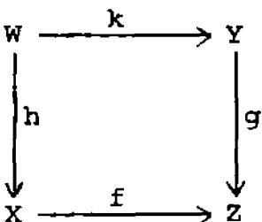

$$h^{z}f^{y} \xrightarrow{\sim} k^{y}g^{z} \tag{III}$$

obtained as above from the isomorphism of [III 6.4].

If we have another Cartesian diagram as shown, with r also a finite morphism, then there is a commutative diagram of isomorphisms

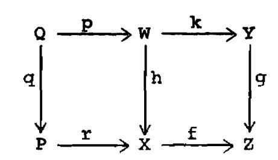

$$\begin{array}{cccccccccccccccccccccccccccccccccccc$$

Also if we have another Cartesian diagram doubling the smooth side of the square, i.e., with r smooth, then there is a similar commutative diagram (iv) involving the isomorphisms (II) and (III). These two compatibilities follow from [III 6.4].

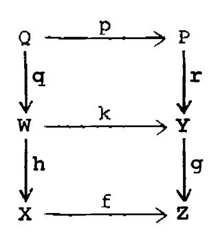

For the residue isomorphism, we suppose that we have a finite morphism f which is factored into pi, with i a closed immersion, and p smooth. Then there is an isomorphism

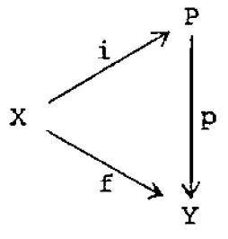

$$f^{Y} \xrightarrow{\sim} i^{Y}p^{Z}$$
 (IV)

obtained as above from that of [III 8.2].

If we have a diagram such as the one shown, with f,g finite, i,k closed immersions, and q,p smooth, then there is a commutative diagram

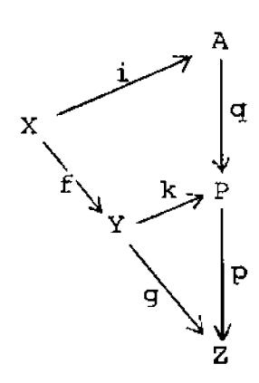

$$(gf)^{Y} \xrightarrow{IV} i^{Y}(pq)^{Z} \xrightarrow{II} i^{Y}q^{Z}p^{Z}$$

$$\downarrow I \qquad \qquad \uparrow IV \qquad (v)$$

$$f^{Y}q^{Y} \xrightarrow{IV} f^{Y}k^{Y}p^{Z} \xrightarrow{I} (kf)^{Y}p^{Z} .$$

This follows from [III 8.6b] applied to the triples (i,q,p) and (f,k,p).

There are also two commutative diagrams expressing compatibility between the square isomorphism (III) and the residue isomorphism (IV).

For the first, suppose one has a diagram as shown with  $Q = Y \times_{Z} P$ , i finite, j,k,£ closed immersions, and f,g smooth. Then there is a commutative diagram

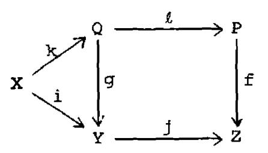

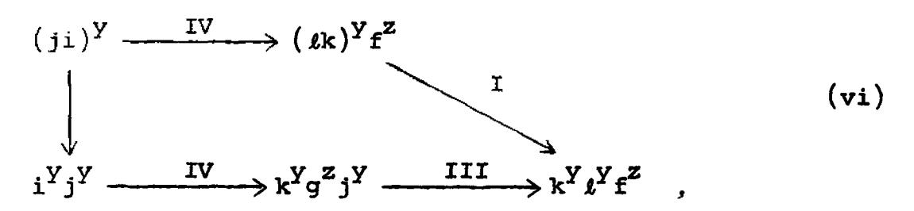

which follows from [III 8.6c].

For the second, suppose there is a Cartesian diagram as shown  $(W = X \times_{Y} Z; Q = P \times_{Y} Z) \text{ with}$  f,g finite, i,j closed immersions, and p,q,u,v,w smooth. Then there is a commutative

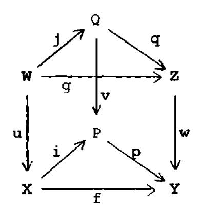

diagram

$$u^{z}f^{y} \xrightarrow{IV} u^{z}i^{y}p^{z} \xrightarrow{III} j^{y}v^{z}p^{z}$$

$$\downarrow III$$

$$g^{y}w^{z} \xrightarrow{IV} j^{y}q^{z}w^{z} \xrightarrow{II} j^{y}(wq)^{z} = j^{y}(pv)^{z}.$$

$$(vii)$$

This follows from [III 8.6a] modified as in [III 6.4].

# §3. f' for residual complexes.

In this section we construct the functor  $f^{i}$  for residual complexes, which we call  $f^{k}$  to avoid confusion. We refer back to the previous section for the notations  $f^{Y}$ ,  $f^{Z}$ , the isomorphisms (I)-(IV), and the compatibilities (i)-(vii).

We will work in the category of <u>locally noetherian</u>

<u>preschemes</u>, and we will consider only morphisms which are

of <u>finite type</u>, and such that the <u>dimensions of the fibres</u>

<u>are bounded</u>. It will be understood in the following that

these conditions hold for all schemes and morphisms considered.

We are now in a position to state our theorem.

Theorem 3.1. There exists a theory of variance consisting of the data a)-d) below subject to the conditions VAR 1 - VAR 5. Furthermore, this theory is unique in the sense that given a second collection of such data a')-d') there is a unique isomorphism of the functors a) and a') compatible with the isomorphisms b)-d) and b')-d').

a) For every morphism  $f: X \longrightarrow Y$ , a functor

$$f^{A}: Res(Y) \longrightarrow Res(X)$$

on the category of residual complexes.

b) For every pair of consecutive morphisms  $f: X \longrightarrow Y$  and  $g: Y \longrightarrow Z$ , an isomorphism

$$c_{f,g}: (gf)^{\Delta} \xrightarrow{\sim} f^{\Delta}g^{\Delta}$$
.

c) For every finite morphism f, an isomorphism

$$\psi_f \colon f^{\Delta} \xrightarrow{\sim} f^{Y}$$
.

d) For every smooth morphism g, an isomorphism

$$\phi_{\mathbf{g}}\colon\ g^{\Delta}\xrightarrow{\hspace*{1cm}\sim\hspace*{1cm}} g^{\mathbf{z}}\quad.$$

VAR 1). For any f, c id, f = c id, and if f,g,h are three consecutive morphisms, then there is a commutative diagram

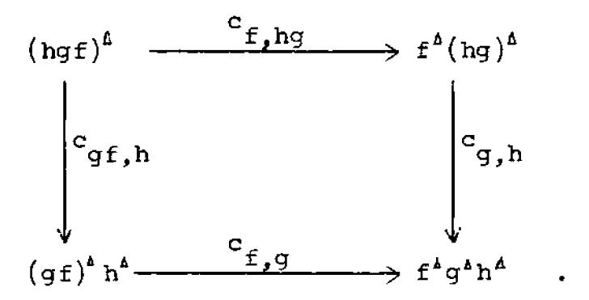

(In other words, the f $^{\Delta}$  and c $_{\rm f,g}$  define a "catégorie clivée normalisée" in the terminology of [SGA 1960-61, VI]).

VAR 2). If f,g are consecutive finite morphisms, then  $c_{f,g}$  is compatible, via  $\psi_f$  and  $\psi_g$ , with the usual isomorphism (I) above.

VAR 3). If f,g are consecutive smooth morphisms, then  $c_{f,g} \mbox{ is compatible, via } \phi_f \mbox{ and } \phi_g, \mbox{ with the usual isomorphism (II) above.}$ 

VAR 4). Given a Cartesian  $\qquad \qquad \qquad \qquad \qquad \qquad \qquad \qquad \qquad \qquad \qquad \qquad \qquad \qquad \qquad \qquad \qquad \qquad \qquad$ 

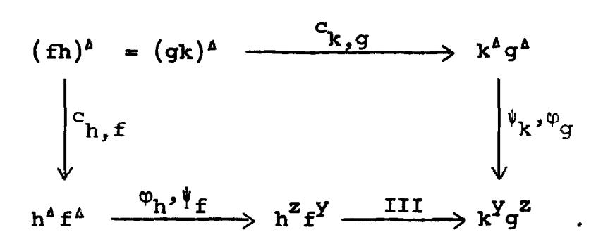

VAR 5). Given a diagram as shown, with i a closed immersion, f finite, and p smooth, we have a commutative diagram

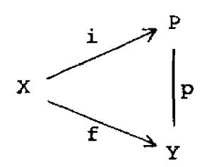

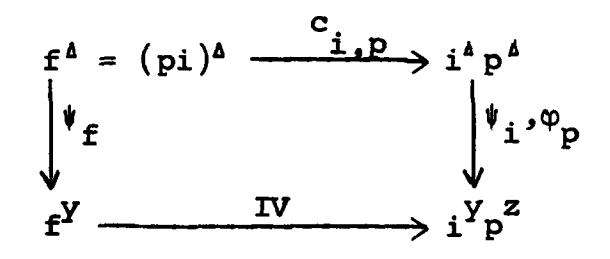

i.e., c is compatible with the residue isomorphism.

The proof of this theorem requires drawing a great many diagrams and checking their commutativity. We will therefore carry out in detail only a few of these verifications, by way of example, and will leave the others to the reader, marking them with the symbol (!) which indicates that he has some work to do at that point. The proof per se will follow after some definitions and lemmas.

Definition. Let  $f: X \longrightarrow Y$  be a fixed morphism, and let  $U \subseteq X$  be an open set. We define a chart on U to be the following collection of data:

- 1) A functor  $f^a$ : Res(Y)  $\longrightarrow$  Res(U).
- 2) A factorization  $f|_{U} = pi$  where i is a closed immersion into a scheme P smooth over Y.

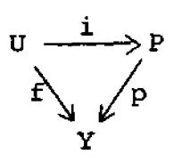

3) An isomorphism

$$\gamma_{i,p}: f^a \xrightarrow{\sim} i^y p^z$$
.

Definition. If  $f^b$ ,  $f|_{U} = jq$ ,  $q: Q \longrightarrow Y$ , and  $\gamma'_{j,q}$  is a second chart on the same open set U, a permissible isomorphism between the two is an isomorphism

$$\alpha: f^a \longrightarrow f^b$$

of functors, such that for every commutative diagram such as the one shown, with k a closed immersion and r,s smooth, there is a commutative diagram of isomorphisms

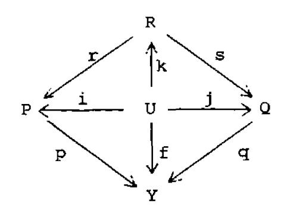

$$f^{a} \xrightarrow{\gamma_{i,p}} i^{y}p^{z} \xrightarrow{IV} k^{y}r^{z}p^{z}$$

$$\downarrow^{\alpha} \qquad \qquad \downarrow^{\gamma_{j,q}} \qquad \downarrow^{y}q^{z} \xrightarrow{IV} k^{y}s^{z}q^{z} \xrightarrow{II} k^{y}(qs)^{z} = k^{y}(pr)^{z}.$$

Lemma 3.2. Given two charts on an open set U, there exists a unique permissible isomorphism between them.

Proof. The uniqueness is clear, because one can take  $R = P \times_{V} Q$  and k the diagonal map ixj. Then the isomorphism a is determined by the condition of the definition.

For the existence, let fa,fb, etc., be two charts as above, and let (R,k,r,s) and  $(S,\ell,\cdots)$  be two diagrams as above. We must show that the isomorphisms  $\,\alpha_{_{{\small \!R}}}^{}\,\,$  and  $\,\alpha_{_{{\small \!S}}}^{}\,\,$  defined by the condition above are the same. By considering the third diagram (RxS, kxl,...) and comparing each to this one, we reduce to the case where S dominates R. In other words, we have a commutative diagram, such as the one shown, with k, & closed immersions and r,s,t smooth morphisms. We must show that the following diagram is

commutative:

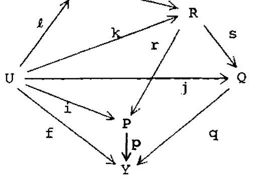

$$f^{a} \xrightarrow{\gamma_{i,p}} i^{y}p^{z} \xrightarrow{IV} k^{y}r^{z}p^{z} \xrightarrow{II} k^{y}(pr)^{z} = k^{y}(qs)^{z} \xleftarrow{II} k^{y}s^{z}q^{z} \xleftarrow{IV} y^{z}q^{z} \xleftarrow{\gamma_{i,q}} f^{b}$$

$$\downarrow^{id} \qquad \qquad \qquad \qquad \qquad \qquad \qquad \qquad \qquad \qquad \qquad \qquad \qquad \qquad \qquad \qquad \qquad \qquad \qquad$$

We will check this one completely by filling in more arrows to make little commutative diagrams. At the left hand end of the diagram we fill in as follows:

$$f^{a} \xrightarrow{\gamma_{i,p}} i^{y}p^{z} \xrightarrow{IV} k^{y}r^{z}p^{z}$$

$$\downarrow id \qquad \downarrow id \qquad \qquad \downarrow^{y}t^{z}r^{z}p^{z}$$

$$\downarrow f^{a} \xrightarrow{\gamma_{i,p}} i^{y}p^{z} \xrightarrow{IV} \ell^{y}(rt)^{z}p^{z}$$

The left-hand square is identically commutative. The right-hand one is commutative by virtue of a special case of compatibility (v) above, where X = Y.

On the right-hand side of our long diagram we fill in two analogous commutative squares. This leaves in the middle the following diagram

$$k^{Y}r^{Z}p^{Z} \xrightarrow{II} k^{Y}(pr)^{Z} = k^{Y}(qs)^{Z} \xleftarrow{II} k^{Y}s^{Z}q^{Z}$$

$$\downarrow^{IV} \downarrow^{IV} \downarrow^{IV} \downarrow^{IU} \downarrow^{IU} \downarrow^{IU}$$

$$\ell^{Y}t^{Z}r^{Z}p^{Z} \xrightarrow{II} \ell^{Y}t^{Z}(pr)^{Z} = \ell^{Y}t^{Z}(qs)^{Z} \xleftarrow{II} \ell^{Y}t^{Z}s^{Z}q^{Z}$$

$$\uparrow^{II} \uparrow^{II} \uparrow^{II} \uparrow^{II} \uparrow^{II}$$

$$\ell^{Y}(rt)^{Z}p^{Z} \xrightarrow{\ell^{Y}(prt)^{Z}} = \ell^{Y}(qst)^{Z} \xleftarrow{II} \ell^{Y}(ts)^{Z}q^{Z}$$

The middle squares are obviously commutative; the upper left and upper right are commutative because the isomorphism IV operates between U and R, and II operates between R and Y, so that the order doesn't matter; and the lower left and lower right are commutative by (ii) above.

q.e.d. lemma.

Lemma 3.3. The composition of permissible isomorphisms is permissible. The inverse of a permissible isomorphism is permissible.

<u>Proof.</u> The inverse is obvious. For the composition, let  $f^a$  and  $f^b$  be two charts as above, and let  $f^c$ ,  $\ell$ , r, R be a third. Using PxQxR to construct the unique permissible isomorphisms of  $f^a$  with  $f^b$ ,  $f^b$  with  $f^a$ , and  $f^a$  with  $f^c$ , we see that the composition of the first two is the third.

<u>Proof of theorem</u>. First we prove the existence of the theory of variance.

a) Construction of the functor  $f^{\Delta}$ . Let  $f: X \longrightarrow Y$  be a morphism. Let  $U = (U_{V})$  be a cover of X by open sets with charts on them. Note that charts exist locally: If  $x \in X$  is a point, let V be a noetherian affine neighborhood of f(x) in Y, and let U be an affine neighborhood of x in  $f^{-1}(V)$ ,

which is of finite type over V. Then U admits a closed immersion i into an affine space  $\mathbf{A}_{\mathbf{V}}^{\mathbf{n}}$  for suitable n. Let  $\mathbf{P} = \mathbf{A}_{\mathbf{V}}^{\mathbf{n}}$ , let  $\mathbf{p} \colon \mathbf{P} \longrightarrow \mathbf{Y}$  be the natural projection, let  $\mathbf{f}^{\mathbf{a}} = \mathbf{i}^{\mathbf{Y}}\mathbf{p}^{\mathbf{Z}}$ , and  $\gamma_{\mathbf{i},\mathbf{p}} = \mathbf{i}\mathbf{d}$ . This gives a chart on U which is a neighborhood of the given point x.

If  $f^a$ , i, P, p,  $\gamma_{i,p}$  is a chart on an open set U, and if  $U' \subseteq U$  is a smaller open set, we define the notion of a restriction (not unique) of the chart to U', as follows: let  $P' \subseteq P$  be an open set whose intersection with i(U) is i(U'). Then we take  $f^a|_{U'}$ ,  $i|_{U'}$ , P',  $p|_{P'}$ ,  $\gamma_{i,p}|_{U'}$  as the restriction of the chart. Note that a restriction of permissible isomorphisms is permissible.

For each pair of indices  $\mu, \nu$ , choose restrictions of the charts on  $U_{\nu}$  and  $U_{\mu}$  to  $U_{\mu\nu} = U_{\nu} \cap U_{\mu}$ , and let  $\alpha_{\mu\nu}$  be the unique permissible isomorphism between them. One sees immediately that the isomorphism of functors

$$\alpha_{\mu\nu} : f^{\nu} \longrightarrow f^{\mu}$$

thus defined on  $U_{\mu\nu}$  is independent of the restrictions of the charts chosen. Furthermore it follows from the lemmas that on a triple intersection  $U_{\mu\nu\lambda}$ , these isomorphisms are

compatible:

$$\alpha_{\mu\nu}^{\alpha}_{\nu\lambda}^{\alpha}_{\lambda\mu} = id.$$

Thus, since we are dealing with functors on residual complexes, we can use Lemma 1.3, and glue the functors  $f^{V}$  via the isomorphisms  $\alpha_{UV}$  to obtain a functor

$$f^{A}: Res(Y) \longrightarrow Res(X)$$

(together with isomorphisms  $\beta_{\nu}: f^{*}|_{U_{\nu}} \longrightarrow f^{\nu}$  for each  $\nu$  compatible with the  $\alpha_{\mu\nu}$ ) which is the one we want.

b) Construction of the isomorphisms  $c_{f,g}$ . Let  $f\colon X\longrightarrow Y$  and  $g\colon Y\longrightarrow Z$  be morphisms. It will be sufficient to construct  $c_{f,g}$  locally, chart by chart, and show that it is compatible with the permissible isomorphisms of change of chart. For then we can glue. Thus we may assume that f and g are embeddable in smooth morphisms, and we may even assume that f is embeddable in an affine space over f, since that is possible locally. Choose embeddings f: f: f: f: f: f: f: f:

upper right square Cartesian. Define  $c_{f,g}$  (depending on the charts chosen, and taking ji:  $X \longrightarrow \mathbb{A}_p^n$  as a chart for gf) as follows:

$$c_{f,g}: (gf)^a \xrightarrow{\gamma_{ji,rq}} (ji)^{\underline{Y}} (rq)^z \xrightarrow{\underline{I},\underline{\Pi}} i^{\underline{Y}} j^{\underline{Y}} q^z r^z \xleftarrow{\underline{\Pi}} i^{\underline{Y}} p^z k^{\underline{Y}} r^z \xleftarrow{\gamma_{i,p}} {}^{\underline{Y}}_{k,r} f^b g^c.$$

Now we must show that  $c_{f,g}$  is compatible with the permissible isomorphisms of change of chart for f and g. It is sufficient to vary one at a time. Furthermore, if  $k' \colon Y \longrightarrow Q$  is another chart for g, by considering the third chart  $k'' = k \times k' \colon Y \longrightarrow P \times_Z Q$ , we reduce to the case where Q dominates P. So we have a diagram such as the one shown, and we must show that the two  $c_{f,g}$  are compatible, i.e., that the following diagram is

commutative:

$$\begin{array}{cccccccccccccccccccccccccccccccccccc$$

One may verify this (!) using the definition of a permissible isomorphism, and the compatibilities ii, v, and vii above.

Similarly we must consider a change of the chart on X to another, say i':  $X \longrightarrow A_Y^m$ , and as before we may assume that i' dominates i. This involves checking another analogous commutative diagram of isomorphisms, which we leave to the reader (!).

c) Construction of the isomorphism  $\psi_f$  for a finite morphism f. Let  $f\colon X\longrightarrow Y$  be a finite morphism. As before, it will be sufficient to construct the isomorphism  $\psi_f$  locally on charts, provided our definition is compatible with permissible isomorphisms of charts. So let  $X \xrightarrow{i} P$  i:  $X \longrightarrow P$  be a chart for f, and f define

$$\psi_f\colon \ f^a \ \xrightarrow{\gamma_i,p} i^Y p^z \xleftarrow{IV} f^Y \ .$$

If  $j: X \longrightarrow Q$  is another chart, one may assume as usual that j dominates i, and one checks (!) using compatibility (v) above that  $\psi_f$  is compatible.

d) For a smooth morphism g: X  $\longrightarrow$  Y we must construct the isomorphism  $\phi_g$ . Take g as its own chart, and take  $\phi_g = \gamma$ . There is no choice involved, hence nothing to check.

Having constructed the data a) - d), we must verify the conditions VAR 1 - VAR 5.

VAR 1). Given three morphisms f,g,h, we use a diagram such as the one shown to calculate cf,g, etc., on the charts. The

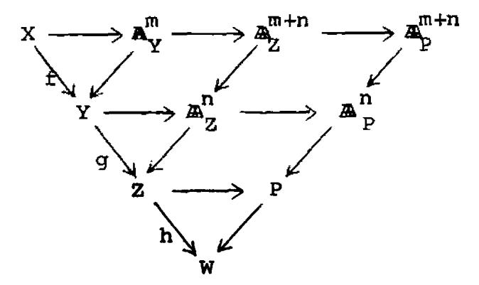

diagram of the condition becomes

a large diagram whose commutative one checks (!) using (iii) and (iv) above.

VAR 2). If f and g are consecutive finite morphisms, one checks (!) that  $c_{f,g}$  is compatible with (I) via the isomorphisms  $\psi_f$  and  $\psi_g$ , by using (v) and (vi) above.

VAR 3). Trivial. One has only to observe that the isomorphism (III) is the identity if one side of the square is the identity.

VAR 4) and VAR 5) follow (!) from the definitions and a few more commutative diagrams.

This completes the proof of existence of the theory of variance, and we now show its uniqueness. For that purpose, suppose that  $\{f^{\Delta}, c^{\Delta}_{f,g}, \psi^{\Delta}_{f}, \phi^{\Delta}_{g}\}$  and  $\{f^{X}, c^{X}_{f,g}, \psi^{X}_{f}, \phi^{X}_{g}\}$  are two sets of data a)-d), each satisfying the conditions VAR 1 - VAR 5 (which we will call VAR  $\mathbf{1}^{\Delta}$ , VAR  $\mathbf{1}^{X}$ , etc., to be precise). We will construct an isomorphism  $\delta \colon f^{\Delta} \longrightarrow f^{X}$ , compatible with the data b)-d) and b')-d'), and we will observe that  $\delta$  is unique.

Let  $f: X \longrightarrow Y$  be a morphism of finite type, and choose locally an embedding  $i: X \longrightarrow P$  into a scheme smooth over Y. Define  $\delta$  by

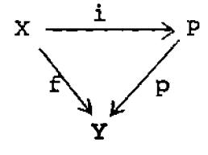

$$\delta: f^{\Delta} \xrightarrow{c_{\underline{i},p}^{\Delta}} i^{\Delta} p^{\Delta} \xrightarrow{\psi_{\underline{i}}^{\Delta}, \phi_{\underline{p}}^{\Delta}} i^{Y} p^{Z} \xleftarrow{\psi_{\underline{i}}^{X}, \phi_{\underline{p}}^{X}} i^{X} p^{X} \xleftarrow{c_{\underline{i},p}^{X}} f^{X}.$$

(Note that in order to be compatible with the  $c_{i,p}$ ,  $\psi_i$ ,  $\phi_p$ , we must choose  $\delta$  this way, which proves the uniqueness of  $\delta$ .)

To see that  $\delta$  is independent of the embedding chosen, let  $j: X \longrightarrow Q$  be another one. Replacing Q by PXQ as usual we reduce to the case Q dominates P, and have a diagram such as the one shown. We must check that the perimeter of the following diagram is commutative:

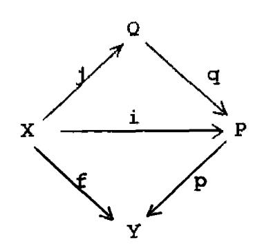

$$f^{\Delta} \xrightarrow{c_{i,p}^{\Delta}} j^{\Delta} p^{\Delta} \xrightarrow{\psi_{i}^{\Delta}, \phi_{p}^{\Delta}} i^{Y}p^{Z} \xleftarrow{\psi_{i}^{X}, \phi_{p}^{X}} i^{X}p^{X} \xleftarrow{c_{i,p}^{X}} f^{X}$$

$$\downarrow VAR 1^{\Delta} \downarrow c_{j,q}^{\Delta} \xrightarrow{\psi_{j}^{\Delta}, \phi_{p}^{\Delta}, \phi_{p}^{\Delta}} \downarrow IV$$

$$\downarrow id \qquad \qquad \downarrow^{\Delta} q^{\Delta}p^{\Delta} \xrightarrow{\psi_{j}^{\Delta}, \phi_{p}^{\Delta}, \phi_{p}^{\Delta}} j^{Y}q^{Z}p^{Z}$$

$$\downarrow c_{p,q}^{\Delta} \xrightarrow{VAR 3^{\Delta}} \uparrow II$$

$$\downarrow f^{\Delta} \xrightarrow{c_{j,pq}^{\Delta}} j^{\Delta}(pq)^{\Delta} \xrightarrow{\psi_{j}^{\Delta}, \phi_{pq}^{\Delta}} j^{Y}(pq)^{Z} \xleftarrow{\psi_{j}^{X}, \phi_{pq}^{X}} j^{X}(pq)^{X} \xleftarrow{c_{j,pq}^{X}} f^{X}$$

That in fact it is, is shown by chopping it into little squares, which are commutative for the reasons shown. On the right we use VAR  $1^{\times}$ , VAR  $3^{\times}$ , and VAR  $5^{\times}$  similarly.

Thus  $\delta$  is well-defined locally. Now cover X by open sets U for which this is possible, and glue together the local isomorphisms

$$\delta_{v} \colon (f_{j_{v}})^{\Delta} \xrightarrow{\sim} (f_{j_{v}})^{x}$$

where  $j_{\nu}: U_{\nu} \longrightarrow X$  is the open immersion. Since  $j_{\nu}^{\Delta}$  is isomorphic via  $\phi_{j_{\nu}}^{\Delta}$  with  $j_{\nu}^{Z}$  which is the restriction, we can glue the  $\delta_{\nu}$  once we have checked (!) that the isomorphisms are compatible with restriction. Thus

$$\delta: f^{\Delta} \xrightarrow{\sim} f^{X}$$

is defined.

Now we must check that  $\delta$  is compatible with the isomorphisms  $c_{f,g}$ ,  $\psi_f$ ,  $\phi_g$ . This can be done locally using the conditions VAR 1 - VAR 5, and we leave the details to the reader (!).

<u>Proposition 3.4.</u> Let  $f: X \longrightarrow Y$  be a morphism (with the conventions above) and let  $K^*$  be a residual complex on Y.

Let d denote the codimension function on X (resp. Y) associated with the pointwise dualizing complex  $f^AK^*$  (resp.  $K^*$ ). Then for each  $x \in X$ , if y = f(x), we have

$$d(x) = d(y) + tr.d. k(x)/k(y).$$

<u>Proof.</u> The question is local, and compatible with composition of morphisms. Thus we reduce to the case f finite (trivial) or f smooth (which is [V 8.4]).

Corollary 3.5. Let  $f: X \longrightarrow Y$  be a morphism (with the conventions above: f is of finite type, and the dimensions of its fibres are bounded). Then if Y admits a residual complex (resp. dualizing complex) so does X.

<u>Proof.</u> The existence of a residual complex on X, given one on Y, follows from the theorem. If Y admits a dualizing complex R', then the associated codimension function d on Y is bounded. By the proposition, the codimension function associated to  $Qf^{\Delta}E(R^{*})$  is also bounded. But  $Qf^{\Delta}E(R^{*})$  is pointwise dualizing, hence dualizing (cf. proof of [V 8.2]).

# §4. Trace for Residual Complexes.

In this section we define the trace map for residual complexes. For a morphism  $f\colon X\longrightarrow Y$  (with the conventions of the previous section) it is a map of graded sheaves

$$Tr_f: f_*f^{\Delta}K^* \longrightarrow K^*$$

where K' is a residual complex on Y. It will be a morphism of complexes only if f is proper (see the Residue Theorem in the next chapter, which generalizes the classical theorem that the sum of the residues of a differential on a curve is zero).

First we define the trace map for a finite morphism, by carrying over the map of [III.6.5] to residual complexes. Let  $f: X \longrightarrow Y$  be a finite morphism. We will denote by f' the functor

$$\overline{\mathbf{f}}^{*}\underline{\mathbf{Hom}}_{\mathbf{f}_{\mathbf{Y}}}(\mathbf{f}_{*}\mathbf{f}_{\mathbf{X}},\cdot)$$

(using the notation of [III §6]) so that  $f^{\flat} = Rf'$ .

Lemma 4.1. Let  $f: X \longrightarrow Y$  be a finite morphism, and let  $K^*$  be a residual complex on Y. Then  $f'(K^*)$  is a residual complex on X, and  $f_*f'(K^*)$  is a Cousin complex

on Y, with respect to the filtration Z associated with  $Q(K^*)$  (cf. [IV §3]).

<u>Proof.</u> It is clear that f' takes quasi-coherent injectives on Y to quasi-coherent injectives on X, and it is also clear that f'(K') has coherent cohomology, so we have only to check that it is isomorphic to a sum of sheaves of the form J(x). Indeed, it will be sufficient to show, for each  $y \in Y$ , that

$$f'(J(y)) \cong \sum_{x \to y} J(x)$$
.

Letting A be the local ring of y on Y, and B the semilocal ring of the points x of X lying over y, we have a local homomorphism  $A \longrightarrow B$  where B is a finite A-module. If k is the residue field of A, and I is an injective hull of k over A, we must show that  $J = \operatorname{Hom}_A(B,I)$  is a direct sum  $\sum_{i=1}^r I_i$  where  $k_1, \dots, k_r$  are the residue fields of B, and  $I_i$  is an injective hull of  $k_i$  over B. For any B-module of finite type M, we have isomorphisms

$$\operatorname{Hom}_{\mathbf{R}}(\mathbf{M},\mathbf{J}) = \operatorname{Hom}_{\mathbf{R}}(\mathbf{M}, \operatorname{Hom}_{\mathbf{A}}(\mathbf{B},\mathbf{I})) \cong \operatorname{Hom}_{\mathbf{A}}(\mathbf{M},\mathbf{I})$$
.

Now J is injective, and has support at the closed points of Spec B. Hence it is a direct sum of some number of copies of the injectives Ii. To find out how many, we have only to calculate

$$\operatorname{Hom}_{B}(k_{i},J) \cong \operatorname{Hom}_{A}(k_{i},I) \cong k_{i}$$

which is true since  $k_i$  is an A-module of finite length, and I is dualizing. Hence each  $I_i$  occurs just once.

Now  $f_*f'(K^*)$  is a direct sum, for each  $y \in Y$ , of

$$\sum_{\mathbf{x} \to \mathbf{y}} \mathbf{f}_{\mathbf{x}} \mathbf{J}(\mathbf{x})$$

which is a constant sheaf spread out on  $\{y\}^-$ , and which occurs in degree p = d(y), where d is the associated codimension function. Hence  $f_*f'(K^*)$  is a Cousin complex with respect to the filtration  $Z^*$  associated with  $Q(K^*)$ .

q.e.d.

Now we are in a position to define the trace map for the finite morphism f, which we will call  $\rho_{\mathbf{f}}$  to avoid confusion:

$$\rho_{f} \colon f_{*}f^{Y}(K^{\bullet}) \longrightarrow K^{\bullet}$$
.

Let K' be a residual complex on Y. Since it is an injective complex, the natural map

$$\xi_{f}$$
:  $Qf'(K^*) \longrightarrow f^{\flat}Q(K^*)$ 

of the functor f' into its derived functor  $f^{\flat}$  is an isomorphism in  $D^{+}(X)$  [I.5.1]. Hence also

$$E\xi_{f'}: f'(K^*) = EQf'(K^*) \longrightarrow Ef^{\flat}Q(K^*) = f^{\flat}(K^*)$$

is an isomorphism of residual complexes (recall EQ  $\cong$  1 for any Cousin complex).

Consider the map

$$Qf_{*}f'(K^{*}) \xrightarrow{\xi_{f_{*}}} Rf_{*}Qf'(K^{*}) \xrightarrow{\xi_{f'}} Rf_{*}f^{\flat}Q(K^{*}) \xrightarrow{Trf_{f}} Q(K^{*}),$$

where the last map, Trff, is the trace of [III 6.5]. By the lemma above, f\*f'(K') is a Cousin complex with respect to the filtration Z', and K' is an injective Cousin complex, so by [III 3.2], this map in the derived category is represented by a unique map of complexes

$$f_*f'(K^*) \longrightarrow K^*$$
.

Composing with the inverse of the isomorphism  $\mathsf{E}\xi_{\mathbf{f}}$ , above,

we obtain the desired map

$$\rho_{\mathtt{f}} \colon \ \mathtt{f}_{\mathtt{*}} \mathtt{f}^{\mathtt{Y}} (\mathtt{K}^{\scriptscriptstyle \bullet}) \xrightarrow{} \mathtt{K}^{\scriptscriptstyle \bullet} \ .$$

If  $f: X \longrightarrow Y$ , and  $g: Y \longrightarrow Z$  are two finite morphisms, then there is a commutative diagram

$$(gf)_*(gf)^Y \xrightarrow{\rho_{gf}} 1$$

$$\begin{vmatrix} I & & & & & & \\ & I & & & & & \\ & & & &$$

which follows from [III 6.6] and the functoriality of the above construction.

Remark. We have given the above definition in some detail to establish its relation with the trace map defined for the derived category in Chapter III. One could of course define  $\rho_f$  much more quickly by the usual "evaluation at one" map, without passing to the derived category, but we need the functorial properties below.

Theorem 4.2. As above, we work in the category of locally noetherian preschemes, and morphisms of finite type

such that the dimension of the fibres is bounded. There exists a unique theory of trace, consisting of the data a) below, subject to the conditions TRA 1 and TRA 2.

a) For each morphism  $f: X \longrightarrow Y$ , a morphism  $Tr_{f}: f_{*}f^{A} \longrightarrow 1$ 

of functors from Res(Y) to the category of graded sheaves of  $\mathscr{O}_{Y}$ -modules (where 1 denotes the forgetful functor: consider a residual complex  $K_{Y}^{\bullet}$  simply as a graded  $\mathscr{O}_{Y}$ -module).

TRA 1). If f and g are two consecutive morphisms of finite type, then there is a commutative diagram

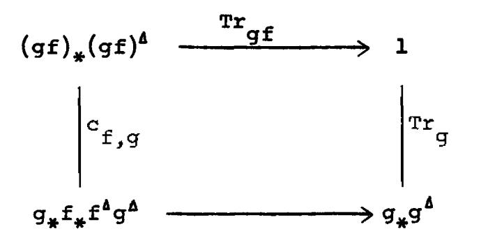

TRA 2). If f is a finite morphism, then  ${\rm Tr}_{\bf f}$  is the one we already know, i.e.,  ${\rm Tr}_{\bf f} = \rho_{\bf f} \psi_{\bf f}$ , using the notation of Theorem 3.1.

Lemma 4.3. [EGA IV §?] Let  $f: X \longrightarrow Y$  be a morphism of finite type, let  $x \in X$  be a point which is closed in its fibre, and let Z be the closure of x in X, with the reduced induced structure. Then there is an open neighborhood V of y = f(x) such that  $Z \cap f^{-1}(V)$  is finite over V.

Proof. Replacing X by Z and Y by f(Z) with the reduced induced strucutre, we reduce to the case where X and Y are integral schemes, x is the generic point of X, and f is dominant. Since furthermore the question is local on X and Y, we may assume X and Y are affine, and thus we reduce to the following statement in algebra:

Let  $A \longrightarrow B$  be an inclusion of integral domains, with B a finitely generated A-algebra. Let K be the quotient field of A, and assume that  $B \otimes_A K$  is a finite extension field of K. Then there exists an element  $f \neq 0$  in A such that  $B \otimes_A A_f$  is a finite  $A_f$ -module.

To prove this statement, let  $b_1, \dots, b_n$  be a finite set of elements in B such that

- 1) the b; generate B as an A-algebra, and
- 2) the elements b @1 generate B@K as a K-vector space.

Then for each i,j,  $b_i b_j \otimes 1 \in B \otimes K$ , so we can write

$$b_i b_j \otimes 1 = \sum_{k=1}^n b_k \otimes \lambda_{ijk}$$
,  $\lambda_{ijk} \in K$ .

Let f be a common denominator for all the  $\lambda_{ijk}$ ,  $1 \leq i,j,k \leq n$ . Then the  $\lambda_{ijk}$  are all in  $A_f$ , so the  $A_f$ -module  $B_o$  generated by the  $b_i \otimes l$  is in fact a ring. But  $B_o$  contains a set of generators for  $B \otimes A_f$  as an  $A_f$ -algebra, so  $B_o = B \otimes A_f$ , which shows that the latter is a finitely generated  $A_f$ -module. q.e.d.

Lemma 4.4. Let  $f: X \longrightarrow Y$  be a morphism, and let  $K^*$  be a residual complex on Y. Then there is a unique map

$$Tr_f: f_*f^{A}K^{\bullet} \longrightarrow K^{\bullet}$$

of graded sheaves on Y, such that whenever U is an open subset of Y, and W is a closed subscheme of  $f^{-1}(U)$ , finite over U, we have a commutative diagram

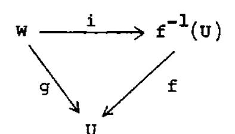

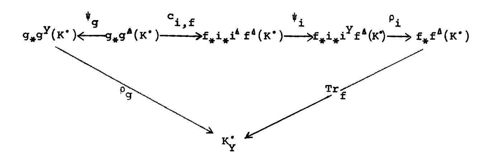

(Here we denote by f the restriction of f to  $f^{-1}(U)$ , by K' the restriction of K' to V, and so forth.)

<u>Proof.</u> Let d denote the codimension function on Y associated with the residual complex  $K^{\bullet}$ , and let it also denote the codimension function on X associated with the residual complex  $f^{\Delta}K^{\bullet}$  (the one we mean will always be clear from the context). Then according to the definition of the residual complexes we have isomorphisms

$$\kappa^{p} \cong \sum_{d(y)=p} J(y)$$

and

$$(f^{A}K^{\bullet})^{p} \cong \sum_{d(x)=p} J(x)$$
.

We will denote by J(y) (resp. J(x)) the unique subsheaf of  $K^p$ 

(resp.  $f^{\Delta}(K^{\bullet})^{p}$ ) which is isomorphic to an injective hull of k(y) (resp. k(x)), so as to make these isomorphisms canonical.

I claim that to give a map of graded  $\sigma_{\mathbf{v}}$ -modules

$$Tr_f: f_*f^{\Delta}K^{\bullet} \longrightarrow K^{\bullet}$$

is equivalent to giving, for each  $x \in X$  which is closed in its fibre, a map

$$Tr_{f,x}: f_{*}J(x) \longrightarrow J(y)$$

where y = f(x). Indeed, x is closed in its fibre if and only if tr.d. k(x)/k(y) = 0, i.e., if and only if d(x) = d(y), by Proposition 3.4 above. Hence  $Tr_f$  certainly gives rise to a collection of maps  $Tr_{f,x}$  as above. On the other hand, if  $y' \in Y$  is a point not equal to y, with d(y') = d(x), then there is no non-zero map of  $f_*J(x)$  into J(y'), because  $d(y') \geq d(y)$  by Proposition 3.4, and so  $y' \notin \{y\}^-$ . (Note that  $f_*J(x)$  has support in  $\{y\}^-$ ). Thus  $Tr_f$  is determined by the maps  $Tr_{f,x}$  above, and these can be given arbitrarily.

We will now construct maps  $Tr_{f,x}$  as above for each point  $x \in X$  which is closed in its fibre.

Given an  $x \in X$  closed in its fibre, choose by Lemma 4.3 an open neighborhood V of y = f(x) such that  $Z = \{x\}^{-} \cap f^{-1}(V)$ is finite over V. Let I be the ideal of Z with the reduced induced structure,

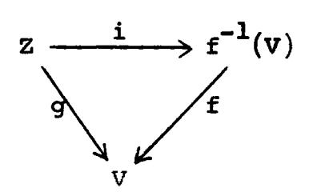

and let  $Z_n$ ,  $n = 1,2,\dots$ , be the subscheme of X defined by

In. For n < n' we have a closed immersion  $j_{nn'}: Z_n \longrightarrow Z_{n'}$ , and one can verify (!) using VAR 1, VAR 2, and (viii) above, that the following diagram is commutative:

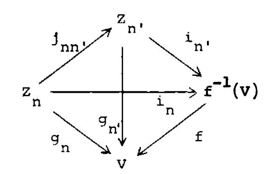

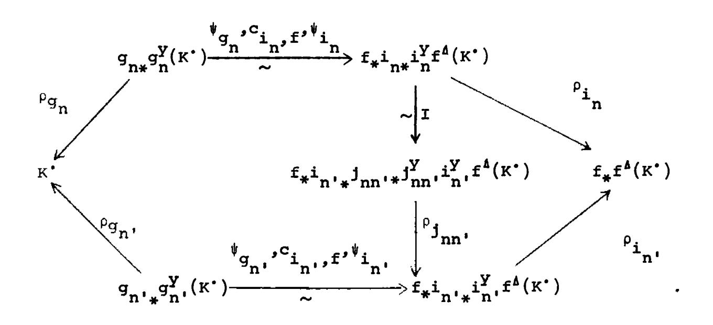

One can also write down another diagram with three indices n, n' and n'' which shows that the sheaves  $f_*i_{n*}i_n^Yf^A(K^*)$  and the maps  $\rho_{j_{nn}}$ , I form a direct system as n varies, and this diagram shows that the  $\rho_{i_n}$  map this direct system into  $f_*f^A(K_Y^*)$  and the  $\rho_{g_n}{}^{\psi}g_n{}^{c}i_n$ ,  $f^{\psi}i_n$  map it to  $K^*$ . Furthermore the  $\rho_{i_n}$  are all injective maps. Thus we can pass to the limit and obtain a map of a certain subsheaf of  $f_*f^A(K_Y^*)$  to  $K_Y^*$ . Looking at the effect of this construction on the component  $f_*J(x)$  of  $f_*f^AK^*$ , we see that the  $n^{th}$  term of the direct system, via the inclusion  $\rho_{i_n}$ , is just  $f_*\underline{Hom}_{X}(\mathcal{O}_X/I^n, J(x))$ , and hence the limit is  $f_*J(x)$  itself, since J(x) has support on Z. Hence the map we obtain is defined on all of  $f_*J(x)$ , and we decree this to be  $Tr_{f_*X^*}$ .

To complete the proof of the lemma, we must check various things. First, that  $\mathrm{Tr}_{\mathrm{f},\mathrm{x}}$  is well-defined, i.e., does not depend on the choice of the open set V. That is clear, since  $\mathrm{Tr}_{\mathrm{f},\mathrm{x}}$  depends only on the stalks at x and y, and all of our constructions are compatible with localization.

Second, we must check the property of the lemma. So let W and U be as in the statement. It will be sufficient to check the diagram on the component of x for each  $x \in W$ . Let Z be the closure of x, with the reduced induced structure (which

will be finite over U). Let J be the ideal of Z in W, and for each  $n=1,2,\ldots,$  let  $Z_n'$  be the subscheme of W defined by  $J^n$ . Let  $Z_n$  be as above. Then there are closed immersions as shown. We leave to the reader (!) to write down a huge commutative diagram of  $Z_n$ 's which in the limit

Third we must check the uniqueness, but this is clear from the construction.

gives the diagram of the lemma on the component of x.

Proof of theorem. For a morphism  $f\colon X\longrightarrow Y$ , we define  $\operatorname{Tr}_f$  to be the map given by the lemma. It is clearly functorial in  $K^*$ . In case f is a finite morphism, we can take U=Y and W=X, so that  $\operatorname{Tr}_f=\rho_f\psi_f$ , which proves condition TRA 2.

To prove TRA 1, let  $f: X \longrightarrow Y$  and  $g: Y \longrightarrow Z$  be two morphisms. It is sufficient to prove the condition of TRA 1 for a single residual complex K' on X and for a single  $x \in X$  which is

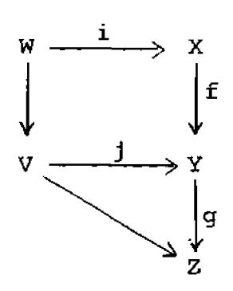

closed in its fibre over Z. The question is local, so we may assume that  $W = \{x\}^T$  is finite over Z, and that  $V = \{y\}^T$ ,

where y = f(x), is finite over Z. Finally it is sufficient to check the commutativity for a given element  $a \in \Gamma(J(x))$ . We choose a subscheme structure  $W_n$  on W with n large enough so that a is in the image of  $i^Y J(x)$ . Now one can check (!) the required commutativity using the property of the lemma, and (viii), VAR 1, and VAR 2 above.

The uniqueness of  $\mathrm{Tr}_{\mathrm{f}}$  is clear, as it was in the lemma, since TRA 1 and TRA 2 imply the condition of the lemma.

q.e.d.

## §5. Behavior with respect to certain base changes.

In this section we show that the functor  $f^{\Delta}$  and the morphism  $\mathrm{Tr}_{f}$  are compatible with certain base changes which take residual complexes into residual complexes.

<u>Definition</u>. A morphism  $f: X \longrightarrow Y$  of locally noetherian preschemes is residually stable if

- a) f is flat
- b) f is integral [EGA II 6.1.1], and
- c) the fibres of f are Gorenstein preschemes [v §9].

Examples. 1. An open immersion is residually stable.

- 2. A composition of residually stable morphisms is residually stable (use [V 9.6]).
- 3. If X and Y are the spectra of fields  $k \subseteq K$ , then f is residually stable if and only if K is algebraic over k.
- 4. If  $f: X \longrightarrow Y$  is residually stable, then every point  $x \in X$  is closed in its fibre, since f is integral. Thus the fibres are zero-dimensional Gorenstein preschemes.

<u>Proposition 5.1.</u> If  $f: X \longrightarrow Y$  is a residually stable morphism, and if  $u: Y' \longrightarrow Y$  is a morphism of finite type, then  $g: X' = X \times_Y Y' \longrightarrow Y'$  is also residually stable.

<u>Proof.</u> Clearly g is flat and integral. To show that the fibres of g are Gorenstein, let  $y' \in Y$ , let y = u(y'), and consider the map of fibres  $v: X'_{y'} \longrightarrow X_{y'}$ . Now  $X_{y'}$  is Gorenstein since f is residually stable. The fibres of v are tensor products of fields, one of which is finitely generated (namely k(y')/k(y)), hence Gorenstein [V 9.5]. Hence  $X'_{v'}$  is Gorenstein [V 9.6].

Lemma 5.2. Let A be a noetherian local ring, and let I be an A-module. Then I is an injective hull of the residue field k of A if and only if

- a) I has support at the closed point of Spec A,
- b)  $Hom_{A}(k,I) \cong k$ , and
- c) There is a sequence of ideals  $\alpha_1 \supseteq \alpha_2 \supseteq \ldots$  of A which form a base for the  $\alpha$ -adic topology, such that for all n, length  $(A/\alpha_n) = \text{length } (Hom_A(A/\alpha_n, I))$ .

Proof. If I is an injective hull of k, then a),b),c) are immediate, since  $\operatorname{Hom}_{\lambda}(\cdot,I)$  is a dualizing functor for

modules of finite length. In fact, c) holds for any ideal which is primary for AM.

Conversely, let I be an A-module satisfying a),b),c), and let J be an injective hull of k. By b), we can find an injection  $k \subseteq I$ , and since J is injective, the natural map  $\theta \colon k \longrightarrow J$  extends to a map  $\psi \colon I \longrightarrow J$ . I claim  $\psi$  is injective. Indeed, given  $y \in I$ ,  $y \neq 0$ , we have  $m^n y = 0$  for sufficiently large n, by a). Let n be the least such integer. Then there is an  $x \in m^{n-1}$  for which  $xy \neq 0$ . But m(xy) = 0, so  $xy \in k$ . Hence  $\psi(xy) = \theta(xy) \neq 0$ . But  $\psi(xy) = x \cdot \psi(y)$ , so  $\psi(y) \neq 0$ , and  $\psi$  is injective.

Now choose a sequence of ideals  $a_1 \supseteq a_2 \supseteq \ldots$  as in c). Then we note that

$$\psi(\operatorname{Hom}(A/\alpha_n,I)) \subseteq \operatorname{Hom}(A/\alpha_n,J)$$
,

and both have the same length, namely the length of  $A/\alpha_n$ . Therefore they are equal. But I and J are the union of the submodules of elements annihilated by  $\alpha_n$ , so we see that  $\psi$  is also surjective. Thus I is isomorphic to J, and so is an injective hull of k.

<u>Proposition 5.3.</u> Let  $f: X \longrightarrow Y$  be a residually stable morphism, and let K' be a residual complex on Y. Then  $f^*(K')$  is a residual complex on X.

<u>Proof.</u> Clearly  $f^*(K^*)$  is a complex of quasi-coherent sheaves with coherent cohomology. We have only to check that there is an isomorphism

$$\sum_{\mathbf{p}} \mathbf{f}^*(\mathbf{K}^{\mathbf{p}}) \cong \sum_{\mathbf{x} \in \mathbf{X}} \mathbf{J}(\mathbf{x}).$$

Thus we reduce to the following local statement: For each  $x \in X$ , let y = f(x), and let I be an injective hull of k = k(y) over the local ring  $A = \mathcal{O}_{Y}$  of y. Let  $B = \mathcal{O}_{X}$  be the local ring of x. Then I  $\otimes_{A}$  B is an injective hull of k' = k(x) over B.

We apply the criteria of the lemma above. Since I is an injective hull of k over A, we have

- a) I has support at the closed point of Spec A
- b)  $Hom_{A}(k,I) \cong k$

where we is the maximal ideal of A.

c) For each n,  $length (A/M^n) = length (Hom_A(A/M^n, I)),$ 

Now since x is closed in its fibre,  $I \otimes_A B$  has support at the closed point of Spec B. Since B is flat over A, we have

$$\operatorname{Hom}_{\mathbf{B}}(\mathbf{B}/\mathbf{m}\mathbf{B}, \mathbf{I}\otimes_{\mathbf{A}}\mathbf{B}) \cong \mathbf{B}/\mathbf{m}\mathbf{B}.$$

Therefore

$$\operatorname{Hom}_{\mathbf{B}}(\mathbf{k}', \mathbf{I} \otimes_{\mathbf{A}} \mathbf{B}) \cong \operatorname{Hom}_{\mathbf{B}}(\mathbf{k}', \mathbf{B}/\mathbf{m} \mathbf{B}) \cong \mathbf{k}',$$

since B/wB is an Artinian Gorenstein ring. Finally note that for each n.

length 
$$(B/w^nB) = length (Hom_B(B/w^nB, I\otimes_A^B)).$$

Thus the conditions of the lemma are fulfilled, and  $I\otimes_A^B$  is an injective hull of k' over B.

Proposition 5.4. Let Y be the spectrum of a local Artin ring A. Then one can find a residually stable morphism u: Y' -> Y where Y' is the spectrum of a local Artin ring A' with algebraically closed residue field.

<u>Proof.</u> By [EGA  $O_{III}$  10.3.1] one can find a local Artin ring A' and a local homomorphism  $A \longrightarrow A'$  such that A' is flat over A, AA' = AA', and AA' = AA' and AA' = AA' is flat over Y. Then Y' = Spec A' will do. Indeed, Y' is flat over Y. It is integral since it is Artinian, and its residue field is algebraic over that of Y. The only fibre is a field, which is Gorenstein.

Now we come to the behavior of f and Tr under residually stable base change.  $f: X \longrightarrow Y$  be a morphism of finite type, and let  $u: Y' \longrightarrow Y$  be a residually stable morphism. Let  $X' = X \times_{V} Y'$ , and let u', f' be as shown.

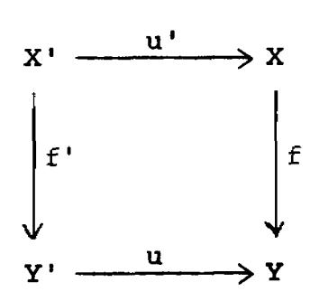

If f is a finite morphism, there is a natural isomorphism

$$f'^{Y}u^{*} \xrightarrow{\sim} u'^{*}f^{Y} \tag{V}$$

derived from [III 6.3] (cf. section 2 above).

On the other hand if f is smooth, there is a natural isomorphism

$$f'^{z}u^{*} \xrightarrow{\sim} u'^{*}f^{z}$$
 (VI)

derived from [III 2.1].

Theorem 5.5. For every morphism  $f: X \longrightarrow Y$  of finite type, and every residually stable morphism u: Y' -> Y (using the notations above) there is an isomorphism

$$d_{u,f}: f^{i\delta}u^* \xrightarrow{\sim} u^{i*}f^{\delta}$$

such that

- 1) If  $v: Y'' \longrightarrow Y'$  is another residually stable morphism, then  $d_{uv,f} = d_{u,f} v_{v,f}$ .
- 2) If f,g are two consecutive morphisms of finite type, then the isomorphisms d are compatible with  $c_{f,g}$  and  $c_{f',g'}$ .
- 3) If f is a finite morphism, then  $d_{u,f}$  is compatible with V via the isomorphisms  $\psi_f, \psi_f$ .
- 4) If f is a smooth morphism, then d u,f is compatible with VI via the isomorphisms  $\phi_f,\phi_f$  .

Suggestion of Proof (!). Show first that V and VI are compatible with the isomorphisms I,II,III and IV of §2. Define  $d_{u,f}$  for f finite or smooth using 3) and 4). Then define  $d_{u,f}$  for arbitrary f and check its properties, following the construction of  $f^{\Delta}$  given in §3.

Theorem 5.6. Let u and f be as in the previous theorem. Then there is a commutative diagram

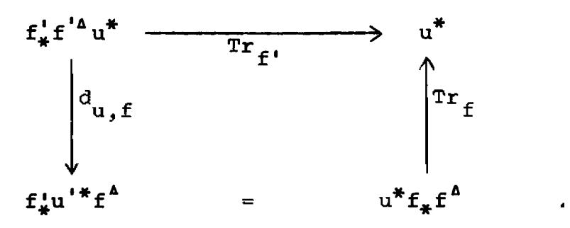

Proof (!). Show first that the analogous diagram of  $f^Y$ ,  $\rho_f$  and V is valid for f finite. Then follow the construction of  $\mathrm{Tr}_f$  in  $\S 4$  to show that it is true in general.

#### CHAPTER VII. THE DUALITY THEOREM

### \$1. Curves over an Artin ring.

In this section we will make explicit the residual complex on a curve over the spectrum of an Artin ring, and we will identify the trace map of [VI §4] with the "classical" residue of a differential. Then, in the case of the projective line over an Artin ring with algebraically closed residue field, we will prove that the sum of the residues is zero, i.e., the trace map is a morphism of complexes. This special case will be used in the following section to prove the general residue theorem for a proper morphism of locally noetherian preschemes, which in turn implies that the sum of the residues is zero on any proper curve.

Throughout this section we will let Y be the spectrum of a local Artin ring A with residue field k, and we let X be a smooth curve over Y (i.e., a connected irreducible prescheme smooth over Y, with relative dimension one). A closed point  $x \in X$  is rational over Y if its residue field k(x) is k. In that case one can find a local parameter  $t \in \mathcal{O}_X$  with the following properties: