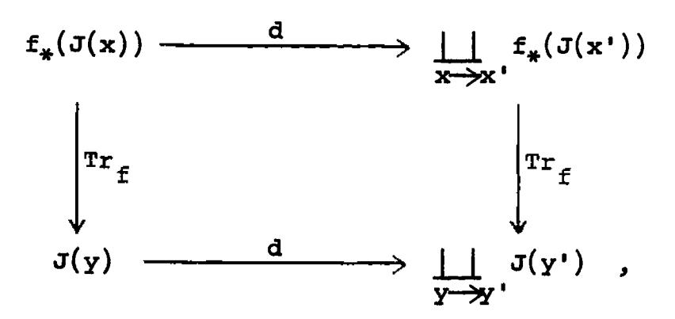
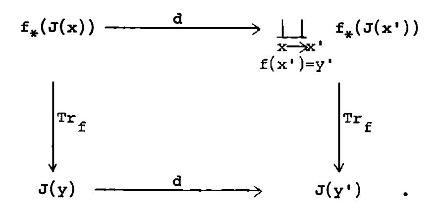
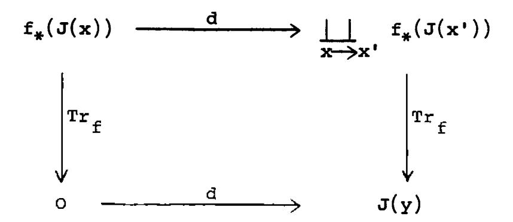
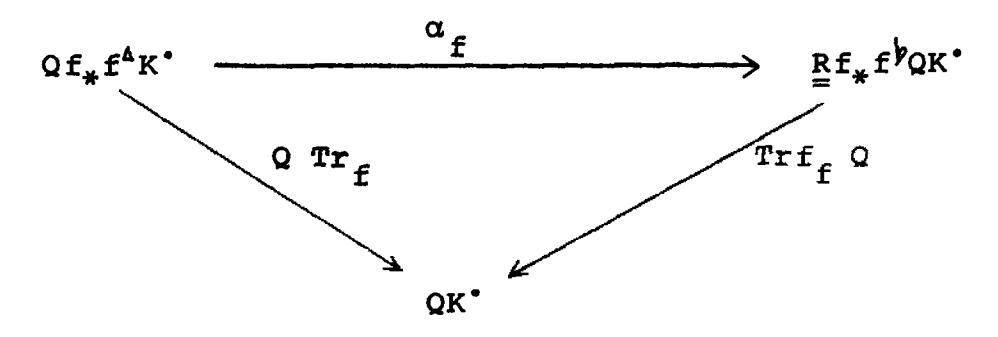
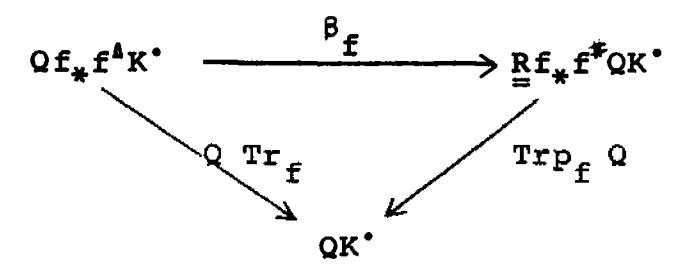
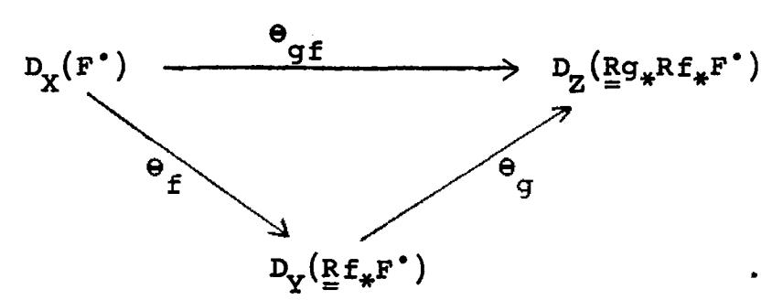
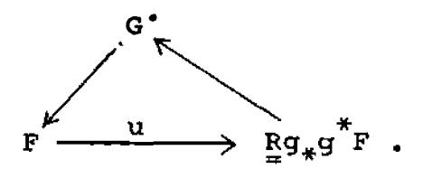
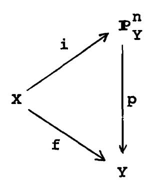

## CHAPTER VII. THE DUALITY THEOREM

## \$1. Curves over an Artin ring.

In this section we will make explicit the residual complex on a curve over the spectrum of an Artin ring, and we will identify the trace map of [VI §4] with the "classical" residue of a differential. Then, in the case of the projective line over an Artin ring with algebraically closed residue field, we will prove that the sum of the residues is zero, i.e., the trace map is a morphism of complexes. This special case will be used in the following section to prove the general residue theorem for a proper morphism of locally noetherian preschemes, which in turn implies that the sum of the residues is zero on any proper curve.

Throughout this section we will let Y be the spectrum of a local Artin ring A with residue field k, and we let X be a smooth curve over Y (i.e., a connected irreducible prescheme smooth over Y, with relative dimension one). A closed point  $x \in X$  is rational over Y if its residue field k(x) is k. In that case one can find a local parameter  $t \in \mathcal{O}_X$  with the following properties:

- (o)  $0/t \cong A$ .
- (1)  $t \in m_x m_x^2$
- (2) t is a non-zero-divisor in  $\mathscr{O}_{\mathbf{x}}$
- (3)  $\mathcal{O}_{\mathbf{x}}/t^n$  is a free A-module with basis 1,t,..., $t^{n-1}$
- (4) The total quotient ring K of  $\mathcal{O}_{\mathbf{x}}$  is generated as an  $\mathcal{O}_{\mathbf{x}}$ -module by 1,t-1,t-2,...

Proposition 1.1. Let  $f: X \longrightarrow Y$  be as above. Let I be an injective hull of k over A, so that  $\widetilde{I}$  is a residual complex on Y. Then

a).  $f^{z}(\widetilde{I})$  is the complex

$$i_{\eta}(I \otimes_{A} \omega_{\eta}) \xrightarrow{\sum_{\mathbf{x} \in X}} i_{\mathbf{x}}(H_{\mathbf{x}}^{1}(I \otimes_{A} \omega_{\mathbf{x}}))$$
closed

where  $\omega = \Omega_{X/Y}^1$  is the sheaf of relative 1-differentials,  $\eta$  is the generic point of X,  $i_{\eta}$ ,  $i_{\chi}$  is the notation of [II §7], meaning the given module spread out as a constant sheaf, and  $H_{\chi}^1$  is a local cohomology group [IV §1].

- b).  $f^{\mathbf{Z}}(\widetilde{\mathbf{I}})$  is an injective resolution of  $f^{*}(\widetilde{\mathbf{I}}) \otimes w[1]$ .
- c). If  $x \in X$  is a point rational over Y, then

$$H_{\mathbf{x}}^{1}(\mathbf{I} \otimes_{\mathbf{A}} \mathbf{w}_{\mathbf{x}}) \cong \mathbf{I} \otimes_{\mathbf{A}} \mathbf{w}_{\mathbf{x}} \otimes \mathbf{K}/\mathcal{O}_{\mathbf{x}}$$

where K is the total quotient ring of  $\mathscr{O}_{\mathbf{x}}$  (which is equal to the stalk  $\mathscr{O}_{\eta}$  at the generic point, hence independent of  $\mathbf{x}$ ).

Proof. a). follows directly from the definition of fz
[VI §2], using [IV §3] and [IV.1.F].

- b). follows from [V 8.3], [V.7.3], and [IV.3.1].
- c). Suppose that x is rational over Y, and let  $t\in {\mathcal O}_X \text{ be a local parameter. Then by [V.4.1] we can calculate the local cohomology as}$

$$H_{\mathbf{x}}^{1}(\mathbf{I} \otimes_{\mathbf{A}} \omega_{\mathbf{x}}) = \underbrace{\lim}_{\mathbf{n}} \operatorname{Ext}_{0_{\mathbf{x}}}^{1}(\mathcal{O}_{\mathbf{x}}/\mathbf{t}^{\mathbf{n}}, \mathbf{I} \otimes_{\mathbf{A}} \omega_{\mathbf{x}}).$$

But t is a non-zero-divisor in  $\mathcal{O}_{\mathbf{X}}$ , so we can calculate the Ext with the resolution

$$\circ \longrightarrow \mathscr{O}_{\mathbf{x}} \xrightarrow{\mathtt{t}^{\mathbf{n}}} \mathscr{O}_{\mathbf{x}} \longrightarrow \mathscr{O}_{\mathbf{x}}/\mathtt{t}^{\mathbf{n}} \longrightarrow \circ \ ,$$

and find that

$$\operatorname{Ext}^1_{\mathcal{O}_{\mathbf{x}}^{'}}(\mathcal{O}_{\mathbf{x}}^{'}/\operatorname{t}^n,\ \operatorname{I}\otimes_{A}^{}\omega_{\mathbf{x}}^{})\ \cong\ \operatorname{I}\ \otimes_{A}^{}\omega_{\mathbf{x}}^{'}/\operatorname{t}^n(\operatorname{I}\otimes_{A}^{}\omega_{\mathbf{x}}^{})\ .$$

The map in the direct system is multiplication by t, and

$$\underset{n}{\underset{\text{lim}}{\text{lim}}} \quad \mathscr{O}_{\mathbf{x}}/\mathsf{t}^{n} \quad \stackrel{\sim}{=} \quad \mathsf{K}/\mathscr{O}_{\mathbf{x}} ,$$

so we have

$$H_{\mathbf{x}}^{1}(\mathbb{I}\otimes_{\mathbf{A}}\mathbf{w}_{\mathbf{x}})\cong \mathbb{I}\otimes_{\mathbf{A}}\mathbf{w}_{\mathbf{x}}\otimes K/O_{\mathbf{x}}$$
.

Now let Z be a closed subscheme of X, concentrated at a closed point  $x_0 \in X$ , rational over Y. Then we can  $z \in X$  write z = z spec B, with B a local Artin ring, finite over A. Let I be an injective hull of k over A as above, and take  $z \in X$  to be a residual complex on Y. We propose to calculate explicitly the residue isomorphism (IV) of [VI \$2] between  $z \in X$  and  $z \in X$  is an affine scheme, we will use modules, instead of sheaves, for convenience. Using the results above, we have

$$\Gamma(g^{Y}(\widetilde{I})) = \text{Hom}_{A}(B,I)$$

$$\Gamma(i^{Y}f^{Z}(\widetilde{I})) = \text{Hom}_{O}(B, I \otimes_{A} \omega_{X_{O}} \otimes K/O)$$

where  $\theta = \theta_{x_0}$ . Indeed, since Z is concentrated at the

point  $x_0$ , there are no homomorphisms of  $\mathcal{O}_Z$  into  $i_{\eta}(I \otimes_A w_{\eta})$  or into  $i_{\chi}(H^1_{\chi}(I \otimes_A w_{\chi}))$  for  $\chi \neq \chi_0$ .

Let t be a local parameter at  $x_o$ . Let  $b_o \in \mathcal{M}_B$  be the image of t under the structural morphism  $\mathcal{O} \longrightarrow B$ . Finally, note that  $w_{\mathbf{x}_o}$  is a free  $\mathcal{O}$ -module with basis dt, so we can represent elements of  $I \otimes_{\mathbf{A}} w_{\mathbf{x}_o} \otimes K/\mathcal{O}$  as

$$\sum_{i < 0} a_i t^i dt$$

with  $a_i \in I$ . Using this notation, we have the following

Lemma 1.2. If

 $\varphi \in \text{Hom}_{\lambda} (B,I)$ 

and  $\psi \in \operatorname{Hom}_{\mathcal{O}}(B, I \otimes w_{X} \otimes K/\mathcal{O})$ 

correspond under the residue isomorphism, then for each b ∈ B,

$$\psi(b) = \sum_{r=0}^{\infty} \varphi(bb_0^r) t^{-r-1} dt$$

and  $\varphi(b) = \text{coefficient of } t^{-1}dt \text{ in } \psi(b).$ 

(Note that the sum in the first expression is finite since boil is nilpotent.)

<u>Proof.</u> Left as a good exercise in definition-chasing to the reader!

Proposition 1.3. With the above notations, the trace map of [VI §4]

$$\operatorname{Tr}_{f} : f_{*}f^{A}(\widetilde{I}) \longrightarrow \widetilde{I}$$

is zero on  $f_*i_{\eta}(I\otimes_{A}w_{\eta})$  (where we have identified  $f^*(\widetilde{I})$  with  $f^Z(\widetilde{I})$ ) and for each closed point  $x\in X$ , rational over Y, its restriction

$$\Gamma(\mathrm{Tr}_{\mathbf{f},\mathbf{x}}): \quad \mathbf{I} \otimes_{\mathbf{A}} \mathbf{w}_{\mathbf{x}} \otimes \mathbf{K}/\mathbf{f}_{\mathbf{x}} \longrightarrow \mathbf{I}$$

to the stalk at x is given as follows: let  $t \in \mathcal{O}_X$  be a local parameter, and write  $u \in I \otimes_A w_X \otimes K/\mathcal{O}_X$  as

$$u = \sum_{i < 0} a_i t^i dt$$

with  $a_i \in I$ . Then  $\Gamma(Tr_{f,x})(u) = a_{-1}$ .

<u>Proof.</u> To apply the definition of the trace map, we must choose a closed subscheme  $i: Z \longrightarrow X$  of X, finite over Y, such that  $u \in \Gamma(i^Y f^Z(\widetilde{I}))$ . Given u as above, suppose

that  $a_i = 0$  for i < -r. Then  $Z = \operatorname{Spec} \mathcal{O}_{x}/t^r$  will do.

Our element u is then identified with the element

$$\psi \in \operatorname{Hom}_{\mathcal{O}_{\mathbf{x}}}(B, I \otimes_{A} \omega_{\mathbf{x}} \otimes K/\mathcal{O}_{\mathbf{x}})$$

defined by  $\psi(1) = u$ . This corresponds by the residue isomorphism to a certain

$$\varphi \in \text{Hom}_{A}(B,I)$$
,

and by definition of the trace morphism we then have

$$\Gamma(\operatorname{Tr}_{f,x})(u) = \varphi(1)$$
.

But by the lemma above,  $\varphi(1)$  is the coefficient of  $t^{-1}dt$  in  $\psi(1) = u$ , so our trace is  $a_{-1}$ , as required.

Remark. Since the trace morphism has already been defined, and we are here calculating it, we can state as a corollary that the process of taking the coefficient of t-1dt in u is independent of the local parameter t chosen. This is in strong contrast with the approach of Serre's book [16, Ch. II §7], where the residue of a differential is defined as a-1, and a tedious proof is required to show that

it is independent of the local parameter [loc. cit. Prop. 5].

To establish the relation between his approach and ours, we
make the following

Definition. Let M be an A-module, and let

$$w \in M \otimes_A \omega_{\eta}$$

be a meromorphic differential on X with coefficients in M. Then for each closed point  $x \in X$ , rational over Y, we define the <u>residue</u> of W at X, as follows. Choose a local parameter X at X. Let

$$\mathbf{w}_{\mathbf{x}} \in \mathbf{M} \otimes_{\mathbf{A}} \mathbf{w}_{\mathbf{x}} \otimes \mathbf{K}/\mathbf{0}_{\mathbf{x}}$$

be the image of w under the natural map

$$\omega_{\mathcal{D}} = \omega_{\mathbf{x}} \otimes \mathbf{K} \longrightarrow \omega_{\mathbf{x}} \otimes \mathbf{K} / \mathcal{O}_{\mathbf{x}}$$
.

Write

$$w_x = \sum_{i < 0} a_i t^i dt$$

with  $a_i \in M$ , and then define

$$Res_{\mathbf{x}}(\mathbf{w}) = \mathbf{a}_{-1}$$
.

(Observe that a is independent of the choice of local parameter. Indeed, we may assume that M is finitely generated,

in which case it is a submodule of  $I^n$  for some n, so we reduce to the case M = I, where  $a_{-1} = \Gamma(Tr_{f,x})(w_x)$  which is independent of t.)

Lemma 1.4. Residues have the following properties [16. Ch. II §7].

- (i)  $Res_{x}(w)$  is A-linear in w.
- (ii)  $\operatorname{Res}_{\mathbf{X}}(\mathbf{w}) = 0$  if  $\mathbf{w} \in M \otimes \mathbf{w}_{\mathbf{X}}$ .
- (iii)  $Res_{\mathbf{v}}(dg) = 0$  for any  $g \in M \otimes_{\mathbf{h}} K$ .
- (iv)  $Res_{x}(t^{-1}dt) = 1$  if t is a local parameter at x.

Proof. All properties follow from the definition.

Theorem 1.5 (Residue formula for the projective line). Let A be a local Artin ring with algebraically closed residue field k, let Y = Spec A, and let X =  $\mathbb{P}^1_{Y}$  be the projective line over Y. Let M be an A-module, and let

$$\mathbf{w} \in \mathbf{M} \otimes_{\mathbf{A}} \omega_{\mathbf{n}}$$

be a meromorphic differential on X with coefficients in M.
Then

$$\sum_{\mathbf{x} \in X} \operatorname{Res}_{\mathbf{x}}(\mathbf{w}) = 0.$$
closed

<u>Proof.</u> (Modeled on the proof of [16, Ch. II,  $\S12$ , Lemma 3], which is the same statement in the case A = k = M.) First of all, we may assume that M is finitely generated. Then writing M as a quotient of  $A^n$  for suitable n, we reduce to the case M = A.

Let  $\mathbf{w} \in \mathbf{w}_{\eta}$  be a meromorphic differential (recall  $\eta$  is the generic point of X). Let  $\mathbf{X}_{o}$  be the affine line Spec A[t] contained as an open subset of X. Then from the exact sequence of sheaves

$$0 \longrightarrow w \longrightarrow i_{\eta}(w_{\eta}) \longrightarrow \bigsqcup_{\mathbf{x} \in \mathbf{X}} i_{\mathbf{x}}(w_{\mathbf{x}} \otimes \mathbb{K}/\mathcal{O}_{\mathbf{x}}) \longrightarrow 0$$

$$closed$$

we obtain the following exact sequence of global sections on  $\mathbf{x}_{o}$ :

$$0 \longrightarrow \Gamma(\mathbf{X}_{0}, \omega) \longrightarrow \omega_{\eta} \longrightarrow \underset{\mathbf{x} \in \mathbf{X}_{0}}{\coprod} \quad \omega_{\mathbf{x}} \otimes \mathbb{K}/\mathscr{O}_{\mathbf{x}} \longrightarrow 0 .$$

For each closed point  $x \in X_0$ , we can choose a local parameter of the form  $t-c_x$ , with  $c_x \in A$ . Then our exact sequence shows that w can be written (uniquely) in the form

$$w = f(t)dt + \sum_{x \in X_0} \sum_{i < 0} a_{i,x}(t-c_x)^i dt$$
closed

where  $f(t) \in A[t]$  is a polynomial in t with coefficients in A. By linearity, we reduce to proving the residue formula in the two cases

$$(1) w = t^n dt n \ge 0$$

(2) 
$$w = (t-c_{x_0})^n dt$$
  $n < 0, x_0 \in X_0$ .

In the first case,  $\operatorname{Res}_{\mathbf{X}}(\mathbf{w}) = 0$  for every  $\mathbf{x} \in \mathbf{X}_{\mathbf{0}}$ , by (ii) of the lemma. We take  $\mathbf{s} = 1/t$  as a local parameter at  $\infty$  (the unique point of  $\mathbf{X} - \mathbf{X}_{\mathbf{0}}$ ). Then  $\mathbf{w} = -\mathbf{s}^{-\mathbf{n}-2} d\mathbf{s}$ , and  $\mathbf{n} - 2 < -1$ , so the residue is zero there also.

In the second case, for any  $x \neq x_0$ ,  $x \in X_0$ ,  $t-c_{X_0}$  is invertible in  $\mathcal{O}_{X_0}$ , so the residue at x is zero. The residue at  $x_0$  is 0 if n < -1, 1 if n = -1. We take  $s = 1/(t-c_{X_0})$  as a local parameter at  $\infty$ . Then  $w = -s^{-n-2}ds$ , so its residue is 0 if n < -1, and -1 if n = -1. Hence the sum of the residues is zero.

Remark. It follows from the theorem of the next section that the theorem remains true for any smooth curve X proper over Y.

Corollary 1.6. Under the hypotheses of the theorem

$$\operatorname{Tr}_{\mathbf{f}}: f_{\mathbf{f}}f^{\mathbf{A}}(\widetilde{\mathbf{I}}) \longrightarrow \widetilde{\mathbf{I}}$$

is a morphism of complexes.

<u>Proof.</u> Using Proposition 1.3 above, this is precisely the statement of the Theorem in the case M = I.

\$2. The residue theorem.

Theorem 2.1. (Residue theorem) Let  $f: X \longrightarrow Y$  be a proper morphism of noetherian schemes, and let  $K^{\bullet}$  be a residual complex on Y. Then the trace map

$$Tr_{f}: f_{*}f^{A}K^{*} \longrightarrow K^{*}$$

defined in [VI \$4] is a morphism of complexes.

<u>Proof.</u> We write the residual complexes as sums of injective hulls.

$$\sum_{\mathbf{b}} \mathbf{K}_{\mathbf{b}} = \prod_{\mathbf{\lambda} \in \mathbf{\lambda}} \mathbf{\lambda}(\mathbf{\lambda})$$

and

$$\sum_{\mathbf{p}} (\mathbf{f}^{\mathbf{A}} \mathbf{K}^{\bullet})^{\mathbf{p}} = \coprod_{\mathbf{x} \in \mathbf{X}} \mathbf{J}(\mathbf{x}) .$$

We must show that for each  $x \in X$  and each  $a \in \Gamma(J(x))$  that  $Tr_f(da) = d(Tr_f a)$ , where d denotes the operator in the complex  $K^*$  (resp.  $f^{\Delta}K^*$ ).

Case 1. Suppose that x is closed in its fibre. Then  $\operatorname{Tr}_f$  maps  $f_*(J(x))$  into J(y) where y = f(x) (see the proof of [VI 4.4]), and we must show that the following diagram is commutative:

where we take those x' which are immediate specializations of x, and those y' which are immediate specializations of y. Clearly it is enough to consider each y' separately, so we must show the commutativity of the diagram

Given a particular element  $a \in \Gamma(J(x))$ , we can put a subscheme structure on  $Z = \{x\}^-$  so that  $a \in \Gamma(i_*i^{\Delta}f^{\Delta}K^{\bullet})$  where  $i: Z \longrightarrow X$  is the inclusion. Let  $g: Z \longrightarrow Y$  be

the composition fi. Then since i is a finite morphism  $Tr_i = \rho_i \quad \text{is a morphism of complexes (see [VI \$4]) and so}$  using TRA lit will be sufficient to show that  $Tr_g$  is a morphism of complexes. In other words, we may replace X by Z and thus reduce to the case X is irreducible and x is the generic point.

Now by reason of codimensions [VI 3.4] each x' is closed in its fibre, i.e., the fibre of y' is discrete. Also f is a proper morphism, so by [EGA III 4.4.11] there is an open neighborhood U of y' such that the restriction of f to  $f^{-1}(U)$  is a finite morphism. Thus we may assume that f itself is finite, in which case  ${\rm Tr}_f = \rho_f$  which is a morphism of complexes, and we are done.

Case 2. Suppose that x is not closed in its fibre. Then  $\mathrm{Tr}_f$  maps  $f_*(J(x))$  to zero. If no immediate specialization of x is closed in its fibre, then also  $\mathrm{Tr}_f \cdot d$  is zero on  $f_*(J(x))$ , and there is nothing to prove. So suppose that some immediate specializations x' of x are closed in their fibres. Then we have f(x) = f(x') = y for all such x', and we must check that the diagram

is commutative. As above, we fix an element  $a \in \Gamma(J(x))$ , and then can replace X by  $\{x\}^-$  with a suitable subscheme structure. Thus we reduce to the case X irreducible and x its generic point.

Next we make the base extension Spec  $\mathscr{O}_Y \longrightarrow Y$ , and thus reduce to the case y is a closed point of Y, since everything is compatible with localization. Now since X is noetherian, and f maps the generic point of X to the closed point of Y, f factors through a closed subscheme Y' of Y defined by a suitable power of the maximal ideal of  $\mathscr{O}_Y$ . Since  $f: Y' \longrightarrow Y$  is a finite morphism, its trace is a morphism of complexes, so we can replace f: Y' and so reduce to the case  $f: Y' \to Y$  is a finite morphism, its trace is a morphism of complexes, so we can replace  $f: Y' \to Y'$ , and so reduce to the case  $f: Y' \to Y' \to Y'$  and  $f: Y' \to Y' \to Y'$  is a finite morphism, its trace is a morphism of complexes, so we can replace  $f: Y' \to Y'$ , and so reduce to the case  $f: Y' \to Y' \to Y'$  is a local Artin ring, and  $f: Y' \to Y' \to Y'$  is a finite morphism of complexes, so we can replace  $f: Y' \to Y'$ , and so reduce to

We refer to [EGA IV \$22,25] for the following two results:

- a) A proper scheme of dimension 1 over an Artin ring is projective, and
- b) A projective scheme X of relative dimension  $\leq n$  over a local ring A admits a finite morphism into  $\mathbb{P}^n_A$  .

(The adventurous reader can replace the reference by a proof of his own, using [EGA III 2.6.2] and [EGA III 4.7.1]. For a) one reduces to the case of a non-singular curve over a field, where any positive divisor of sufficiently high degree is very ample. For b) one puts X first in a large projective space  $\mathbb{P}_{A}^{N}$ , and then projects successively into smaller projective spaces.)

Using these results, we see that X is projective over Y, and admits a finite morphism onto  $\mathbb{P}^1_A$ . Since the theorem is known for a finite morphism, we reduce to the case  $X = \mathbb{P}^1_A$ , with A an artin ring. We now invoke [VI 5.4] and [VI 5.6] to reduce to the case where the residue field of A is algebraically closed. (Note that the base extension Y'  $\longrightarrow$  Y is faithfully flat, so that it is enough to prove the theorem in the extended situation.) But this is Corollary 1.6, so we are done.

## §3. The duality theorem for proper morphisms.

In this section we prove the long-awaited duality theorem for a proper morphism of locally noetherian preschemes  $f\colon X\longrightarrow Y$ . We will suppose the existence of a residual complex  $K^*$  on Y. Then  $K^*$  and  $f^{\Delta}K^*$  give rise to pointwise dualizing functors  $D_Y$  and  $D_X$  on Y and X, respectively, and we express the duality theorem as

$$D_{X}(F^{*}) \xrightarrow{\sim} D_{Y}(\underline{R}f_{*}F^{*})$$

for  $F^* \in D_{qq}(X)$ .

Before proving the theorem, we must show that the trace map  ${\rm Tr}_{\rm f}$  of [VI 4.2] agrees in the case of a finite or projective morphism with the trace maps  ${\rm Trf}_{\rm f}$  of [III 6.5] and  ${\rm Trp}_{\rm f}$  of [III 4.3].

So let  $f: X \longrightarrow Y$  be a finite morphism of preschemes, and assume that Y is noetherian and has finite Krull dimension. Let  $K^*$  be a residual complex on Y. Then we construct an isomorphism

$$\alpha_f: Qf_*f^{\Delta}K^{\bullet} \xrightarrow{\sim} \underline{R}f_*f^{\dagger}QK^{\bullet}$$

as follows:

$$Qf_*f^{\Delta}K^{\bullet} \xrightarrow{\xi_{f_*}} \underline{R}f_*Qf^{\Delta}K^{\bullet} \xrightarrow{\psi_f} \underline{R}f_*Qf^{\Delta}K^{\bullet} \xrightarrow{} \underline{R}f_*Qf^{\Delta}K^{\bullet} \xrightarrow{}$$

where as usual, Q denotes the natural map from complexes to elements of the derived category;  $\xi_{f_*}$  is the isomorphism of [I.5.1];  $\psi_{f}$  is the isomorphism of [VI 3.1c]; the map (1) is the definition of  $f^{Y}$  [VI, §2]; and (2) is the isomorphism of [VI 1.1c] (here is where we need the hypothesis that Y is noetherian of finite Krull dimension).

Proposition 3.1. Let  $f: X \longrightarrow Y$  be a finite morphism, with Y noetherian of finite Krull dimension, and let  $K^{\circ}$  be a residual complex on Y. Then there is a commutative diagram

where  $Tr_f$  is the trace of [VI 4.2] and  $Trf_f$  is the trace of [III 6.5].

<u>Proof.</u> Follows immediately from TRA 2 [VI 4.2] and the definition of  $\rho_f$  [VI §4].

Now let Y be a noetherian prescheme of finite Krull dimension, and let  $f: X = \mathbb{P}^n_Y \longrightarrow Y$  be the structural map of an n-dimensional projective space over Y. Let K' be a residual complex on Y. Then we define an isomorphism

$$\beta_{f}: Qf_{*}f^{\Delta}K^{\bullet} \xrightarrow{\sim} \underline{R}f_{*}f^{*}QK^{\bullet}$$

similar to the map  $\alpha_f$  above, using  $\xi_{f_*}$ , the map  $\phi_f$  of [VI 3.1d], the definition of  $f^Z$  [VI \$2], and [VI 1.1c].

Proposition 3.2. Let Y be a noetherian prescheme of finite Krull dimension, let  $X = \mathbb{P}^n_Y$ , let  $f: X \longrightarrow Y$  be the projection, and let  $K^*$  be a residual complex on Y. Then there is a commutative diagram

where  $Tr_f$  is the trace of [VI 4.2], and  $Trp_f$  is the trace of [III 4.3].

<u>Proof.</u> Choose a section  $s: Y \longrightarrow X$  of f, and consider the following diagram:

$$\begin{array}{c}
QK' \xrightarrow{Q \ C_{s,f}} & Qf_*s_*s^{\Delta}f^{\Delta}K' \xrightarrow{Q \ Tr_s} & Qf_*f^{\Delta}K' \xrightarrow{Q \ Tr_f} & QK' \\
\downarrow id &$$

where the notations have the sources indicated, and the second vertical arrow is obtained by sandwiching  $\alpha_{_{\bf S}}$  in the middle of the four isomorphisms which define  $\beta_{_{\bf f}}$ . Now we make the following observations:

- 1). The composition of the upper row of arrows is the identity on QK°. This follows from TRA 1 [VI 4.2].
- 2). The composition of the lower row of arrows is also the identity on QK\*. This is the statement of [III 10.1].
- 3). The left-hand square is commutative. This follows from VAR 5 [VI 3.1] and the definition of the isomorphisms  $\alpha_{s}$ ,  $\beta_{f}$  and (IV) of [VI §2].

- 4). The middle square is commutative. This is Proposition 3.1 above.
- 5).  $\psi_{s,f}$  and  $\operatorname{Trp}_{f}$  are isomorphisms by construction, hence  $\operatorname{Trf}_{s}$  is an isomorphism.
- 6).  $c_{s,f}$  is an isomorphism, hence Q  $Tr_s$  and Q  $Tr_f$  are isomorphisms. (Note incidentally we have used Theorem 2.1 above that  $Tr_f$  is a morphism of complexes, in order to consider Q  $Tr_f$  in the first place.)
- 7). We conclude finally that the right-hand square is a commutative diagram of isomorphisms. q.e.d.

Now we come to the duality theorem itself. Let  $f: X \longrightarrow Y$  be a proper morphism of noetherian preschemes of finite Krull dimension. Let  $K^*$  be a residual complex on Y. (Note that the existence of a residual complex imposes a slight restriction on the preschemes considered [VI 1.1] and [V \$10].) We denote by  $D_Y$  (resp.  $D_Y$ ) the functor  $P_X \mapsto D_Y$  (resp.  $P_X \mapsto D_X$ ) the functor  $P_X \mapsto D_X \mapsto D_X$  (resp.  $P_X \mapsto D_X$ ) the functor  $P_X \mapsto D_X \mapsto D_X$  (resp.  $P_X \mapsto D_X$ ). Then composing the morphism of [II.5.5] with  $P_X \mapsto D_X \mapsto D_X$ , we obtain the duality morphism

$$\Theta_{f} : \underline{R}f_{*} \underline{D}_{x}(F^{*}) \longrightarrow \underline{D}_{v}(\underline{R}f_{*}F^{*})$$

for  $F' \in D^-(X)$ . Applying the functor  $R\Gamma(Y, \cdot)$  to both sides, and using [II 5.2] and [II 5.3] we obtain a global duality morphism

$$\Theta_{f} \colon D_{\mathbf{X}}(\mathbf{F}^{\bullet}) \longrightarrow D_{\mathbf{V}}(\mathbf{F}_{\mathbf{F}}^{\bullet}\mathbf{F}^{\bullet})$$
.

Taking the cohomology of this, we get morphisms

$$\Theta_{\mathtt{f}}^{\mathtt{i}} \colon \operatorname{Ext}_{X}^{\mathtt{i}}(\mathtt{F}^{\:\raisebox{3.5pt}{\text{\circle*{1.5}}}},\mathtt{Qf}^{\mathtt{b}}\mathtt{K}^{\:\raisebox{3.5pt}{\text{\circle*{1.5}}}}) \xrightarrow{} \operatorname{Ext}_{Y}^{\mathtt{i}}(\underline{\underline{\mathtt{g}}}\mathtt{f}_{*}\mathtt{F}^{\:\raisebox{3.5pt}{\text{\circle*{1.5}}}},\mathtt{QK}^{\:\raisebox{3.5pt}{\text{\circle*{1.5}}}}) \ .$$

Theorem 3.3 (Duality Theorem). Let  $f: X \longrightarrow Y$  be a proper morphism of noetherian preschemes of finite Krull dimension, and let  $K^{\bullet}$  be a residual complex on Y. Then the duality morphisms  $\underline{\Theta}_{f}$ ,  $\underline{\Theta}_{f}$ , and  $\underline{\Theta}_{f}^{i}$  defined above are isomorphisms for all  $F^{\bullet} \in D_{GC}^{-}(X)$ .

(Note that the hypothesis of finite Krull dimension is needed only for the definition of  $\underline{\Theta}_{\mathbf{f}}$  (cf. [II 5.5]). If we restrict to <u>bounder complexes</u>  $\mathbf{F}^{\bullet} \in D^{\mathbf{b}}_{\mathbf{qc}}(\mathbf{X})$ , we can state the theorem assuming only that  $\mathbf{X}$  and  $\mathbf{Y}$  are locally noetherian, and that the fibres of  $\mathbf{f}$  are of bounded dimension. The proof is the same.)

Proof. We proceed in several steps, eventually using Chow's lemma to reduce to the case of projective space which we know already.

- a) Clearly it is sufficient to show that  $\Theta_f$  is an isomorphism. The question is local on Y, so we may assume Y is the spectrum of a local ring. In particular, we may assume that Y is noetherian, affine, and of finite Krull dimension. Using the lemma on way-out functors, we reduce to the case of a single quasi-coherent sheaf F on X.
- b) Any quasi-coherent sheaf on F is the direct limit of its coherent subsheaves. In particular, it is a quotient of a direct sum of coherent sheaves. Thus using the lemma on way-out functors again, we reduce to the case of a direct sum of coherent sheaves. Now since RHom transforms direct sums in the first variable to direct products, we reduce to the case of a single coherent sheaf F on X.
- c) Now since Y is affine, and all the sheaves considered are quasi-coherent, it is enough to show  $\theta_{\rm f}$  is an isomorphism.
- d) If  $f: X \longrightarrow Y$  and  $g: Y \longrightarrow Z$  are two proper morphisms, and  $K_Z^*$  a residual complex on Z, and if we take  $K^* = g^A K_Z^*$ , then for any  $F^* \in D_C^*(X)$  we have a commutative diagram

We deduce the following elementary but essential consequences:

- (i) If  $\boldsymbol{\theta}_{f}$  and  $\boldsymbol{\theta}_{g}$  are isomorphisms for all arguments, so is  $\boldsymbol{\theta}_{\sigma\,f}$  .
- (ii) If  $\theta_g$  and  $\theta_{gf}$  are isomorphisms for all arguments, so is  $\theta_f$  .
- (iii) If  $\Theta_f$  and  $\Theta_{gf}$  are isomorphisms for all arguments, then  $\Theta_g$  is an isomorphism for every complex of the form  $\mathbb{R}f_*F^*$  with  $F^*\in D^-_C(X)$ .
- e) By noetherian induction on X, we may assume the theorem proven for every morphism of the form  $g: Z \longrightarrow Y$ , where g = fi, and  $i: Z \longrightarrow X$  is a closed immersion of Z onto a subscheme of X, different from X.
- f) We now apply Chow's Lemma [EGA II 5.6.1]  $X' \xrightarrow{g} X$  to deduce the existence of a scheme X' projective over Y, together with a projective Y-morphism  $g: X' \longrightarrow X$ , which is an isomorphism on a non-empty open subset U of X (we may assume  $X \neq \emptyset$ !). Given a coherent sheaf F on X, consider the natural map

u:  $F \longrightarrow Rg_*g^*F$ , and embed it in a triangle

Then since g is an isomorphism on U, G' has support on X-U, and so  $\theta_f(G^*)$  is an isomorphism by our induction hypothesis e). Thus it will be sufficient to show that  $\theta_f(\mathbb{R}^g_*g^*F)$  is an isomorphism. Using (iii) above, we reduce to showing  $\theta_g$  and  $\theta_{fg}$  are isomorphisms for all arguments, and so we reduce to the case f is projective.

g) Since Y is affine, we can\nembed X in a suitable projective
space over Y, say f = pi, with
p: Py

separately. Now i is a finite morphism, so  $\theta_i$  is an isomorphism by Proposition 3.1 above, and [III 6.7]. Also  $\theta_i$  is an isomorphism by Proposition 3.2 above, and [III 5.1]. q.e.d.

We can now pull ourselves up by our bootstraps, and obtain a theory of f and Tr f for complexes with coherent cohomology and schemes admitting dualizing complexes.

Corollary 3.4. We consider the category of noetherian preschemes which admit a dualizing complex, and we consider morphisms of finite type. Then

(a). For every such morphism  $f: X \longrightarrow Y$ , there is a theory of f' consisting of a functor

$$f: D_{C}^{+}(Y) \longrightarrow D_{C}^{+}(X)$$

plus the data 2)-5) and properties VAR 1 - VAR 6 of [III 8.7] (only leave out the word "embeddable" wherever it occurs).

(b). For every such proper morphism  $f: X \longrightarrow Y$ , there is a theory of trace consisting of a functorial morphism

$$\operatorname{Tr}_{f} : \operatorname{Rf}_{*} f^{!} \longrightarrow 1$$

with the properties TRA 1 - TRA 4 of [III 10.5] (only leave out the phrase "projectively embeddable" wherever it occurs).

(c). For every such <u>proper</u> morphism  $f: X \longrightarrow Y$ , the duality morphism

$$\underline{\Theta}_{f} \colon \ \underline{\mathbb{R}} f_{*} \ \underline{\mathbb{R}} \underline{\operatorname{Hom}}_{X}^{\bullet}(F^{\bullet}, \ f^{\bullet}G^{\bullet}) \longrightarrow \underline{\mathbb{R}} \ \underline{\operatorname{Hom}}_{Y}^{\bullet}(\underline{\mathbb{R}} f_{*}F^{\bullet}, \ G^{\bullet}) \ ,$$

obtained by composing the morphism of [II 5.5] with  $\operatorname{Tr}_f$  in the second place, is an isomorphism for  $F^* \in \operatorname{D}^-_{\operatorname{qc}}(X)$  and  $G^* \in \operatorname{D}^+_{\operatorname{c}}(Y)$ . (Compare [III 11.1].)

<u>Proof.</u> (a) Let  $K^{\bullet}$  be a residual complex on Y (and observe that  $QK^{\bullet}$  is then a dualizing complex on Y, and  $Qf^{\Delta}K^{\bullet}$  a dualizing complex on X). Let  $\underline{D}_{Y}$  and  $\underline{D}_{X}$  be as in the theorem above, and define

$$f'(G') = \overline{D}_X(\overline{F}t_{\overline{D}}^{-1}(G_{\overline{G}}))$$

for all  $G^{\bullet} \in D_{\mathbf{C}}^{+}(Y)$ . Note that  $\underline{D}_{\mathbf{Y}}(G^{\bullet}) \in D_{\mathbf{C}}^{-}(Y)$ , so that  $\underline{L}f^{*}$  of it is defined. Here is where we need that QK $^{\bullet}$  is a dualizing complex, not just pointwise dualizing. Observe also that  $f^{\bullet}$  is independent of the choice of K $^{\bullet}$  (use [V 3.1]).

The construction of the isomorphisms  $c_{f,g}$  is easy, using [VI 3.1]. For the isomorphisms  $d_f$  and  $e_f$ , we use [III 6.9b] and [III 2.4], respectively. The details of these constructions, and verifications of VAR 1 - VAR 6 are left to the reader (!).

Observe, by the way, that this part of the Corollary does not depend on the duality theorem, and could have come just after the construction of  $f^{\Delta}$  [VI 3.1].

(b) To define  $Tr_f$ , let  $G^* \in D_C^+(Y)$ , and use [II 5.10], [VI 4.2], Theorem 2.1 above, and [V 2.1]:

$$\underbrace{\mathbb{R}f_{*}f^{*}G^{*}}_{\mathbf{K}^{*}} = \underbrace{\mathbb{R}f_{*}}_{\mathbf{K}^{*}} \underbrace{\mathbb{R}}_{\mathbf{K}^{*}} \underbrace{\operatorname{Hom}_{X}^{*}}(\underline{\mathbf{L}}f^{*}\underline{\mathbf{D}}_{Y}(G^{*}), \, \mathbb{Q}f^{A}K^{*}) \\
\downarrow \qquad \qquad \qquad \qquad \downarrow [II \, 5.10] \\
\underbrace{\mathbb{R}}_{\mathbf{K}^{*}} \underbrace{\operatorname{Hom}_{Y}^{*}}(\underline{\mathbf{D}}_{Y}(G^{*}), \, \underline{\mathbb{R}}f_{*}\mathbb{Q}f^{A}K^{*}) \\
\downarrow \qquad \qquad \qquad \qquad \downarrow \mathbb{Q} \operatorname{Tr}_{f} \\
\underbrace{\mathbb{C}^{*}}_{\mathbf{K}^{*}} \xrightarrow{\sim} \underbrace{\mathbb{R}}_{\mathbf{K}^{*}} \underbrace{\operatorname{Hom}_{Y}^{*}}(\underline{\mathbf{D}}_{Y}(G^{*}), \, \mathbb{Q}K^{*})$$

The verification of TRA 1 is clear, using TRA 1 of [VI 4.2]. For TRA 2 we use [III 6.9c]. Details left to reader (:).

(c) To prove the duality formula, we reduce as in part b) of the proof of the theorem above, to the case of complexes  $F^*$  with coherent cohomology. So let  $F^* \in D^-_C(X)$  and  $G^* \in D^+_C(Y)$ . Consider

$$\underline{R}f_* \underline{R} \underline{Hom}_X(F^*, f^*G^*) . \tag{1}$$

We write  $F' = D_X D_X (F')$  and  $f'G' = D_X (Lf^*D_Y (G'))$ . Now since  $D_X$  is a dualizing functor, it transforms  $R + D_X = 0$  into  $R + D_X = 0$  of the duals of the arguments, with the order reversed. Thus (1) becomes

Applying the duality theorem above, this becomes

$$\underline{D}_{\mathbf{Y}} \underset{\mathbf{F}^*}{\mathbf{R}} \underline{\mathbf{f}}_{\mathbf{X}} \underbrace{\mathbf{R}} \underset{\mathbf{M}}{\mathbf{Hom}}_{\mathbf{X}} (\underline{\mathbf{L}} \underline{\mathbf{f}}^{\mathbf{X}} \underline{\mathbf{D}}_{\mathbf{Y}} (\mathbf{G}^{\bullet}), \underline{\mathbf{D}}_{\mathbf{Y}} (\mathbf{F}^{\bullet})) \tag{3}$$

which in turn, since  $\underline{L}f^*$  is a left adjoint of  $\underline{R}f_*$  [II 5.10], is isomorphic to

$$\underline{D}_{\underline{Y}} \stackrel{\underline{R}}{=} \underline{Hom}_{\underline{Y}} (\underline{D}_{\underline{Y}} (G^{\bullet}), \stackrel{\underline{R}}{=} \underline{f}_{\underline{X}} (F^{\bullet})) . \tag{4}$$

Now applying duality to the second argument, (4) becomes

$$\underline{D}_{\mathbf{Y}} \stackrel{\mathbb{R}}{=} \underline{\operatorname{Hom}}_{\mathbf{Y}}(\underline{D}_{\mathbf{Y}}(G^{\bullet}), \underline{D}_{\mathbf{Y}}(\underline{\mathbb{R}}f_{*}F^{\bullet}))$$

and since  $\underline{D}_{\underline{Y}}$  is dualizing, this is

The reader may check that our chain of isomorphisms is indeed  $\underline{\Theta}_{f}$ , which proves (c).

<u>Proposition 3.5</u> (Compatibility of Local and Global duality). Let  $f: X \longrightarrow Y$  be a proper morphism of noetherian schemes, and let  $K^{\circ}$  be a residual complex on Y. Let  $x \in X$  be a closed point, with local ring  $A = \mathcal{O}_{X}$ . Let  $R^{\circ}$  be the dualizing complex  $(Qf^{\Delta}K^{\circ})_{X}$  on A, and assume that  $R^{\circ}$  is

normalized [V §6]. Let  $I = \Gamma_{\mathbf{X}}(R^{\bullet})$ . Let  $F^{\bullet} \in D_{\mathbf{C}}^{+}(X)$ . Then the diagram

$$\underline{\underline{R}\Gamma_{\mathbf{X}}(\mathbf{F}^{\bullet})} \xrightarrow{\underline{\Theta_{\mathbf{X}}}} \underline{\operatorname{Hom}_{\mathbf{A}}^{\bullet}(\mathbf{F}_{\mathbf{X}}^{\bullet}, \mathbf{R}^{\bullet}), \mathbf{I})}$$

$$\underline{\underline{R}\Gamma_{\mathbf{X}}(\mathbf{F}^{\bullet})} \xrightarrow{\underline{D_{\mathbf{Y}}(\Theta_{\mathbf{f}})}} \underline{\underline{\operatorname{Hom}_{\mathbf{Y}}^{\bullet}(\underline{R}f_{\mathbf{X}} \xrightarrow{\underline{Hom_{\mathbf{X}}^{\bullet}}(\mathbf{F}^{\bullet}, \mathbf{Q}f^{\mathbf{A}}K^{\bullet}), \mathbf{Q}K^{\bullet})}}$$

is commutative, where  $\theta_{\mathbf{x}}$  is the local duality isomorphism [V 6.2],  $\alpha$  is the natural map of derived functors obtained from the inclusion  $\Gamma_{\mathbf{x}} \subseteq \mathbf{f}_*$ ,  $\beta$  is obtained from the stalk map

$$\underline{\underline{R}}f_* \xrightarrow{\operatorname{Hom}_X^*}(F^*,Qf^{\Delta}K^*) \longrightarrow \operatorname{Hom}_{\underline{A}}^*(F_X^*,R^*)$$

and the trace map

$$Tr_{f,x}: f_*J(x) = I \longrightarrow K^{\bullet}$$

and  $\underline{D}_{\underline{Y}} \theta_{\underline{f}}$  is the transpose by  $\underline{D}_{\underline{Y}}$  of the global duality isomorphism of Theorem 3.3. (Note we write four times Hominstead of  $\underline{R}$  Homin because the second argument in each case is injective.)

Proof. Immediate from the definitions of the maps in question.

Remark. This compatibility is the one needed to complete the proof of "Lichtenbaum's theorem" [LC theorem 6.9, see parenthetical remark in middle of p. 103].

## §4. Smooth morphisms.

In this section we give the special case of the duality theorem for a proper smooth morphism of locally noetherian preschemes. In this case we can eliminate the hypothesis that our preschemes admit residual complexes.

The results below are valid practically without change for Cohen-Macaulay morphisms (see [V.9.7]). In that case one defines  $\omega_{X/Y}$  to be the unique cohomology group of  $f^{!}(\mathcal{B}'_{Y})$ . The functor  $f^{!}$  is defined only locally, but one can glue the sheaves  $\omega_{X/Y}$  to obtain a global one. One then defines  $f^{\#} = f^{\#} \otimes \omega_{X/Y}[n]$  as in the smooth case. We leave the details to the reader.

Throughout this section,  $f\colon X\longrightarrow Y$  will be a proper, smooth morphism of locally noetherian preschemes, and we will suppose for simplicity that the fibres are all of the same dimension, say n. We denote by  $w_{X/Y}$  the sheaf  $\Omega_{X/Y}^n$  of relative n-differentials, and by  $f^*$  the functor

$$f^*: D(Y) \longrightarrow D(X)$$

given by

$$f^*(G^*) = f^*(G^*) \otimes \omega_{X/Y}[n]$$

(compare [III, \$\$1,2]).

Theorem 4.1. For every proper, smooth morphism  $f: X \longrightarrow Y$  of relative dimension n of locally noetherian preschemes, there is a morphism

$$\gamma_f : \mathbb{R}^n f_*(\omega_{X/Y}) \longrightarrow \mathscr{O}_Y$$

with the properties b)-g) of [III 11.2].

Proof. We will first consider the case where Y is noetherian and admits a dualizing complex. Then by Corollary 3.4, we have

$$f'(O'_{Y}) = f''(O'_{Y}) = \omega_{X/Y}[n]$$
,

and we have a trace map

$$\operatorname{Tr}_{\mathbf{f}} \colon \operatorname{\underline{R}f}_{*}^{!}(\mathscr{O}_{\mathbf{v}}) \longrightarrow \mathscr{O}_{\mathbf{v}} .$$

Taking the cohomology in degree n, we obtain a map

$$\gamma_f : R^n f_*(\omega_{X/Y}) \longrightarrow \emptyset_Y$$

as required. The proofs of the properties b)-g) are similar to loc. cit. except for c), which we will leave to the reader.

For the general case, the question is local by c), so we may assume Y = Spec A is the spectrum of a noetherian ring A. We consider flat base extensions  $u_i: Y_i \longrightarrow Y$ , where  $Y_i$  is

the spectrum of a complete local noetherian ring Bi, flat over A. By the Cohen structure theorem [14, (31.1)], each Bi is a quotient of a regular local ring, hence admits a dualizing complex, and so the theorem holds for Yi. Thus for each i we have a morphism

$$\gamma_{f_i}: R^n f_{i*}(\omega_{X_i/Y_i}) \longrightarrow O_{Y_i}$$
.

Furthermore, by c), if  $v_{ij}: Y_i \longrightarrow Y_j$  is a morphism compatible with the morphisms  $u_i, u_i$ , we have

$$\gamma_{f_i} = v_{ij}^* \gamma_{f_j}$$
.

By the lemma below, applied to the A-module

$$\operatorname{Hom}_{\mathbf{Y}}(\mathbf{R}^{\mathbf{n}}\mathbf{f}_{\mathbf{*}}(\mathbf{w}_{\mathbf{X}/\mathbf{Y}}), \mathcal{O}_{\mathbf{Y}})$$
,

there is a unique

$$\gamma_{f} \colon R^{n} f_{*}(w_{X/Y}) \longrightarrow \mathcal{O}_{Y}$$

such that  $\gamma_f = u_i^* \gamma_f$  for all i. By virtue of its construction, this  $\gamma_f$  has the properties b)-g), which completes the proof (details left to reader!).

Lemma 4.2. Let A be a noetherian ring, and let M be an A-module. We consider the category  $(B_i)_{i\in I}$  of A-algebras which are complete noetherian local rings, flat over A, and morphisms of A-algebras. Then the natural map

$$\phi\colon \ M \longrightarrow \varprojlim \ M \otimes_A B_i$$

is injective, and if moreover M is of finite type,  $\,\phi\,$  is bijective.

 $\underline{\underline{Proof}}$ . To see that  $\phi$  is injective, it is sufficient to notice that the map

$$M \longrightarrow \prod M \otimes \hat{A}_{m}$$

is injective, where the product is taken over the maximal ideals \*\* of A.

For surjectivity, suppose first that  $M \cong A/J$ , where J is a prime ideal of A. Then we have the following commutative diagram:

$$0 \longrightarrow M \longrightarrow M_{g} \longrightarrow M_{g}/M \longrightarrow 0$$

$$\downarrow^{\phi_{1}} \qquad \downarrow^{\phi_{2}} \qquad \downarrow^{\phi_{3}}$$

$$0 \longrightarrow \varprojlim M \otimes B_{i} \longrightarrow \varprojlim M_{g} \otimes B_{i} \longrightarrow \varprojlim (M_{g}/M) \otimes B_{i}$$

Now  $\varphi_2$  is bijective, because  $M_{2} = k(3)$ , and so the natural map

is bijective. On the other hand,  $\phi_{\overline{\mathbf{3}}}$  is injective, so  $\phi_{1}$  is bijective.

Now let M be an arbitrary A-module of finite type.

Then we can find a filtration

$$0 = M_0 \subseteq M_1 \subseteq \dots \subseteq M_r = M$$

whose quotients  $M_i/M_{i-1}$  are of the form  $A/p_i$  with  $p_i \in Ass M$ . By using the 5-lemma and induction on r, we reduce to the previous case.

Remark. One sees from the proof that it would be sufficient to consider only  $B_i$  of the form  $(A_{\vec{j}})^{\hat{}}$  where  $\vec{j}$  is either maximal, or an element of Ass M.

Corollary 4.3. a) For every proper, smooth morphism f: X -> Y of noetherian preschemes of finite Krull dimension.

There is a trace morphism

$$\operatorname{Tr}_{\mathbf{f}} : \operatorname{\underline{R}f}_{\mathbf{f}} f^{\mathbf{f}} G^{\bullet} \longrightarrow G^{\bullet}$$

for  $G^* \in D_{qc}^b(Y)$ , satisfying TRA 1-TRA 4 of [III 10.5] (but where TRA 4 is valid for arbitrary base extension).

b) The resulting duality morphism

$$\underline{\Theta}_{f} \colon \underline{R}f_{*} \underline{R} \xrightarrow{Hom_{X}^{\bullet}} (F^{\bullet}, f^{\sharp}G^{\bullet}) \longrightarrow \underline{R} \xrightarrow{Hom_{Y}^{\bullet}} (\underline{R}f_{*}F^{\bullet}, G^{\bullet})$$

is an isomorphism for  $F^* \in D^{-}_{qc}(X)$  and  $G^* \in D^{b}_{qc}(Y)$ .

Proof. Define  ${\tt Tr}_{\tt f}$  by the projection formula and  ${\tt \gamma}_{\tt f}.$  Details left to reader!