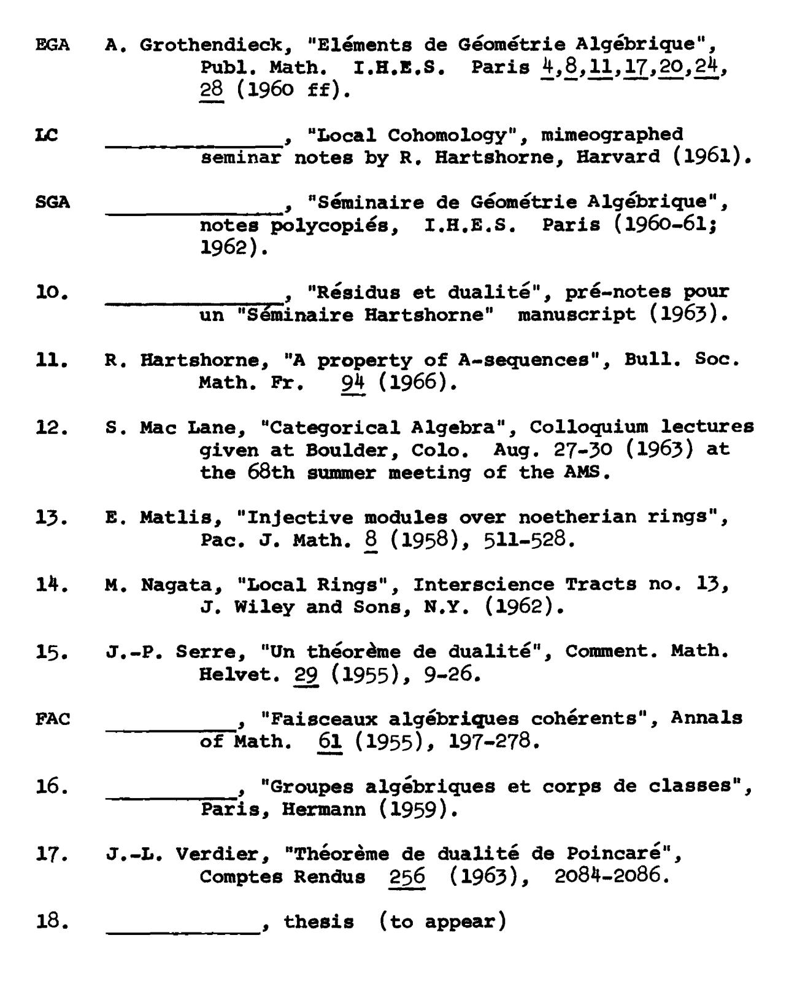
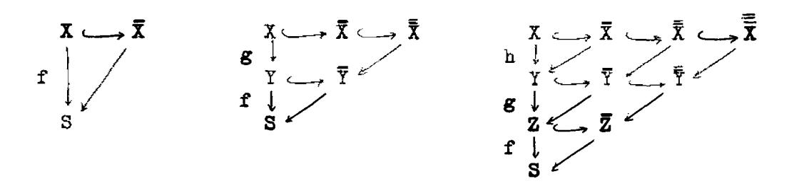
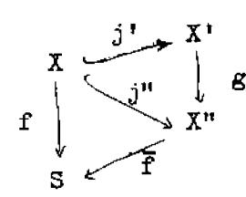

for  $G^* \in D_{qc}^b(Y)$ , satisfying TRA 1-TRA 4 of [III 10.5] (but where TRA 4 is valid for arbitrary base extension).

b) The resulting duality morphism

$$\underline{\Theta}_{f} \colon \underline{R}f_{*} \underline{R} \underline{Hom}_{X}^{\bullet}(F^{\bullet}, f^{\sharp}G^{\bullet}) \longrightarrow \underline{R} \underline{Hom}_{Y}^{\bullet}(\underline{R}f_{*}F^{\bullet}, G^{\bullet})$$

is an isomorphism for  $F^* \in D^{-}_{qc}(X)$  and  $G^* \in D^{b}_{qc}(Y)$ .

Proof. Define  ${\tt Tr}_{\tt f}$  by the projection formula and  ${\tt \gamma}_{\tt f}.$  Details left to reader!

## Index of Definitions

| 4.                             | <b>~</b> ~  |
|--------------------------------|-------------|
| acyclic complex                | I.5         |
| bounded complex                | I.2         |
| Cartan-Eilenberg resolution    | 1.7         |
| catenary                       | V.7         |
| Cech complex                   | III.3       |
| codimension                    | IV.1        |
| codimension function           | v.7         |
| co-finite type module          | <b>v.</b> 5 |
| Cohen-Macaulay complex         | IV.3        |
| Cohen-Macaulay morphism        | <b>v.</b> 9 |
| Cohen-Macaulay-1 ring          | <b>v.</b> 9 |
| Cohen-Macaulay sheaf           | IV.2        |
| cohomological functor          | I.1         |
| complex                        | 1.2         |
| Cousin complex                 | IV.3        |
| Cousin complex of F            | IV.2        |
| ∂-functor                      | 1.1         |
| depth                          | IV.2        |
| derived category               | I.4         |
| derived functor                | <b>I.</b> 5 |
| duality morphism               | III.5       |
| dualizing complex              | V.2         |
| dualizing functor              | <b>v.</b> 5 |
| embeddable morphism            | ııı.8       |
| F-acyclic                      | <b>I.</b> 5 |
| family of supports             | IV.1        |
| filtration associated to a     | -           |
| dualizing complex              | <b>v.</b> 7 |
| finite cohomological dimension | <b>I.</b> 5 |
| finite injective dimension     | I.7         |
| finite Tor-dimension           | II.4        |
| Gorenstein complex             | IV.3        |
| Gorenstein morphism            | III.1, V.9  |
| Gorenstein prescheme           | v.9         |
| Gorenstein ring                | <b>v.</b> 9 |
| homotopy                       | 1.2         |
| hyperext                       | 1.6         |
| Koszul complex                 | 111.7       |
| Krull dimension                | V.2         |
|                                | III.1       |
| local complete intersection    | II.3        |
| local hyperext                 | 11.7        |

| local hyper Tor               | II.4          |
|-------------------------------|---------------|
| localization of a category    | 1.3           |
| localizing subcategory        | I.5           |
| locally noetherian category   | II.7          |
| local parameter               | VII.1         |
| mapping cone                  | 1.2           |
| multiplicative system         | I.3           |
| noetherian object             | 11.7          |
| normalized dualizing complex  | <b>v.</b> 6   |
| pointwise bounded below       | <b>v.</b> 8   |
| pointwise dualizing complex   | <b>v.</b> 8   |
| pointwise finite injective    |               |
| dimension                     | <b>v.</b> 8   |
| projectively embeddable       | III.10        |
| rational point                | VII.1         |
| reflexive complex             | <b>v.</b> 2   |
| regular prescheme             | <b>v.</b> 2   |
| relative differentials        | III.1         |
| residual complex              | VI.1          |
| residually stable morphism    | <b>VI.</b> 5  |
| residue of a differential     | VII.1         |
| residue symbol                | <b>III.</b> 9 |
| sheaf of families of supports | IV.1          |
| smooth morphism               | III.1         |
| translation functor           | I.1           |
| triangle                      | I.1           |
| triangulated category         | I.1           |
| way-out functor               | <b>I.</b> 7   |
| Z/Z'-skeleton                 | IV.2          |

### Index of Notations

Of course there is the usual collection of variable notations: A,B for abelian categories or rings, F,G for functors or sheaves, X,Y for preschemes, x,Y for points of them, f,g for morphisms of preschemes,  $\varphi,\psi$  for morphisms of functors on sheaves, etc. In general no underline denotes a group, as  $\operatorname{Hom}(F,G)$ , one underline denotes a sheaf, as  $\operatorname{Hom}(F,G)$  or  $\operatorname{Tor}(F,G)$ , two underlines denotes an object in a derived category, as  $\operatorname{R} \operatorname{Hom}(F,G)$ , or  $\operatorname{F}^* \operatorname{G}^*$ , and a dot denotes a complex.

In the list of stable notations below, we have distinguished five categories: Latin alphabet, other alphabets, superscripts, subscripts, and arbitrary symbols.

## Latin alphabet

| Ab                       | the category of abelian groups  |             |
|--------------------------|---------------------------------|-------------|
| acc                      | ascending chain condition       | <b>v.</b> 2 |
| Ass                      | associated primes               |             |
| В                        | boundaries of a complex         |             |
| Coh                      | category of coherent sheaves    | II.1        |
| Coz                      | category of Cousin complexes    | IV.3        |
| D                        | dualizing functor               | v.o         |
| D(A)                     | derived category                | I.4         |
| $\mathbf{D}(\mathbf{X})$ | = D(Mod(X))                     | II.1        |
| dec                      | descending chain condition      | <b>v.</b> 2 |
| dim                      | dimension                       |             |
| Dual                     | category of dualizing complexes | VI.1        |

| E<br>Ext<br>Ext<br>fid<br>FR1-FR5 | associated Cousin complex  finite injective dimension axioms of multiplicative systems | IV.2,IV.3<br>I.6<br>II.3<br>I.7.6,II.7.20<br>I.3 |
|-----------------------------------|----------------------------------------------------------------------------------------|--------------------------------------------------|
| H                                 | cohomology                                                                             | I.1,IV.1                                         |
| Hom<br>Hom                        |                                                                                        | 1.6<br>11.3                                      |
| ix                                |                                                                                        | II.7                                             |
| _x                                |                                                                                        | ·                                                |
| Icz                               | category of injective Cousin comple                                                    | exes IV.3                                        |
| id                                | identity map                                                                           |                                                  |
| im 7/22 27/22 27/2                | image                                                                                  | TT 7                                             |
| K(A)                              | ) standard injectives                                                                  | II.7<br>I.2                                      |
| k(x)                              | residue field of a point x                                                             | 1.2                                              |
|                                   | F) Koszul complexes                                                                    | III.7                                            |
| ker (1)                           | kernel                                                                                 | (                                                |
| L1-L3                             | axioms of direct systems                                                               | I.3                                              |
| <del>-</del>                      | left derived functor (by analogy)                                                      | <b>I.</b> 5                                      |
| L<br>Žfřr                         | locally free of finite rank                                                            | II.5                                             |
| Lno                               | category of locally noetherian                                                         | _                                                |
|                                   | preschemes                                                                             | <b>III.</b> 8                                    |
| Mod(X)                            | category of $f_{X}$ -modules                                                           | II.1                                             |
| Ob                                | objects of a category                                                                  |                                                  |
| pfid                              | pointwise finite injective dimensi                                                     | on <b>v.</b> 8                                   |
| Ptwdua1                           | category of pointwise dualizing                                                        |                                                  |
|                                   | complexes                                                                              | VI.1                                             |
| Q                                 | functor into derived category                                                          | <b>I.</b> 3                                      |
| Qco                               | category of quasi-coherent sheaves                                                     |                                                  |
| Qis                               | quasi-isomorphisms                                                                     | I.4                                              |
| R                                 | right derived functor                                                                  | <b>I.</b> 5                                      |
|                                   | residue symbol                                                                         | III.9                                            |
| Res                               | category of residual complexes                                                         | VI.1                                             |
| _                                 | residue of a differential                                                              | VII.1                                            |
| Spec                              | spectrum of a ring                                                                     | TT 6                                             |
| Supp                              | support of a sheaf or module                                                           | II.7                                             |
| T                                 | translation functor                                                                    | I.1<br>II.4                                      |
| Tor<br>Tr                         | t*2.50 m2n                                                                             | III.10,VI.4,VII.1                                |
| TI                                | trace map                                                                              | TTT . TO , VI . 7 , VII . I                      |

| TR1-TR4<br>TRA | axioms of a triangulated category axioms of trace | I.1<br>III 10.5,VI 4.2 |
|----------------|---------------------------------------------------|------------------------|
| tr. d.         | transcendence degree                              | ·                      |
| Trf            | trace for a finite morphism                       | <b>III.</b> 6          |
| Trp            | trace for a projective morphism                   | III.4                  |
| VAR            | axioms for f or f                                 | III 8.7,VI 3.1         |
| Z              | cycles of a complex                               |                        |

# Greek and other alphabets

| γ              | trace for smooth morphism       | III 3.4,III 11.2,<br>VII 4.1 |
|----------------|---------------------------------|------------------------------|
| r              | global sections of a sheaf      |                              |
| ζ<br>η         | change of differentials         | <b>III 1.</b> 5              |
| $\check{\eta}$ | fundamental local isomorphism   | III 7.3                      |
| ⊖              | duality morphism                | III.5,III.6,III.11,          |
|                | •                               | v.6, vII.3                   |
| ξ              | map of a functor to its derived | -                            |
| _              | functor                         | <b>I.</b> 5                  |
| $^{\sigma}$ >n | truncated complex               | I.7                          |
| τ<br>>n        | truncated complex               | 1.7                          |
| <b>*</b>       | residue isomorphism             | 8.111                        |
| w<br>v         | sheaf of differentials          | III.1                        |
| Ω              | sheaf of differentials          | III.1                        |
| o <sub>x</sub> | structure sheaf of a prescheme  |                              |
| 4M             | maximal ideal of a ring         |                              |
| 9              | prime ideal of a ring           |                              |
| <b>₹</b>       | affine space                    |                              |
| <b>I</b> P     | projective space                |                              |
| Œ.             | the rational numbers            |                              |
| Z              | the integers                    |                              |
|                |                                 |                              |

# Subscripts

| A'  | as in K <sub>A</sub> ,(A), D <sub>A</sub> ,(A) | I.4  |
|-----|------------------------------------------------|------|
| c   | as in D <sub>C</sub> (X)                       | II.1 |
| fid | as in D(X)                                     | I.7  |
| fTd | as in D(X)                                     | II.4 |

| Gor(Z°) | as in   | D(X) <sub>Gor</sub> (Z*)                                                              | IV.3 |
|---------|---------|---------------------------------------------------------------------------------------|------|
| 7       | as in   | Ag, Mg: localization at a prime ideal                                                 |      |
| qс      |         | $\mathbf{p}^{dc}(\mathbf{x})$                                                         | II.1 |
|         | ( as in | $g_{\mathbf{x}}$ : local ring at a point $\mathbf{x}$                                 |      |
| ×       | as in   | $\mathbf{F}_{\mathbf{x}}$ : stalk of a sheaf at $\mathbf{x}$                          |      |
|         | as in   | <pre>fy: local ring at a point x Fx: stalk of a sheaf at x Hi: local cohomology</pre> | IV.1 |
| Z       | as in   | $\Gamma_{\!\!\!\mathbf{Z}}$ , $H_{\!\!\!\mathbf{Z}}^{\mathtt{i}}$                     | IV.1 |
| I,II    | as in   | R <sub>I</sub> , R <sub>II</sub>                                                      | 1.6  |
| > n     | as in   | <sup>σ</sup> >n, , , , , , , , , , , , , , , , , , ,                                  | I.7  |
| *       | as in   | f*: direct image                                                                      | II.2 |
|         |         |                                                                                       |      |

## Superscripts

| b  |    |    | K <sup>D</sup> , D <sup>D</sup> : bounded                      | 1.2,1.4     |
|----|----|----|----------------------------------------------------------------|-------------|
|    | as | in | x <sup>i</sup> : i <sup>th</sup> term of a complex             |             |
| i  | as | in | Hi: ith cohomology group                                       |             |
|    | as | in | R <sup>i</sup> F: i <sup>th</sup> derived functor              |             |
| Y  | as | in | f <sup>Y</sup>                                                 | VI.2        |
| z  | as | in | f <sup>z</sup>                                                 | VI.2        |
| •  | as | in | F',X': denotes a complex                                       |             |
| •• | as | in | C': double complex                                             | I.7         |
| •  | as | in | <pre>K(A)*: opposed category</pre>                             |             |
| *  | as | in | f*: inverse image                                              | II.4        |
| +  | as | in | K <sup>+</sup> ,D <sup>+</sup> ,R <sup>+</sup> : bounded below | 1.2,1.4,1.5 |
| -  | as | in | K,D,R: bounded above                                           | 1.2,1.4,1.5 |

```
! as in f<sup>1</sup> Intr.,III.8,VII.3

as in f<sup>1</sup> III.6

# as in f<sup>1</sup> VI.3

as in f<sup>1</sup> VI.3

as in f<sup>1</sup> vI.5.16,III.1

as in {x}: closure

as in M: sheaf associated to a module

as in A: completion of local ring
```

## Arbitrary Symbols

```
restriction
            enough larger than
>>
X
            product
Ø
            tensor product
⊕
            direct sum
П
            product
            disjoint union or sum
1
                                                      1.2
            shift operator
                                                      v.8
            closed interval
            reference to Bibliography
                 or other chapter
                                                      Intro.
            union
Ü
            the set of
            morphism
            effect of a map on elements
            distinguished side of triangle
                                                      I.1
            morphism being constructed
            as in F.G: composition of functors
```

#### BIBLIOGRAPHY

- GT M. Artin, "Grothendieck Topologies", mimeographed seminar notes, Harvard (1962).
- 1. H. Bass, "Injective dimension in noetherian rings", T.A.M.S. 102 (1962), 18-29.
- 2. \_\_\_\_\_, "On the ubiquity of Gorenstein rings",
  Math. Zeitschrift 82 (1963), 8-28.
- M H. Cartan and S. Eilenberg, "Homological Algebra", Princeton University Press (1956).
- 3. C. Chevalley, "Introduction to the theory of algebraic functions of one variable", Amer. Math. Soc. Surveys (1951).
- 4. Eckmann and Schopf, "Über injektive Moduln", Archiv der Math. 4 (1953).
- 5. P. Gabriel, "Des Catégories Abéliennes", Bull. Soc. Math. Fr. 90 (1962), 323-448.
- 6. Giraud, thesis (to appear)
- G R. Godement, "Topologie algébrique et théorie des faisceaux", Hermann, Paris (1958).
- 7. D. Gorenstein, "An arithmetic theory of adjoint plane curves", T.A.M.S. 72 (1952), 414-436.
- A. Grothendieck, "Sur quelque points d'algèbre homologique". Tohoku Math. J. IX (1957), 119-221.
- 8. \_\_\_\_\_\_, "Théorèmes de dualité pour les faisceaux algébriques cohérents", seminaire Bourbaki, no. 149, Secr. Math. I.H.P. Paris (1957).
- 9. \_\_\_\_\_\_, "The cohomology theory of abstract algebraic varieties" in Int. Cong. of Math. at Edinburgh, 1958, Cambridge Univ. Press (1960), 103-118.



- 19. O. Zariski, "Complete linear systems on normal varieties and a generalization of a lemma of Enriques-Severi", Annals of Math. 55 (1952), 552-592.
- on the second summer institute, Part III,
  Bull. Amer. Math. Soc. 62 (1956), 117-141.
- ZS O. Zariski and P. Samuel, "Commutative Algebra", 2 vols., van Nostrand, Princeton (1958,1960).
- 21. M.F. Atiyah and R. Bott, "A Lefschetz fixed point formula for elliptic differential operators", Bull. Amer. Math. Soc. 72 (1966), 245-250.
- 22. A. Grothendieck, "De Rham cohomology of algebraic varieties", to appear, Publ. Math. I.H.E.S.

#### APPENDIX: COHOMOLOGIE A SUPPORT PROPRE

# ET CONSTRUCTION DU FONCTEUR f!.

par P. DELIGNE (1)

Verdier a montré que dans le cas topologique, le formalisme de la dualité de Poincaré se ramenait à des problèmes locaux en haut (voir [1]). Pour transposer sa construction au cadre schématique, il faut disposer d'une théorie de la cohomologie "à support propre" pour les faisceaux cohérents.

Sauf mention explicite du contraire, tous les pré-schémas considérés sont noethériens et les préfaisceaux quasi-cohérents.

## nº 1. Le sorite des pro-objets.

Proposition 1. Soit C une U -catégorie (2) où existent les

<sup>(1)</sup> Ceci est une version complétée d'une lettre de P. Deligne à R. Hartshorne (lettre du 3 Mars 1966). Les notes de bas de page ont été ajoutées par le copiste.

<sup>(2)</sup> U désigne un univers fixé dans toute la suite.

<u>limites inductives finies. Soit</u> h <u>un foncteur</u> C° ---> (ens).

<u>Les conditions suivantes sont équivalentes:</u>

- (i) h <u>est limite inductive</u>, <u>selon un petit</u> (3) <u>ensemble or-</u> donné filtrant, <u>de foncteurs représentables</u>.
- (ii) h <u>est limite inductive</u>, <u>selon ure petite catégorie fil-</u>
  <u>trante</u>, <u>de foncteurs représentables</u>.
- (iii) h transforme lim finies en lim finies, et il existe un petit ensemble d'objets tel que tout élément d'un h(X) se factorise par l'un d'eux.

Les implications (i)  $\Rightarrow$  (ii)  $\Rightarrow$  (iii) sont triviales et (iii)  $\Rightarrow$  (ii) standard (h est limite des h selon la catégorie des (F,  $\alpha$ ) pour  $\alpha \in h(F)$  et F dans la souscatégorie de C stable par lim finie engendrée par le petit ensemble donné). Reste à prouver que (ii)  $\Rightarrow$  (i). Si  $\mathcal{L}$  et  $\mathcal{M}$  sont deux catégories filtrantes, un foncteur  $F: \mathcal{L} \to \mathcal{M}$  est dit cofinal si  $\lim_{\alpha \to \infty} h_{F(L)}$  est le foncteur final. Pour tout  $G: \mathcal{M} \to \mathcal{M}$ , on a alors  $\lim_{\alpha \to \infty} G = \lim_{\alpha \to \infty} G = \lim_{\alpha \to \infty} G = \lim_{\alpha \to \infty} G = \lim_{\alpha \to \infty} G = \lim_{\alpha \to \infty} G = \lim_{\alpha \to \infty} G = \lim_{\alpha \to \infty} G = \lim_{\alpha \to \infty} G = \lim_{\alpha \to \infty} G = \lim_{\alpha \to \infty} G = \lim_{\alpha \to \infty} G = \lim_{\alpha \to \infty} G = \lim_{\alpha \to \infty} G = \lim_{\alpha \to \infty} G = \lim_{\alpha \to \infty} G = \lim_{\alpha \to \infty} G = \lim_{\alpha \to \infty} G = \lim_{\alpha \to \infty} G = \lim_{\alpha \to \infty} G = \lim_{\alpha \to \infty} G = \lim_{\alpha \to \infty} G = \lim_{\alpha \to \infty} G = \lim_{\alpha \to \infty} G = \lim_{\alpha \to \infty} G = \lim_{\alpha \to \infty} G = \lim_{\alpha \to \infty} G = \lim_{\alpha \to \infty} G = \lim_{\alpha \to \infty} G = \lim_{\alpha \to \infty} G = \lim_{\alpha \to \infty} G = \lim_{\alpha \to \infty} G = \lim_{\alpha \to \infty} G = \lim_{\alpha \to \infty} G = \lim_{\alpha \to \infty} G = \lim_{\alpha \to \infty} G = \lim_{\alpha \to \infty} G = \lim_{\alpha \to \infty} G = \lim_{\alpha \to \infty} G = \lim_{\alpha \to \infty} G = \lim_{\alpha \to \infty} G = \lim_{\alpha \to \infty} G = \lim_{\alpha \to \infty} G = \lim_{\alpha \to \infty} G = \lim_{\alpha \to \infty} G = \lim_{\alpha \to \infty} G = \lim_{\alpha \to \infty} G = \lim_{\alpha \to \infty} G = \lim_{\alpha \to \infty} G = \lim_{\alpha \to \infty} G = \lim_{\alpha \to \infty} G = \lim_{\alpha \to \infty} G = \lim_{\alpha \to \infty} G = \lim_{\alpha \to \infty} G = \lim_{\alpha \to \infty} G = \lim_{\alpha \to \infty} G = \lim_{\alpha \to \infty} G = \lim_{\alpha \to \infty} G = \lim_{\alpha \to \infty} G = \lim_{\alpha \to \infty} G = \lim_{\alpha \to \infty} G = \lim_{\alpha \to \infty} G = \lim_{\alpha \to \infty} G = \lim_{\alpha \to \infty} G = \lim_{\alpha \to \infty} G = \lim_{\alpha \to \infty} G = \lim_{\alpha \to \infty} G = \lim_{\alpha \to \infty} G = \lim_{\alpha \to \infty} G = \lim_{\alpha \to \infty} G = \lim_{\alpha \to \infty} G = \lim_{\alpha \to \infty} G = \lim_{\alpha \to \infty} G = \lim_{\alpha \to \infty} G = \lim_{\alpha \to \infty} G = \lim_{\alpha \to \infty} G = \lim_{\alpha \to \infty} G = \lim_{\alpha \to \infty} G = \lim_{\alpha \to \infty} G = \lim_{\alpha \to \infty} G = \lim_{\alpha \to \infty} G = \lim_{\alpha \to \infty} G = \lim_{\alpha \to \infty} G = \lim_{\alpha \to \infty} G = \lim_{\alpha \to \infty} G = \lim_{\alpha \to \infty} G = \lim_{\alpha \to \infty} G = \lim_{\alpha \to \infty} G = \lim_{\alpha \to \infty} G = \lim_{\alpha \to \infty} G = \lim_{\alpha \to \infty} G = \lim_{\alpha \to \infty} G = \lim_{\alpha \to \infty} G = \lim_{\alpha \to \infty} G = \lim_{\alpha \to \infty} G = \lim_{\alpha \to \infty} G = \lim_{\alpha \to \infty} G = \lim_{\alpha \to \infty} G = \lim_{\alpha \to \infty} G = \lim_{\alpha \to \infty} G = \lim_{\alpha \to \infty} G = \lim_{\alpha \to \infty} G = \lim_{\alpha \to \infty} G = \lim_{\alpha \to \infty} G = \lim_{\alpha \to \infty} G = \lim_{\alpha \to \infty} G = \lim_{\alpha \to \infty} G = \lim_{\alpha \to \infty} G = \lim_{\alpha \to \infty} G = \lim_{\alpha \to \infty} G = \lim_{\alpha \to \infty} G = \lim_{\alpha \to \infty} G = \lim_{\alpha \to \infty} G = \lim$ 

lemme. Pour toute petite catégorie filtrante  $\checkmark$ , il existe un foncteur cofinal d'un petit ensemble ordonné filtrant dans  $\checkmark$ .

La première projection :  $\mathcal{L} \times \mathbb{N} \longrightarrow \mathcal{L}$  , est un foncteur cofinal (N muni de l'ordre naturel) ; ceci permet de se

<sup>(3) &</sup>quot;petit" = "  $\in U$ ".

ramener à supposer que  $0b\mathcal{L}$ , préordonné par  $\text{Hom}(X,Y) \neq \emptyset$ , n'a pas de plus grand élément. On ordonne par inclusion l'ensemble E des sous-catégories finies de  $\mathcal{L}$  ayant un seul objet final (fini signifie d'ensemble de flèches fini). On définit un foncteur de E dans  $\mathcal{L}$  en associant à chacune de ces catégories son objet final. Sous les hypothèses faites, E est filtrant et ce foncteur cofinal.

Les foncteurs vérifiant les conditions équivalentes de la proposition 1 sont les Ind -objets de C . Ils forment une sous-catégorie pleine Ind C de  $\underline{\text{Hom}}$  (C°, (Ens)), stable par limite inductive.  $C \longmapsto \text{Ind } C$  est un foncteur (cat) $\rightarrow$ (cat). Si les limites inductives filtrantes existent dans C, pour tout  $h \in \text{Ind } C$ , le foncteur  $X \longrightarrow \text{Hom } (h, h_{\overline{X}})$  est coreprésentable, d'où un foncteur, noté  $\varinjlim$ , de Ind C dans C. En particulier, on a toujours un foncteur Ind Ind  $C \longrightarrow \text{Ind } C$ , et tout foncteur  $C \longrightarrow \text{Ind } O$  se prolonge en un foncteur Ind  $C \longrightarrow \text{Ind } O$ . Dans Ind C, les limites inductives filtrantes sont exactes, et seront notées "lim"; en particulier, identifiant C à une sous-catégorie pleine de Ind C, si  $(X_i)_{i \in I}$  est un système inductif filtrant dans C,  $\frac{\lim_{i \in I} X_i}{\inf} = \frac{\lim_{i \in I} \|\lim_{i \in I} X_i\|_{i \in I}$ 

Pour qu'un foncteur sur Ind C soit représentable, il faut et suffit qu'il transforme lim finies en lim finies, lim filtrantes en lim filtrantes et que sa restriction à C satisfasse à la condition de petitesse de la prop. 1 (iii) (en

effet, la proposition 1 montre alors que sa restriction à C est un Ind -objet, auquel il est partout égal vu la condition sur les limites).

Ce qui précède, sauf la prop. 1 (iii) et l'assertion précédente reste vrai en utilisant partout des limites de suites (ou dénombrables, c'est la même chose).

On définit par dualité la catégorie pro C des pro-objets (sous-catégorie pleine de  $\underline{\text{Hom}}$  (C, (Ens))°) .

Proposition 2. Soit X un préschéma quasi-compact quasi-séparé

(non nécessairement noethérien). La catégorie des faisceaux

quasi-cohérents sur X est équivalente à la catégorie des Ind 
objets de la catégorie des faisceaux quasi-cohérents de présen
tation finie sur X .

La flêche est "lim"  $f_i \mapsto \lim_{i \to \infty} f_i$ . Si  $f_i$  est de p.f. (présentation finie), pour tout système inductif filtrant  $(g_i)_{i \in I}$ ,  $f_i \mapsto \lim_{i \to \infty} g_i = \lim_{i \to \infty} f_i \mapsto \lim_{i \to \infty} f_i$  (par un recollement fini qui commute à  $\lim_{i \to \infty} f_i \mapsto \lim_{i \to \infty} f_i$  (par un recollement fini qui commute à  $\lim_{i \to \infty} f_i \mapsto \lim_{i \to \infty} f_i$  (par un recollement fini qui commute à  $\lim_{i \to \infty} f_i$  on se ramène au cas affine). Le foncteur précédent est donc pleinement fidèle. Son image est stable par limites inductives filtrantes et sommes finies. Il suffit de prouver que pour tout  $f_i \mapsto f_i \mapsto f_i$  tout  $f_i \mapsto f_i \mapsto f_i \mapsto f_i \mapsto f_i$  dans  $f_i \mapsto f_i \mapsto f_i \mapsto f_i \mapsto f_i \mapsto f_i \mapsto f_i \mapsto f_i \mapsto f_i \mapsto f_i \mapsto f_i \mapsto f_i \mapsto f_i \mapsto f_i \mapsto f_i \mapsto f_i \mapsto f_i \mapsto f_i \mapsto f_i \mapsto f_i \mapsto f_i \mapsto f_i \mapsto f_i \mapsto f_i \mapsto f_i \mapsto f_i \mapsto f_i \mapsto f_i \mapsto f_i \mapsto f_i \mapsto f_i \mapsto f_i \mapsto f_i \mapsto f_i \mapsto f_i \mapsto f_i \mapsto f_i \mapsto f_i \mapsto f_i \mapsto f_i \mapsto f_i \mapsto f_i \mapsto f_i \mapsto f_i \mapsto f_i \mapsto f_i \mapsto f_i \mapsto f_i \mapsto f_i \mapsto f_i \mapsto f_i \mapsto f_i \mapsto f_i \mapsto f_i \mapsto f_i \mapsto f_i \mapsto f_i \mapsto f_i \mapsto f_i \mapsto f_i \mapsto f_i \mapsto f_i \mapsto f_i \mapsto f_i \mapsto f_i \mapsto f_i \mapsto f_i \mapsto f_i \mapsto f_i \mapsto f_i \mapsto f_i \mapsto f_i \mapsto f_i \mapsto f_i \mapsto f_i \mapsto f_i \mapsto f_i \mapsto f_i \mapsto f_i \mapsto f_i \mapsto f_i \mapsto f_i \mapsto f_i \mapsto f_i \mapsto f_i \mapsto f_i \mapsto f_i \mapsto f_i \mapsto f_i \mapsto f_i \mapsto f_i \mapsto f_i \mapsto f_i \mapsto f_i \mapsto f_i \mapsto f_i \mapsto f_i \mapsto f_i \mapsto f_i \mapsto f_i \mapsto f_i \mapsto f_i \mapsto f_i \mapsto f_i \mapsto f_i \mapsto f_i \mapsto f_i \mapsto f_i \mapsto f_i \mapsto f_i \mapsto f_i \mapsto f_i \mapsto f_i \mapsto f_i \mapsto f_i \mapsto f_i \mapsto f_i \mapsto f_i \mapsto f_i \mapsto f_i \mapsto f_i \mapsto f_i \mapsto f_i \mapsto f_i \mapsto f_i \mapsto f_i \mapsto f_i \mapsto f_i \mapsto f_i \mapsto f_i \mapsto f_i \mapsto f_i \mapsto f_i \mapsto f_i \mapsto f_i \mapsto f_i \mapsto f_i \mapsto f_i \mapsto f_i \mapsto f_i \mapsto f_i \mapsto f_i \mapsto f_i \mapsto f_i \mapsto f_i \mapsto f_i \mapsto f_i \mapsto f_i \mapsto f_i \mapsto f_i \mapsto f_i \mapsto f_i \mapsto f_i \mapsto f_i \mapsto f_i \mapsto f_i \mapsto f_i \mapsto f_i \mapsto f_i \mapsto f_i \mapsto f_i \mapsto f_i \mapsto f_i \mapsto f_i \mapsto f_i \mapsto f_i \mapsto f_i \mapsto f_i \mapsto f_i \mapsto f_i \mapsto f_i \mapsto f_i \mapsto f_i \mapsto f_i \mapsto f_i \mapsto f_i \mapsto f_i \mapsto f_i \mapsto f_i \mapsto f_i \mapsto f_i \mapsto f_i \mapsto f_i \mapsto f_i \mapsto f_i \mapsto f_i \mapsto f_i \mapsto f_i \mapsto f_i \mapsto f_i \mapsto f_i \mapsto f_i \mapsto f_i \mapsto f_i \mapsto f_i \mapsto f_i \mapsto f_i \mapsto f_i \mapsto f_i \mapsto f_i \mapsto f_i \mapsto f_i \mapsto f_i \mapsto f_i \mapsto f_i \mapsto f_i \mapsto f_i \mapsto f_i \mapsto f_i \mapsto f_i \mapsto f_i \mapsto f_i \mapsto f_i \mapsto f_i \mapsto f_i \mapsto f_i \mapsto f_i \mapsto f_i \mapsto f_i \mapsto f_i \mapsto f_i \mapsto f_i \mapsto f_i \mapsto f_i \mapsto f_i \mapsto f_i \mapsto f_i \mapsto f_i \mapsto f_i \mapsto f_i \mapsto f_i \mapsto f_i \mapsto f_i \mapsto f_i \mapsto f_i \mapsto$ 

F sera limite d'images de fai sceaux de p.f. et chacune d'elles quotient d'un faisceau de p.f. par une limite de sous-faisceaux

de type fini.

Soit <u>sur</u> un voisinage quasi-compact U de x une flêche  $f: \mathcal{C} \longrightarrow \mathcal{F}$ ,  $\mathcal{C}$  de p.f., s dans l'image. Il suffit de prolonger  $\mathcal{C}$  et f à X entier, et, procédant pas à pas, il suffit de savoir prolonger à  $U \cup V$  si V est affine, ce qui revient à effectuer un prolongement de  $U \cap V$  à V:

Lemme. Soit & un faisceau de p.f. sur un ouvert quasi-compact

U d'un schéma affine X , F un faisceau sur X et f une

flêche de & dans F U . Il est possible de prolonger & et

f en & et f , définis sur X ( & étant de p.f.).

Soit  $\iota$  l'inclusion de U dans X et  $\mathcal{C}_1$  le produit fibré de  $\iota_*\mathcal{C}$  et  $\exists$  sur  $\iota_*\iota^*\exists$ .  $\mathcal{C}_1$  prolonge  $\mathcal{C}$  et s'envoie dans  $\exists$ . Si on représente  $\mathcal{C}_1$  comme limite de ses sous-faisceaux de type fini, comme U est quasi-compact et  $\mathcal{C}$  de p.f;, l'un d'eux prolonge déjà  $\mathcal{C}$ . Si on représente ce dernier comme quotient de  $\mathcal{C}^n$  par une limite de sous-faisceaux de type fini de  $\mathcal{C}^n$ , on voit de même qu'on peut remplacer  $\mathcal{C}_1$  par un faisceau de p.f.

Cor 1. Pour qu'un foncteur contravariant additif F:

(q coh) → Ab soit représentable, il faut et suffit qu'il

soit exact à gauche et transforme lim filtrante en lim filtrante.

Cor 2. Tout faisceau de p.f. défini sur un ouvert quasi-compact

### U de X se prolonge en un faisceau de p.f. sur X .

Soit  $\mathcal A$  une catégorie abélienne. On aura à travailler de façon essentielle dans pro  $\mathbb D^b\mathcal A$ , sous-catégorie pleine de pro  $\mathbb D(\mathcal A)$  formée des "lim"  $K_i$  où la cohomologie de K est uniformément bornée avec i .  $\mathbb H^p$  se prolonge en un foncteur pro  $\mathbb D(\mathcal A)$   $\longrightarrow$  pro  $\mathcal A$  .

Proposition 3. Les foncteurs  $\mathbb{H}^p$  forment un système conservatif (4) de foncteurs sur pro  $\mathbb{D}^b \mathcal{A}$ .

Soit  $f: K \to L$  une flêche de pro  $D^b \mathcal{A}$  telle que les  $H^p(K) \to H^p(L)$  soient des isomorphismes (dans pro  $\mathcal{A}$ ). Il s'agit de vérifier que pour tout M dans  $D^b(\mathcal{A})$ ,  $Hom(K,M) \longleftarrow Hom(L,M)$  est un isomorphisme. Pésons  $K = \text{"lim"}K_{\kappa'}$ . On dispose d'une suite spectrale convergente

 $\begin{array}{cccccccccccccccccccccccccccccccccccc$ 

 $\underset{\longrightarrow}{\text{lim}} \ \text{Ext}^{p}(H^{q}K,M) \implies \underset{\longrightarrow}{\text{lim}} \ \text{Ext}^{p+q}(K,M) = \text{Hom } (K [-p-q],M)$ 

Cette suite spectrale reste d'ailleurs vraie pour  $\mathbf{M} \in \mathtt{D}(\mathcal{A}) \quad \text{. La proposition résulte aussitôt de l'existence de ces suites.}$ 

<sup>(4)</sup> i.e. si u est une flêche telle que les  $H^{p}(u)$  soient inversibles, u est inversible.

### nº 2. Lemmes fondamentaux.

Rappelons que les préschémas considérés sont noethé-riens.

Proposition 4. (Théorème de dualité pour une immersion ouverte).

Soient U un ouvert de X , j la flêche d'inclusion, J un idéal définissant le fermé complémentaire, F un faisceau cohérent sur U et g quasi-cohérent sur X . Soit J un prolongement cohérent de F . On a

$$Hom_{\mathbf{U}}(\mathcal{F}, j^*\mathcal{G}) = Hom_{\mathbf{X}}(\text{"lim"} J^n \mathcal{F}, \mathcal{G})$$
 (5)

La flêche  $\varinjlim \operatorname{Hom}_X(\mathfrak{I}^n\overline{\mathfrak{I}},\mathfrak{J}) \longrightarrow \operatorname{Hom}_U(\mathfrak{I},\mathfrak{J})$  est injective: si l'image par f de  $\mathfrak{I}^n\overline{\mathfrak{I}}$  dans  $\mathfrak{J}$  a son support dans le complémentaire de U, elle est annulée par une puissance de  $\mathfrak{I}$ , soit  $\mathfrak{I}^k$ , et l'image de  $\mathfrak{I}^{n+k}\overline{\mathfrak{I}}$  est nulle.

Supposons maintenant X affine et soit  $f \in \operatorname{Hom}_U(\mathcal{F},\mathcal{G})$ . Pour k assez grand, toute section s de  $\mathcal{I}^k \overline{\mathcal{F}}$  sur X a une image (sur U) qui se prolonge en une section de  $\mathcal{G}$  sur X . Remplaçant  $\overline{\mathcal{F}}$  par  $\mathcal{I}^k \overline{\mathcal{F}}$ , on peut supposer disposer d'un diagramme

$$0 \longrightarrow R \longrightarrow O^{n} \longrightarrow J \longrightarrow 0$$

$$0 \longrightarrow R_{1} \longrightarrow O^{n} \longrightarrow J$$

<sup>(5)</sup> Cette formule est évidemment bien connue, cf. p. ex. la thèse de P. GABRIEL.

où les flèches pointillées sont définies sur U . Pour  $\ell$  assez grand, en vertu de Krull et du fait que  $R/R \cap R_1$  est concentré hors de U , on a  $R \cap J^{\ell} \cdot \Theta^n \subset R_1$  , ce qui permet de prolonger f en  $\overline{f}: J^{\ell} \mathcal{F} \to \mathcal{G}$ .

Dans le cas général  $U_i$  un recouvrement affine fini de X et  $U_{ijk}$  des recouvrements affins finis des  $U_{ij} = U_i \cap U_j$ . Les lim commutent aux produits finis, d'où :

$$0 \longrightarrow \operatorname{Hom}_{\mathbf{U}}(\mathfrak{F}, \mathbf{j}^*\mathfrak{P}) \longrightarrow \prod_{\mathbf{i}} \operatorname{Hom}_{\mathbf{U}, \mathbf{i}}(\mathfrak{F}, \mathbf{j}^*\mathfrak{P}) \rightrightarrows_{\mathbf{i}, \mathbf{j}, \mathbf{k}} \operatorname{Hom}_{\mathbf{U}_{\mathbf{i}, \mathbf{j}, \mathbf{k}}}(\mathfrak{F}, \mathbf{j}^*\mathfrak{P}) \xrightarrow{\uparrow_{\mathbf{i}}} \underset{\mathbf{i}, \mathbf{j}, \mathbf{k}}{\text{Im}} \operatorname{Hom}_{\mathbf{U}_{\mathbf{i}}}(\mathfrak{F}, \mathbf{j}^*\mathfrak{P}) \xrightarrow{\downarrow_{\mathbf{i}, \mathbf{j}, \mathbf{k}}} \underset{\mathbf{i}, \mathbf{j}, \mathbf{k}}{\text{Im}} \operatorname{Hom}_{\mathbf{U}_{\mathbf{i}, \mathbf{j}, \mathbf{k}}}(\mathfrak{F}, \mathbf{j}^*\mathfrak{P}, \mathbf{j}) \xrightarrow{\downarrow_{\mathbf{i}, \mathbf{j}, \mathbf{k}}} \underset{\mathbf{i}, \mathbf{j}, \mathbf{k}}{\text{Im}} \operatorname{Hom}_{\mathbf{U}_{\mathbf{i}, \mathbf{j}, \mathbf{k}}}(\mathfrak{F}, \mathbf{j}^*\mathfrak{P}, \mathbf{j})$$
ce qui achève la démonstration.

La proposition 4 donne une formule explicite pour le foncteur (coh sur U) -----------------------------------

<u>Proposition 5</u>. (Indépendance de la compactification).

$$\begin{array}{cccccccccccccccccccccccccccccccccccc$$

<sup>(6)</sup> Cette terminologie et notation conflictent évidemment avec ceux généralement admis (livre de Godement, SGA 1962 ...). Le lecteur préfèrera peut-être lire j, au lieu de j,

- et f<sup>-1</sup>(U) . Soit I un faisceau d'idéaux définissant Y U,
  \net soit I = f\*I . Si I est cohérent sur X , on a
- (i) si k>0, le système projectif Rkf\* J n + est essentiellement nul (i.e. définit le proobjet nul)
- (ii) si k = 0, pour n assez grand,  $f_*J^{n+1}J = J.f_*J^nJ$ On:a

 $\sum_{n=0}^{\infty} R^k f_* J^n \mathcal{F} \text{ est un } \sum_{n=0}^{\infty} J^n \text{ -module de type fini (EGA III)}$   $\text{donc pour n assez grand, } J \otimes R^k f_* J^n \mathcal{F} \longrightarrow R^k f_* J^{n+1} \mathcal{F} \text{ est sur-}$   $\text{jectif ; (ii) en résulte. Si } k > 0 \text{ , } R^k f_* \text{ est nul sur } U \text{ ;}$   $\text{il existe N tel que } J^N R^k f_* J^n \mathcal{F} \text{ soit nul (quel que soit n).}$  Le diagramme

$$J^{\mathbf{p}} \otimes R^{\mathbf{k}} f_{*} J^{\mathbf{n}} \mathcal{F} \longrightarrow R^{\mathbf{k}} f_{*} J^{\mathbf{n}+\mathbf{p}} \mathcal{F} \longrightarrow 0 \quad (\text{si } \mathbf{n} \mathbf{n}_{0})$$

$$\downarrow \qquad \qquad \downarrow \qquad \qquad \downarrow$$

$$J^{\mathbf{p}} \cdot R^{\mathbf{k}} f_{*} J^{\mathbf{n}} \mathcal{F} \longrightarrow R^{\mathbf{k}} f_{*} J^{\mathbf{n}} \mathcal{F}$$

prouve que pour N assez grand et k > 0 ,

$$R^k f_* J^{n+N} J \longrightarrow R^k f_* J^n J$$
 est nul, soit (i).

# n° 3. Définition de Rf! .

Un morphisme f (resp un couple de morphismes composables, resp. un triple ...) sera dit compactifiable si on peut respectivement trouver des diagrammes commutatifs



où les flêches horizontales sont des immersions ouvertes et les flêches obliques sont propres. Tout morphisme compactifiable est séparé de type fini, et Nagata affirme dans [2] que sa démonstration prouve la réciproque pour les schémas noethériens intègres, mais les hypothèses qu'il fait sur la base ne sont pas claires (7).

On se propose, pour tout f compactifiable, de définir Rf:  $\operatorname{proD}_{\operatorname{coh}}^b(X) \longrightarrow \operatorname{proD}_{\operatorname{coh}}^b(S)$ . Rappelons que la catégorie  $\operatorname{D}_{\operatorname{coh}}^b(S)$ , catégorie dérivée bornée de la catégorie des faisceaux cohérents sur S, est sous-catégorie pleine de la catégorie dérivée de celle de tous les faisceaux (non nécessairement quasi-cohérents) sur S, l'image essentielle étant formée des complexes à cohomologie cohérente et bornée.

Si f est propre, on dispose de  $\mathrm{Rf}_*\colon \mathrm{D}^b_{\operatorname{coh}}(X) \longrightarrow \mathrm{D}^b_{\operatorname{coh}}(S)$ , de dimension finie, qui induit  $\mathrm{Rf}_!: \mathrm{proD}^b_{\operatorname{coh}}(X) \longrightarrow \mathrm{proD}^b_{\operatorname{coh}}(S)$ . Si f est une immersion ouverte,  $\mathrm{f}_!: (\mathrm{coh}\ \mathrm{sur}\ X) \longrightarrow \mathrm{pro}(\mathrm{coh}\ \mathrm{sur}S)$  induit  $\mathrm{D}^b(\mathrm{coh}\ \mathrm{sur}\ X) \longrightarrow \mathrm{D}^b$  pro (coh sur S) qui s'envoie dans pro  $\mathrm{D}^b_{\operatorname{coh}}(S)$ , et cette flêche se prolonge en  $\mathrm{Rf}_!: \mathrm{proD}^b_{\operatorname{coh}}(X) \longrightarrow \mathrm{proD}^b_{\operatorname{coh}}(S)$ . Si on prolonge le complexe

<sup>(7)</sup> Mumford aurait vérifié via la démonstration de Nagata que tout morphisme séparé de type fini des schémas noethériens est compactifiable.

cohérent K sur X en  $\overline{K}$  sur S , son image est "lim"  $\int^n \overline{K}$  , où J définit S-X.

Pour un composé f = gh (g propre, h immersion ouverte) on prend Rf, = Rg, Rh, . Il faut vérifier.

#### Indépendance de la compactification.

Considérons un diagramme commutatif



où j' et j\* sont des immersions ouverf f f f f f f f f f  $R\overline{f}_{*}Rj^{"}_{,} = R(\overline{f}g)_{*}Rj^{!}_{,}$ , soit encore,

puisque  $R(\overline{f}g)_{*} = R\overline{f}_{*} Rg_{*}$ , que  $Rj_{!}^{"} = Rg_{*} Rj_{!}^{"}$ . On se ramène à supposer X dense dans X', pour être dans les conditions de la proposition 5. Soit K un complexe cohérent borné sur X , prolongé en  $\overline{K}$  sur X' .  $g_{\underline{k}}\overline{K}$  prolonge K sur X'' , et on a une flêche

$$g_{*} \exists^{n} \overline{K} \longrightarrow Rg_{*} \exists^{n} \overline{K}$$
 (1)

' désigne un faisceau d'idéaux qui définit X' X . La prop. 5 (ii) montre que  $j^n_{\underline{I}}K = \lim_{\underline{I} \to \underline{I}} g_{\underline{K}}^{\underline{I}} \cdot \overline{K}$ . Par passage à la "limite", on trouve "lim"  $R^p g_* J^{n} \overline{K}^q \implies "lim" R^{p+q} g_* J^{n} \overline{K}$ , la proposition 5 (i) montre que cette suite spectrale dégénère, et il résulte de la prop. 3 que la flêche déduite de (1) par passage à la "limite" est un isomorphisme, d'où la formule voulue.

#### Il reste à vérifier

a) pour tout diagramme, on a une compatibilité

$$\begin{array}{cccccccccccccccccccccccccccccccccccc$$

Comme deux compactifiactions peuvent toujours être coiffées par une troisième (par exemple X' x X"), ceci suffit à prouver S l'indépendance de l'arbitraire.

- b) pour tout couple compactifiable, une identification
  Rfg; = Rf; Rg;
- c) pour tout triple compactifiable, une compatibilité

On aurait alors prouvé

Théorème 1. Pour  $f: X \longrightarrow Y$  compactifiable,  $K \in \operatorname{proD}_{\operatorname{coh}}^b(X)$ ,  $L \in \operatorname{proD}_{\operatorname{coh}}^b(Y)$  posons  $\operatorname{Hom}_f(K,L) = \operatorname{Hom}_Y(\operatorname{Rf}_!K,L)$ . Modulo des questions de compactificabilité, on fait ainsi des catégories  $\operatorname{proD}_{\operatorname{coh}}^b(X)$  une catégorie cofibrée sur les préschémas noethériens (les flâches étant compactifiables ...)

# n° 4. Définition de Rf!.

Il résulte d'un tapis général de Verdier [1] que le foncteur  $Rf_*: D(X) \longrightarrow D(S)$  a un adjoint à <u>droite</u>  $D^+(S) \longrightarrow D^+(X)$ ; il ne mérite un nom, soit  $Rf^!$ , que pour f propre, et sa définition ne se prête pas directement au calcul.

Il faut tout d'abord expliciter un procédé de calcul de Rf\* au niveau des complexes, du type Rf\*\_K = f\*\_C\*(K) où C\* est une résolution acyclique finie dépendant de façon fonctorielle, exacte, et compatible avec les limites inductives filtrantes de l'objet auquel on l'applique. A ce moment, pour tout injectif I sur S , Hom(f\*\_C^p \( \frac{1}{2} \), I) est exact en quasi-cohérent sur X , et transforme  $\lim_{n \to \infty} f_n = \lim_{n \to \infty} f_n = \lim_{n \to \infty} f_n = \lim_{n \to \infty} f_n = \lim_{n \to \infty} f_n = \lim_{n \to \infty} f_n = \lim_{n \to \infty} f_n = \lim_{n \to \infty} f_n = \lim_{n \to \infty} f_n = \lim_{n \to \infty} f_n = \lim_{n \to \infty} f_n = \lim_{n \to \infty} f_n = \lim_{n \to \infty} f_n = \lim_{n \to \infty} f_n = \lim_{n \to \infty} f_n = \lim_{n \to \infty} f_n = \lim_{n \to \infty} f_n = \lim_{n \to \infty} f_n = \lim_{n \to \infty} f_n = \lim_{n \to \infty} f_n = \lim_{n \to \infty} f_n = \lim_{n \to \infty} f_n = \lim_{n \to \infty} f_n = \lim_{n \to \infty} f_n = \lim_{n \to \infty} f_n = \lim_{n \to \infty} f_n = \lim_{n \to \infty} f_n = \lim_{n \to \infty} f_n = \lim_{n \to \infty} f_n = \lim_{n \to \infty} f_n = \lim_{n \to \infty} f_n = \lim_{n \to \infty} f_n = \lim_{n \to \infty} f_n = \lim_{n \to \infty} f_n = \lim_{n \to \infty} f_n = \lim_{n \to \infty} f_n = \lim_{n \to \infty} f_n = \lim_{n \to \infty} f_n = \lim_{n \to \infty} f_n = \lim_{n \to \infty} f_n = \lim_{n \to \infty} f_n = \lim_{n \to \infty} f_n = \lim_{n \to \infty} f_n = \lim_{n \to \infty} f_n = \lim_{n \to \infty} f_n = \lim_{n \to \infty} f_n = \lim_{n \to \infty} f_n = \lim_{n \to \infty} f_n = \lim_{n \to \infty} f_n = \lim_{n \to \infty} f_n = \lim_{n \to \infty} f_n = \lim_{n \to \infty} f_n = \lim_{n \to \infty} f_n = \lim_{n \to \infty} f_n = \lim_{n \to \infty} f_n = \lim_{n \to \infty} f_n = \lim_{n \to \infty} f_n = \lim_{n \to \infty} f_n = \lim_{n \to \infty} f_n = \lim_{n \to \infty} f_n = \lim_{n \to \infty} f_n = \lim_{n \to \infty} f_n = \lim_{n \to \infty} f_n = \lim_{n \to \infty} f_n = \lim_{n \to \infty} f_n = \lim_{n \to \infty} f_n = \lim_{n \to \infty} f_n = \lim_{n \to \infty} f_n = \lim_{n \to \infty} f_n = \lim_{n \to \infty} f_n = \lim_{n \to \infty} f_n = \lim_{n \to \infty} f_n = \lim_{n \to \infty} f_n = \lim_{n \to \infty} f_n = \lim_{n \to \infty} f_n = \lim_{n \to \infty} f_n = \lim_{n \to \infty} f_n = \lim_{n \to \infty} f_n = \lim_{n \to \infty} f_n = \lim_{n \to \infty} f_n = \lim_{n \to \infty} f_n = \lim_{n \to \infty} f_n = \lim_{n \to \infty} f_n = \lim_{n \to \infty} f_n = \lim_{n \to \infty} f_n = \lim_{n \to \infty} f_n = \lim_{n \to \infty} f_n = \lim_{n \to \infty} f_n = \lim_{n \to \infty} f_n = \lim_{n \to \infty} f_n = \lim_{n \to \infty} f_n = \lim_{n \to \infty} f_n = \lim_{n \to \infty} f_n = \lim_{n \to \infty} f_n = \lim_{n \to \infty} f_n = \lim_{n \to \infty} f_n = \lim_{n \to \infty} f_n = \lim_{n \to \infty} f_n = \lim_{n \to \infty} f_n = \lim_{n \to \infty} f_n = \lim_{n \to \infty} f_n = \lim_{n \to \infty} f_n = \lim_{n \to \infty}$ 

Voici comment définir une telle résolution :

- 1) Si S est séparé: on prend un recouvrement fini de X par des ouverts affines sur S (par exemple affines) et  $Rf_*K = f_*\check{C}(\mathsf{U},K) \quad \text{(complexe de Čech alterné)}$
- 2) Sinon: les résolutions flasques canoniques ont ici deux défauts: a) f\*C\* n'est plus quasi-cohérent; cela ne porte pas à conséquence tant que, comme ici, les injectifs quasi-cohérents sont injectifs en tant que faisceaux.

b)  $C^*$  ne commute pas aux limites inductives filtrantes. Il est facile de corriger ce défaut : on représente quasi-cohérent comme  $\exists = \varinjlim \exists_i \ (\exists_i \ de \ présentation \ finie)$  et on pose  $C^{**} + \varinjlim C^* = \varinjlim C^*$ . Cela ne dépend pas de l'arbitraire.

Pour une immersion ouverte, on prendra  $Rf^!K = f^*K$ . Pour un morphisme composé f = gh (g propre, h immersion ouverte), on prendra  $Rf^! = Rg^!Rh^!$ . Mettant bout à bout la proposition 4 et ce qui précède, on trouve

Théorème 2. (Dualité) Soit  $f: X \longrightarrow S$  compactifiable, f = gh.

Les foncteurs  $Rf_!: proD_{coh}^b(X) \longrightarrow proD_{coh}^b(S)$  et  $Rf^!: D^+(S) \longrightarrow D^+(X)$  sont "adjoints" l'un de l'autre.

Il faudrait vérifier l'indépendance de la compactification et un sorite de compatibilités et d'identifications analogue au cas de Rf. Des cas particuliers du formulaire résultent de la formule d'adjonction (unicité d'un vrai adjoint ...)

On pourra dans le cas général s'appuyer sur la propo-sition suivante :

Proposition 6. Soit  $f: X \longrightarrow S$  compactifiable et  $L \in D_{qc}^+(S)$ .

La fibre en  $x \in X$  de  $\mathcal{R}^p$  Rf<sup>!</sup>L est donnée par

$$(\mathcal{H}^{p}Rf^{l}L)_{x} = \underset{x \in U}{\underline{\lim}} \operatorname{Hom}_{S}^{p} (Rf_{l}(U, \Theta_{U}), L)$$

On peut supposer X propre et L donné comme complexe de fais-ceaux injectifs quasi-cohérents. Soient U un ouvert affine de

X et J un idéal qui définit X V .

$$(\mathcal{H}^{p}Rf^{!}L)(U) = H^{p}(Rf^{!}L(U)) = H^{p} Hom_{ij} (\theta,Rf^{!}L)$$

- =  $H^p \underset{X}{\lim} Hom_{X} (J^n, Rf^!L) = \underset{X}{\lim} Hom_{S}^p (Rf_*J^n, L)$
- =  $\operatorname{Hom}_{S}^{p}(\operatorname{Rf}_{1}(U,\mathcal{O}_{U}),L)$  La proposition en résulte.

On supposera admis pour Rf un formalisme de varian-ce analogue à celui du théorème 1 pour Rf .

Si on veut rendre plus explicite la définition de Rf! dans le cas propre, on peut remarquer que si  $\exists$  quasicohérent représente un foncteur F, pour tout ouvert U et  $\exists$  définissant  $X \cdot U$ , on a  $\exists (U) = \varinjlim \operatorname{Hom} (\exists^n, \exists) = \varinjlim F (\exists^n)$ .

# nº 5. Calcul de Rf! .

Pour un morphisme fini, Rf! est ce qu'on veut ; pour le voir, il suffit de prendre pour foncteur résolvant, dans le calcul de Rf\*, l'identité. Pour l'espace projectif, l'unicité d'un adjoint ne laisse pas le choix (on utilise le fait qu'on a la formule d'adjonction pour Rf! = Rf\*: D(X)  $\rightarrow$  D(S)), on reviendra sur la flèche. Pour une immersion ouverte, Rf! = Rf\*. Pour tout ouvert quasi-projectif U de X au-dessus de S , on peut donc calculer la restriction à U de Rf!. En particulier, si on peut vérifier localement que Rqf! K = O pour q  $\neq$  p , on connaît Rf!K , puisqu'un objet de la catégorie

dérivée n'ayant qu'un faisceau de cohomologie non nul est déterminé par ce faisceau. Rappelons un cas important où cette condition est vérifiée, avec K = 0.

Proposition 7. Soit f: X Y , compactifiable. Supposons

que localement (sur X et Y) on puisse trouver un diagramme

où g et h sont localement intersection

complète de dimension relative d' et d" ,
\net soit d = d' - d" .

Alors Rf est réduit à un seul faisceau de cohomologie, si-tué en degré -d , qui est inversible.

En effet,  $Rg^!\theta = Rf^!Rh^!\theta$ , on sait que  $Rg^!\theta$  et  $Rh^!\theta$  sont du type indiqué, situés en degré - d' et - d", par des calculs locaux dans l'espace projectif; tout étant local, on peut supposer  $R^{-d}h^!\theta$  isomorphe à  $\theta$ , et l'assertion en résulte.

Pour passer de là à des complexes plus généraux, il faudrait au préalable démontrer des formules du type  $Rf^!(K \overset{L}{\otimes} L) = Rf^!(K) \overset{L}{\otimes} Lf^*L \quad . \quad Seule la définition de la flêche pose un problème, l'isomorphie étant un problème local. Il faut bien sûr des restrictions de degré. Je n'ai rien vérifié en détail de ce qui suit.$ 

#### 1ère méthode pour définir la flêche.

Supposons K et L dans  $D_{coh}^{b}(S)$  (et pas seulement quasi-cohérents), et en outre que

- a) Rf K est à degré borné (il est automatiquement cohérent, c'est un problème local)
  - b) K & L est à degré borné
  - c) Rf K & Lf L est à degré borné.

Pour définir Rf!  $K \stackrel{!}{\otimes} Lf^*L \longrightarrow Rf! (K \stackrel{!}{\otimes} L)$ , il suffit par dualité de définir  $Rf_!(Rf!K \stackrel{!}{\otimes} Lf L) \longrightarrow K \stackrel{!}{\otimes} L$ , et par Kunneth  $Rf_!(Rf!K \stackrel{!}{\otimes} Lf^*L) = Rf_!Rf!K \stackrel{!}{\otimes} L$ ; la flêche cherchée est induite par la flêche d'adjonction  $Rf_!Rf!K \longrightarrow K$ .

#### 2ème méthode.

On suppose f compactifiable, plat et localement d'intersection complète relative. On a alors  $\operatorname{Rf}^!\Theta = \omega[d]$ ,  $\omega$  étant inversible. Désignons par  $\operatorname{Rf}_!$  un procédé de calcul de  $\operatorname{Rf}_!$  au niveau des complexes (c-à-d un tel procédé pour un compactifié  $\overline{f}:\overline{X}\to S$ , de f), qu'on suppose du type décrit au n° 4, et tel que  $C^p + \operatorname{soit}$  nul pour p>d (ce qui peut s'obtenir par tronquage). On a alors une flèche  $\operatorname{Rd}_{\overline{f}_*} = [-d] \longrightarrow \operatorname{Rf}_* = \operatorname{pour} = \operatorname{tout} = \operatorname{Rd}_* = \operatorname{Rd}_* = \operatorname{pour} = \operatorname{tout} = \operatorname{Rd}_* = \operatorname{pour} = \operatorname{tout} = \operatorname{Rd}_* = \operatorname{Rd}_* = \operatorname{Rd}_* = \operatorname{Rd}_* = \operatorname{Rd}_* = \operatorname{Rd}_* = \operatorname{Rd}_* = \operatorname{Rd}_* = \operatorname{Rd}_* = \operatorname{Rd}_* = \operatorname{Rd}_* = \operatorname{Rd}_* = \operatorname{Rd}_* = \operatorname{Rd}_* = \operatorname{Rd}_* = \operatorname{Rd}_* = \operatorname{Rd}_* = \operatorname{Rd}_* = \operatorname{Rd}_* = \operatorname{Rd}_* = \operatorname{Rd}_* = \operatorname{Rd}_* = \operatorname{Rd}_* = \operatorname{Rd}_* = \operatorname{Rd}_* = \operatorname{Rd}_* = \operatorname{Rd}_* = \operatorname{Rd}_* = \operatorname{Rd}_* = \operatorname{Rd}_* = \operatorname{Rd}_* = \operatorname{Rd}_* = \operatorname{Rd}_* = \operatorname{Rd}_* = \operatorname{Rd}_* = \operatorname{Rd}_* = \operatorname{Rd}_* = \operatorname{Rd}_* = \operatorname{Rd}_* = \operatorname{Rd}_* = \operatorname{Rd}_* = \operatorname{Rd}_* = \operatorname{Rd}_* = \operatorname{Rd}_* = \operatorname{Rd}_* = \operatorname{Rd}_* = \operatorname{Rd}_* = \operatorname{Rd}_* = \operatorname{Rd}_* = \operatorname{Rd}_* = \operatorname{Rd}_* = \operatorname{Rd}_* = \operatorname{Rd}_* = \operatorname{Rd}_* = \operatorname{Rd}_* = \operatorname{Rd}_* = \operatorname{Rd}_* = \operatorname{Rd}_* = \operatorname{Rd}_* = \operatorname{Rd}_* = \operatorname{Rd}_* = \operatorname{Rd}_* = \operatorname{Rd}_* = \operatorname{Rd}_* = \operatorname{Rd}_* = \operatorname{Rd}_* = \operatorname{Rd}_* = \operatorname{Rd}_* = \operatorname{Rd}_* = \operatorname{Rd}_* = \operatorname{Rd}_* = \operatorname{Rd}_* = \operatorname{Rd}_* = \operatorname{Rd}_* = \operatorname{Rd}_* = \operatorname{Rd}_* = \operatorname{Rd}_* = \operatorname{Rd}_* = \operatorname{Rd}_* = \operatorname{Rd}_* = \operatorname{Rd}_* = \operatorname{Rd}_* = \operatorname{Rd}_* = \operatorname{Rd}_* = \operatorname{Rd}_* = \operatorname{Rd}_* = \operatorname{Rd}_* = \operatorname{Rd}_* = \operatorname{Rd}_* = \operatorname{Rd}_* = \operatorname{Rd}_* = \operatorname{Rd}_* = \operatorname{Rd}_* = \operatorname{Rd}_* = \operatorname{Rd}_* = \operatorname{Rd}_* = \operatorname{Rd}_* = \operatorname{Rd}_* = \operatorname{Rd}_* = \operatorname{Rd}_* = \operatorname{Rd}_* = \operatorname{Rd}_* = \operatorname{Rd}_* = \operatorname{Rd}_* = \operatorname{Rd}_* = \operatorname{Rd}_* = \operatorname{Rd}_* = \operatorname{Rd}_* = \operatorname{Rd}_* = \operatorname{Rd}_* = \operatorname{Rd}_* = \operatorname{Rd}_* = \operatorname{Rd}_* = \operatorname{Rd}_* = \operatorname{Rd}_* = \operatorname{Rd}_* = \operatorname{Rd}_* = \operatorname{Rd}_* = \operatorname{Rd}_* = \operatorname{Rd}_* = \operatorname{Rd}_* = \operatorname{Rd}_* = \operatorname{Rd}_* = \operatorname{Rd}_* = \operatorname{Rd}_* = \operatorname{Rd}_* = \operatorname{Rd}_* = \operatorname{Rd}_* = \operatorname{Rd}_* = \operatorname{Rd}_* = \operatorname{Rd}_* = \operatorname{Rd}_* = \operatorname{Rd}_* = \operatorname{Rd}_* = \operatorname{Rd}_* = \operatorname{Rd}_* = \operatorname{Rd}_* = \operatorname{Rd}_* = \operatorname{Rd}_* = \operatorname{Rd}_* = \operatorname{Rd}_* = \operatorname{Rd}_* = \operatorname{Rd}_* = \operatorname{Rd}_* = \operatorname{Rd}_* = \operatorname{Rd}_* = \operatorname{Rd}_* = \operatorname{Rd}_* = \operatorname{Rd}_* = \operatorname{Rd}_*$ 

 $\operatorname{Hom}_S(\operatorname{Rf}_* \mathfrak{F}, I) \longrightarrow \operatorname{Hom}_S(\operatorname{R}^d \overline{f}_* \mathfrak{F}[-d], I)$  pour tout complexe I sur S. Soit I un injectif.  $\operatorname{R}^d \overline{f}_* \mathfrak{F}[-d]$  est exact à droite en  $\mathfrak{F}$ , le foncteur en  $\mathfrak{F}$  à droite de la flêche est donc représentable : on définit  $I_1$  par

$$\operatorname{Hom}_{S}(\mathbb{R}^{d}f_{*}\mathcal{F},I) = \operatorname{Hom}_{\overline{X}}(\mathcal{F},I_{1}) \text{ et } \mathbb{R}f_{1}^{!}I = I_{1}[d]$$

Ce qui précède définit

$$Rf^!I \longrightarrow Rf^!_1I$$

et pour un complexe d'injectifs,  $Rf_1^!$  se définit terme à terme. Il reste à évaluer  $Rf_1^!$  I sur des ouverts affines, soit U, de X; c'est donné par  $\varinjlim$  Hom  $(R^df_!J^n,I)$ . Ce problème étant local en haut, il est facile de montrer par des méthodes projectives que le dual de " $\liminf$   $R^df_!J^n=R^df_!(U,O)$ , un ind -objet, est  $f_*(U,\omega)$ , représenté comme limite de ses sous-modules de sections ayant un pôle d'ordre ou plus n hors de  $U(n \longrightarrow \infty)$ .

Ceci donne Rf  $_1^!$  I =  $\omega \otimes f^*I[d]$  , et la formule générale Rf  $_1^!K = fK \otimes \omega[d]$  .

#### BIBLIOGRAPHIE

- [1] J.L. VERDIER, Séminaire Bourbaki, Novembre 65, exposé 300.
- [2] M. NAGATA, Imbedding of an abstract variety in a complete variety. Journal of Math. of Kyoto
  University, vol. 2 nº1 1962.

### ERRATA

- Page 10, line 1: read "see Appendix" instead of "unpublished".
- Page 85, Proposition 1.1: For the case of Qco(X), one needs the hypothesis "X quasi-separated".
- Page 88, line 5: read "proper" instead of "of finite type".
- Page 120, Ch II § 7: It has recently come to my attention that S. Kleiman has independently arrived at the results of [II 7.8] and [II 7.11] (unpublished).
- Page 137, line 5: refer to [EGA IV § 16].
- Page 144, line 4: read "invertible sheaf shifted n places to the left, where n = rel. dim X/Y" instead of "invertible sheaf".
- Page 185, line 9: observe that the condition "If finite" is a consequence of the other conditions.
- Page 190, line 7: read "a unique isomorphism" instead of "an isomorphim".
- Page 199: add at bottom: "Furthermore, the residue symbol is uniquely characterized by the properties (R0), (R1), (R2), (R5), (R6), and (R7)."
- Page 249, line 8: "is" instead of "in".
- Page 254, line 8: "ZZ instead of "Q".
- Page 288, Theorem 8.3: One must assume also that the fibres of f are of bounded dimension, so that f\* (R\*) will be in D\*.
- Page 297, line 7: read "strengthens" instead of "generalizes".
- Page 298, line 7: insert "shifted" after "invertible sheaf".

Page 301, line 5: "not" instead of "now".

Page 301, Problem 2: Giraud [6] provides us with an element of

$$H^2(X, G_m)$$

(cohomology in the Zariski topology), whose vanishing is a necessary and sufficient condition for the global existence of a dualizing complex, supposed to exist locally. On the other hand, it is easy enough to construct a noetherian scheme of finite Krull dimension, which has a dualizing complex locally, but none globally, due to the lack of a global codimension function.

Page 373, line 1: change reference to [EGA V].

Page 403, last line: read "Publ. Math. I.H.E.S. no 29".